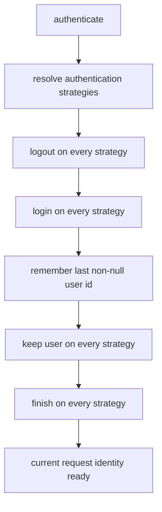

# BASE3 Access Control and Authentication

## Purpose

This document explains the access control and authentication subsystem in BASE3.

It is written for developers who want to understand:

* what `IAccesscontrol` is responsible for
* what `IAuthentication` is responsible for
* how authentication strategies participate in one request
* how `SelectedAccesscontrol` composes an explicit authentication chain
* how `CustomAccesscontrol` discovers authentication implementations
* which built-in authentication strategies currently exist
* how session, token, request, and microservice authentication relate to each other
* how this subsystem differs from `IUsermanager` and RBAC
* how a project should wire access control without coupling runtime classes to concrete implementations

---

## 1. Responsibility split

BASE3 separates request authentication from application authorization.

```text
IAccesscontrol
  establishes and exposes the current request user id

IAuthentication
  one authentication strategy participating in the authentication lifecycle

IUsermanager
  exposes user data, roles, groups, and permissions after identity is known
```

This distinction is important.

`IAccesscontrol` does not define role or permission checks. Those belong to `IUsermanager`.

Likewise, `IAuthentication` does not represent the complete access-control system. It represents one way to obtain, persist, finish, or remove identity information.

---

## 2. `IAccesscontrol`

The framework contract is:

```php
<?php declare(strict_types=1);

namespace Base3\Accesscontrol\Api;

interface IAccesscontrol {

	public function getUserId();

	public function authenticate(): void;
}
```

The two responsibilities are deliberately small.

### `authenticate()`

Explicitly initializes authentication for the current request.

A common place to call it is `AccesscontrolMiddleware`:

```php
$this->accesscontrol->authenticate();
return $this->next->process();
```

### `getUserId()`

Returns the user identity established by the active access-control implementation.

The concrete type is implementation-specific. It may be a numeric id, string identifier, or `null` when no user is authenticated.

Reusable code should not assume one concrete id type unless its own contract explicitly requires one.

---

## 3. `IAuthentication`

Authentication strategies implement:

```php
Base3\Accesscontrol\Api\IAuthentication
```

The contract extends `IBase`, so every authentication implementation has a stable technical name.

```php
interface IAuthentication extends IBase {

	public function setVerbose($verbose);

	public function login();

	public function keep($userid);

	public function finish($userid);

	public function logout();
}
```

The lifecycle is intentionally broader than a simple `login()` call.

---

## 4. Authentication lifecycle

The access-control implementations that compose multiple strategies execute them in four phases:

```text
1. logout
2. login
3. keep
4. finish
```

Conceptually:



### Why all strategies receive all phases

Different strategies own different parts of the lifecycle.

Examples:

* one strategy may validate a login form
* another may restore a user from a cookie
* another may write the resulting identity into a session
* another may create a persistent authentication cookie
* another may perform an SSO redirect in `finish()`

That means a strategy is not required to implement meaningful behavior in every phase.

`AbstractAuth` provides no-op defaults for all phases except the required technical name.

---

## 5. `SelectedAccesscontrol`

`SelectedAccesscontrol` is the explicit composition implementation.

Its constructor receives an ordered array of authentication objects or lazy callables:

```php
new SelectedAccesscontrol([
	fn() => new SessionAuth($session),
	fn() => new SingleSignOnAuth($token),
]);
```

The important behavior is:

* authentication objects are resolved lazily on first use
* each resolved object must implement `IAuthentication`
* the configured order is preserved
* the authentication lifecycle runs once per `SelectedAccesscontrol` instance
* the last non-null result returned by `login()` becomes the current user id

This is useful when a project wants a deliberate and visible authentication composition.

### Recommended project pattern

The project plugin or custom bootstrap should make the final choice:

```php
$container->set(
	IAccesscontrol::class,
	fn($c) => new SelectedAccesscontrol([
		fn() => $c->get(SessionAuth::class),
		fn() => $c->get(SingleSignOnAuth::class),
	]),
	IContainer::SHARED
);
```

The exact registrations depend on the project.

The architectural point is that runtime consumers still depend only on `IAccesscontrol`.

---

## 6. `CustomAccesscontrol`

`CustomAccesscontrol` uses the class map to discover every `IAuthentication` implementation:

```php
$authentications = $classmap->getInstancesByInterface(IAuthentication::class);
```

It then executes the same four lifecycle phases.

This makes it convenient in systems where all discovered authentication classes are intentionally part of the authentication chain.

It also means discovery determines participation.

For projects that require precise control over enabled authentication mechanisms and their order, `SelectedAccesscontrol` is usually easier to reason about because the composition is explicit.

---

## 7. Built-in access-control implementations

The framework currently contains four `IAccesscontrol` implementations.

### `NoAccesscontrol`

```text
getUserId() -> null
authenticate() -> no-op
```

This is the safe no-authentication implementation used by the default standalone bootstrap.

### `FullAccesscontrol`

Returns:

```text
fullaccess
```

as the current user id and performs no authentication work.

It is useful only where the runtime intentionally grants unconditional access.

### `SelectedAccesscontrol`

Runs an explicitly supplied authentication chain.

### `CustomAccesscontrol`

Discovers all `IAuthentication` implementations through `IClassMap` and runs them as a chain.

---

## 8. Built-in authentication strategies

The current framework includes several authentication implementations. They are not all equally modern and they do not all use constructor injection consistently. Treat the list below as a description of current framework behavior, not as a recommendation to copy every implementation style.

### `CliAuth`

Technical name:

```text
cliauth
```

Returns `internal` when PHP is running through the CLI SAPI.

### `SessionAuth`

Technical name:

```text
sessionauth
```

Uses `ISession`.

Its responsibilities are:

* read the current user from session state in `login()`
* keep the authenticated user in session state
* remove session authentication during logout

This is the normal session bridge in a composed authentication chain.

### `CookieAuth`

Technical name:

```text
cookieauth
```

Uses a token service to persist authentication in a browser cookie.

The cookie contains a user id and token. The token itself is validated against the configured token backend.

The current implementation uses a default one-week timeout.

### `SingleAuth`

Technical name:

```text
singleauth
```

Reads one configured username and password hash from the `singleauth` configuration group.

It only attempts login when the request contains the expected login fields.

### `MultiAuth`

Technical name:

```text
multiauth
```

Extends the same idea to multiple configured user/password entries in the `multiauth` configuration group.

### `GroupUserAuth`

Technical name:

```text
groupuserauth
```

Reads a local JSON password file under:

```text
DIR_LOCAL/Authentication/groupusers.json
```

It is a file-backed compatibility authentication strategy.

### `Base3SystemAuth`

Technical name:

```text
base3systemauth
```

Uses the framework database service and the `base3system_sysuser` table.

The implementation includes a compatibility switch-user mode for privileged rows.

### `InternalHmacAuth`

Technical name:

```text
internalhmacauth
```

Validates the internal HMAC headers used by the framework microservice connector.

Expected headers are exposed to PHP as:

```text
HTTP_USER
HTTP_TIME
HTTP_TOKEN
HTTP_HASH
```

An optional `HTTP_AUTH` header may carry the user identity represented by the internal request.

The current implementation:

* validates a request timestamp
* prevents token reuse through the token service
* validates the configured microservice master password hash
* optionally returns the forwarded authenticated user

See `microservices.md` for the corresponding connector behavior.

### `SingleSignOnAuth`

Technical name:

```text
singlesignonauth
```

Consumes a one-time token from the `singlesignon` token scope.

The token is deleted after successful validation.

### `SingleSignOnAutoAuth`

Technical name:

```text
singlesignonautoauth
```

Triggers an SSO check redirect when no user is present and the request is suitable for browser redirection.

The current implementation avoids automatic redirection for POST and Ajax requests.

### `SingleSignOnServerAuth`

Technical name:

```text
singlesignonserverauth
```

Handles the server side of the SSO continuation flow and can issue a short-lived `singlesignon` token before redirecting back to the target system.

### `ContinueAuth`

Technical name:

```text
continueauth
```

Handles the `_continueauth` redirect parameter in the finish phase.

---

## 9. Verbose authentication diagnostics

`SelectedAccesscontrol` and `CustomAccesscontrol` enable verbose mode when the request contains:

```text
checkaccesscontrol
```

In that mode the current implementations print each lifecycle phase and authentication result, then terminate the request.

This is a developer diagnostic mechanism.

It should not be treated as application UI.

---

## 10. Access control middleware

The built-in middleware is:

```php
Base3\Middleware\Accesscontrol\AccesscontrolMiddleware
```

Its job is intentionally small:

```php
public function process(): string {
	$this->accesscontrol->authenticate();
	return $this->next->process();
}
```

When session-backed authentication is used, session middleware should normally run first:

```text
SessionMiddleware
AccesscontrolMiddleware
ServiceSelector
```

See `middlewares.md` and `sessions.md`.

---

## 11. Access control versus Usermanager

Do not put application permission logic into an authentication strategy.

Authentication establishes identity.

Authorization asks what that identity may do.

Recommended flow:

```php
$accesscontrol->authenticate();
$userId = $accesscontrol->getUserId();

if (!$usermanager->can(Permission::for('report', 'edit'))) {
	throw new RuntimeException('Permission denied.');
}
```

For the complete RBAC model, see `usermanager.md`.

---

## 12. Access control versus entry-level ACLs

`IAccesscontrol` is request-level identity infrastructure.

It is not a generic data-record ACL system.

A domain backend may have its own record-level access rules. Those rules should consume the current identity or framework permissions where appropriate instead of extending `IAccesscontrol` with unrelated domain responsibilities.

---

## 13. Dependency injection guidance

Runtime services should receive the narrow contract they need.

Good:

```php
public function __construct(
	private readonly IAccesscontrol $accesscontrol
) {}
```

Authentication composition belongs in:

* bootstrap code
* project plugin composition
* infrastructure setup

Avoid resolving authentication strategies dynamically inside ordinary business services.

---

## 14. Current implementation notes

Several built-in authentication classes predate the newer constructor-injection conventions and still use `ServiceLocator` or PHP superglobals directly.

When writing new reusable code:

* depend on interfaces
* use constructor injection
* use `IRequest` for request data where practical
* use `ISession` for session state
* use `IToken` for token operations
* keep the final authentication chain in project composition

Documenting the legacy implementations does not make their internal style the recommended pattern for new plugins.

---

## 15. Summary

The BASE3 access-control model is intentionally layered:

```text
IAuthentication
  one authentication strategy

IAccesscontrol
  composes authentication and exposes current identity

AccesscontrolMiddleware
  initializes identity during request processing

IUsermanager
  provides user, role, group, and permission semantics
```

Use authentication to establish who the current caller is, and use the appropriate application or RBAC service to decide what that caller may do.
