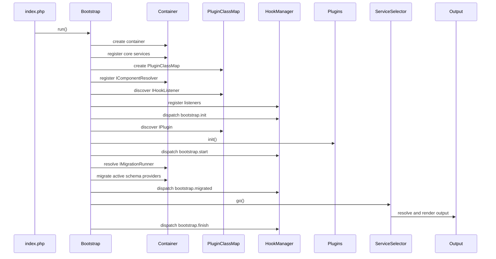
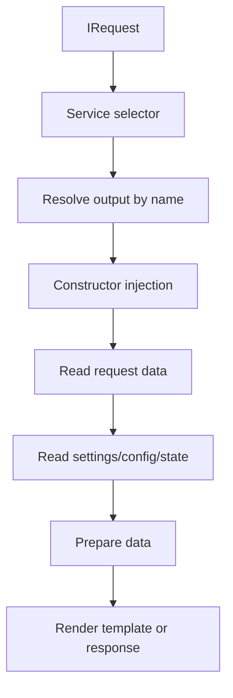
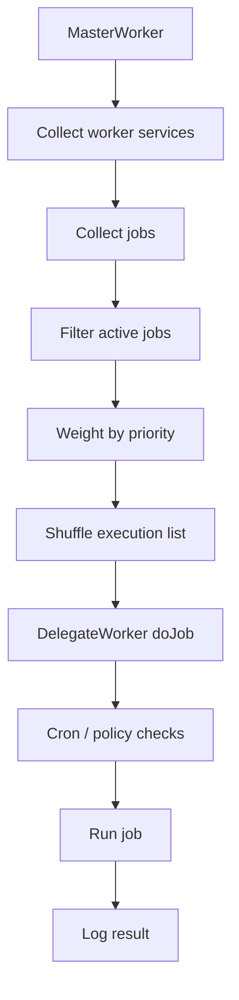

# BASE3 Architecture Principles and Runtime Flow

## Purpose

This document collects the main architectural principles of BASE3.

It explains how the subsystems work together and which design rules should guide framework, plugin, foundation, and project code.

It is written for developers who want to understand:

* why BASE3 separates container and class map
* how dependency direction should work
* where final service wiring belongs
* how runtime startup works
* how request handling works
* how worker execution works
* how to avoid unwanted plugin dependencies

---

## 1. Core principle

BASE3 is designed for replaceability.

The core principle is:

```text
Code should depend on stable contracts.
Final implementations should be selected by composition.
```

In practice:

```text
Interfaces live in framework or foundation plugins.
Implementations live in feature or implementation plugins.
Final bindings live in project plugins or custom bootstraps.
```

This keeps plugins reusable across different projects.

---

## 2. Container for known services

Use the container for known shared services.

Examples:

```text
IConfiguration
IRequest
IDatabase
IMigrationRunner
ILogger
ISettingsStore
IStateStore
IAssetResolver
IEventManager
IQueryService
IFileStorage
```

A class that needs one of these services should type-hint the interface.

```php
public function __construct(
	private readonly IQueryService $queryService
) {}
```

It should not decide which implementation is active.

That decision belongs to the bootstrap or a project plugin.

---

## 3. Class map for discovered components

Use the class map for components that should be discoverable.

Examples:

```text
IPlugin
IHookListener
IOutput
IDisplay
IJob
ICheck
IJobExecutionPolicy
IConfigValueModeResolver
IDatabaseMigrationProvider
```

The class map is useful when the system asks:

```text
Which implementations exist?
Which implementation has this name?
Which implementations belong to this app?
```

The container is useful when the system asks:

```text
Give me the active implementation for this known service.
```


---

## 4. Configured components between container and class map

Use configured components when one discovered implementation class needs multiple configured runtime instances.

Example:

```text
RagTool::getName() = "rag"

internal-rag
  implementation: rag
  vector_db: internal

customer-rag
  implementation: rag
  vector_db: customer
```

This does not create a second container.

The roles remain:

```text
Container
  known services and parameters
  ComponentDefinition values

Class map
  discovered implementations
  autowired instantiation
  instantiateWith() for explicit constructor arguments

ComponentResolver
  thin resolver from definitions to configured instances
```

The naming rule is:

```text
IBase::getName()
  implementation name / classmap key

IComponent::id()
  configured runtime instance id
```

Use this when the system asks:

```text
Give me the configured instance internal-rag of this component interface.
```

Do not use it for ordinary shared services. Those belong directly in the container.

---

## 5. Factory only for real runtime construction

Do not create factories that only duplicate class map lookup.

Less useful:

```php
final class OutputFactory {

	public function create(string $name): IOutput {
		return match ($name) {
			'dashboard' => new DashboardOutput(),
			default => throw new RuntimeException()
		};
	}
}
```

Better:

```php
$output = $classMap->getInstanceByInterfaceName(IOutput::class, $name);
```

Factories are useful when construction depends on runtime input:

* selected settings
* dynamic credentials
* request payloads
* external clients
* non-discoverable value objects
* complex composition rules

Use factories when they add real construction logic.

---

## 6. Depend on interfaces

Runtime classes should depend on interfaces whenever replacement is expected.

Good:

```php
public function __construct(
	private readonly ISettingsStore $settingsStore,
	private readonly IAssetResolver $assetResolver
) {}
```

Less portable:

```php
public function __construct(
	private readonly DatabaseSettingsStore $settingsStore,
	private readonly DefaultAssetResolver $assetResolver
) {}
```

Concrete classes are acceptable when the concrete type is intentionally the contract.

But service slots should use interfaces.

---

## 7. Keep plugin dependencies intentional

Most plugins should only depend on:

* BASE3 framework APIs
* their own classes
* foundation plugins
* very explicit extension targets

A plugin should not casually `use` classes from another normal plugin.

That creates hidden coupling.

Recommended dependency direction:

```text
Feature Plugin -> Foundation Plugin
Implementation Plugin -> Foundation Plugin
Project Plugin -> Feature/Implementation Plugins
```

Allowed exception:

```text
Extension Plugin -> Plugin it explicitly extends
```

For example, if a plugin exists only to extend another plugin and has no standalone purpose, then direct dependency on that plugin is valid and should be documented.

---

## 8. Foundation plugins define slots

Foundation plugins define stable shared contracts.

They should usually contain:

```text
Api/
Dto/
Model/
Exception/
Proxy/
```

Their purpose is to create plugin slots.

Example:

```php
interface IQuerySchemaProvider {
	// contract
}
```

They should not normally bind the final implementation.

That is a project decision.

---

## 9. Project plugins wire final implementations

A project plugin is the composition layer.

It may bind:

```php
IDatabase::class => MysqlDatabase
IMigrationRunner::class => DatabaseMigrationRunner
ISettingsStore::class => DatabaseSettingsStore
IQuerySchemaProvider::class => ProjectQuerySchemaProvider
IReportConfigProvider::class => ProjectReportConfigProvider
IAgentKnowledgeService::class => ProjectKnowledgeService
```

A project plugin may import concrete classes from multiple feature and implementation plugins.

That is its job.

Ordinary reusable plugins should avoid doing this unless they are explicit extensions of another plugin.

---

## 10. Use `NOOVERWRITE` for fallback defaults

Reusable plugins may provide fallback services.

Example:

```php
$container->set(
	IEventManager::class,
	fn() => new EventManager(),
	IContainer::SHARED | IContainer::NOOVERWRITE
);
```

This means:

```text
Use this if no one else provided a better implementation.
```

Use `NOOVERWRITE` for infrastructure defaults that should remain replaceable.

Do not use it when a service is required and must be wired deliberately.

---

## 11. Keep plugin `init()` small

Plugin `init()` should be composition code.

Good responsibilities:

* register services
* register aliases
* register fallback services
* attach event listeners
* expose plugin object
* perform small setup

Avoid:

* running imports
* processing user requests
* doing heavy database work
* making external HTTP calls
* depending on request-specific state
* hiding large business workflows in `init()`

Request behavior belongs in outputs, displays, jobs, middleware, controllers, or services.

---

## 12. Runtime lifecycle

The normal lifecycle is:

```text
index.php
Bootstrap
Container
Core service registration
PluginClassMap
ComponentResolver
Hook listener discovery
bootstrap.init
Plugin discovery
plugin.init()
bootstrap.start
Migration runner
bootstrap.migrated
Service selector
Output / Display / MVC
bootstrap.finish
```

Diagram:



---

## 13. Early discovery rule

Hook listeners are discovered before plugin `init()`.

Plugins are also instantiated before their own `init()` runs.

Therefore classes needed during early bootstrap must only depend on services that already exist.

Safe early dependencies usually include:

```text
IContainer
IConfiguration
IRequest
IClassMap
IComponentResolver
IHookManager
ISystemService
```

Plugin-specific services registered in `init()` are not available before `init()`.

---

## 14. Request flow

A typical web request follows this pattern:

```text
IRequest created from globals
Service selector reads request
Selector resolves output/display
Output reads request/settings
Output prepares data
MVC view loads template
Response is returned
```

Diagram:



A display class should not use globals directly.

It should use `IRequest`.

A template should not contain business logic.

It should render assigned values.

---

## 15. Worker flow

A worker request or CLI trigger follows a different flow:

```text
MasterWorker
  -> worker services
  -> class map discovers jobs
  -> active/priority checks
  -> cron/policy checks
  -> job execution
  -> logging/state updates
```

Diagram:



Jobs should be discoverable and named.

Policies should be discoverable and named.

State such as last run timestamps should go into state storage or explicit runtime files, not into configuration.

---

## 16. Settings, state, and configuration boundaries

Do not mix configuration, settings, and state.

### Configuration

Use for project/static configuration.

Examples:

```text
database connection
directories
debug flags
default framework options
```

### Settings Store

Use for grouped named runtime settings.

Examples:

```text
provider/openai
connection/main-api
agent/default
report/sales
```

### State Store

Use for operational runtime state.

Examples:

```text
last job run
sync cursor
temporary lock
progress marker
health timestamp
```

### Config Value Resolver

Use for resolving one value from a definition.

Examples:

```text
env variable
file secret
fixed literal
configuration group/key
```

---

## 17. Database migrations follow active composition

Database migrations follow the same composition rule as other infrastructure.

The default framework bootstrap registers `IMigrationRunner` as a no-op service because BASE3 must be able to run without a database. A project plugin replaces that runner only when the project wires `IDatabase` and wants database migrations to run.

Migration providers are discoverable through the class map, but they must still decide whether they are active for the current runtime composition. A provider should own one schema area and should not run merely because its class exists.

Examples:

```text
DatabaseStateStoreMigrationProvider
  active when IStateStore is wired to DatabaseStateStore

DatabaseConfigurationMigrationProvider
  active when IConfiguration is wired to a database-backed implementation

ExamplePluginMigrationProvider
  active when ExamplePlugin's database feature is enabled
```

This keeps schema ownership with the code that owns the data structure, while the project plugin still decides which implementations are active.

---

## 18. Assets must be resolved

Plugins should reference assets through logical plugin paths.

Example:

```text
plugin/Chatbot/assets/icons/send.svg
```

Templates should use an asset resolver.

The project or host integration decides the final public URL.

This keeps plugin templates portable.

---

## 19. Hooks versus events

Use hooks for lifecycle extension points.

Examples:

```text
bootstrap.init
bootstrap.start
bootstrap.finish
```

Use events for runtime domain notifications.

Examples:

```text
ToolStartedEvent
ToolFinishedEvent
ImportFailedEvent
```

Hooks answer:

```text
Which extension point in the framework lifecycle is running?
```

Events answer:

```text
What happened during runtime behavior?
```

---

## 20. Standalone versus embedded

BASE3 should not assume one runtime layout.

In standalone mode, BASE3 controls the root directory, plugin directory, and entry point.

In embedded mode, a host integration may provide:

* custom bootstrap
* custom class map
* custom asset resolver
* custom request implementation
* custom system service
* custom access control
* custom settings store
* custom project plugin

Therefore portable plugins should avoid hardcoded assumptions about:

* public URLs
* host system constants
* user system
* session implementation
* plugin physical location
* storage backend

Use interfaces and resolvers.

---

## 21. Local project files

A project plugin may include a `local/` directory with project-specific configuration files, presets, prompts, schemas, or sample data.

Example:

```text
local/
├── Chatbot/
│   ├── default-agentflow.json
│   └── default-systemprompt.txt
├── Data/
│   └── query-schema.json
└── Reports/
    └── courses.json
```

This is acceptable for project-specific configuration.

Do not put generic reusable plugin defaults into a project plugin's local directory if they belong to the reusable plugin itself.

Do not use `local/` as a replacement for proper storage when data is user-specific, large, or frequently changed.

---

## 22. Documentation principle

Subsystem documentation should explain two things:

```text
API behavior
architecture intent
```

API behavior explains what methods do.

Architecture intent explains when and why to use the subsystem.

BASE3 relies heavily on architectural conventions.

Those conventions should be documented directly.

---

## 23. Practical rules

Use constructor injection for runtime classes.

Use the container for known services.

Use `PluginClassMap` for discoverable components.

Use configured components when one discovered implementation needs multiple runtime instance ids.

Use foundation plugins for shared contracts.

Use project plugins for final wiring.

Avoid direct dependencies between normal plugins.

Use direct dependencies only for explicit extension plugins.

Keep plugin `init()` small.

Keep templates parallel to display classes.

Resolve assets through `IAssetResolver`.

Use settings for editable datasets.

Use state for runtime status.

Use config values for late value resolution.

Use hooks for lifecycle.

Use events for runtime notifications.

Use workers for background execution.

---

## 24. Summary

BASE3 architecture is built around separation of roles:

```text
Framework core provides base mechanisms.
Foundation plugins define contracts.
Feature plugins provide reusable behavior.
Implementation plugins fill some contracts.
Project plugins decide the final service graph.
Custom bootstraps adapt the runtime.
Configured components bridge discovered implementations and instance-specific configuration.
```

The most important dependency rule is:

```text
Reusable plugins should depend on contracts, not on concrete project choices.
```

The most important composition rule is:

```text
Final wiring belongs in the project plugin or bootstrap.
```
