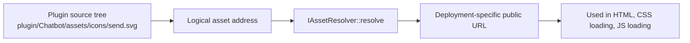
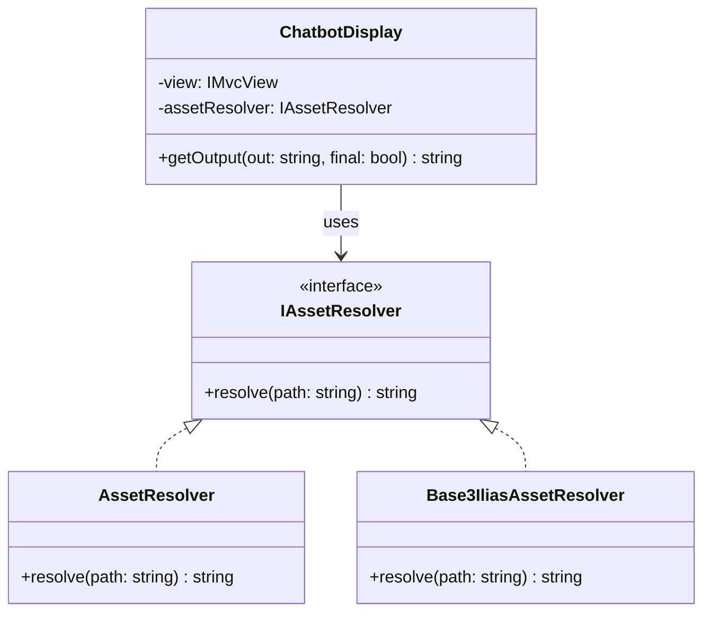
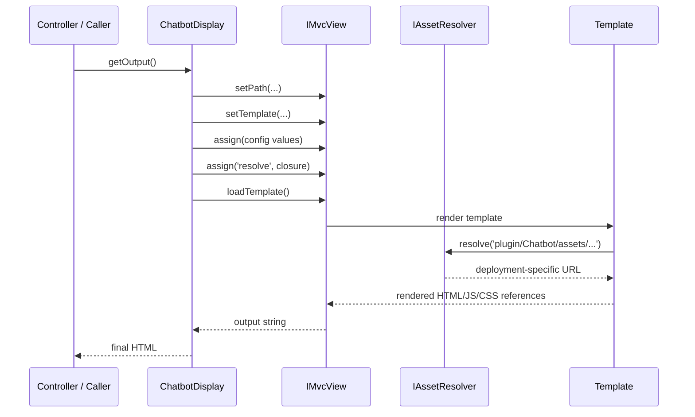
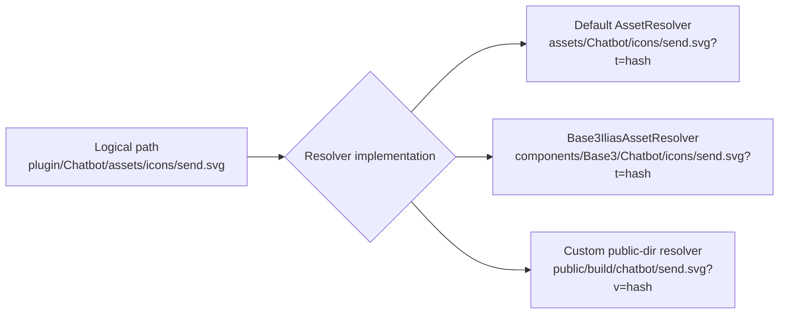
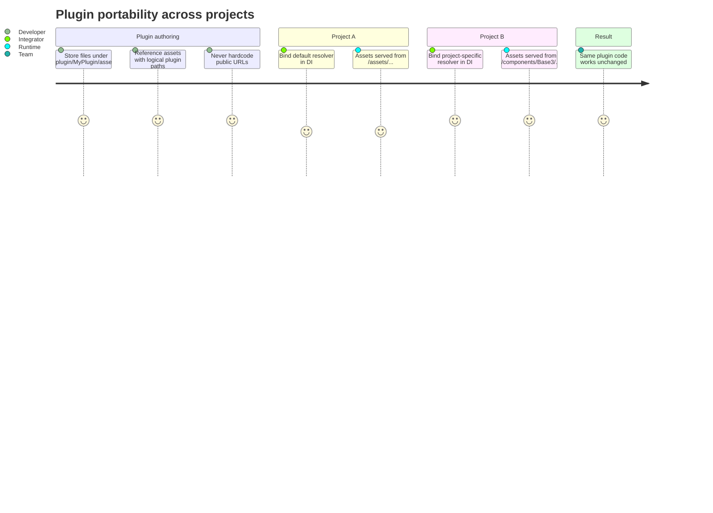
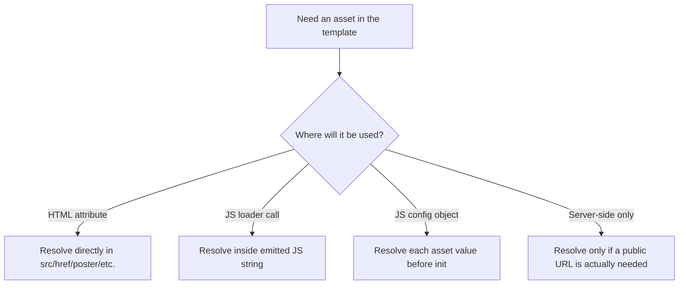
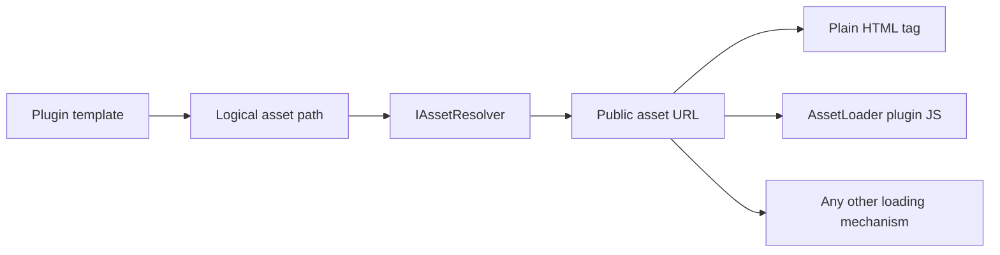
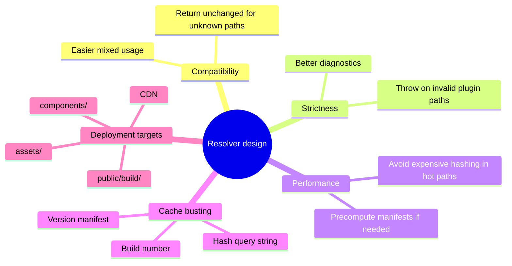
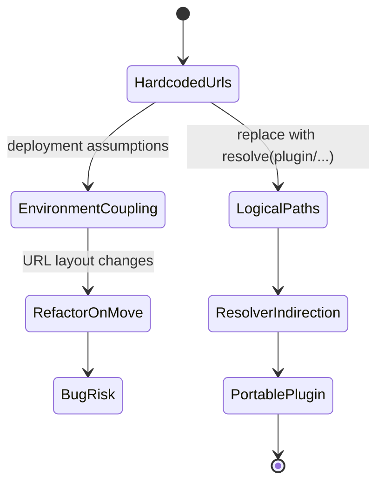
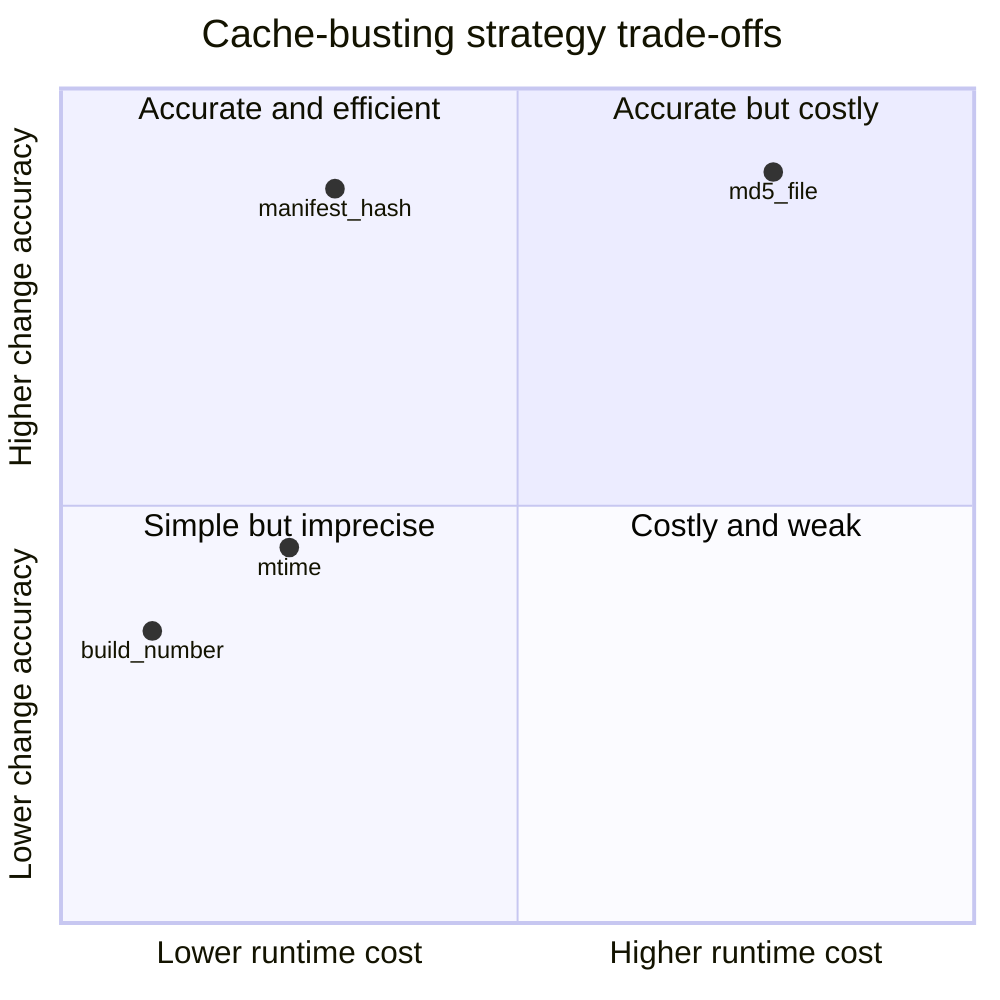

# BASE3 Framework Assets

## Developer Guide for Plugin Authors

This guide explains how assets work in the **BASE3 Framework**, with a strong focus on the **`IAssetResolver`** contract and the default **`AssetResolver`** implementation.

It is written for developers who want to build their own plugins and need a clear, practical model for referencing CSS, JavaScript, images, icons, fonts, and other static files **without coupling the plugin to a specific deployment structure**.

> Core rule: **Do not link plugin assets directly in templates.**
> Always reference assets through their **logical plugin location** and let the resolver produce the final public URL.

---

## Why this exists

A plugin should be reusable in more than one environment.

One project may expose plugin assets directly under a conventional public path such as:

```text
/assets/Chatbot/chatbot/chatbot.css
```

Another project may publish the same plugin into a completely different structure, for example:

```text
/components/Base3/Chatbot/chatbot/chatbot.css
```

Or a build/deploy process may copy assets into a generated public directory that does not resemble the source tree at all.

If templates hardcode URLs, moving between these deployment models forces refactoring in every template and every script block. BASE3 avoids that by separating:

* **logical asset addressing** inside the plugin
* **physical/public asset URL generation** inside the resolver

That makes plugins portable.

---

## The core idea

Inside your plugin, assets are addressed by their **position in the plugin source tree**.

Typical logical asset path:

```text
plugin/Chatbot/assets/icons/send.svg
```

This string does **not** represent the public browser URL.
It is just the plugin-internal address.

The resolver turns it into the correct URL for the current installation.

### Mental model



The plugin never needs to know whether assets are:

* served from `/assets/...`
* copied into `/components/...`
* published into a generated `public/` directory
* decorated with a cache-busting query string

That knowledge belongs to the resolver.

---

## The contract: `IAssetResolver`

BASE3 defines a very small interface:

```php
<?php declare(strict_types=1);

namespace Base3\Api;

/**
 * Resolves internal plugin asset paths to public-facing asset URLs.
 */
interface IAssetResolver {

    /**
     * Resolves a plugin asset path to the corresponding public path.
     *
     * For example:
     * "plugin/Foo/assets/js/app.js" -> "/assets/Foo/js/app.js"
     *
     * @param string $path Internal plugin-relative asset path
     * @return string Publicly accessible asset path (usually web-relative URL)
     */
    public function resolve(string $path): string;
}
```

This minimal API is intentional:

* plugin code stays simple
* deployment logic stays replaceable
* different projects can provide different resolver implementations

### Class view



---

## Asset addressing convention

The resolver expects a logical asset path in this form:

```text
plugin/<PluginName>/assets/<subpath>
```

Examples:

```text
plugin/Chatbot/assets/chatbot/chatbot.css
plugin/Chatbot/assets/chatbot/chatbot.js
plugin/Chatbot/assets/icons/send.svg
plugin/ClientStack/assets/marked/marked.js
plugin/EventTransport/assets/eventtransportclient.js
```

### Why this convention matters

The path contains enough information to answer three questions:

1. **Which plugin owns the asset?**
2. **Is this really an asset path?**
3. **What is the relative asset path inside that plugin?**

That allows the resolver to map the address into whatever public structure the host project uses.

### Parsing model

```mermaid
flowchart TD
    P[plugin/Chatbot/assets/icons/send.svg] --> S1[Split by slash]
    S1 --> S2[parts[0] = plugin]
    S1 --> S3[parts[1] = Chatbot]
    S1 --> S4[parts[2] = assets]
    S1 --> S5[parts[3..] = icons/send.svg]
    S2 --> V{Valid asset address?}
    S3 --> V
    S4 --> V
    S5 --> V
    V -->|yes| R[Build deployment-specific target URL]
    V -->|no| X[Return original path unchanged]
```

---

## How the resolver is used in practice

The best way to understand the pattern is to look at a real display class and template.

## Example: `ChatbotDisplay`

The display receives an `IAssetResolver` through dependency injection:

```php
<?php declare(strict_types=1);

namespace Chatbot\Content;

use Base3\Api\IAssetResolver;
use Base3\Api\IDisplay;
use Base3\Api\IMvcView;
use Base3\Api\ISchemaProvider;

class ChatbotDisplay implements IDisplay, ISchemaProvider {

    private array $data = [];

    public function __construct(
        private readonly IMvcView $view,
        private readonly IAssetResolver $assetResolver
    ) {}

    public static function getName(): string {
        return 'chatbotdisplay';
    }

    public function getOutput(string $out = 'html', bool $final = false): string {
        $this->view->setPath(DIR_PLUGIN . 'Chatbot');
        $this->view->setTemplate('Content/ChatbotDisplay.php');

        $defaults = [
            'service'        => 'chatbotservice.php',
            'use_markdown'   => true,
            'use_icons'      => true,
            'use_voice'      => true,
            'use_threads'    => true,
            'transport_mode' => 'auto',
            'default_lang'   => 'auto'
        ];

        $config = array_merge($defaults, $this->data);

        foreach ($config as $tag => $content) {
            $this->view->assign($tag, $content);
        }

        $this->view->assign('resolve', fn($src) => $this->assetResolver->resolve($src));

        return $this->view->loadTemplate();
    }

    public function setData($data) {
        $this->data = (array) $data;
    }
}
```

### Important detail

This line exposes a `resolve` helper into the template:

```php
$this->view->assign('resolve', fn($src) => $this->assetResolver->resolve($src));
```

That is the bridge between:

* plugin logic in PHP
* asset references in the template

The template never needs to know the actual public URL strategy.

### Request-to-render flow



---

## Template usage pattern

In the Chatbot template, assets are not linked directly. They are always resolved from their logical plugin path.

### Image example

```php
_['resolve']('plugin/Chatbot/assets/icons/send.svg'); ?>" alt="Send" />
```

### CSS loading example

```php
await AssetLoader.loadCssAsync(
    '<?php echo $this->_['resolve']('plugin/Chatbot/assets/chatbot/chatbot.css'); ?>'
);
```

### JavaScript loading example

```php
await AssetLoader.loadScriptAsync(
    '<?php echo $this->_['resolve']('plugin/Chatbot/assets/chatbot/chatbot.js'); ?>'
);
```

### Cross-plugin asset reference example

```php
await AssetLoader.loadScriptAsync(
    '<?php echo $this->_['resolve']('plugin/ClientStack/assets/marked/marked.js'); ?>'
);
```

That last example is especially important: the logical address can point to an asset owned by a different plugin, and the current resolver still decides how to expose it publicly.

---

## What not to do

Do **not** hardcode public URLs in templates.

### Bad

```php

<script src="/assets/Chatbot/chatbot/chatbot.js"></script>
<link rel="stylesheet" href="/assets/Chatbot/chatbot/chatbot.css">
```

### Why this is bad

This assumes:

* a specific public directory layout
* a specific deployment process
* no project-specific remapping
* no cache-busting strategy changes

The plugin becomes less portable and refactoring becomes necessary as soon as the environment changes.

### Good

```php
_['resolve']('plugin/Chatbot/assets/icons/send.svg'); ?>" alt="Send" />
```

---

## The default framework resolver

BASE3 provides a default resolver implementation:

```php
<?php declare(strict_types=1);

namespace Base3\Core;

use Base3\Api\IAssetResolver;

class AssetResolver implements IAssetResolver {

    public function resolve(string $path): string {
        if (!str_starts_with($path, 'plugin/')) {
            return $path;
        }

        $parts = explode('/', $path);
        if (count($parts) < 4 || $parts[2] !== 'assets') {
            return $path;
        }

        $plugin = $parts[1];
        $subpath = array_slice($parts, 3); // skip plugin, PluginName, assets
        $target = 'assets/' . $plugin . '/' . implode('/', $subpath);

        // Optionally add cache-busting query param
        $realfile = DIR_ROOT . implode(DIRECTORY_SEPARATOR, $parts);
        $hash = file_exists($realfile) ? substr(md5_file($realfile), 0, 6) : '000000';
        return $target . '?t=' . $hash;
    }
}
```

### What it does

For a logical address like:

```text
plugin/Chatbot/assets/icons/send.svg
```

it produces something like:

```text
assets/Chatbot/icons/send.svg?t=a1b2c3
```

### Algorithm breakdown

```mermaid
flowchart TD
    A[Input path] --> B{Starts with plugin/?}
    B -->|no| Z[Return path unchanged]
    B -->|yes| C[Split into parts]
    C --> D{parts[2] == assets and enough parts?}
    D -->|no| Z
    D -->|yes| E[plugin = parts[1]]
    E --> F[subpath = parts[3..]]
    F --> G[target = assets/plugin/subpath]
    G --> H[Find real file on disk]
    H --> I{File exists?}
    I -->|yes| J[Compute md5 hash prefix]
    I -->|no| K[Use fallback 000000]
    J --> L[Append ?t=hash]
    K --> L
    L --> M[Return final URL]
```

### Design characteristics

The default implementation is intentionally straightforward:

* it supports the standard plugin asset convention
* it keeps unknown paths untouched
* it adds simple cache busting
* it decouples plugin templates from the final public location

### Why unresolved paths are returned unchanged

This is a pragmatic design choice. It allows the resolver to accept non-plugin paths without breaking them.

Example:

```php
$assetResolver->resolve('https://cdn.example.com/lib.js');
$assetResolver->resolve('/static/app.css');
$assetResolver->resolve('images/local.png');
```

Depending on how you use the resolver in your project, returning the path unchanged can make mixed asset strategies easier.

For strict environments, you may choose a stricter resolver that validates more aggressively.

---

## Alternative resolver: project-specific deployment mapping

A different project can provide a different resolver implementation while leaving all plugin templates unchanged.

Example:

```php
<?php declare(strict_types=1);

namespace Base3Ilias\Base3;

use Base3\Api\IAssetResolver;

class Base3IliasAssetResolver implements IAssetResolver {

    public function resolve(string $path): string {
        if (!str_starts_with($path, 'plugin/')) return $path;

        $parts = explode('/', $path);
        if (count($parts) < 4 || $parts[2] !== 'assets') return $path;

        $plugin = $parts[1];
        $subpath = array_slice($parts, 3); // skip plugin, PluginName, assets
        $target = 'components/Base3/' . $plugin . '/' . implode('/', $subpath);

        // Optionally add cache-busting query param
        unset($parts[0]);
        $realfile = DIR_PLUGIN . implode(DIRECTORY_SEPARATOR, $parts);
        $hash = file_exists($realfile) ? substr(md5_file($realfile), 0, 6) : '000000';
        return $target . '?t=' . $hash;
    }
}
```

### Key observation

The plugin code does not change.
Only the resolver changes.

That is the whole architectural point.

### Deployment comparison



---

## Why this is essential for plugin authors

When you build a plugin, you usually do **not** control all of the following:

* the host project directory layout
* the web server document root
* the deployment process
* whether assets are copied, symlinked, bundled, or published
* the final URL namespace used in production

If your plugin hardcodes public URLs, it becomes tied to one installation strategy.

If your plugin uses logical asset addresses plus `IAssetResolver`, it stays reusable.

### Portability lifecycle



---

## Recommended plugin structure

A typical plugin can keep its assets inside its own `assets/` tree.

```text
plugin/
└── Chatbot/
    ├── src/
    │   └── Content/
    │       └── ChatbotDisplay.php
    ├── tpl/
    │   └── Content/
    │       └── ChatbotDisplay.php
    └── assets/
        ├── chatbot/
        │   ├── chatbot.css
        │   └── chatbot.js
        ├── chatvoice/
        │   └── chatvoice.js
        ├── chatthreads/
        │   └── chatthreads.js
        └── icons/
            ├── send.svg
            ├── copy.svg
            └── reload.svg
```

This layout is local, obvious, and maintainable.
The resolver exists specifically so that this internal layout does not need to mirror the final public URL space.

---

## End-to-end example

## 1. Plugin asset files

```text
plugin/HelloWorld/assets/css/widget.css
plugin/HelloWorld/assets/js/widget.js
plugin/HelloWorld/assets/img/logo.svg
```

## 2. Display class injects the resolver

```php
<?php declare(strict_types=1);

namespace HelloWorld\Content;

use Base3\Api\IAssetResolver;
use Base3\Api\IDisplay;
use Base3\Api\IMvcView;

class HelloWorldDisplay implements IDisplay {

    public function __construct(
        private readonly IMvcView $view,
        private readonly IAssetResolver $assetResolver
    ) {}

    public static function getName(): string {
        return 'helloworlddisplay';
    }

    public function getOutput(string $out = 'html', bool $final = false): string {
        $this->view->setPath(DIR_PLUGIN . 'HelloWorld');
        $this->view->setTemplate('Content/HelloWorldDisplay.php');

        $this->view->assign('resolve', fn(string $src) => $this->assetResolver->resolve($src));

        return $this->view->loadTemplate();
    }
}
```

## 3. Template resolves every asset

```php
<div class="hello-widget">
    _['resolve']('plugin/HelloWorld/assets/img/logo.svg'); ?>"
        alt="HelloWorld logo"
    />

    <button type="button" class="hello-button">Run</button>
</div>

<script>
(async function () {
    await AssetLoader.loadCssAsync(
        '<?php echo $this->_['resolve']('plugin/HelloWorld/assets/css/widget.css'); ?>'
    );

    await AssetLoader.loadScriptAsync(
        '<?php echo $this->_['resolve']('plugin/HelloWorld/assets/js/widget.js'); ?>'
    );
})();
</script>
```

## 4. Resolver decides the final URL

Possible output in one project:

```text
assets/HelloWorld/css/widget.css?t=93bc44
assets/HelloWorld/js/widget.js?t=1fe830
assets/HelloWorld/img/logo.svg?t=7b1d72
```

Possible output in another project:

```text
components/Base3/HelloWorld/css/widget.css?t=93bc44
components/Base3/HelloWorld/js/widget.js?t=1fe830
components/Base3/HelloWorld/img/logo.svg?t=7b1d72
```

## 5. Plugin code stays identical

That is the main win.

---

## Working with inline HTML, JavaScript, and configuration objects

The Chatbot example demonstrates three common usage modes.

### 1. Direct HTML attribute

```php
_['resolve']('plugin/Chatbot/assets/icons/send.svg'); ?>" alt="Send" />
```

### 2. JavaScript string argument

```php
await AssetLoader.loadScriptAsync(
    '<?php echo $this->_['resolve']('plugin/Chatbot/assets/chatbot/chatbot.js'); ?>'
);
```

### 3. Resolved URLs embedded in config objects

```php
icons: {
    copy: '<?php echo $this->_['resolve']('plugin/Chatbot/assets/icons/copy.svg'); ?>',
    check: '<?php echo $this->_['resolve']('plugin/Chatbot/assets/icons/check.svg'); ?>',
    reload: '<?php echo $this->_['resolve']('plugin/Chatbot/assets/icons/reload.svg'); ?>'
}
```

### Decision map



---

## About `AssetLoader`

`AssetLoader` appears in the Chatbot template, but it is **not part of the BASE3 core framework**.
It is offered as a **plugin** and implemented in JavaScript.

That means:

* BASE3 asset resolution does **not** depend on `AssetLoader`
* `AssetLoader` is just one consumer of resolved asset URLs
* the important framework-level abstraction is the resolver, not the loader

So the architectural responsibility split is:

* **BASE3 / project integration:** determine the correct public URL with `IAssetResolver`
* **optional JS loader plugin:** load CSS/JS dynamically in the browser

### Separation of concerns



---

## Building a custom resolver

You should write a custom resolver when the host application:

* publishes assets into a non-standard URL namespace
* copies assets into a generated build directory
* serves assets behind a CDN prefix
* needs a different cache-busting strategy
* wants stricter validation or logging

## Minimal custom resolver example

```php
<?php declare(strict_types=1);

namespace Acme\Base3;

use Base3\Api\IAssetResolver;

final class PublicDirAssetResolver implements IAssetResolver {

    public function resolve(string $path): string {
        if (!str_starts_with($path, 'plugin/')) {
            return $path;
        }

        $parts = explode('/', $path);
        if (count($parts) < 4 || $parts[2] !== 'assets') {
            return $path;
        }

        $plugin = $parts[1];
        $subpath = implode('/', array_slice($parts, 3));

        return 'public/assets/' . strtolower($plugin) . '/' . $subpath;
    }
}
```

## CDN-aware resolver example

```php
<?php declare(strict_types=1);

namespace Acme\Base3;

use Base3\Api\IAssetResolver;

final class CdnAssetResolver implements IAssetResolver {

    public function __construct(
        private readonly string $cdnBaseUrl,
        private readonly string $pluginRoot
    ) {}

    public function resolve(string $path): string {
        if (!str_starts_with($path, 'plugin/')) {
            return $path;
        }

        $parts = explode('/', $path);
        if (count($parts) < 4 || $parts[2] !== 'assets') {
            return $path;
        }

        $plugin = $parts[1];
        $subpath = implode('/', array_slice($parts, 3));
        $target = rtrim($this->cdnBaseUrl, '/') . '/base3/' . $plugin . '/' . $subpath;

        $realfile = rtrim($this->pluginRoot, DIRECTORY_SEPARATOR)
            . DIRECTORY_SEPARATOR
            . implode(DIRECTORY_SEPARATOR, array_slice($parts, 1));

        $version = file_exists($realfile)
            ? substr(sha1_file($realfile), 0, 10)
            : 'dev';

        return $target . '?v=' . $version;
    }
}
```

## Strict resolver example

```php
<?php declare(strict_types=1);

namespace Acme\Base3;

use Base3\Api\IAssetResolver;
use InvalidArgumentException;

final class StrictAssetResolver implements IAssetResolver {

    public function resolve(string $path): string {
        if (!str_starts_with($path, 'plugin/')) {
            throw new InvalidArgumentException('Only plugin asset paths are allowed: ' . $path);
        }

        $parts = explode('/', $path);
        if (count($parts) < 4 || $parts[2] !== 'assets') {
            throw new InvalidArgumentException('Invalid plugin asset path: ' . $path);
        }

        $plugin = $parts[1];
        $subpath = implode('/', array_slice($parts, 3));

        return 'assets/' . $plugin . '/' . $subpath;
    }
}
```

### Resolver design trade-offs



---

## Binding the resolver in the DI container

The resolver should be provided by the host application or project integration layer through dependency injection.

A display or service should depend on the interface:

```php
use Base3\Api\IAssetResolver;

public function __construct(
    private readonly IAssetResolver $assetResolver
) {}
```

The container chooses the actual implementation.

### Conceptual DI binding

```php
$container->set(IAssetResolver::class, function () {
    return new AssetResolver();
});
```

Or in another project:

```php
$container->set(IAssetResolver::class, function () {
    return new Base3IliasAssetResolver();
});
```

### Why interface-based injection matters

If plugin code asks for `AssetResolver` directly instead of `IAssetResolver`, you lose replaceability.

Correct dependency:

```php
private readonly IAssetResolver $assetResolver
```

Incorrect dependency for reusable plugin code:

```php
private readonly AssetResolver $assetResolver
```

---

## Suggested usage rules for plugin developers

### Rule 1: Keep assets inside the plugin

Use the plugin-local `assets/` tree as the source of truth.

### Rule 2: Always address assets logically

Use:

```text
plugin/MyPlugin/assets/...
```

not the final public URL.

### Rule 3: Resolve at the boundary where a public URL is needed

Examples:

* template `src` / `href`
* emitted JavaScript loader call
* JSON config consumed by frontend code

### Rule 4: Depend on the interface

Inject `IAssetResolver`, not a concrete resolver class.

### Rule 5: Do not bake deployment assumptions into plugin code

A plugin should not assume `/assets/`, `/components/`, `/public/`, or any other target path.

### Rule 6: Keep resolver logic out of templates

Templates should call `resolve(...)`, not reimplement path parsing.

---

## Migration example: from hardcoded URLs to resolver-based URLs

### Before

```php
<link rel="stylesheet" href="/assets/Reporting/css/widget.css">
<script src="/assets/Reporting/js/widget.js"></script>

```

### After

```php
<link rel="stylesheet" href="<?php echo $this->_['resolve']('plugin/Reporting/assets/css/widget.css'); ?>">
<script src="<?php echo $this->_['resolve']('plugin/Reporting/assets/js/widget.js'); ?>"></script>
_['resolve']('plugin/Reporting/assets/img/export.svg'); ?>" alt="Export">
```

### Migration effect



---

## Testing your resolver

A resolver is small enough that it should be easy to test thoroughly.

## Example PHPUnit-style test cases

```php
<?php declare(strict_types=1);

use Base3\Core\AssetResolver;
use PHPUnit\Framework\TestCase;

final class AssetResolverTest extends TestCase {

    public function testNonPluginPathIsReturnedUnchanged(): void {
        $resolver = new AssetResolver();
        $this->assertSame('/static/app.css', $resolver->resolve('/static/app.css'));
    }

    public function testInvalidPluginPathIsReturnedUnchanged(): void {
        $resolver = new AssetResolver();
        $this->assertSame('plugin/Foo/not-assets/file.js', $resolver->resolve('plugin/Foo/not-assets/file.js'));
    }

    public function testPluginAssetPathIsMapped(): void {
        $resolver = new AssetResolver();
        $resolved = $resolver->resolve('plugin/Chatbot/assets/icons/send.svg');

        $this->assertStringStartsWith('assets/Chatbot/icons/send.svg?t=', $resolved);
    }
}
```

## Test checklist

* valid plugin asset path maps correctly
* invalid asset path is handled intentionally
* cache-busting suffix is appended correctly
* missing file fallback behaves as expected
* alternate project resolver produces its own URL scheme

---

## Performance and cache-busting considerations

The default resolver computes a short hash from the file contents:

```php
$hash = file_exists($realfile) ? substr(md5_file($realfile), 0, 6) : '000000';
```

This is convenient and robust, but there are trade-offs.

### Pros

* browsers fetch new assets when content changes
* no manual versioning needed
* easy to understand

### Cons

* hashing reads the file
* repeated calls may add overhead in large pages or loops
* runtime hashing may be unnecessary in build-heavy deployments

### Possible alternatives

* use file modification time
* use a deployment version number
* read from a generated asset manifest
* cache resolved paths in memory

### Cache strategy map



---

## Common mistakes

## 1. Using final public URLs in plugin code

This defeats portability.

## 2. Injecting a concrete resolver instead of `IAssetResolver`

This defeats swapability.

## 3. Mixing source tree paths with public URLs

Example confusion:

```text
DIR_PLUGIN/Chatbot/assets/icons/send.svg
```

This is a filesystem path, not the browser URL.
The resolver converts a logical asset address into a public URL.

## 4. Resolving too early

Only resolve when a public URL is needed. Keep internal decisions based on logical paths or filesystem paths separate.

## 5. Reimplementing resolver logic in each plugin

The point of the interface is centralization. Plugins should consume the abstraction, not duplicate it.

---

## Practical plugin author checklist

Before publishing a BASE3 plugin, check the following:

* assets live under `plugin/<PluginName>/assets/`
* templates do not hardcode `/assets/...` or any other public path
* display or service classes inject `IAssetResolver`
* templates receive a small `resolve(...)` helper or equivalent
* JavaScript loader calls also use resolved URLs
* cross-plugin asset references use logical plugin addresses
* plugin code contains no project-specific deployment assumptions

---

## Summary

BASE3 asset handling is based on one strong architectural decision:

> **Plugins reference assets by logical position inside the plugin, not by final public URL.**

The `IAssetResolver` abstraction makes this possible.

That gives you:

* reusable plugins
* deployment-independent templates
* cleaner project integration
* easier migration between installations
* no refactoring when the public asset layout changes

The default `AssetResolver` is only one implementation.
The real power comes from depending on the interface and letting each project bind the resolver that matches its own deployment model.

---

## Appendix: compact reference

### Logical asset address

```text
plugin/<PluginName>/assets/<subpath>
```

### Resolver interface

```php
public function resolve(string $path): string;
```

### Template usage

```php
<?php echo $this->_['resolve']('plugin/MyPlugin/assets/css/app.css'); ?>
```

### Principle

```text
Plugin code describes where the asset belongs logically.
The resolver decides where the asset lives publicly.
```

