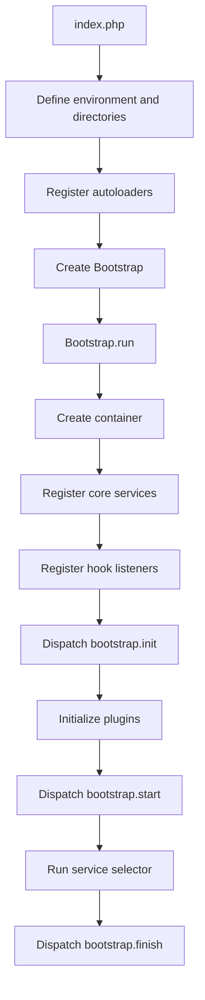
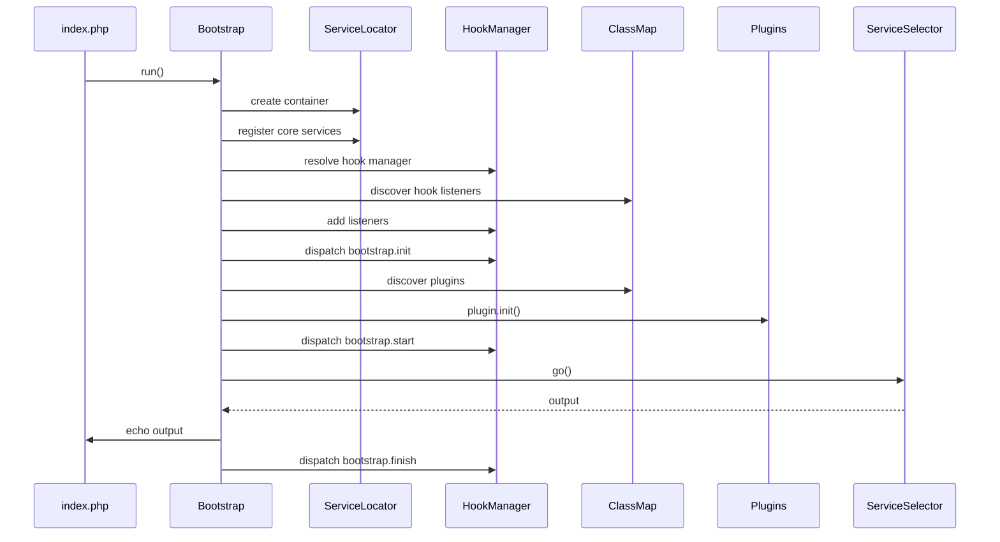
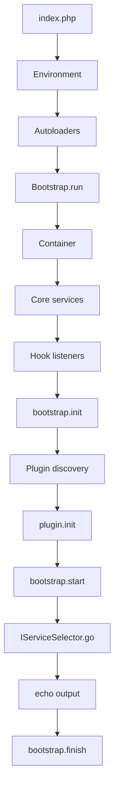
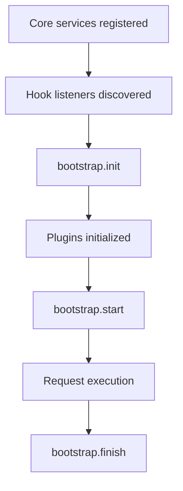

# BASE3 Framework Bootstrap

## Purpose

This document explains how the BASE3 bootstrap process works.

It is written for developers who want to understand:

* what the framework-owned `index.php` does
* what `IBootstrap` is for
* what the default `Base3\Core\Bootstrap` initializes
* which services are registered before plugins run
* when hooks are dispatched
* when plugin `init()` methods are called
* how the service selector starts request handling
* how a project or host system can replace the default bootstrap with a custom one

After reading this document, a developer should understand the startup boundary between:

* the **entry file**, which prepares the PHP environment
* the **bootstrap**, which builds the BASE3 runtime container
* the **plugins**, which extend the container during initialization
* the **service selector**, which executes the actual request

---

## 1. The big picture

BASE3 startup has two visible layers.

The first layer is the entry file.

In the standalone framework setup this is:

```text id="s61upa"
index.php
```

The entry file prepares the runtime environment:

* sets debug mode
* defines directory constants
* configures PHP error handling
* loads Composer autoloading if available
* registers the BASE3 autoloader
* creates and runs a bootstrap instance

The second layer is the bootstrap.

The default implementation is:

```php id="61x6c7"
Base3\Core\Bootstrap
```

It builds the service container, registers core services, discovers hooks and plugins, initializes plugins, and finally executes the service selector.



---

## 2. Important architectural point: the bootstrap is replaceable

`Base3\Core\Bootstrap` is the framework default.

It is not the only possible bootstrap.

A host project or integrating system may use a different entry file and instantiate a different bootstrap implementation.

This is intentional.

A custom bootstrap can:

* register different default services
* use a different configuration backend
* use a different access control implementation
* use a different service selector
* register logging earlier
* bind project-specific infrastructure
* pre-register settings, state, session, cache, or database services
* integrate BASE3 into another host system
* skip standalone assumptions from the framework-owned `index.php`

The contract for such a component is small:

```php id="aax9ms"
Base3\Api\IBootstrap
```

As long as a class implements `IBootstrap`, it can act as a bootstrap.

---

## 3. The bootstrap contract

The bootstrap contract is intentionally minimal.

```php id="e6rr9d"
<?php declare(strict_types=1);

namespace Base3\Api;

interface IBootstrap {

	public function run(): void;

}
```

The interface says only one thing:

> A bootstrap is something that can run startup logic.

It does not prescribe which services must be registered, which selector must be used, or which host system owns the entry file.

This keeps the startup mechanism flexible.

---

## 4. The framework-owned entry file

In the standalone framework setup, startup begins in:

```text id="zwxg95"
Base3Framework/index.php
```

This file is not just a router. It prepares the process before the framework bootstrap is called.

Its responsibilities are:

1. enable debug mode
2. define framework directory constants
3. configure PHP error handling
4. load optional Composer autoloading
5. register the BASE3 autoloader
6. run the default bootstrap

Conceptually:

```php id="9rd3vd"
putenv('DEBUG=1');

define('DIR_ROOT', __DIR__ . DIRECTORY_SEPARATOR);
define('DIR_CNF', DIR_ROOT . 'cnf' . DIRECTORY_SEPARATOR);
define('DIR_SRC', DIR_ROOT . 'src' . DIRECTORY_SEPARATOR);
define('DIR_LOCAL', DIR_ROOT . 'local' . DIRECTORY_SEPARATOR);
define('DIR_PLUGIN', DIR_ROOT . 'plugin' . DIRECTORY_SEPARATOR);
define('DIR_TEST', DIR_ROOT . 'test' . DIRECTORY_SEPARATOR);
define('DIR_TMP', DIR_ROOT . 'tmp' . DIRECTORY_SEPARATOR);
define('DIR_TPL', DIR_ROOT . 'tpl' . DIRECTORY_SEPARATOR);
define('DIR_USERFILES', DIR_ROOT . 'userfiles' . DIRECTORY_SEPARATOR);

require DIR_SRC . 'Core/Autoloader.php';
\Base3\Core\Autoloader::register();

(new \Base3\Core\Bootstrap())->run();
```

This file is suitable for standalone BASE3 execution.

A host system can provide its own entry file instead.

---

## 5. Directory constants

The default entry file defines a set of directory constants used by framework services and plugins.

```text id="cp8xfl"
DIR_ROOT
DIR_CNF
DIR_SRC
DIR_LOCAL
DIR_PLUGIN
DIR_TEST
DIR_TMP
DIR_TPL
DIR_USERFILES
```

These constants establish the standard BASE3 project layout.

Typical meanings:

```text id="uwuvuj"
DIR_ROOT       framework root directory
DIR_CNF        configuration directory
DIR_SRC        framework source directory
DIR_LOCAL      local runtime data
DIR_PLUGIN     plugin directory
DIR_TEST       test directory
DIR_TMP        temporary files
DIR_TPL        framework templates
DIR_USERFILES  user-uploaded files
```

Many framework components assume these constants exist.

A custom entry file should either define compatible constants or provide alternative services that do not depend on them.

---

## 6. Error handling in the default entry file

The standalone entry file configures PHP error handling before the framework bootstrap runs.

It sets:

* error logging enabled
* error log path under `DIR_TMP`
* memory limit
* display errors depending on `DEBUG`
* full error reporting when debug mode is enabled

Conceptually:

```php id="fb2bf7"
ini_set('log_errors', '1');
ini_set('error_log', DIR_TMP . 'php-error.log');
ini_set('memory_limit', '256M');
ini_set('display_errors', getenv('DEBUG') ? 1 : 0);
ini_set('display_startup_errors', getenv('DEBUG') ? 1 : 0);
error_reporting(getenv('DEBUG') ? E_ALL | E_STRICT : 0);
```

This belongs to the entry layer, not to plugin code.

A host system may decide to use its own PHP error handling and still run BASE3 with a custom bootstrap.

---

## 7. Autoloading

The default entry file supports two autoloading steps.

First, Composer autoloading is loaded if available:

```php id="jkc3oz"
$pluginComposerAutoload = DIR_ROOT . 'vendor/autoload.php';
if (file_exists($pluginComposerAutoload)) {
	require_once $pluginComposerAutoload;
}
```

Then the BASE3 autoloader is registered:

```php id="i4eazc"
require DIR_SRC . 'Core/Autoloader.php';
\Base3\Core\Autoloader::register();
```

This means BASE3 can run with or without Composer, while still supporting Composer dependencies in projects that use them.

---

## 8. Default bootstrap implementation

The default bootstrap class is:

```php id="pw3vc7"
Base3\Core\Bootstrap
```

It implements:

```php id="s3xepe"
Base3\Api\IBootstrap
```

Its `run()` method performs the full framework startup sequence.

At a high level:



---

## 9. Container creation

The first major task of the default bootstrap is creating the shared container.

```php id="k943uk"
$container = new ServiceLocator();
ServiceLocator::useInstance($container);
```

This does two things:

1. creates a new `ServiceLocator`
2. makes it the globally accessible current `ServiceLocator` instance

This is important for older or legacy code that still uses `ServiceLocator::getInstance()`.

Modern plugin code should still prefer constructor injection where possible.

---

## 10. Core service registration

After creating the container, the bootstrap registers the initial service graph.

The default registrations are:

```php id="lmc86b"
$container
	->set('servicelocator', $container, IContainer::SHARED)
	->set(ISystemService::class, fn() => new SystemService(), IContainer::SHARED)
	->set(IRequest::class, fn() => Request::fromGlobals(), IContainer::SHARED)
	->set(IContainer::class, 'servicelocator', IContainer::ALIAS)
	->set(IHookManager::class, fn() => new HookManager(), IContainer::SHARED)
	->set('configuration', fn() => new ConfigFile(), IContainer::SHARED)
	->set(IConfiguration::class, 'configuration', IContainer::ALIAS)
	->set('classmap', fn($c) => new PluginClassMap($c->get(IContainer::class)), IContainer::SHARED)
	->set(IClassMap::class, 'classmap', IContainer::ALIAS)
	->set('accesscontrol', fn($c) => new NoAccesscontrol(), IContainer::SHARED)
	->set(IAccesscontrol::class, 'accesscontrol', IContainer::ALIAS)
	->set(IServiceSelector::class, fn($c) => new StandardServiceSelector($c), IContainer::SHARED)
	->set('middlewares', []);
```

This is the default runtime baseline.

Plugins are initialized only after these services exist.

---

## 11. Services registered by default

## 11.1 `servicelocator`

```php id="h475kp"
'servicelocator'
```

Stores the container instance itself.

This is also used as the target of the `IContainer` alias.

---

## 11.2 `IContainer`

```php id="1l9htx"
IContainer::class => 'servicelocator'
```

This allows classes to depend on `IContainer` instead of the concrete `ServiceLocator`.

In plugin setup code, this is useful because plugin constructors receive the shared container.

---

## 11.3 `ISystemService`

```php id="5novu8"
ISystemService::class => SystemService
```

Registers the default system service.

This gives the framework a central place for system-level behavior.

---

## 11.4 `IRequest`

```php id="wb7y47"
IRequest::class => Request::fromGlobals()
```

Registers the current request object.

The request is initialized from PHP globals:

* `$_GET`
* `$_POST`
* `$_COOKIE`
* `$_SESSION`
* `$_SERVER`
* `$_FILES`
* CLI arguments when running in CLI mode

Plugin code should normally consume `IRequest` through constructor injection.

---

## 11.5 `IHookManager`

```php id="61jd52"
IHookManager::class => HookManager
```

Registers the hook manager.

The hook manager is used immediately during bootstrap to register hook listeners and dispatch lifecycle hooks.

---

## 11.6 `IConfiguration`

```php id="vijnvx"
'configuration' => ConfigFile
IConfiguration::class => 'configuration'
```

Registers the default file-based configuration backend.

The concrete service is stored as:

```text id="0f3mqi"
configuration
```

The interface alias is:

```php id="3zfdxq"
IConfiguration::class
```

Plugin code should depend on `IConfiguration`.

A custom bootstrap may bind this interface to another configuration backend.

---

## 11.7 `IClassMap`

```php id="hrbn4f"
'classmap' => PluginClassMap
IClassMap::class => 'classmap'
```

Registers the plugin class map.

The class map is required very early because bootstrap itself uses it to discover:

* hook listeners
* plugins

Later, other systems use it to discover outputs, jobs, policies, checks, and other extension points.

---

## 11.8 `IAccesscontrol`

```php id="1o1r32"
'accesscontrol' => NoAccesscontrol
IAccesscontrol::class => 'accesscontrol'
```

Registers a default access control implementation that does not enforce real access rules.

This is a safe minimal default for standalone or development usage.

Projects should replace this binding when they need real authentication or authorization.

A host-specific bootstrap is the right place to do that.

---

## 11.9 `IServiceSelector`

```php id="tkt97r"
IServiceSelector::class => StandardServiceSelector
```

Registers the default service selector.

The service selector is responsible for resolving the current request to an executable output and returning the response body.

A project can replace this with a route-based selector or host-specific selector.

---

## 11.10 `middlewares`

```php id="rm8wpw"
'middlewares' => []
```

The default bootstrap initializes the middleware list as an empty array.

Plugins or custom bootstraps can replace or extend this value.

The service selector can then build a middleware chain around request execution.

---

## 12. Why aliases are used

The default bootstrap often registers one concrete service under a simple internal name and then maps an interface to it.

Example:

```php id="d8czjs"
->set('configuration', fn() => new ConfigFile(), IContainer::SHARED)
->set(IConfiguration::class, 'configuration', IContainer::ALIAS)
```

This provides both:

* a stable internal service name
* a type-based interface binding for constructor injection

Plugin developers should normally use the interface.

Framework or legacy code may still use the named service.

---

## 13. Hook listener registration

After core services are registered, the bootstrap initializes the hook system.

```php id="cgwpbl"
$hookManager = $container->get(IHookManager::class);

$listeners = $container
	->get(IClassMap::class)
	->getInstancesByInterface(IHookListener::class);

foreach ($listeners as $listener) {
	$hookManager->addHookListener($listener);
}

$hookManager->dispatch('bootstrap.init');
```

The important detail is timing:

> Hook listeners are discovered before plugins are initialized.

This means a listener can react to `bootstrap.init` even before plugin `init()` methods have run, as long as the listener class is discoverable and can be instantiated.

---

## 14. Bootstrap lifecycle hooks

The default bootstrap dispatches three lifecycle hooks.

```text id="r0ir6k"
bootstrap.init
bootstrap.start
bootstrap.finish
```

### `bootstrap.init`

Dispatched after:

* the container has been created
* core services have been registered
* hook listeners have been discovered and registered

Dispatched before:

* plugin `init()` methods are called

Typical use cases:

* very early diagnostics
* early environment checks
* early logging
* project-level bootstrap observers
* setup that only depends on core services

---

### `bootstrap.start`

Dispatched after:

* all discovered plugins have run `init()`

Dispatched before:

* the service selector executes the request

Typical use cases:

* coordination after all plugins have registered services
* validation of final service bindings
* route or middleware inspection
* request preparation before output execution

---

### `bootstrap.finish`

Dispatched after:

* the service selector has produced and echoed the response body

Typical use cases:

* cleanup
* logging
* profiling
* post-response side effects
* diagnostics

Important: in the default bootstrap, the response is echoed before `bootstrap.finish` is dispatched.

---

## 15. Plugin discovery and initialization

After `bootstrap.init`, the default bootstrap discovers plugins:

```php id="pq2en3"
$plugins = $container
	->get(IClassMap::class)
	->getInstancesByInterface(IPlugin::class);

foreach ($plugins as $plugin) {
	$plugin->init();
}

$hookManager->dispatch('bootstrap.start');
```

A plugin is any discoverable class implementing:

```php id="vdoegt"
Base3\Api\IPlugin
```

The bootstrap does not hardcode plugin classes.

The class map handles discovery and instantiation.

This allows plugins to participate automatically when they are present in the plugin structure and visible to the class map.

---

## 16. What plugin `init()` is for

A plugin's `init()` method is its composition point.

Typical plugin initialization tasks:

* register plugin services
* register default implementations
* define aliases
* register parameters
* extend middleware lists
* bind factories
* replace framework defaults when appropriate
* expose plugin-specific infrastructure

Example:

```php id="zwsi2m"
public function init() {
	$this->container->set(
		MyServiceInterface::class,
		fn($c) => new MyService($c->get(IConfiguration::class)),
		IContainer::SHARED
	);
}
```

Plugin `init()` should not normally execute request logic.

Request execution belongs to the service selector and output classes.

---

## 17. Request execution

After plugin initialization and `bootstrap.start`, the bootstrap runs the service selector.

```php id="or3e74"
$serviceSelector = $container->get(IServiceSelector::class);
echo $serviceSelector->go();

$hookManager->dispatch('bootstrap.finish');
```

The service selector is responsible for:

* reading the current request
* selecting the correct output
* optionally applying middleware
* executing the output class
* returning the response body

The bootstrap itself does not decide which page, command, or output class should run.

That responsibility belongs to `IServiceSelector`.

---

## 18. Default startup sequence

The default sequence is:

```text id="ozi756"
1. index.php prepares environment
2. index.php registers autoloading
3. index.php creates Base3\Core\Bootstrap
4. Bootstrap creates ServiceLocator
5. Bootstrap registers core services
6. Bootstrap discovers hook listeners
7. Bootstrap dispatches bootstrap.init
8. Bootstrap discovers plugins
9. Bootstrap calls plugin.init()
10. Bootstrap dispatches bootstrap.start
11. Bootstrap runs IServiceSelector
12. Bootstrap echoes output
13. Bootstrap dispatches bootstrap.finish
```

Diagram:



---

## 19. Entry file vs bootstrap

It is useful to keep the responsibilities separate.

### Entry file responsibilities

The entry file owns process-level setup.

Examples:

* define directory constants
* configure error handling
* configure environment variables
* register autoloaders
* decide which bootstrap class to run

### Bootstrap responsibilities

The bootstrap owns framework-level runtime setup.

Examples:

* create the container
* register core services
* register hooks
* initialize plugins
* start request execution

### Plugin responsibilities

Plugins own feature-level composition.

Examples:

* register feature services
* register plugin-specific implementations
* expose routes, outputs, jobs, policies, middleware, or settings services
* adapt framework extension points

---

## 20. Custom bootstrap use cases

A custom bootstrap is useful when BASE3 is embedded into another project or host system.

Examples:

* BASE3 runs inside another CMS
* BASE3 is used as a subsystem inside an existing application
* the host already has a service container
* the host owns authentication
* the host owns request handling
* configuration comes from a database instead of `config.ini`
* access control must use the host user model
* routing must use project-specific URL rules
* middleware should be preconfigured by the host
* logging must be available before plugins initialize

In these cases, a custom bootstrap can still implement `IBootstrap`, but build a different runtime baseline.

---

## 21. Example custom entry file

A host project can use its own entry file.

Conceptual example:

```php id="kj7sqa"
<?php declare(strict_types=1);

define('DIR_ROOT', __DIR__ . '/');
define('DIR_SRC', DIR_ROOT . 'components/Base3/Base3Framework/src/');
define('DIR_PLUGIN', DIR_ROOT . 'components/Base3/plugin/');
define('DIR_LOCAL', __DIR__ . '/var/base3/');
define('DIR_TMP', __DIR__ . '/var/tmp/');

require DIR_SRC . 'Core/Autoloader.php';
\Base3\Core\Autoloader::register();

(new \Project\Base3\ProjectBootstrap())->run();
```

The important difference is the last line.

Instead of running:

```php id="i2p9ax"
new \Base3\Core\Bootstrap()
```

the project runs:

```php id="jv44js"
new \Project\Base3\ProjectBootstrap()
```

---

## 22. Example custom bootstrap

A custom bootstrap can register a different default service graph.

```php id="kxhg3y"
<?php declare(strict_types=1);

namespace Project\Base3;

use Base3\Api\IBootstrap;
use Base3\Api\IClassMap;
use Base3\Api\IContainer;
use Base3\Api\IPlugin;
use Base3\Api\IRequest;
use Base3\Configuration\Api\IConfiguration;
use Base3\Core\PluginClassMap;
use Base3\Core\Request;
use Base3\Core\ServiceLocator;
use Base3\Hook\Api\IHookListener;
use Base3\Hook\Api\IHookManager;
use Base3\Hook\HookManager;
use Base3\ServiceSelector\Api\IServiceSelector;

final class ProjectBootstrap implements IBootstrap {

	public function run(): void {
		$container = new ServiceLocator();
		ServiceLocator::useInstance($container);

		$container
			->set('servicelocator', $container, IContainer::SHARED)
			->set(IContainer::class, 'servicelocator', IContainer::ALIAS)
			->set(IRequest::class, fn() => Request::fromGlobals(), IContainer::SHARED)
			->set(IHookManager::class, fn() => new HookManager(), IContainer::SHARED)
			->set(IConfiguration::class, fn($c) => new ProjectConfiguration(), IContainer::SHARED)
			->set('classmap', fn($c) => new PluginClassMap($c->get(IContainer::class)), IContainer::SHARED)
			->set(IClassMap::class, 'classmap', IContainer::ALIAS)
			->set(IServiceSelector::class, fn($c) => new ProjectRoutingServiceSelector($c), IContainer::SHARED)
			->set('middlewares', fn($c) => [
				new ProjectSessionMiddleware(),
				new ProjectAccessMiddleware()
			]);

		$hookManager = $container->get(IHookManager::class);

		foreach ($container->get(IClassMap::class)->getInstancesByInterface(IHookListener::class) as $listener) {
			$hookManager->addHookListener($listener);
		}

		$hookManager->dispatch('bootstrap.init');

		foreach ($container->get(IClassMap::class)->getInstancesByInterface(IPlugin::class) as $plugin) {
			$plugin->init();
		}

		$hookManager->dispatch('bootstrap.start');

		echo $container->get(IServiceSelector::class)->go();

		$hookManager->dispatch('bootstrap.finish');
	}
}
```

This follows the same lifecycle shape but uses project-specific services.

---

## 23. What a custom bootstrap should preserve

A custom bootstrap does not have to copy the default implementation exactly.

However, most custom bootstraps should preserve these concepts:

* create or provide an `IContainer`
* bind `IContainer`
* bind `IClassMap`
* bind `IRequest`
* bind `IConfiguration`
* bind `IHookManager`
* register hook listeners before dispatching bootstrap hooks
* initialize plugins by calling `IPlugin::init()`
* run an `IServiceSelector` or equivalent request executor

If a custom bootstrap intentionally skips one of these, it should be because the host system provides an alternative mechanism.

---

## 24. Service replacement points

The bootstrap is the best place to replace framework defaults.

Common replacement points:

```text id="qaytjq"
IConfiguration
IAccesscontrol
IServiceSelector
IRequest
IClassMap
IHookManager
middlewares
logger
database
settings store
state store
session
link target service
```

Example: replacing access control.

```php id="r2eui8"
$container
	->set('accesscontrol', fn($c) => new HostAccesscontrol($hostUserService), IContainer::SHARED)
	->set(IAccesscontrol::class, 'accesscontrol', IContainer::ALIAS);
```

Example: replacing the service selector.

```php id="akq31n"
$container->set(
	IServiceSelector::class,
	fn($c) => new ProjectRoutingServiceSelector($c),
	IContainer::SHARED
);
```

---

## 25. Why the default bootstrap uses `NoAccesscontrol`

The default bootstrap registers:

```php id="v8mblz"
NoAccesscontrol
```

This provides a minimal access control service without forcing a specific authentication model on every BASE3 installation.

This is useful for:

* standalone development
* simple installations
* public output-only applications
* projects that have not yet configured authentication

For real applications, projects usually replace this service with a project-specific implementation.

---

## 26. Why the default bootstrap uses `StandardServiceSelector`

The default bootstrap registers:

```php id="314kax"
StandardServiceSelector
```

This provides the standard request dispatch model.

Projects can replace it with:

* a route-based selector
* a language-aware selector
* a host-integrated selector
* a CLI-specific selector
* an API-first selector

The rest of the framework can keep depending on `IServiceSelector`.

---

## 27. Middleware initialization

The default bootstrap registers:

```php id="c7fcp5"
'middlewares' => []
```

This means the middleware system starts empty.

A plugin or custom bootstrap can provide middleware.

Example:

```php id="2wkjrd"
$container->set('middlewares', fn($c) => [
	new SessionMiddleware($c->get(ISession::class)),
	new AccesscontrolMiddleware($c->get(IAccesscontrol::class))
]);
```

Middleware order matters.

Prerequisites should come first.

Typical order:

```text id="ur7zf4"
session
authentication
authorization
request logging
output decoration
```

---

## 28. Bootstrap and plugin ordering

The ordering is important.

Hook listeners are discovered before plugin initialization.

Plugins are initialized before the service selector runs.

This gives three different extension timings.



### Early listeners

Use hook listeners for behavior that must run before plugin `init()`.

### Plugin init

Use plugin `init()` for service registration and feature composition.

### Service selector

Use outputs, routes, middleware, and controllers for request-specific execution.

---

## 29. Practical guidance for plugin authors

Plugin authors usually do not need to write a bootstrap.

They should assume the bootstrap has already provided the core services and should register plugin services in `init()`.

Good plugin style:

```php id="mjgmgh"
public function __construct(
	private readonly IContainer $container
) {}

public function init() {
	$this->container->set(
		MyFeatureService::class,
		fn($c) => new MyFeatureService($c->get(IConfiguration::class)),
		IContainer::SHARED
	);
}
```

Plugin runtime classes should consume dependencies through constructor injection.

Good runtime style:

```php id="qry10g"
public function __construct(
	private readonly IRequest $request,
	private readonly IConfiguration $configuration
) {}
```

Avoid using the bootstrap as a place for plugin business logic.

---

## 30. Practical guidance for project integrators

Project integrators may need to write or replace a bootstrap.

A custom bootstrap is appropriate when the project must define the application baseline before plugins run.

Typical project-level decisions:

* where configuration comes from
* how users are authenticated
* how URLs are routed
* which services are shared
* where runtime files live
* whether BASE3 is standalone or embedded
* which middleware stack is active
* which settings/state/logging backends are used

A good custom bootstrap should be small enough to understand, but explicit enough that the runtime baseline is visible.

---

## 31. Common mistakes

### Running plugin logic in the entry file

Less good:

```php id="uctqqu"
require 'plugin/MyPlugin/bootstrap.php';
(new \Base3\Core\Bootstrap())->run();
```

Better:

* let the bootstrap create the framework runtime
* let the plugin register itself through `IPlugin::init()`

### Hardcoding project services in reusable plugins

Less good:

```php id="qry3ll"
new HostAccesscontrol()
```

inside a generic plugin.

Better:

* depend on `IAccesscontrol`
* let the bootstrap or project container bind the concrete service

### Replacing the bootstrap but forgetting core aliases

If a custom bootstrap registers `configuration` but forgets `IConfiguration`, constructor injection may fail.

Good:

```php id="lm3wq9"
$container
	->set('configuration', fn() => new ProjectConfiguration(), IContainer::SHARED)
	->set(IConfiguration::class, 'configuration', IContainer::ALIAS);
```

### Running the service selector before plugin initialization

Plugins must initialize before request execution.

Wrong sequence:

```text id="p7ospr"
service selector runs
plugins initialize
```

Correct sequence:

```text id="pgyllw"
plugins initialize
service selector runs
```

---

## 32. Minimal standalone startup summary

Standalone BASE3 startup looks like this:

```php id="wkdn09"
(new \Base3\Core\Bootstrap())->run();
```

But that only works because the entry file has already:

* defined required constants
* configured PHP runtime behavior
* registered autoloaders

The bootstrap is not responsible for everything.

The entry file and bootstrap together form the startup boundary.

---

## 33. Summary

The BASE3 bootstrap system is deliberately small and replaceable.

The default entry file prepares the PHP process and runs:

```php id="mx3bur"
Base3\Core\Bootstrap
```

The default bootstrap then:

* creates the `ServiceLocator`
* registers core services
* registers aliases for important interfaces
* discovers and registers hook listeners
* dispatches `bootstrap.init`
* discovers and initializes plugins
* dispatches `bootstrap.start`
* runs the service selector
* dispatches `bootstrap.finish`

The important architectural point is that this default bootstrap is not mandatory.

Other entry files and host systems may instantiate a different `IBootstrap` implementation to build a different service baseline while still using BASE3 components, plugins, class discovery, hooks, and request execution.
