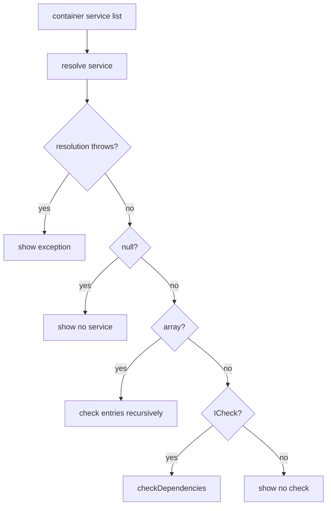

# BASE3 Checks and Diagnostics

## Purpose

This document explains the diagnostic contracts and built-in diagnostic outputs in BASE3.

It covers:

* `ICheck`
* the built-in `check` output
* how container services are inspected
* common `ICheck` implementations
* `phpinfo`
* debug-mode restrictions
* the difference between diagnostics and runtime error handling

---

## 1. `ICheck`

The framework contract is:

```php
namespace Base3\Api;

interface ICheck {

	public function checkDependencies();
}
```

It is intentionally broad for compatibility.

Implementations normally return an associative array of diagnostic names and human-readable results.

Example:

```php
public function checkDependencies(): array {
	return [
		'openssl_available' => extension_loaded('openssl')
			? 'Ok'
			: 'OpenSSL extension not loaded'
	];
}
```

---

## 2. What a dependency check is for

Use `ICheck` to answer operational questions such as:

```text
Is the required PHP extension loaded?
Is a directory writable?
Is a configured dependency present?
Can a remote service be reached?
Is a required session active?
```

A check is diagnostic information.

It is not a substitute for correct runtime validation inside the service itself.

---

## 3. Built-in `check` output

The framework contains:

```php
Base3\Core\Check
```

with technical name:

```text
check
```

It implements:

```text
IOutput
IHelp
ICheck
```

The HTML output is only available when `DEBUG` is enabled.

---

## 4. How the check page works

The current `Check` output scans all names returned by:

```php
$container->getServiceList();
```

For each registered value it attempts to resolve the service and classify it.

Conceptually:



This gives a broad infrastructure overview rather than a subsystem-specific health API.

---

## 5. Check result convention

The built-in HTML renderer visually treats the exact string:

```text
Ok
```

as success.

Other result strings are rendered as non-success diagnostic values.

This is a presentation convention of the current check output, not a strongly typed health-status protocol.

---

## 6. Framework self-check

`Base3\Core\Check` itself reports:

```text
tmp_dir_writable
```

so the diagnostics include whether `DIR_TMP` is writable.

---

## 7. Examples of built-in check providers

Several current framework implementations implement `ICheck`.

Examples include:

```text
AbstractClassMap
  class-map related dependencies

MysqlDatabase / PostgresDatabase
  database/configuration connectivity information

OpensslCrypt
  OpenSSL extension availability

FileToken
  OpenSSL and token-directory writability

MultiLang
  session state

MicroserviceConnector
  master secret and remote service availability

SelectedAccesscontrol / CustomAccesscontrol
  authentication composition dependencies
```

The exact set may grow as plugins add their own checkable services.

---

## 8. Plugin checks

A plugin service can implement `ICheck` directly.

Example:

```php
final class ExampleClient implements ICheck {

	public function checkDependencies(): array {
		return [
			'endpoint_configured' => $this->endpoint !== '' ? 'Ok' : 'Missing endpoint'
		];
	}
}
```

If that object is registered in the container, the built-in check output can inspect it.

Discoverable check classes may also be used by plugin-specific diagnostics through `IClassMap` when that is the chosen extension model.

---

## 9. Do not make checks perform destructive setup

A dependency check should normally inspect state, not mutate production data merely to make the result become green.

If a service requires installation, migration, or explicit configuration, perform that action at the responsible lifecycle boundary and let the check report whether it is ready.

This keeps diagnostics trustworthy.

---

## 10. Exceptions during diagnostics

The built-in check page catches `Throwable` while resolving container services and reports the exception text in the diagnostics table.

This keeps one broken service from preventing the entire diagnostic page from rendering.

That broad catch belongs to the diagnostic aggregation boundary.

It should not be copied into normal runtime services as a way to hide dependency errors.

---

## 11. `phpinfo` output

The framework contains another debug-only output:

```php
Base3\Core\PhpInfo
```

Technical name:

```text
phpinfo
```

It implements:

```text
IOutput
IHelp
```

Its output is suppressed unless `DEBUG` is enabled.

It then calls PHP's `phpinfo()` function.

Because `phpinfo()` may expose sensitive environment details, this endpoint should remain unavailable in normal production mode.

---

## 12. Help diagnostics

Routing can expose `IHelp` output through `out=help` when debug mode is active.

This is complementary to `ICheck`:

```text
IHelp
  how to use or understand this component

ICheck
  whether dependencies/environment appear usable
```

See `core-contracts.md` and `routing.md`.

---

## 13. Diagnostics versus logging

Use checks for current readiness/state.

Use logging for historical runtime events.

Example:

```text
check
  "database_connected" -> Ok

log
  "database connection failed at 14:32"
```

See `logging.md`.

---

## 14. Diagnostics versus tests

`ICheck` runs inside the application runtime and reports environment readiness.

PHPUnit tests verify code behavior in a controlled test environment.

Do not replace automated tests with runtime checks.

See `developer-tooling.md`.

---

## 15. Summary

```text
ICheck
  lightweight dependency/readiness diagnostic contract

Base3\Core\Check
  debug-only aggregate container diagnostic page

Base3\Core\PhpInfo
  debug-only PHP environment information

IHelp
  optional usage/self-description capability
```

Checks should report the state of the correct architecture boundary rather than trying to compensate for broken configuration or missing services.
