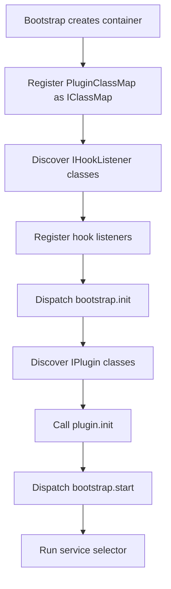
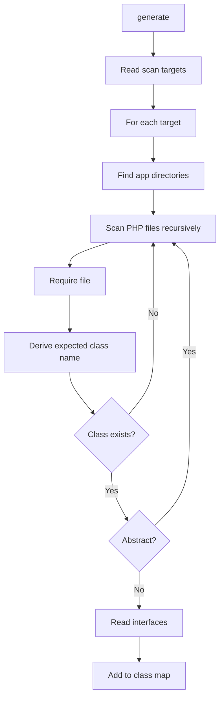
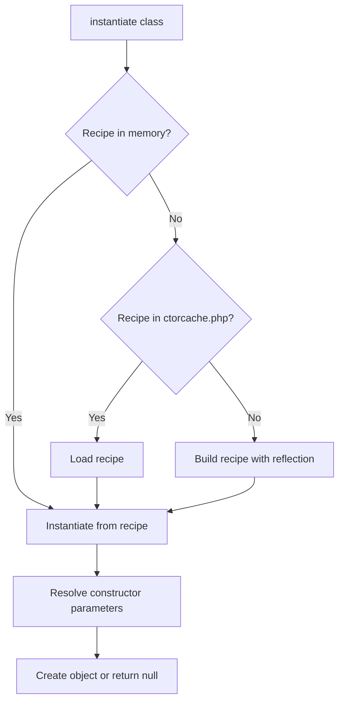

# BASE3 Framework Class Map and Plugin Class Map

## Purpose

This document explains how the **Class Map** system works in the BASE3 framework.

It is written for developers who want to understand:

* what `IClassMap` is for
* why `PluginClassMap` is the normal runtime implementation
* how BASE3 discovers framework classes and plugin classes
* how classes are indexed by app, interface, and logical name
* how plugins become discoverable
* how `IBase::getName()` fits into name-based selection
* how automatic instantiation works
* how constructor dependencies are resolved through the container
* when to use the class map instead of factories
* how class map caching works
* how class map discovery affects hooks, plugins, outputs, jobs, checks, policies, and other extension points

After reading this document, a developer should understand why the class map is one of the most important extension mechanisms in BASE3.

---

## 1. What the Class Map is

The BASE3 Class Map is a discovery and instantiation service.

It answers questions like:

* Which classes implement this interface?
* Which classes are available in this plugin?
* Which class has this logical `getName()`?
* Which output should be used for this route?
* Which job should be executed?
* Which policy implementation has this name?
* Which hook listeners are available?
* Which plugins exist?
* Can this class be instantiated with dependency injection?

A useful shortcut is:

```text id="l8mgfx"
Class Map = discovery + selection + autowired instantiation
```

This makes it different from a simple PHP autoloader.

An autoloader loads a class when the class name is already known.

The class map helps find classes when the framework only knows a concept such as:

```text id="b0c4zi"
IOutput + name=navigation
IJob + name=mailimportjob
IHookListener
IPlugin
IJobExecutionPolicy + name=dailywindowjobpolicy
IConfigValueModeResolver
IDatabaseMigrationProvider
```

---

## 2. The important point: `PluginClassMap` is the normal implementation

BASE3 has more than one class map implementation.

The small framework-only implementation is:

```php id="rw4hkl"
Base3\Core\ClassMap
```

The more important normal runtime implementation is:

```php id="lva9ix"
Base3\Core\PluginClassMap
```

In the default bootstrap, `PluginClassMap` is registered as the `IClassMap` implementation.

Conceptually:

```php id="c9v9fs"
$container
	->set('classmap', fn($c) => new PluginClassMap($c->get(IContainer::class)), IContainer::SHARED)
	->set(IClassMap::class, 'classmap', IContainer::ALIAS);
```

That means normal plugin code receives `PluginClassMap` when it asks for:

```php id="j6nscp"
IClassMap
```

Plugin developers should usually think in terms of `IClassMap`, but the default behavior they rely on is provided by `PluginClassMap`.

---

## 3. Why `PluginClassMap` matters

BASE3 is usually extended through plugins.

A plugin can add:

* outputs
* displays
* hook listeners
* jobs
* execution policies
* checks
* config value modes
* database migration providers
* event-aware services
* provider definitions
* connection drivers
* node definitions
* custom extension points

The framework should not need a central hardcoded list for all of these.

`PluginClassMap` solves this by scanning both:

* the framework source tree
* the plugin source tree

This is the mechanism that makes plugin-provided classes visible to framework systems.

---

## 4. Framework-only `ClassMap`

The simpler `ClassMap` scans only the framework source directory.

```php id="o3cjht"
class ClassMap extends AbstractClassMap {

	protected function getScanTargets(): array {
		return [
			[
				'basedir' => DIR_SRC,
				'subdir' => '',
				'subns' => 'Base3'
			]
		];
	}
}
```

This is useful for framework-only discovery.

It does not scan plugin classes.

That makes it less relevant for normal plugin-based runtime usage.

---

## 5. Plugin-aware `PluginClassMap`

`PluginClassMap` extends `AbstractClassMap` and adds plugin discovery.

```php id="lz5syd"
class PluginClassMap extends AbstractClassMap {

	protected function getScanTargets(): array {
		return [
			[
				'basedir' => DIR_SRC,
				'subdir' => '',
				'subns' => 'Base3'
			],
			[
				'basedir' => DIR_PLUGIN,
				'subdir' => 'src',
				'subns' => ''
			]
		];
	}

	public function getPlugins(): array {
		$plugins = [];

		foreach ($this->getMap() as $app => $appdata) {
			if (!isset($appdata['interface'])) {
				continue;
			}

			if (array_key_exists(IPlugin::class, $appdata['interface'])) {
				$plugins[] = $app;
			}
		}

		return $plugins;
	}
}
```

This is the normal BASE3 class map because it includes both framework and plugin classes.

---

## 6. Scan targets

A scan target describes where the class map should look for PHP classes.

A scan target can contain:

```text id="d9ygnj"
basedir
subdir
subns
app
```

The most important fields are:

```text id="ryvekg"
basedir  root directory to scan
subdir   optional subdirectory inside each app/plugin
subns    namespace prefix or namespace root
```

For `PluginClassMap`, the scan targets are:

```php id="e6hjgb"
[
	[
		'basedir' => DIR_SRC,
		'subdir' => '',
		'subns' => 'Base3'
	],
	[
		'basedir' => DIR_PLUGIN,
		'subdir' => 'src',
		'subns' => ''
	]
]
```

This means:

* framework classes are scanned under `DIR_SRC`
* plugin classes are scanned under `DIR_PLUGIN/<PluginName>/src`

---

## 7. Expected plugin structure

For plugin discovery, a typical plugin should have this structure:

```text id="kqkqiu"
plugin/
└── ExamplePlugin/
	├── src/
	│   ├── ExamplePlugin.php
	│   ├── Content/
	│   │   └── ExampleOutput.php
	│   ├── Hook/
	│   │   └── ExampleHookListener.php
	│   ├── Job/
	│   │   └── ExampleJob.php
	│   └── Service/
	│       └── ExampleService.php
	├── tpl/
	├── assets/
	└── lang/
```

`PluginClassMap` scans:

```text id="sz3rpp"
plugin/ExamplePlugin/src
```

Classes outside `src/` are not discovered by this scan target.

Templates, assets, and language files are not class map classes.

---

## 8. Namespace convention for plugins

For plugin classes, the scanner derives the namespace from the plugin directory and the path below `src/`.

Example file:

```text id="x8i6b9"
plugin/ExamplePlugin/src/Content/ExampleOutput.php
```

Expected class:

```php id="o5f4m1"
ExamplePlugin\Content\ExampleOutput
```

Example file:

```text id="x6cjf5"
plugin/ExamplePlugin/src/ExamplePlugin.php
```

Expected class:

```php id="rjsfku"
ExamplePlugin\ExamplePlugin
```

For plugin discovery to work, namespace and path must match the class map convention.

---

## 9. Framework namespace convention

For framework classes, the scan target uses:

```php id="gj2507"
'subns' => 'Base3'
```

Example file:

```text id="llhbm9"
src/Worker/Policy/Timing/DailyWindowJobPolicy.php
```

Expected class:

```php id="er51ky"
Base3\Worker\Policy\Timing\DailyWindowJobPolicy
```

This is why framework classes live below the `Base3` namespace.

---

## 10. Core interface

The central contract is:

```php id="u3y3kq"
<?php declare(strict_types=1);

namespace Base3\Api;

interface IClassMap {

	public function instantiate(string $class);

	public function generate($regenerate = false): void;

	public function getApps();

	public function &getInstances(array $criteria = []);

	public function &getInstancesByInterface($interface);

	public function &getInstancesByAppInterface($app, $interface, $retry = false);

	public function &getInstanceByAppName($app, $name, $retry = false);

	public function &getInstanceByInterfaceName($interface, $name, $retry = false);

	public function &getInstanceByAppInterfaceName($app, $interface, $name, $retry = false);

	public function getPlugins();
}
```

Most plugin developers use only a few of these methods regularly:

```php id="d7pnqg"
getInstancesByInterface()
getInstanceByInterfaceName()
getInstanceByAppInterfaceName()
instantiate()
getPlugins()
```

---

## 11. Mental model

The class map builds an index.

Conceptually:

```text id="uddqki"
app
├── interface
│   ├── SomeInterface
│   │   ├── ClassA
│   │   └── ClassB
│   └── OtherInterface
│       └── ClassC
└── name
    ├── logicalname1 => ClassA
    └── logicalname2 => ClassC
```

This gives BASE3 three lookup axes:

```text id="gvzmtj"
app
interface
name
```

Many systems combine those axes.

Example:

```text id="sgbv8f"
Find class in any app that implements IOutput and has getName() = "dashboard"
```

or:

```text id="fqxx03"
Find all classes in ExamplePlugin that implement ICheck
```

---

## 12. What “app” means

In the class map, an app is the top-level scan bucket.

For framework classes, this is typically:

```text id="bga2u5"
Base3
```

For plugin classes, this is usually the plugin directory name:

```text id="mxvp8l"
ExamplePlugin
MissionBay
Chatbot
Reporting
```

So when code calls:

```php id="bk66ba"
$classMap->getInstancesByAppInterface('ExamplePlugin', ICheck::class);
```

it asks for all checks inside the `ExamplePlugin` class map bucket.

---

## 13. What “interface” means

The interface index contains every interface implemented by each discovered class.

That makes this possible:

```php id="rt8hm4"
$listeners = $classMap->getInstancesByInterface(IHookListener::class);
```

or:

```php id="kqsv61"
$jobs = $classMap->getInstancesByInterface(IJob::class);
```

Common class map extension interfaces include:

```php id="ngdyoh"
IPlugin::class
IOutput::class
IDisplay::class
IHookListener::class
IJob::class
IJobExecutionPolicy::class
ICheck::class
IConfigValueModeResolver::class
IDatabaseMigrationProvider::class
```

A plugin class becomes discoverable for one of these extension points by implementing the relevant interface.

---

## 14. What “name” means

The name index is based on:

```php id="z8zu60"
IBase::getName()
```

A class is indexed by logical name only when:

* it implements `IBase`
* it exposes a callable static `getName()`
* `getName()` can be called without failing

Example:

```php id="cdjt9j"
final class DashboardOutput implements IOutput {

	public static function getName(): string {
		return 'dashboard';
	}

	public function getOutput(string $out = 'html', bool $final = false): string {
		return '...';
	}

	public function getHelp(): string {
		return 'Shows the dashboard.';
	}
}
```

This class can be resolved by:

```php id="h63eid"
$output = $classMap->getInstanceByInterfaceName(
	IOutput::class,
	'dashboard'
);
```

---

## 15. Why `IBase::getName()` is important

`getName()` is what makes name-based selection possible.

Without a stable logical name, the class map may still find a class by interface, but it cannot select it by technical name.

This matters for:

* outputs selected by request name
* jobs selected by job name
* policies selected by policy definition
* checks displayed in diagnostics
* config value mode resolvers shown in admin tools
* plugin metadata and lookup

Recommended style:

```php id="bq25f9"
public static function getName(): string {
	return 'mailimportjob';
}
```

Avoid unstable or display-oriented names:

```php id="f2aeqc"
public static function getName(): string {
	return 'My Mail Import Job';
}
```

Use labels elsewhere.

`getName()` is a technical identifier.

---

## 16. Class Map versus autoloader

The autoloader and class map solve different problems.

### Autoloader

The autoloader answers:

```text id="aowmub"
I know the class name. Please load it.
```

Example:

```php id="ptfzm1"
new \Base3\Core\Request();
```

### Class Map

The class map answers:

```text id="bp3r88"
I do not know the concrete class yet. Find matching implementations.
```

Example:

```php id="ygk7uq"
$output = $classMap->getInstanceByInterfaceName(
	IOutput::class,
	'dashboard'
);
```

The caller knows the interface and logical name, not the concrete class.

---

## 17. Class Map versus container

The container and class map also solve different problems.

### Container

The container stores known services.

Examples:

```php id="zjga8k"
IConfiguration::class
IDatabase::class
ILogger::class
ISettingsStore::class
IStateStore::class
IEventManager::class
```

A service is usually registered explicitly in bootstrap or plugin `init()`.

### Class Map

The class map discovers components.

Examples:

```php id="iwycf7"
IPlugin
IOutput
IDisplay
IHookListener
IJob
IJobExecutionPolicy
ICheck
IConfigValueModeResolver
```

These are often not registered one by one.

They are found by scanning framework and plugin classes.

### Practical rule

Use the container for known shared services.

Use the class map for discovered components.

---

## 18. Class Map versus factories

In many frameworks, developers create factory classes whenever they need one of several possible implementations.

In BASE3, this is often unnecessary.

The class map already provides:

* discovery
* interface filtering
* name filtering
* app filtering
* autowired instantiation

Instead of this:

```php id="z3sgxy"
final class OutputFactory {

	public function create(string $name): IOutput {
		return match ($name) {
			'dashboard' => new DashboardOutput(),
			'profile' => new ProfileOutput(),
			default => throw new RuntimeException('Unknown output')
		};
	}
}
```

Use this:

```php id="g42le6"
$output = $classMap->getInstanceByInterfaceName(
	IOutput::class,
	$name
);
```

Now a plugin can add a new output without editing a central factory.

Factories are still useful when construction depends on runtime data, external clients, dynamic credentials, or domain-specific composition.

They are not needed just to reproduce class map lookup.

---

## 19. Default bootstrap flow

The default bootstrap registers `PluginClassMap` early.

Then it uses `IClassMap` to discover hook listeners and plugins.

Conceptual flow:



This means plugin classes are visible before plugin `init()` is called.

That is important.

A plugin's hook listener can be discovered and registered before the plugin object has initialized its services, as long as the listener class itself is instantiable with the services that already exist at that time.

---

## 20. Plugin discovery

A plugin class is discovered like any other class.

It must:

* live below `plugin/<PluginName>/src`
* have a matching namespace
* implement `IPlugin`
* be instantiable by the class map
* usually implement `IBase` through the plugin contract

Example:

```php id="l1zoxf"
<?php declare(strict_types=1);

namespace ExamplePlugin;

use Base3\Api\IContainer;
use Base3\Api\IPlugin;

final class ExamplePlugin implements IPlugin {

	public function __construct(
		private readonly IContainer $container
	) {}

	public static function getName(): string {
		return 'exampleplugin';
	}

	public function init() {
		$this->container->set(
			ExampleService::class,
			fn() => new ExampleService(),
			IContainer::SHARED
		);
	}
}
```

The bootstrap can discover it through:

```php id="qegbop"
$plugins = $classMap->getInstancesByInterface(IPlugin::class);
```

Then it calls:

```php id="y4w15j"
$plugin->init();
```

---

## 21. `getPlugins()`

`IClassMap` includes:

```php id="d9p0b2"
public function getPlugins();
```

The base `AbstractClassMap` returns an empty array.

`PluginClassMap` overrides this.

It inspects the class map and returns the app names that contain classes implementing:

```php id="ikadyc"
IPlugin::class
```

Conceptually:

```php id="m7sb83"
foreach ($this->getMap() as $app => $appdata) {
	if (isset($appdata['interface'][IPlugin::class])) {
		$plugins[] = $app;
	}
}
```

This is metadata-style plugin discovery.

Runtime initialization usually uses:

```php id="f3bmmy"
$classMap->getInstancesByInterface(IPlugin::class)
```

because that returns actual plugin instances.

---

## 22. How scanning works

During generation, the class map loops through all scan targets.

For each target:

1. determine `basedir`
2. determine `subdir`
3. determine `subns`
4. determine apps
5. build the path for each app
6. recursively scan PHP files
7. require matching files
8. derive the expected class name
9. check whether the class exists
10. skip abstract classes
11. collect implemented interfaces
12. fill the map

Diagram:



---

## 23. File selection rules

The scanner applies several filters.

It:

* skips dotfiles
* skips entries starting with `_`
* recursively scans directories
* accepts only `.php` files
* ignores filenames with more than one dot
* skips the framework `Autoloader.php` in the framework source tree
* ignores files that do not define the expected class
* ignores abstract classes

This means classes should follow predictable path and namespace conventions.

---

## 24. Map filling

The class map is filled in two ways.

### Interface index

Every discovered class is indexed by every interface it implements.

Conceptually:

```php id="u77px4"
$this->map[$app]['interface'][$interface][] = $class;
```

This powers:

```php id="tt60cy"
$classMap->getInstancesByInterface(IHookListener::class);
```

### Name index

If the class implements `IBase`, it is indexed by logical name.

Conceptually:

```php id="nall92"
$name = $class::getName();
$this->map[$app]['name'][$name] = $class;
```

This powers:

```php id="ot8lsz"
$classMap->getInstanceByInterfaceName(IOutput::class, 'dashboard');
```

---

## 25. Duplicate names

Inside one app, the name index stores one class per name.

If two classes in the same app return the same `getName()`, the later discovered class can overwrite the earlier one in the name map.

Avoid duplicate technical names.

Good:

```text id="rs8wgj"
dashboardoutput
mailimportjob
dailywindowjobpolicy
```

Risky:

```text id="yrql17"
default
job
output
test
```

Name collisions become harder to diagnose when multiple plugins expose similar components.

Prefer plugin/domain-specific names when necessary.

---

## 26. Cache files

`AbstractClassMap` uses two cache files under `DIR_TMP`.

```text id="k8n8zy"
DIR_TMP/classmap.php
DIR_TMP/ctorcache.php
```

### `classmap.php`

Stores the discovered class index:

* app
* interface
* name
* class names

### `ctorcache.php`

Stores constructor recipes.

Constructor recipes describe how classes should be instantiated without repeating reflection work on every request.

---

## 27. Cache generation

The class map is generated when needed.

If `classmap.php` is missing or empty, generation is forced.

A caller can also force regeneration:

```php id="him4ue"
$classMap->generate(true);
```

If regeneration is not forced and a usable cache exists, generation is skipped.

Typical development use:

```text id="hzwuy2"
Added new plugin class.
Class is not found.
Regenerate class map.
```

---

## 28. Retry regeneration

Several lookup methods automatically retry once.

The normal pattern is:

1. search current map
2. if not found, regenerate map
3. search again
4. return result or `null` / empty array

This helps during development when files were added after the cache was generated.

The retry flag prevents endless regeneration loops.

---

## 29. Writable `DIR_TMP`

The class map writes cache files to:

```text id="ogxvzj"
DIR_TMP
```

Therefore `DIR_TMP` must be writable.

If it is not writable, class map generation cannot store its result.

This affects:

* plugin discovery
* output discovery
* hook listener discovery
* job discovery
* policy discovery
* constructor cache generation

A deployment should ensure `DIR_TMP` exists and is writable.

---

## 30. Main lookup: `getInstances()`

The generic lookup method is:

```php id="cgez7g"
$classMap->getInstances(array $criteria = []);
```

Supported criteria:

```php id="o31jmu"
[
	'app' => 'ExamplePlugin',
	'interface' => IOutput::class,
	'name' => 'dashboard'
]
```

Supported combinations:

* app + interface + name
* app + interface
* app + name
* interface + name
* interface
* name
* no criteria

Most plugin code should use the more explicit convenience methods.

---

## 31. `getInstancesByInterface()`

Use this when you need all implementations of an interface across framework and plugins.

```php id="m15zm6"
$checks = $classMap->getInstancesByInterface(ICheck::class);
```

Common use cases:

```php id="tezzwa"
$classMap->getInstancesByInterface(IPlugin::class);
$classMap->getInstancesByInterface(IHookListener::class);
$classMap->getInstancesByInterface(IJob::class);
$classMap->getInstancesByInterface(ICheck::class);
$classMap->getInstancesByInterface(IConfigValueModeResolver::class);
```

This is the most important bulk discovery method.

---

## 32. `getInstancesByAppInterface()`

Use this when you need all implementations of an interface inside one plugin or app.

```php id="o68hqd"
$checks = $classMap->getInstancesByAppInterface(
	'ExamplePlugin',
	ICheck::class
);
```

This is useful for diagnostics and plugin-specific introspection.

---

## 33. `getInstanceByInterfaceName()`

Use this when you know the interface and logical name, but not the plugin/app.

```php id="gl8sd4"
$output = $classMap->getInstanceByInterfaceName(
	IOutput::class,
	'dashboard'
);
```

This is one of the most important lookup methods in BASE3.

Examples:

```php id="wlc77y"
$job = $classMap->getInstanceByInterfaceName(
	IJob::class,
	'mailimportjob'
);

$policy = $classMap->getInstanceByInterfaceName(
	IJobExecutionPolicy::class,
	'dailywindowjobpolicy'
);

$output = $classMap->getInstanceByInterfaceName(
	IOutput::class,
	'dashboard'
);
```

This protects against accidentally selecting a class with the right name but the wrong role.

---

## 34. `getInstanceByAppName()`

Use this when you know the app and name, but do not need to restrict by interface.

```php id="bbj7ss"
$instance = $classMap->getInstanceByAppName(
	'ExamplePlugin',
	'dashboard'
);
```

For most runtime selection, prefer an interface-constrained lookup.

Better:

```php id="aeagkg"
$instance = $classMap->getInstanceByAppInterfaceName(
	'ExamplePlugin',
	IOutput::class,
	'dashboard'
);
```

---

## 35. `getInstanceByAppInterfaceName()`

Use this when you know all three selection axes:

* app
* interface
* name

```php id="v7g5i7"
$output = $classMap->getInstanceByAppInterfaceName(
	'ExamplePlugin',
	IOutput::class,
	'dashboard'
);
```

If the app is empty, it behaves like:

```php id="z2p6w8"
getInstanceByInterfaceName($interface, $name)
```

This is useful for routing systems where app selection is optional.

---

## 36. `instantiate()`

`instantiate()` creates an object from a known class name.

```php id="fb3kdy"
$instance = $classMap->instantiate(MyKnownClass::class);
```

It is the bridge between discovery and dependency injection.

The class map does not always call:

```php id="c2wvrr"
new $class()
```

Instead, it uses constructor recipes and resolves dependencies through the container.

That allows discoverable plugin classes to use constructor injection without being manually registered as services.

---

## 37. Constructor recipes

The constructor cache stores recipes for instantiation.

A recipe describes:

* whether the class is abstract
* whether the class has a constructor
* parameter names
* parameter types
* default values
* nullable parameters
* builtin versus class/interface parameters
* union types

This avoids repeated reflection work during normal runtime.



---

## 38. Constructor dependency resolution

When instantiating a class, the class map resolves constructor parameters.

### Class or interface type

For non-builtin types, it tries the container by type.

Example:

```php id="eoozf3"
public function __construct(
	private readonly IConfiguration $configuration
) {}
```

The class map checks whether the container has:

```php id="jgbf03"
IConfiguration::class
```

If yes, that service is injected.

### Parameter-name fallback

If type lookup fails, the class map can try the parameter name.

Example:

```php id="tqxwti"
public function __construct(
	private readonly array $workers
) {}
```

If the container has:

```php id="y5ips8"
'workers'
```

the value can be injected.

### Builtin parameters

For builtin parameters, type-based DI is not possible.

The class map uses:

* parameter-name registration
* default value
* `null` when nullable
* otherwise returns `null`

### Union types

For union types, the class map tries the listed types and injects the first available matching container service.

---

## 39. Dynamic mock fallback

For unresolved non-builtin dependencies, the implementation can try to create a dynamic mock.

This helps in discovery or inspection scenarios.

It should not be treated as normal application design.

Plugin authors should still register real dependencies properly in bootstrap or plugin `init()`.

The fallback exists to make probing more robust, not to replace proper dependency registration.

---

## 40. When instantiation returns `null`

Instantiation may return `null`.

Common reasons:

* the class is abstract
* required dependency cannot be resolved
* required builtin parameter has no container value and no default
* required union type cannot be resolved
* dynamic mock fallback cannot provide a value

Code that uses class map results should be prepared for missing instances.

---

## 41. How this affects hooks

The bootstrap discovers hook listeners through:

```php id="phg2nm"
$classMap->getInstancesByInterface(IHookListener::class)
```

Because the default class map is `PluginClassMap`, hook listeners inside plugins can be discovered automatically.

A plugin listener usually needs only:

* class under `plugin/<PluginName>/src`
* correct namespace
* implementation of `IHookListener`
* constructor dependencies that are available before listener registration

This is why class map discovery is part of the bootstrap lifecycle.

---

## 42. How this affects plugins

Plugin initialization itself depends on class map discovery.

The bootstrap asks the class map for all `IPlugin` implementations:

```php id="nsua1l"
$plugins = $classMap->getInstancesByInterface(IPlugin::class);
```

Then it calls:

```php id="uebwkj"
$plugin->init();
```

A plugin does not need to be listed manually in the bootstrap.

It needs to be discoverable.

---

## 43. How this affects outputs and displays

Outputs and displays are often selected by logical name.

Example:

```php id="y6dyeq"
$output = $classMap->getInstanceByInterfaceName(
	IOutput::class,
	$name
);
```

This allows a plugin to add a new output simply by adding a discoverable class that implements `IOutput` and returns a stable `getName()`.

No central output factory is needed.

---

## 44. How this affects workers and jobs

Workers can discover all jobs:

```php id="o8dveh"
$jobs = $classMap->getInstancesByInterface(IJob::class);
```

A specific job can be selected by name:

```php id="cwqr42"
$job = $classMap->getInstanceByInterfaceName(
	IJob::class,
	'mailimportjob'
);
```

This allows plugins to provide jobs without editing the worker core.

---

## 45. How this affects policies

Execution policies can be resolved by name.

Example:

```php id="e2gmxf"
$policy = $classMap->getInstanceByInterfaceName(
	IJobExecutionPolicy::class,
	'dailywindowjobpolicy'
);
```

That is why policy definitions can store a policy name instead of a concrete class.

The class map turns that name into the correct policy instance.

---

## 46. How this affects config value modes

The Config Value Resolver discovers mode resolvers through the class map.

Conceptually:

```php id="k7npit"
$modeResolvers = $classMap->getInstancesByInterface(
	IConfigValueModeResolver::class
);
```

This means a plugin can add a new generic config value mode by adding a discoverable mode resolver.

No central resolver factory has to be changed.

---

## 47. How this affects migration providers

Database migration providers are discoverable components. The migration runner asks the class map for all `IDatabaseMigrationProvider` implementations and then evaluates each provider's `isActive()` method.

This distinction is important:

```text
Class map discovery says: this provider class exists.
Provider activation says: this provider is relevant for the current runtime composition.
```

Do not run migrations merely because a provider class exists. A provider should be active only when the implementation or feature that owns the schema is actually wired in the current project.

---

## 48. Recommended discoverable component style

A class that should be discovered by the class map should:

1. live in the expected `src/` path
2. use the expected namespace
3. implement the relevant interface
4. implement `IBase` when name-based lookup is needed
5. return a stable `getName()`
6. use constructor injection
7. avoid direct service locator usage in runtime code

Example:

```php id="uzm2n8"
<?php declare(strict_types=1);

namespace ExamplePlugin\Job;

use Base3\Logger\Api\ILogger;
use Base3\Worker\Api\IJob;

final class MailImportJob implements IJob {

	public function __construct(
		private readonly ILogger $logger
	) {}

	public static function getName(): string {
		return 'mailimportjob';
	}

	public function isActive() {
		return true;
	}

	public function getPriority() {
		return 1;
	}

	public function go() {
		$this->logger->info('Mail import started', [
			'scope' => 'worker'
		]);

		return 'Mail import finished.';
	}
}
```

---

## 49. Recommended plugin class style

A plugin class itself is also a discoverable class.

Example:

```php id="v6g2dn"
<?php declare(strict_types=1);

namespace ExamplePlugin;

use Base3\Api\IContainer;
use Base3\Api\IPlugin;

final class ExamplePlugin implements IPlugin {

	public function __construct(
		private readonly IContainer $container
	) {}

	public static function getName(): string {
		return 'exampleplugin';
	}

	public function init() {
		$this->container->set(
			ExampleService::class,
			fn() => new ExampleService(),
			IContainer::SHARED
		);
	}
}
```

Its constructor should only require dependencies available before plugin initialization.

Usually that means:

```php id="azfbyu"
IContainer
```

or other very early core services.

---

## 50. Early discovery caveat

Some classes are discovered before plugin `init()` has registered plugin services.

This is especially relevant for:

* plugin classes
* hook listeners used during bootstrap
* anything discovered before `bootstrap.start`

If such a class requires a plugin service that is only registered inside the same plugin's `init()`, instantiation can fail or fall back.

Practical rule:

```text id="ba31uj"
Classes needed before plugin init must depend only on services already registered before plugin init.
```

Runtime classes selected later can depend on plugin services registered during `init()`.

---

## 51. Recommended naming style

Use stable lowercase technical names.

Good:

```text id="ha74a8"
dashboard
mailimportjob
dailywindowjobpolicy
configvaluemoderesolver
connectionconfigdisplay
```

Avoid display names:

```text id="xnekh5"
Mail Import Job
Dashboard Page
Daily Window Policy
```

If a human-readable label is needed, expose it through a separate method or settings value.

---

## 52. Deployment considerations

For reliable class map behavior:

* `DIR_TMP` must be writable
* plugin classes must live under `plugin/<PluginName>/src`
* namespaces must match paths
* class filenames must match class names
* discoverable classes must not be abstract
* required constructor dependencies must be registered
* `getName()` values should be stable
* class map cache should be regenerated after code changes when needed

A deployment process may explicitly run:

```php id="rcog9x"
$classMap->generate(true);
```

after updating framework or plugin code.

---

## 53. Development troubleshooting

### New plugin class is not found

Check:

* is it under `plugin/<PluginName>/src`?
* does the namespace match the path?
* does the filename match the class name?
* is `DIR_TMP/classmap.php` stale?
* can the class be required without fatal errors?
* is the class abstract?
* does it implement the expected interface?

Then regenerate:

```php id="oq7s4d"
$classMap->generate(true);
```

### Class is found by interface but not by name

Check:

* does it implement `IBase`?
* does it provide a static `getName()`?
* is the name stable?
* is there a duplicate `getName()` in the same app?

### Class is discovered but cannot instantiate

Check:

* are constructor dependencies registered?
* are type hints correct?
* are builtin parameters given defaults or registered by parameter name?
* is the class needed before plugin `init()` registers its dependencies?

---

## 54. Custom class maps

A project or host integration can provide a different class map implementation.

Reasons:

* scan a different plugin directory
* include generated classes
* support Composer class map generation
* restrict plugins
* scan host-specific extension directories
* use a different cache strategy

A custom implementation should usually extend:

```php id="rgf4o6"
AbstractClassMap
```

and provide its own:

```php id="yo3fdm"
getScanTargets()
```

The rest of the framework should depend only on:

```php id="r6xm8p"
IClassMap
```

---

## 55. Practical rules for plugin developers

Put plugin PHP classes under `plugin/<PluginName>/src`.

Use namespaces that match plugin path structure.

Implement the relevant extension interface.

Implement `IBase` when name-based lookup is needed.

Return stable technical names from `getName()`.

Use constructor injection.

Register plugin services in plugin `init()`.

Use the container for known shared services.

Use the class map for discovered components.

Do not write factories that only duplicate class map lookup.

Regenerate the class map when new classes are not discovered.

Avoid constructor dependencies that are not available at the time the class is discovered.

---

## 56. Summary

The BASE3 Class Map system discovers and instantiates framework and plugin classes.

The important runtime implementation is usually:

```php id="kurk70"
PluginClassMap
```

because it scans both:

```text id="hayycx"
DIR_SRC
DIR_PLUGIN/<PluginName>/src
```

The smaller `ClassMap` scans only framework source classes and is therefore less central for normal plugin development.

The class map indexes classes by:

```text id="vuakqu"
app
interface
name
```

and provides lookup methods such as:

```php id="q3q66p"
getInstancesByInterface()
getInstancesByAppInterface()
getInstanceByInterfaceName()
getInstanceByAppInterfaceName()
instantiate()
getPlugins()
```

This is what allows BASE3 to discover plugins, hook listeners, outputs, jobs, checks, policies, config value modes, and other extension components without central factories.

In short:

```text id="pdit9y"
Container for known shared services.
PluginClassMap for framework and plugin discovery.
Factories only for real runtime construction logic.
```
