# BASE3 Framework Configuration

## Purpose

This document explains how configuration works in the BASE3 framework.

It is written for developers who build their own plugins and want to understand:

* which configuration API they should depend on
* how configuration is typically consumed through Dependency Injection
* how the backwards-compatible API and the newer convenience API fit together
* how lazy loading, dirty tracking, and persistence work
* when to use `ConfigFile`, `ArrayConfiguration`, or a custom implementation
* how to build a plugin-specific configuration backend

The goal is practical understanding. After reading this document, a plugin developer should be able to:

* inject and use `IConfiguration`
* read typed configuration values safely
* update configuration data without breaking the rest of the system
* choose the right storage strategy for a plugin
* implement a custom configuration provider on top of `AbstractConfiguration`

---

## 1. Overview

BASE3 configuration is intentionally simple at the API level.

The central interface is:

* `Base3\Configuration\Api\IConfiguration`

This interface supports two usage styles at the same time:

1. **Backwards-compatible access**

   * `get()`
   * `set()`
   * `save()`

2. **Modern convenience access**

   * typed getters such as `getString()`, `getInt()`, `getBool()`
   * value-oriented helpers such as `getValue()` and `setValue()`
   * group-oriented helpers such as `getGroup()` and `setGroup()`
   * lifecycle helpers such as `isDirty()`, `saveIfDirty()`, `reload()`, `persistValue()`

The design goal is to keep old code working while making everyday plugin development more ergonomic.

---

## 2. Core concepts

In BASE3, configuration data is usually treated as a nested associative array with this structure:

```php
[
	'database' => [
		'host' => 'localhost',
		'name' => 'app',
	],
	'manager' => [
		'layout' => 'simple',
		'stdscope' => 'web',
	],
]
```

The terminology used by the configuration API is:

* **group** = a configuration section, similar to an INI section
* **key** = a value inside a group

So this:

```php
$config->getString('manager', 'layout', 'default');
```

reads the key `layout` from the group `manager`.

### Conceptual model

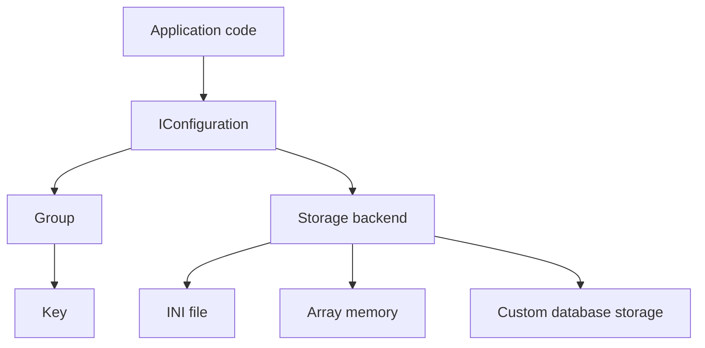

---

## 3. The main interface: `IConfiguration`

The entire framework depends on the interface, not on a specific backend.

### Interface responsibilities

`IConfiguration` combines five responsibilities:

1. **Read configuration**
2. **Write configuration in memory**
3. **Persist configuration to storage**
4. **Provide safe typed access**
5. **Expose backend-friendly lifecycle helpers**

### Class relationship

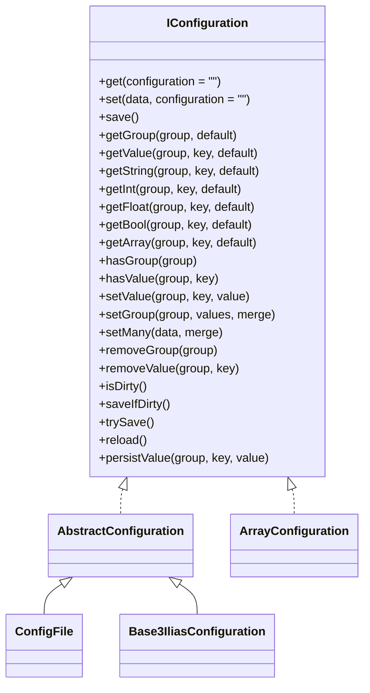

### Why plugin developers should depend on the interface

A plugin should almost always type-hint `IConfiguration`, not `ConfigFile` or another concrete class.

That keeps the plugin reusable because different projects can provide different configuration backends through the container.

Typical examples:

* one project stores config in `config.ini`
* another project stores config in a database table
* tests use an in-memory array configuration
* a long-running worker reloads configuration on demand

The consuming plugin code should not need to change.

---

## 4. Typical usage through Dependency Injection

For most plugin classes, configuration is simply a service from the container.

### Example: inject `IConfiguration` into a service

```php
<?php declare(strict_types=1);

namespace MyPlugin\Service;

use Base3\Configuration\Api\IConfiguration;

class ReportSettingsService {

	public function __construct(
		private readonly IConfiguration $configuration
	) {}

	public function getDefaultLayout(): string {
		return $this->configuration->getString('report', 'layout', 'table');
	}

	public function isDebugEnabled(): bool {
		return $this->configuration->getBool('report', 'debug', false);
	}

	public function getExportFormats(): array {
		return $this->configuration->getArray('report', 'export_formats', ['csv']);
	}
}
```

### Runtime access flow

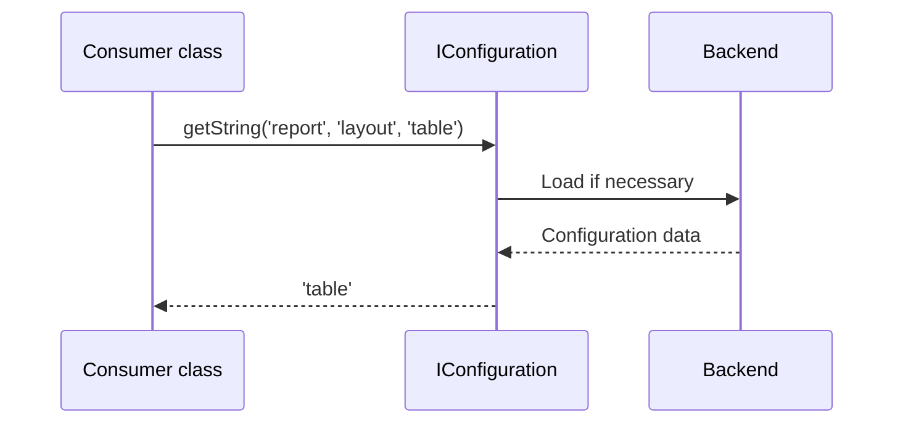

### Why DI is the normal approach

Using DI gives you:

* backend independence
* easier testing
* less global state
* simpler replacement in project-specific deployments

For plugin authors, this is the default approach.

---

## 5. Backwards-compatible API

The old API is still available and remains valid:

* `get()`
* `set()`
* `save()`

This is important because older BASE3 code may still use section-level access.

### `get()` semantics

```php
$all = $config->get();
$manager = $config->get('manager');
```

Behavior:

* `get()` with an empty parameter returns the entire configuration
* `get('manager')` returns the full group named `manager`
* missing groups return `null`

### `set()` semantics

```php
$config->set([
	'layout' => 'simple',
	'stdscope' => 'web'
], 'manager');

$config->set([
	'manager' => ['layout' => 'simple']
]);
```

Behavior:

* if the group name is given, that group is replaced
* if the group name is empty, the entire root configuration is replaced

### `save()` semantics

```php
$config->save();
```

Behavior:

* persists the current configuration state
* kept for backwards compatibility even though newer code often prefers `saveIfDirty()` or `trySave()`

### When to still use the BC API

Use the backwards-compatible API when:

* you are touching legacy code
* you intentionally want whole-group replacement
* you are migrating older plugins gradually

For new code, the convenience API is usually clearer and safer.

---

## 6. Convenience API for modern plugin code

The convenience API exists because most real code does not want whole-array handling.

### Reading a group

```php
$manager = $config->getGroup('manager', []);
```

This guarantees an array result.

### Reading a single value

```php
$layout = $config->getValue('manager', 'layout', 'simple');
```

### Typed reads

```php
$layout = $config->getString('manager', 'layout', 'simple');
$retries = $config->getInt('http', 'retries', 3);
$timeout = $config->getFloat('http', 'timeout', 2.5);
$debug = $config->getBool('debug', 'enabled', false);
$formats = $config->getArray('export', 'formats', ['csv']);
```

### Existence checks

```php
if ($config->hasGroup('database')) {
	// ...
}

if ($config->hasValue('database', 'host')) {
	// ...
}
```

### Updates

```php
$config->setValue('manager', 'layout', 'simple');
$config->setGroup('manager', ['layout' => 'simple', 'stdscope' => 'web']);
$config->setMany([
	'manager' => ['layout' => 'simple'],
	'debug' => ['enabled' => true],
]);
```

### Deletes

```php
$config->removeValue('manager', 'layout');
$config->removeGroup('debug');
```

---

## 7. Typed getter behavior

The typed getters are a major part of the developer ergonomics.

They reduce repeated conversion logic in plugin code and provide predictable defaults.

### `getString()`

* returns the value unchanged if it is already a string
* converts scalar values to string
* returns the default for arrays, objects, or `null`

### `getInt()`

* returns ints directly
* converts booleans to `1` or `0`
* converts numeric strings and numeric floats to int
* returns the default for non-numeric values

### `getFloat()`

* returns floats directly
* converts ints and numeric strings to float
* returns the default for non-numeric values

### `getBool()`

Supports common practical values such as:

* true: `1`, `true`, `yes`, `on`
* false: `0`, `false`, `no`, `off`, empty string

### `getArray()`

This method is especially useful because it supports two common storage styles:

1. real arrays
2. JSON strings that decode to arrays

Example:

```php
$formats = $config->getArray('export', 'formats', []);
```

If the stored value is:

```php
'["csv", "xlsx", "json"]'
```

then `getArray()` can decode it automatically.

### Conversion overview

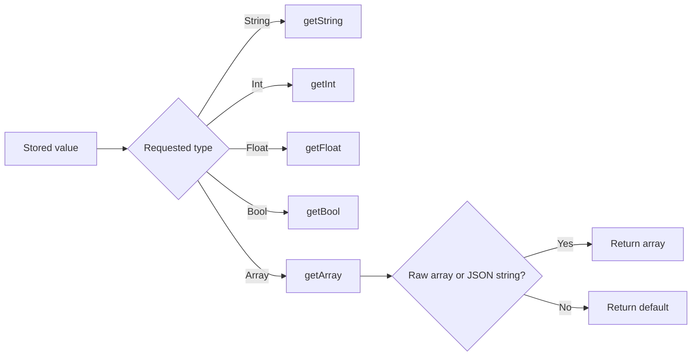

---

## 8. Lazy loading and dirty tracking

The configuration subsystem is designed so that reading does not immediately force backend work at object construction time.

### Lazy loading

For classes based on `AbstractConfiguration`, the actual backend load happens only on first access.

That means:

* the object can be constructed early
* the backend is only queried when needed
* read-only requests that never touch config do not pay the load cost

### Dirty tracking

Whenever configuration is modified in memory, the instance is marked as dirty.

This allows the framework or plugin code to avoid unnecessary writes.

### State model

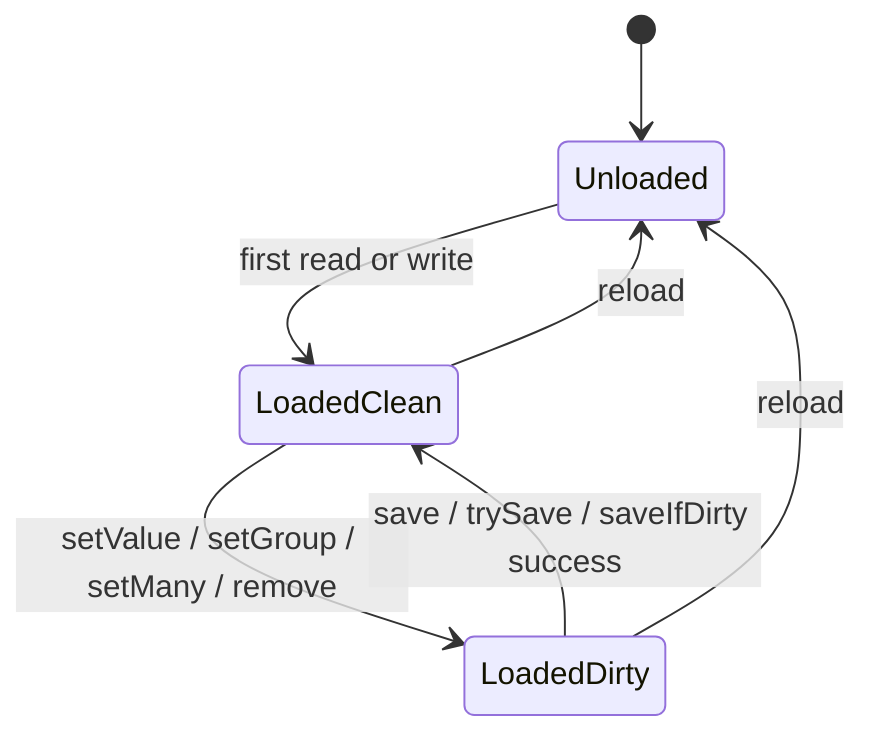

### Typical lifecycle

```php
$config->setValue('manager', 'layout', 'simple');

if ($config->isDirty()) {
	$config->saveIfDirty();
}
```

### Practical recommendation

For normal application code:

* read with typed getters
* write with `setValue()` or `setGroup()`
* persist with `saveIfDirty()` unless you specifically need stricter error handling

---

## 9. `AbstractConfiguration`: the base for custom backends

`AbstractConfiguration` is the main foundation for custom configuration backends.

It already implements almost all logic from `IConfiguration`.

A subclass only needs to implement two backend-specific methods:

* `load(): array`
* `saveData(array $data): bool`

### What `AbstractConfiguration` already gives you

* lazy loading
* dirty tracking
* backwards-compatible `get()` / `set()` / `save()`
* typed getters
* value and group helpers
* delete helpers
* `reload()`
* default `persistValue()` implementation
* normalization of loaded data

### Internal structure

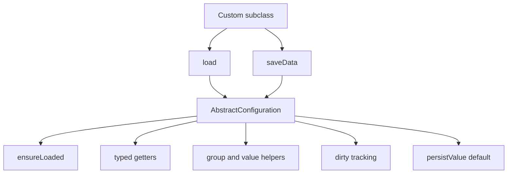

### Minimal custom implementation

```php
<?php declare(strict_types=1);

namespace MyPlugin\Configuration;

use Base3\Configuration\AbstractConfiguration;

class MyConfiguration extends AbstractConfiguration {

	protected function load(): array {
		return [
			'myplugin' => [
				'enabled' => true,
				'mode' => 'default'
			]
		];
	}

	protected function saveData(array $data): bool {
		// Persist to your backend here.
		return true;
	}
}
```

This is the normal extension point for plugin-specific configuration providers.

---

## 10. `ConfigFile`: the default file-based implementation

`Base3\Configuration\ConfigFile\ConfigFile` is the built-in INI-backed configuration implementation.

It extends `AbstractConfiguration` and adds file-specific behavior.

### Key characteristics

* reads from `DIR_CNF . "config.ini"` by default
* can override the file path through the `CONFIG_FILE` environment variable
* loads lazily on first access
* supports recursive include files
* writes INI data back to the same file
* implements `ICheck` for dependency diagnostics

### Typical load source

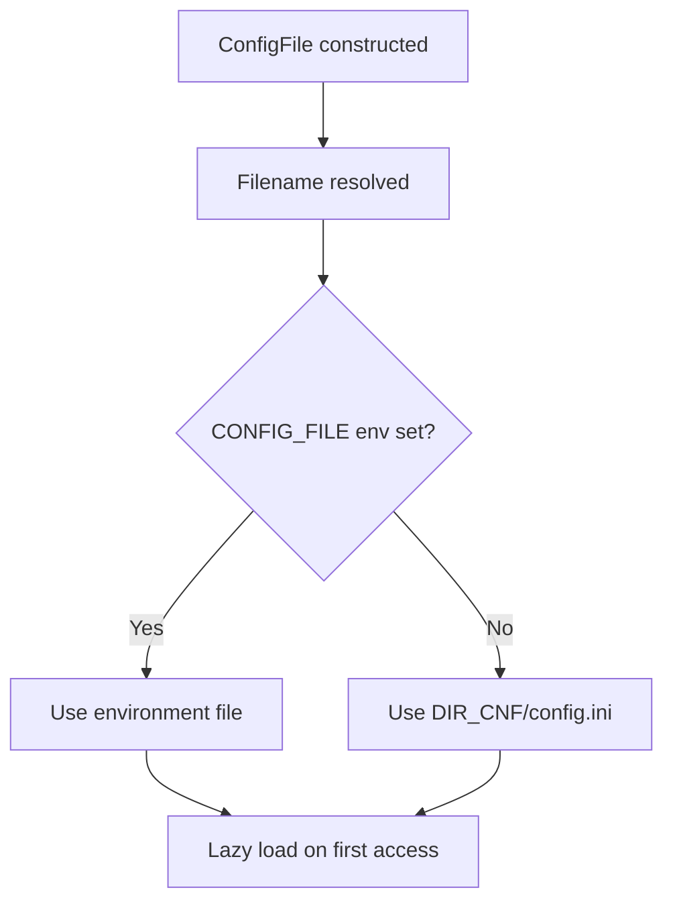

### Example INI file

```ini
[directories]
data = "/var/app/data"

[manager]
layout = "simple"
stdscope = "web"

[database]
host = "localhost"
name = "base3"
port = 3306
```

### Include support

`ConfigFile` supports included files via a dedicated section:

```ini
[directories]
data = "/var/app/data"

[include]
files[] = "database.ini"
files[] = "mail.ini"
```

The implementation then loads the included files recursively.

If `directories.data` exists, include files are resolved relative to that directory.
Otherwise, they are resolved relative to the directory of the current INI file.

### Include processing flow

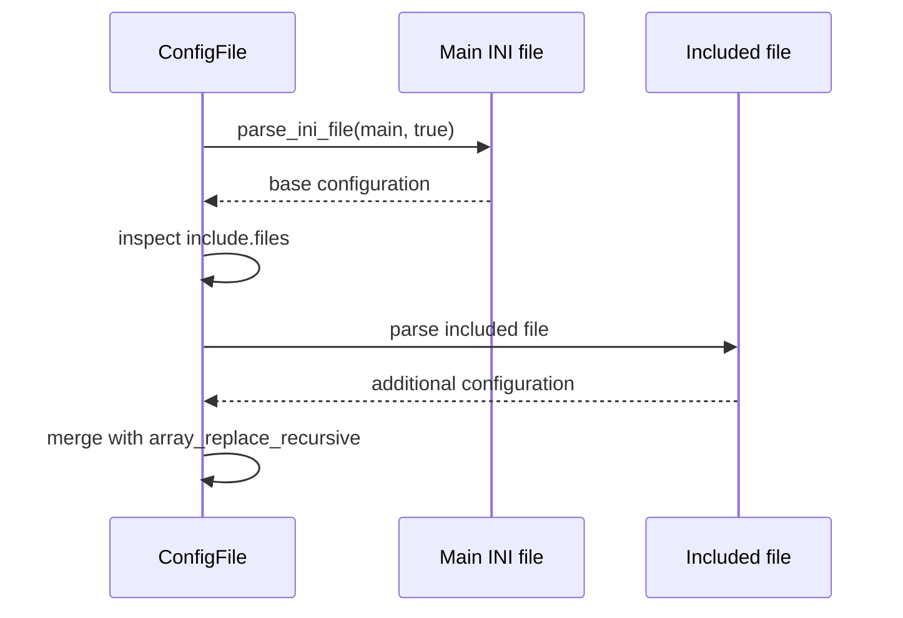

### Diagnostics via `ICheck`

`ConfigFile` also exposes basic dependency checks:

* whether the config file exists
* whether `directories.data` is defined

That makes it suitable for framework health checks or admin diagnostics.

---

## 11. `ArrayConfiguration`: the simplest implementation

`Base3\Configuration\ArrayConfiguration` is an in-memory implementation of `IConfiguration`.

It does not extend `AbstractConfiguration`, but it provides the same public interface.

### When to use it

`ArrayConfiguration` is useful for:

* tests
* temporary runtime overrides
* small standalone tools
* bootstrapping scenarios where no persistent storage is needed

### Characteristics

* all data lives in memory
* `save()` only resets the dirty flag
* `trySave()` always succeeds
* `reload()` only resets dirty state
* typed getter behavior mirrors the main abstraction closely

### Example

```php
<?php declare(strict_types=1);

use Base3\Configuration\ArrayConfiguration;

$config = new ArrayConfiguration([
	'manager' => [
		'layout' => 'simple',
		'stdscope' => 'web'
	],
	'debug' => [
		'enabled' => true
	]
]);

$layout = $config->getString('manager', 'layout', 'default');
$debug = $config->getBool('debug', 'enabled', false);
```

### Best use cases

* unit tests that need predictable config
* replacing container config in isolated scenarios
* building wrapper services around configuration before deciding on persistent storage

---

## 12. Choosing the right implementation

The configuration interface stays the same, but the backend choice depends on the problem you want to solve.

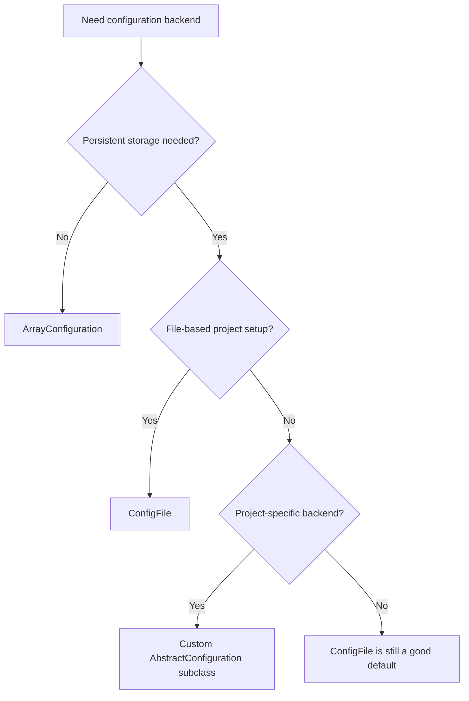

### General guidance

Use `ArrayConfiguration` when:

* persistence is unnecessary
* you want lightweight test setup

Use `ConfigFile` when:

* your deployment already uses INI configuration
* file-based editing by admins or operators is desired
* you want a simple default that works across many environments

Create a custom subclass of `AbstractConfiguration` when:

* config must live in a database
* config should be tenant-specific or project-specific
* defaults must be bootstrapped programmatically
* single-value persistence can be optimized

---

## 13. Reading configuration in plugin code

For most plugin authors, configuration usage should be boring and predictable.

### Recommended style

* inject `IConfiguration`
* use typed getters
* provide sensible defaults
* keep group and key names stable
* avoid spreading raw `get()` calls everywhere

### Example: feature toggle service

```php
<?php declare(strict_types=1);

namespace MyPlugin\Feature;

use Base3\Configuration\Api\IConfiguration;

class FeatureToggleService {

	public function __construct(
		private readonly IConfiguration $configuration
	) {}

	public function isNewUiEnabled(): bool {
		return $this->configuration->getBool('features', 'new_ui', false);
	}

	public function isAuditLoggingEnabled(): bool {
		return $this->configuration->getBool('features', 'audit_logging', true);
	}
}
```

### Example: HTTP client settings

```php
<?php declare(strict_types=1);

namespace MyPlugin\Http;

use Base3\Configuration\Api\IConfiguration;

class HttpClientSettings {

	public function __construct(
		private readonly IConfiguration $configuration
	) {}

	public function getBaseUrl(): string {
		return $this->configuration->getString('http', 'base_url', '');
	}

	public function getTimeout(): float {
		return $this->configuration->getFloat('http', 'timeout', 5.0);
	}

	public function getRetryCount(): int {
		return $this->configuration->getInt('http', 'retries', 3);
	}
}
```

### Why defaults matter

Good defaults make plugins more portable and easier to install.

A plugin should behave reasonably even when a project has not yet set every optional key.

---

## 14. Writing configuration from plugin code

Some plugins only read config. Others need to change it.

When writing configuration, the most important distinction is:

* **update in memory only**
* **persist to the backend immediately**

### In-memory update

```php
$config->setValue('manager', 'layout', 'simple');
```

At this point:

* the configuration object is dirty
* the backend may not yet have been updated

### Save later

```php
$config->saveIfDirty();
```

### Persist a single value immediately

```php
$config->persistValue('manager', 'layout', 'simple');
```

This is especially important for custom backends that can optimize a single-value write.

### Persistence decision flow

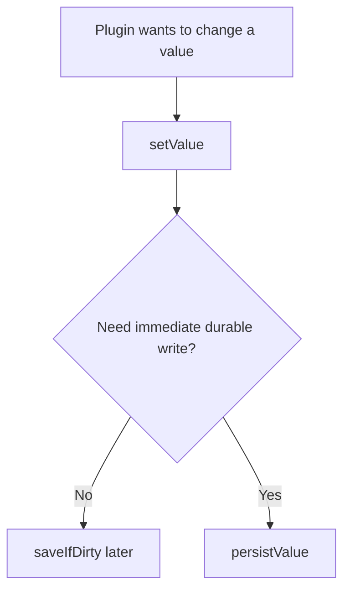

### Recommended style

Use `persistValue()` when:

* a settings form saves one value or a few values directly
* you want backend-specific optimization
* you want the write to happen immediately

Use `setValue()` plus `saveIfDirty()` when:

* you batch multiple changes
* you want to avoid repeated writes
* you want to collect several updates before persisting

---

## 15. `persistValue()` and backend optimization

`persistValue()` exists because some backends can do better than rewriting everything.

### Default behavior in `AbstractConfiguration`

The default implementation does this:

1. `setValue()` in memory
2. `saveIfDirty()` for the full configuration

That is safe and generic.

### Why custom backends may override it

A database-backed backend can often update a single row directly.

That is exactly what the example `Base3IliasConfiguration` does.

### Comparison

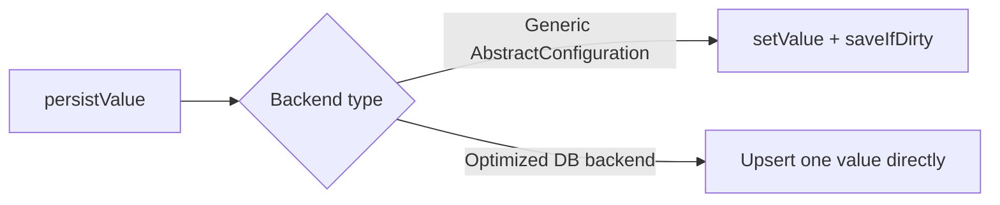

This method is small, but it matters in real systems.

It allows plugin code to stay generic while the backend remains efficient.

---

## 16. Building a custom configuration backend

A plugin can provide its own configuration implementation if the default file-based configuration is not enough.

The provided `Base3IliasConfiguration` example shows a database-backed approach.

### What makes it a good example

It demonstrates several practical ideas:

* extending `AbstractConfiguration`
* injecting `IDatabase`
* ensuring a default configuration exists
* loading from a database table
* persisting either the full state or a single value
* decoding JSON arrays from the database when useful

### Architecture

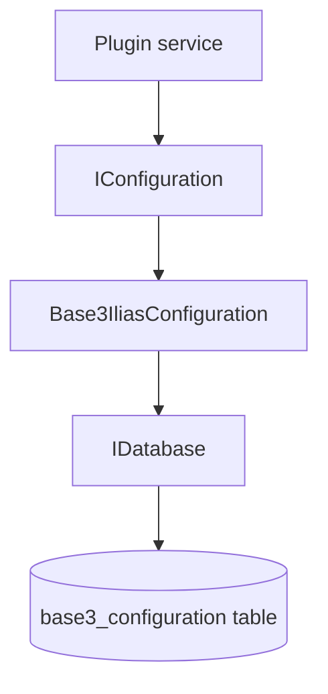

### Skeleton for a database-backed backend

```php
<?php declare(strict_types=1);

namespace MyPlugin\Configuration;

use Base3\Configuration\AbstractConfiguration;
use Base3\Database\Api\IDatabase;

class MyPluginConfiguration extends AbstractConfiguration {

	public function __construct(
		private readonly IDatabase $database
	) {}

	protected function load(): array {
		$this->database->connect();
		if (!$this->database->connected()) {
			return $this->getDefaultConfiguration();
		}

		return $this->loadConfigurationFromDatabase();
	}

	protected function saveData(array $data): bool {
		$this->database->connect();
		if (!$this->database->connected()) return false;

		foreach ($data as $group => $entries) {
			if (!is_array($entries)) continue;
			foreach ($entries as $key => $value) {
				$this->storeValue((string)$group, (string)$key, $value);
			}
		}

		return true;
	}

	public function persistValue(string $group, string $key, $value): bool {
		$this->ensureLoaded();
		$this->setValue($group, $key, $value);

		$this->database->connect();
		if (!$this->database->connected()) return false;

		$this->storeValue($group, $key, $value);
		$this->dirty = false;
		return true;
	}

	private function getDefaultConfiguration(): array {
		return [
			'myplugin' => [
				'enabled' => true,
				'mode' => 'default'
			]
		];
	}

	private function loadConfigurationFromDatabase(): array {
		// Read rows and transform them into the normalized array structure.
		return $this->getDefaultConfiguration();
	}

	private function storeValue(string $group, string $key, $value): void {
		// Store one value in the DB.
	}
}
```

### Design lessons from the DB example

A custom backend should answer these questions clearly:

1. What is the default configuration?
2. What happens if the backend is temporarily unavailable?
3. How is the data normalized into the standard `[group][key]` structure?
4. Can `persistValue()` be optimized?
5. Should missing defaults be auto-created in storage?

---

## 17. Defaults and self-healing backends

A notable pattern in the database example is that defaults are not just returned in memory.

They are also used to ensure the backend contains required rows.

This is a strong pattern for plugins that must remain operable across installations.

### Why defaults matter

Defaults help in several situations:

* first installation
* backend table exists but is incomplete
* configuration was partially deleted
* optional values are introduced in a plugin upgrade

### Default enforcement flow

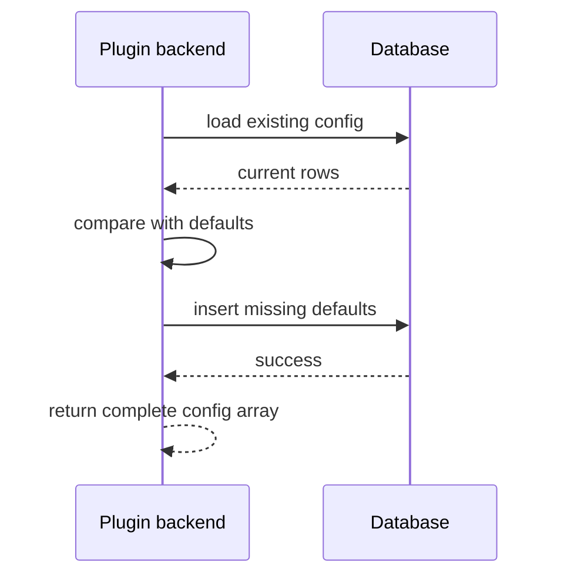

This pattern is especially useful for plugins that need guaranteed keys to exist.

---

## 18. Configuration file structure and naming guidance

BASE3 itself does not force a strict global naming scheme beyond the group/key structure, but plugin authors should still be disciplined.

### Recommended conventions

Use a dedicated group per plugin or topic, for example:

```ini
[myplugin]
enabled = true
mode = "default"

[myplugin_cache]
ttl = 3600
```

or:

```ini
[report]
default_display = "datatable"
page_size = 25
```

### Good practices

* keep group names stable
* avoid cryptic keys
* use booleans and numbers only when they are semantically correct
* do not mix unrelated concerns in one oversized group
* provide defaults in consuming code or in the backend

### Practical recommendation

Treat configuration keys as part of your plugin’s public contract.

Once a plugin is used in real installations, changing group or key names carelessly becomes a migration problem.

---

## 19. Example: plugin settings form save flow

A common real-world scenario is an admin form that edits plugin settings.

### Example service

```php
<?php declare(strict_types=1);

namespace MyPlugin\Admin;

use Base3\Configuration\Api\IConfiguration;

class AdminSettingsWriter {

	public function __construct(
		private readonly IConfiguration $configuration
	) {}

	public function saveSettings(string $layout, bool $debug): bool {
		$this->configuration->setValue('report', 'layout', $layout);
		$this->configuration->setValue('report', 'debug', $debug);
		return $this->configuration->saveIfDirty();
	}
}
```

### Save flow

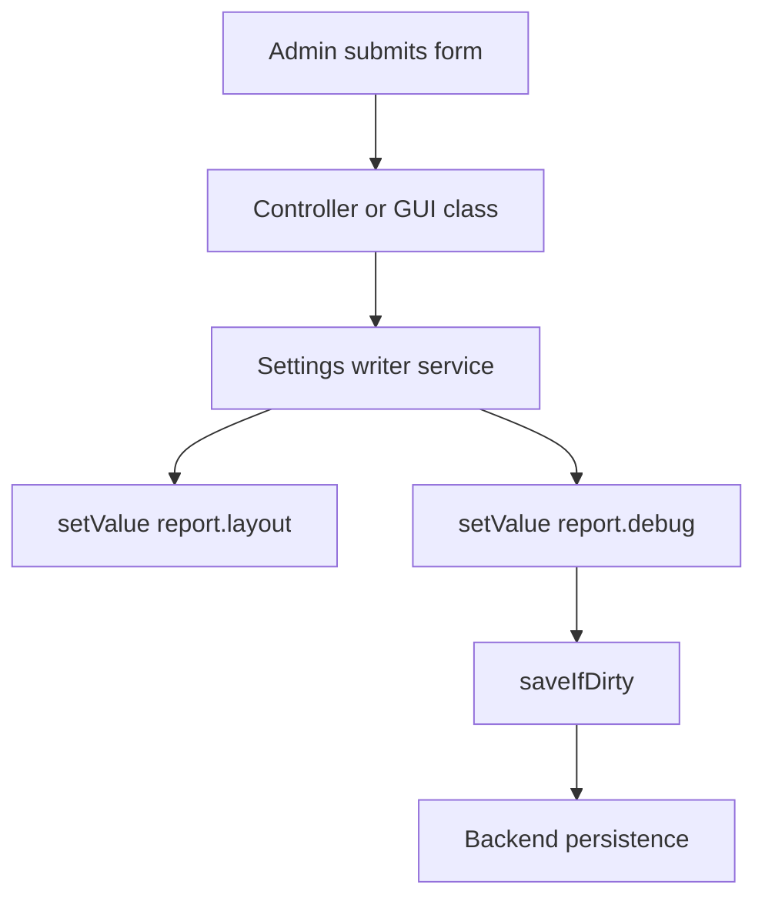

This keeps configuration handling centralized and testable.

---

## 20. Testing code that depends on configuration

One of the biggest advantages of the interface-based design is testability.

### Easy test setup with `ArrayConfiguration`

```php
<?php declare(strict_types=1);

use Base3\Configuration\ArrayConfiguration;
use MyPlugin\Service\ReportSettingsService;

$config = new ArrayConfiguration([
	'report' => [
		'layout' => 'cards',
		'debug' => true,
		'export_formats' => ['csv', 'json']
	]
]);

$service = new ReportSettingsService($config);

assert($service->getDefaultLayout() === 'cards');
assert($service->isDebugEnabled() === true);
assert($service->getExportFormats() === ['csv', 'json']);
```

### Why this matters

* no filesystem required
* no database required
* no special bootstrap required
* configuration can be tailored inline per test

For plugin authors, this is often the fastest path to reliable unit tests.

---

## 21. Operational behavior and reloads

Most web requests are short-lived, but some processes are not.

Examples:

* workers
* daemons
* queue consumers
* import jobs
* CLI loops

In those cases, configuration may change while the process is still running.

### Use `reload()` when needed

```php
$config->reload();
```

This resets the in-memory state and loads from the backend again on next access.

### Typical use case

```php
while (true) {
	$config->reload();

	if ($config->getBool('worker', 'enabled', true) === false) {
		break;
	}

	// Process work here.
}
```

### Why this exists

Without reload support, long-running processes might keep using stale settings indefinitely.

---

## 22. Error handling and save behavior

The configuration API intentionally keeps `save()` for backwards compatibility, even though it does not expose a return value.

For modern code, two methods are more informative:

* `saveIfDirty(): bool`
* `trySave(): bool`

### When to use which

Use `save()` when:

* you are maintaining old code
* you do not need immediate success feedback

Use `saveIfDirty()` when:

* you want the normal ergonomic path
* you want to skip unnecessary writes automatically

Use `trySave()` when:

* you explicitly want to attempt persistence now
* you want a success or failure result

### Example

```php
if (!$config->trySave()) {
	// Handle persistence failure.
}
```

### Practical note

Backends differ in how much error detail they expose.

The interface standardizes behavior, but a plugin that cares deeply about save diagnostics may need companion logging or backend-specific checks.

---

## 23. Recommended usage patterns for plugin authors

### Prefer this

```php
$value = $config->getString('myplugin', 'mode', 'default');
```

### Avoid this unless you really need it

```php
$group = $config->get('myplugin');
$mode = $group['mode'] ?? 'default';
```

The typed convenience methods are clearer and safer.

### Prefer narrow write operations

```php
$config->setValue('myplugin', 'mode', 'advanced');
```

instead of replacing large arrays unless that is your real intention.

### Keep backend assumptions out of consumer code

Consumer code should not care whether configuration comes from:

* an INI file
* a database
* an array in memory

That decision belongs to project wiring and container setup.

---

## 24. Anti-patterns

### 1. Depending on a concrete backend without need

Bad:

```php
public function __construct(private ConfigFile $config) {}
```

Better:

```php
public function __construct(private IConfiguration $config) {}
```

### 2. Pulling whole groups for one value

Bad:

```php
$group = $config->getGroup('manager');
$layout = $group['layout'] ?? 'simple';
```

Better:

```php
$layout = $config->getString('manager', 'layout', 'simple');
```

### 3. Saving after every tiny change without need

Bad:

```php
$config->setValue('a', 'x', 1);
$config->save();
$config->setValue('a', 'y', 2);
$config->save();
```

Better:

```php
$config->setValue('a', 'x', 1);
$config->setValue('a', 'y', 2);
$config->saveIfDirty();
```

### 4. Hard-coding missing defaults everywhere

Bad:

```php
if (!$config->hasValue('myplugin', 'mode')) {
	$config->setValue('myplugin', 'mode', 'default');
}
```

Prefer either:

* sensible getter defaults in consumer code
* backend-level default configuration in a custom implementation

---

## 25. End-to-end example

The following example shows a small but realistic plugin service using configuration through DI.

```php
<?php declare(strict_types=1);

namespace MyPlugin\Service;

use Base3\Configuration\Api\IConfiguration;

class MailDispatchSettings {

	public function __construct(
		private readonly IConfiguration $configuration
	) {}

	public function isEnabled(): bool {
		return $this->configuration->getBool('mail', 'enabled', true);
	}

	public function getSenderAddress(): string {
		return $this->configuration->getString('mail', 'sender_address', 'noreply@example.org');
	}

	public function getMaxRetries(): int {
		return $this->configuration->getInt('mail', 'max_retries', 3);
	}

	public function getTransportOptions(): array {
		return $this->configuration->getArray('mail', 'transport_options', []);
	}

	public function updateSenderAddress(string $address): bool {
		return $this->configuration->persistValue('mail', 'sender_address', $address);
	}
}
```

### End-to-end interaction

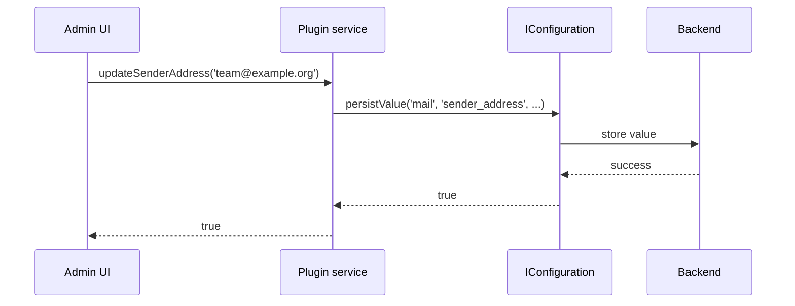

This is the typical BASE3 style:

* consumer code stays clean
* configuration is injected
* backend choice remains flexible

---

## 26. Summary

BASE3 configuration is built around one central abstraction: `IConfiguration`.

That abstraction is intentionally broad enough to support:

* old code using `get()` / `set()` / `save()`
* modern code using typed getters and narrow write helpers
* file-based configuration through `ConfigFile`
* in-memory configuration through `ArrayConfiguration`
* custom backends through `AbstractConfiguration`

For plugin developers, the most important practical rules are:

1. Depend on `IConfiguration`, typically via DI.
2. Prefer typed getters and narrow helpers over raw array access.
3. Use `saveIfDirty()` or `persistValue()` consciously.
4. Build custom backends by extending `AbstractConfiguration`.
5. Keep group and key names stable, readable, and intentional.

If you follow those rules, your plugin configuration will remain portable, testable, and easy to adapt to different BASE3 deployments.

---

## 27. Quick reference

### Read operations

```php
$config->get();
$config->get('manager');
$config->getGroup('manager', []);
$config->getValue('manager', 'layout', 'simple');
$config->getString('manager', 'layout', 'simple');
$config->getInt('http', 'retries', 3);
$config->getFloat('http', 'timeout', 5.0);
$config->getBool('debug', 'enabled', false);
$config->getArray('mail', 'transport_options', []);
```

### Write operations

```php
$config->set(['layout' => 'simple'], 'manager');
$config->setValue('manager', 'layout', 'simple');
$config->setGroup('manager', ['layout' => 'simple'], true);
$config->setMany([
	'manager' => ['layout' => 'simple'],
	'debug' => ['enabled' => true],
], true);
```

### Remove operations

```php
$config->removeValue('manager', 'layout');
$config->removeGroup('debug');
```

### Lifecycle operations

```php
$config->isDirty();
$config->save();
$config->saveIfDirty();
$config->trySave();
$config->reload();
$config->persistValue('manager', 'layout', 'simple');
```

