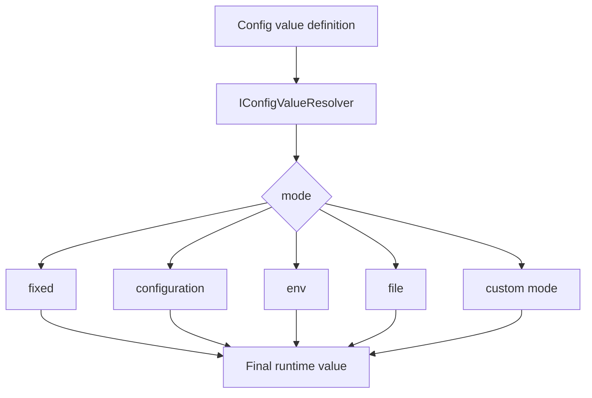
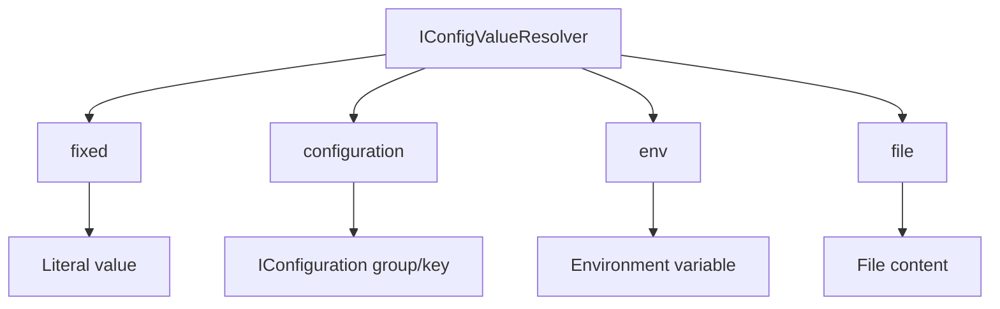
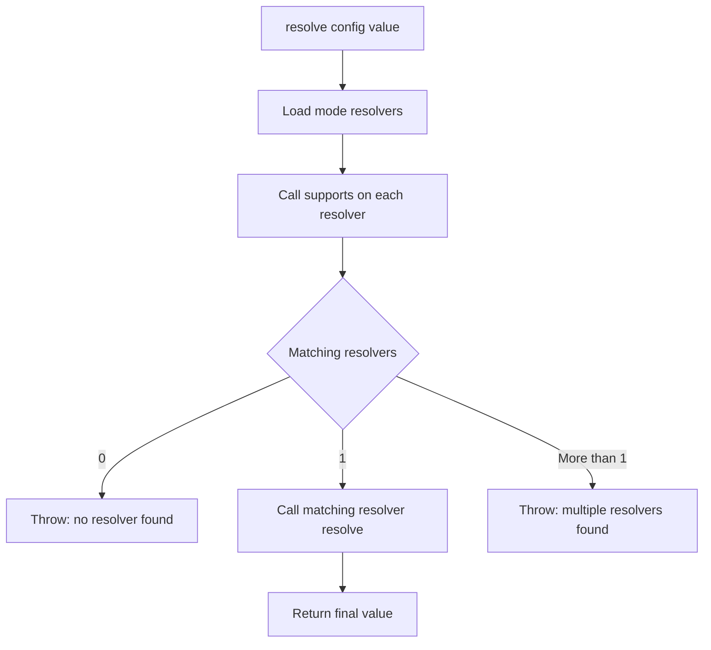

# BASE3 Framework Config Value Resolver

## Purpose

This document explains how the **Config Value Resolver** works in the BASE3 framework.

It is written for developers who want to understand:

* what `IConfigValueResolver` is for
* what a config value definition is
* how values can be resolved from different sources
* which built-in modes exist
* how mode resolvers are discovered
* how config value modes can be exposed to UIs
* how plugins can add new generic modes
* when plugin-specific runtime modes should stay outside the generic BASE3 resolver
* how this relates to `IConfiguration`, `ISettingsStore`, and dependency injection

After reading this document, a developer should understand how BASE3 separates **value definition** from **value resolution**.

---

## 1. What the Config Value Resolver is

The Config Value Resolver resolves a value definition into a final runtime value.

The central interface is:

```php id="9x8x4a"
Base3\ConfigValue\Api\IConfigValueResolver
```

It answers one main question:

```text id="ihphfw"
Given this configuration value definition, what is the effective runtime value?
```

Example:

```php id="pme0fp"
$value = $configValueResolver->resolve([
	'mode' => 'env',
	'name' => 'OPENAI_API_KEY'
]);
```

The result is the value of the environment variable:

```text id="ofj6vf"
OPENAI_API_KEY
```

The caller does not need to know how environment variables are read.

It only asks the resolver to resolve the definition.

---

## 2. Why this exists

Not every configuration value should be stored directly where the configuration is stored.

Some values should be:

* literal values
* read from the global framework configuration
* read from environment variables
* read from files
* provided by custom plugin modes
* generated at runtime by a domain-specific resolver

This is especially useful for:

* API keys
* passwords
* access tokens
* connection secrets
* host-specific values
* deployment-specific paths
* provider configuration
* reusable technical connections
* values that should be editable through a generic UI

The Config Value Resolver makes this explicit.

Instead of storing only this:

```php id="vsxfrr"
'secret' => 'my-secret-token'
```

a settings record can store this:

```php id="ii3qvn"
'secret' => [
	'mode' => 'env',
	'name' => 'OPENAI_API_KEY'
]
```

The actual value is resolved only when needed.

---

## 3. What this is not

The Config Value Resolver is not a configuration storage system.

It does not:

* load config files by itself
* persist settings
* modify settings
* store secrets
* replace `IConfiguration`
* replace `ISettingsStore`
* replace `IStateStore`

It only resolves one value definition into one runtime value.

Storage remains in other systems.

```text id="d194rs"
IConfiguration     stores project/framework configuration
ISettingsStore     stores grouped named settings datasets
IStateStore        stores runtime state
IConfigValueResolver resolves value definitions
```

---

## 4. Mental model

A config value definition describes where a value should come from.



The consuming code receives only the final value.

---

## 5. Core interface

The central interface is:

```php id="a4o91u"
<?php declare(strict_types=1);

namespace Base3\ConfigValue\Api;

use Base3\Api\IBase;

interface IConfigValueResolver extends IBase {

	public function resolve(array|string|int|float|bool|null $config): mixed;

	public function getModes(): array;

	public function getModeSchema(string $mode): ?array;

	public function getModeSchemas(): array;

	public function getModeResolverNames(): array;
}
```

The interface has two responsibilities:

1. resolve values
2. expose available modes and schemas for diagnostics and UIs

---

## 6. Config value definitions

A config value definition can be either:

* a raw scalar value
* `null`
* a raw array
* an explicit object-like array with a `mode`

Examples:

```php id="a605lf"
'hello'
```

```php id="ov6ijh"
42
```

```php id="v2d6em"
true
```

```php id="xww2ep"
[
	'mode' => 'fixed',
	'value' => 'hello'
]
```

```php id="skqb92"
[
	'mode' => 'env',
	'name' => 'OPENAI_API_KEY'
]
```

```php id="e2j244"
[
	'mode' => 'file',
	'path' => DIR_LOCAL . 'secret/openai.key'
]
```

The central resolver finds exactly one mode resolver that supports the given definition.

---

## 7. Main method: `resolve()`

The main method is:

```php id="q0ba9e"
$value = $configValueResolver->resolve($config);
```

It accepts:

```php id="tkq7bx"
array|string|int|float|bool|null
```

and returns:

```php id="uffeid"
mixed
```

The return type is intentionally broad because a resolved value can be:

* string
* int
* float
* bool
* array
* null
* another plugin-defined value type

---

## 8. Built-in modes

BASE3 provides four generic config value modes.

```text id="esbrws"
fixed
configuration
env
file
```

These modes cover the common generic use cases.



---

## 9. Mode resolvers

Each mode is implemented by an `IConfigValueModeResolver`.

```php id="ox0hlg"
Base3\ConfigValue\Api\IConfigValueModeResolver
```

A mode resolver:

* exposes one canonical public mode name
* decides whether it supports a given definition
* resolves the definition
* exposes a schema for UI and validation

The interface is:

```php id="a1jeqk"
<?php declare(strict_types=1);

namespace Base3\ConfigValue\Api;

use Base3\Api\IBase;
use Base3\Api\ISchemaProvider;

interface IConfigValueModeResolver extends IBase, ISchemaProvider {

	public function getMode(): string;

	public function supports(array|string|int|float|bool|null $config): bool;

	public function resolve(array|string|int|float|bool|null $config): mixed;

	public function getSchema(): array;
}
```

Mode resolvers are discoverable BASE3 components.

They implement `IBase`, so they also have a technical `getName()`.

---

## 10. Mode name versus resolver name

There are two names involved.

### Public mode name

The public mode name is returned by:

```php id="g3ki3e"
$modeResolver->getMode()
```

Examples:

```text id="ugrk2c"
fixed
configuration
env
file
```

This is the value stored in config definitions:

```php id="ha3ktw"
[
	'mode' => 'env',
	'name' => 'OPENAI_API_KEY'
]
```

### Technical resolver name

The technical resolver name is returned by:

```php id="kdxggs"
$modeResolver::getName()
```

Examples:

```text id="jtfxhv"
fixedconfigvaluemoderesolver
envconfigvaluemoderesolver
fileconfigvaluemoderesolver
configurationconfigvaluemoderesolver
```

This is useful for diagnostics, not for normal configuration.

Do not confuse both names.

---

## 11. Resolver discovery

The central `ConfigValueResolver` receives the class map through dependency injection.

```php id="q4hk50"
public function __construct(
	private readonly IClassMap $classMap
) {}
```

It discovers all mode resolvers through:

```php id="jjk20i"
$classMap->getInstancesByInterface(IConfigValueModeResolver::class)
```

This means new generic modes can be added without editing the central resolver.

A plugin can provide another implementation of `IConfigValueModeResolver`, and the class map can discover it.

---

## 12. Resolution flow

The central resolver follows this process:



Important:

* exactly one resolver must match
* zero matches are an error
* multiple matches are an error

This protects against ambiguous definitions.

---

## 13. Built-in mode: `fixed`

The `fixed` mode returns a static value.

Explicit definition:

```php id="bqdq8o"
[
	'mode' => 'fixed',
	'value' => 'example'
]
```

Resolved value:

```php id="bkvu85"
'example'
```

The fixed resolver also accepts raw values without a mode.

Examples:

```php id="xd0xwr"
$configValueResolver->resolve('example');
$configValueResolver->resolve(123);
$configValueResolver->resolve(true);
$configValueResolver->resolve(null);
```

These values are returned unchanged.

This makes the resolver convenient for code that accepts both direct values and resolver definitions.

---

## 14. `fixed` mode schema

The schema for `fixed` describes only the mode-specific payload.

It does not include the common `mode` field.

Conceptually:

```php id="jkl4di"
[
	'type' => 'object',
	'properties' => [
		'value' => [
			'description' => 'Static value returned by the resolver.'
		]
	],
	'required' => ['value']
]
```

A UI can combine this schema with the public mode name:

```php id="c0kwm5"
[
	'mode' => 'fixed',
	'value' => 'example'
]
```

---

## 15. Built-in mode: `configuration`

The `configuration` mode reads a value from the global BASE3 configuration service.

Definition:

```php id="fq9dn2"
[
	'mode' => 'configuration',
	'group' => 'openai',
	'key' => 'apikey'
]
```

This resolves to:

```php id="p8gbvp"
$configuration->getValue('openai', 'apikey')
```

The resolver validates that:

* the definition is an array
* `group` is a non-empty string
* `key` is a non-empty string
* the configuration group exists
* the configuration key exists in that group

If the group or key is missing, an exception is thrown.

---

## 16. `configuration` mode schema

Conceptually:

```php id="vrnqgv"
[
	'type' => 'object',
	'properties' => [
		'group' => [
			'type' => 'string',
			'description' => 'Configuration group name.'
		],
		'key' => [
			'type' => 'string',
			'description' => 'Configuration key inside the selected group.'
		]
	],
	'required' => ['group', 'key']
]
```

Example:

```php id="a9vr9y"
[
	'mode' => 'configuration',
	'group' => 'mail',
	'key' => 'default_sender'
]
```

---

## 17. Built-in mode: `env`

The `env` mode reads an environment variable.

Definition:

```php id="hfuh18"
[
	'mode' => 'env',
	'name' => 'OPENAI_API_KEY'
]
```

This resolves to:

```php id="zqycuk"
getenv('OPENAI_API_KEY')
```

If the environment variable does not exist, the resolved value is:

```php id="zge4ms"
null
```

This makes `env` useful for secrets that should not be stored directly in a settings file or database row.

---

## 18. `env` mode schema

Conceptually:

```php id="ougyck"
[
	'type' => 'object',
	'properties' => [
		'name' => [
			'type' => 'string',
			'description' => 'Environment variable name.'
		]
	],
	'required' => ['name']
]
```

Example:

```php id="iyioo5"
[
	'mode' => 'env',
	'name' => 'MAIL_PASSWORD'
]
```

---

## 19. Built-in mode: `file`

The `file` mode reads a value from a file.

Definition:

```php id="ptmez7"
[
	'mode' => 'file',
	'path' => DIR_LOCAL . 'secret/openai.key'
]
```

By default, the file content is trimmed.

This is useful for secrets stored as one-line files.

Example file content:

```text id="kmri8n"
sk-example-secret
```

Resolved value:

```text id="w748bk"
sk-example-secret
```

The resolver validates that:

* the definition is an array
* `path` is a non-empty string
* the path is readable
* the file can be read

If the file is not readable, an exception is thrown.

---

## 20. `file` mode and trimming

The `file` mode supports a `trim` field.

Default:

```php id="qmohvu"
[
	'mode' => 'file',
	'path' => DIR_LOCAL . 'secret/token.txt'
]
```

Same as:

```php id="gu3lqu"
[
	'mode' => 'file',
	'path' => DIR_LOCAL . 'secret/token.txt',
	'trim' => true
]
```

To preserve whitespace:

```php id="ibw9pc"
[
	'mode' => 'file',
	'path' => DIR_LOCAL . 'secret/template.txt',
	'trim' => false
]
```

The resolver accepts boolean-like values for `trim`.

Examples treated as true:

```text id="j3xf5q"
1
true
yes
on
```

---

## 21. `file` mode schema

Conceptually:

```php id="pnhxiz"
[
	'type' => 'object',
	'properties' => [
		'path' => [
			'type' => 'string',
			'description' => 'Absolute path to the file containing the value.'
		],
		'trim' => [
			'type' => 'boolean',
			'description' => 'Trim leading and trailing whitespace from the file content.',
			'default' => true
		]
	],
	'required' => ['path']
]
```

---

## 22. Legacy aliases

Some built-in resolvers accept legacy formats.

These aliases are supported for backwards compatibility.

They should not be shown as official modes in new configuration UIs.

### `fixed`

Canonical mode:

```text id="j1gzzn"
fixed
```

Legacy mode:

```text id="sru9ii"
default
```

Raw values without a `mode` are also treated as fixed values.

### `configuration`

Canonical mode:

```text id="n9z9zs"
configuration
```

Legacy mode:

```text id="z4mxft"
config
```

Canonical field:

```text id="p8a99t"
group
```

Legacy field:

```text id="cw707n"
section
```

### `env`

Canonical field:

```text id="r0j27z"
name
```

Legacy field:

```text id="t9637v"
value
```

---

## 23. Official modes for UIs

Configuration UIs should use:

```php id="f0etsz"
$configValueResolver->getModes()
```

Example result:

```php id="aqovpu"
[
	'configuration',
	'env',
	'file',
	'fixed'
]
```

The returned modes are canonical public mode names.

Legacy aliases are intentionally not included.

This keeps new configuration definitions clean.

---

## 24. Mode schemas for UIs

A generic UI can request all mode schemas:

```php id="x4n2ci"
$schemas = $configValueResolver->getModeSchemas();
```

Example structure:

```php id="x557vd"
[
	'env' => [
		'type' => 'object',
		'properties' => [
			'name' => ['type' => 'string']
		],
		'required' => ['name']
	],
	'file' => [
		'type' => 'object',
		'properties' => [
			'path' => ['type' => 'string'],
			'trim' => ['type' => 'boolean']
		],
		'required' => ['path']
	]
]
```

A UI can use this to render mode-specific fields.

For example:

```text id="i2ms93"
mode = env  -> show field: name
mode = file -> show fields: path, trim
mode = fixed -> show field: value
```

---

## 25. One mode schema

To get the schema for one mode:

```php id="t1al7c"
$schema = $configValueResolver->getModeSchema('env');
```

If no resolver exists for the canonical mode, the method returns:

```php id="l7zbz5"
null
```

If multiple resolvers expose the same canonical mode, an exception is thrown.

This protects generic UIs from ambiguous mode definitions.

---

## 26. Resolver names for diagnostics

To inspect the actual available resolver classes:

```php id="gob10s"
$names = $configValueResolver->getModeResolverNames();
```

Example result:

```php id="my113n"
[
	'configurationconfigvaluemoderesolver',
	'envconfigvaluemoderesolver',
	'fileconfigvaluemoderesolver',
	'fixedconfigvaluemoderesolver'
]
```

This is useful for:

* diagnostics
* admin views
* debugging class map discovery
* checking whether plugin-provided modes are available

These names are technical identifiers, not configuration modes.

---

## 27. Example: resolving an API key from a fixed value

```php id="zkpohb"
$apiKey = $configValueResolver->resolve([
	'mode' => 'fixed',
	'value' => 'sk-example'
]);
```

This is simple, but usually not ideal for real secrets because the secret is stored directly in the configuration definition.

Good for:

* local development
* non-secret values
* test values
* simple static settings

---

## 28. Example: resolving an API key from an environment variable

```php id="kekw4z"
$apiKey = $configValueResolver->resolve([
	'mode' => 'env',
	'name' => 'OPENAI_API_KEY'
]);
```

Good for:

* deployment-specific secrets
* containerized environments
* CI/CD-managed configuration
* avoiding secret values in settings storage

If the environment variable is missing, the resolved value is `null`.

The consuming code should validate whether `null` is acceptable.

---

## 29. Example: resolving an API key from a file

```php id="q2bfzb"
$apiKey = $configValueResolver->resolve([
	'mode' => 'file',
	'path' => DIR_LOCAL . 'secret/openai.key'
]);
```

Good for:

* mounted secret files
* local protected files
* deployment systems that provide secrets through files

By default the file content is trimmed.

---

## 30. Example: resolving from framework configuration

```php id="m6y8yz"
$apiKey = $configValueResolver->resolve([
	'mode' => 'configuration',
	'group' => 'openai',
	'key' => 'apikey'
]);
```

Good for:

* values already managed by `IConfiguration`
* compatibility with existing config sections
* values that should remain in the framework configuration backend

---

## 31. Example: storing config value definitions in Settings Store

A settings dataset can store config value definitions without resolving them immediately.

Example connection settings:

```php id="in4rwy"
[
	'name' => 'OpenAI',
	'type' => 'http',
	'baseUrl' => 'https://api.example.com',
	'authType' => 'bearer',
	'authSecret' => [
		'mode' => 'env',
		'name' => 'OPENAI_API_KEY'
	],
	'enabled' => true
]
```

At runtime:

```php id="keg8ow"
$settings = $settingsStore->get('connection', 'openai', []);

$secret = $configValueResolver->resolve(
	$settings['authSecret'] ?? null
);
```

This keeps the connection definition reusable while allowing the secret to come from a safer source.

---

## 32. Example: generic secret config validation

A UI or display class can validate mode-specific fields using schemas.

```php id="r10xam"
$mode = (string)($secretConfig['mode'] ?? '');
$schema = $configValueResolver->getModeSchema($mode);

if ($schema === null) {
	throw new RuntimeException('Unknown secret config mode.');
}

$required = is_array($schema['required'] ?? null)
	? $schema['required']
	: [];

foreach ($required as $field) {
	if (!array_key_exists($field, $secretConfig) || trim((string)$secretConfig[$field]) === '') {
		throw new RuntimeException('Missing secret config field: ' . $mode . '.' . $field);
	}
}
```

This lets UI code validate built-in and plugin-provided modes without hardcoding every field.

---

## 33. Example: exposing config value modes to a UI

A JSON endpoint can expose available modes and schemas:

```php id="h45nvc"
return [
	'configValueModes' => $configValueResolver->getModes(),
	'configValueModeSchemas' => $configValueResolver->getModeSchemas(),
	'configValueModeResolverNames' => $configValueResolver->getModeResolverNames()
];
```

The frontend can then render a selector:

```text id="dn5k82"
fixed
configuration
env
file
```

and show the correct fields depending on the selected mode.

This avoids duplicating mode knowledge in JavaScript or templates.

---

## 34. Example: keeping existing secrets

When editing an existing settings record, a UI may want to keep the current secret without sending it back to the browser.

A practical pattern is:

```php id="v4dwgn"
[
	'mode' => 'fixed',
	'value' => '',
	'configured' => true
]
```

This does not mean the empty string should become the new secret.

It means:

```text id="fdxgyg"
The secret is already configured. Keep the existing stored config definition.
```

The application layer must interpret this pattern before calling `set()` on the Settings Store.

This is not part of the generic resolver itself.

It belongs to the form handling or settings editing logic.

---

## 35. Generic modes versus domain-specific modes

Not every mode should become a BASE3-wide config value mode.

A useful distinction:

### Generic modes

A generic mode is useful across many parts of the framework.

Examples:

```text id="hl8s5z"
fixed
configuration
env
file
```

These belong in the generic `IConfigValueResolver`.

### Domain-specific runtime modes

A domain-specific mode is meaningful only inside a specific subsystem.

Examples in abstract terms:

```text id="val2um"
inherit
random
uuid
current_user
current_timestamp
node_input
previous_step_result
```

These should usually stay in a domain-specific resolver.

That resolver can handle its own modes first and delegate generic values to `IConfigValueResolver`.

---

## 36. Example: domain-specific resolver wrapping the generic resolver

A plugin or subsystem can define its own resolver.

```php id="mr09pg"
<?php declare(strict_types=1);

namespace ExamplePlugin\Config;

use Base3\ConfigValue\Api\IConfigValueResolver;

final class DomainConfigValueResolver {

	public function __construct(
		private readonly IConfigValueResolver $configValueResolver
	) {}

	public function resolveValue(array|string|int|float|bool|null $config): mixed {
		if (is_array($config)) {
			$mode = $config['mode'] ?? null;

			switch ($mode) {
				case 'inherit':
					return null;

				case 'random':
					return $this->resolveRandom($config);

				case 'uuid':
					return $this->generateUuidV4();
			}
		}

		return $this->configValueResolver->resolve($config);
	}

	private function resolveRandom(array $config): mixed {
		$values = $config['values'] ?? ($config['value'] ?? null);

		if (!is_array($values) || empty($values)) {
			return null;
		}

		return $values[array_rand($values)];
	}

	private function generateUuidV4(): string {
		$data = random_bytes(16);
		$data[6] = chr((ord($data[6]) & 0x0f) | 0x40);
		$data[8] = chr((ord($data[8]) & 0x3f) | 0x80);

		return vsprintf('%s%s-%s-%s-%s-%s%s%s', str_split(bin2hex($data), 4));
	}
}
```

This keeps the generic BASE3 resolver clean.

The domain resolver handles domain-specific runtime behavior and delegates generic modes to BASE3.

---

## 37. When to add a new `IConfigValueModeResolver`

Add a new generic mode resolver when the mode is useful beyond one specific subsystem.

Good candidates:

* secret manager lookup
* encrypted value lookup
* remote parameter store
* vault integration
* project-wide tenant value
* host-wide setting lookup

Example:

```text id="bbx1so"
mode = vault
```

could be useful generically if multiple plugins should read values from the same vault integration.

---

## 38. When not to add a new generic mode

Do not add a generic mode when it only makes sense inside one domain.

Less good as generic modes:

```text id="r8koyo"
inherit
random
uuid
previous_node_output
agent_memory
```

These may be valid in a specific agent, workflow, form, or runtime system.

But they should usually be handled by that system's own resolver before delegation to `IConfigValueResolver`.

---

## 39. Implementing a custom mode resolver

A custom generic mode resolver implements:

```php id="a2hbi9"
IConfigValueModeResolver
```

Example skeleton:

```php id="fy6omp"
<?php declare(strict_types=1);

namespace ExamplePlugin\ConfigValue;

use Base3\ConfigValue\Api\IConfigValueModeResolver;
use RuntimeException;

final class VaultConfigValueModeResolver implements IConfigValueModeResolver {

	public static function getName(): string {
		return 'vaultconfigvaluemoderesolver';
	}

	public function getMode(): string {
		return 'vault';
	}

	public function supports(array|string|int|float|bool|null $config): bool {
		return is_array($config)
			&& ($config['mode'] ?? null) === 'vault'
			&& isset($config['key']);
	}

	public function resolve(array|string|int|float|bool|null $config): mixed {
		if (!is_array($config)) {
			throw new RuntimeException('Vault config value definition must be an array.');
		}

		$key = $config['key'] ?? null;

		if (!is_string($key) || $key === '') {
			throw new RuntimeException('Vault config value definition requires a non-empty key.');
		}

		return $this->readVaultValue($key);
	}

	public function getSchema(): array {
		return [
			'type' => 'object',
			'properties' => [
				'key' => [
					'type' => 'string',
					'description' => 'Vault key.'
				]
			],
			'required' => ['key']
		];
	}

	private function readVaultValue(string $key): ?string {
		// Read from project-wide secret infrastructure.
		return null;
	}
}
```

Once this class is discoverable through the class map, the central resolver can use it.

---

## 40. Custom mode resolver rules

A custom resolver should follow these rules:

* return one canonical public mode from `getMode()`
* keep `getMode()` stable
* keep `getName()` technical and unique
* make `supports()` strict enough to avoid accidental matches
* validate required fields in `resolve()`
* throw clear exceptions for invalid definitions
* return a schema without the common `mode` field
* avoid exposing legacy aliases through `getMode()`
* support legacy aliases only inside `supports()` when necessary

---

## 41. Strict `supports()` methods

`supports()` should be strict.

Bad:

```php id="vy95ou"
public function supports(array|string|int|float|bool|null $config): bool {
	return is_array($config);
}
```

This would match too many definitions and cause ambiguity with other resolvers.

Better:

```php id="qw6vj0"
public function supports(array|string|int|float|bool|null $config): bool {
	return is_array($config)
		&& ($config['mode'] ?? null) === 'vault'
		&& isset($config['key']);
}
```

A resolver should only claim definitions it can actually resolve.

---

## 42. Handling ambiguity

The central resolver throws an exception if multiple mode resolvers support the same definition.

This usually means at least one `supports()` method is too broad.

Example problem:

```php id="m5mljb"
Resolver A supports every array.
Resolver B supports mode=env.
```

For:

```php id="q8zxl9"
[
	'mode' => 'env',
	'name' => 'OPENAI_API_KEY'
]
```

both resolvers match.

The central resolver cannot safely choose.

The fix is to make Resolver A more specific.

---

## 43. Error handling

Errors can occur during resolution.

Examples:

* no resolver found
* multiple resolvers found
* invalid definition structure
* missing required field
* missing configuration group
* missing configuration key
* unreadable file
* unreadable secret file
* invalid custom mode payload

The consuming code should decide whether to:

* show an admin error
* log and skip the entry
* fail the request
* use a safe fallback

Example:

```php id="j26n75"
try {
	$secret = $configValueResolver->resolve($secretConfig);
}
catch (RuntimeException $e) {
	$logger->error('Failed to resolve secret config: ' . $e->getMessage(), [
		'scope' => 'configvalue'
	]);

	return null;
}
```

---

## 44. Security considerations

The Config Value Resolver can help avoid storing secret values directly.

Prefer:

```php id="pocw96"
[
	'mode' => 'env',
	'name' => 'SERVICE_API_KEY'
]
```

or:

```php id="cz0qm2"
[
	'mode' => 'file',
	'path' => DIR_LOCAL . 'secret/service.key'
]
```

over:

```php id="zdlmj5"
[
	'mode' => 'fixed',
	'value' => 'actual-secret-value'
]
```

However, the resolver does not automatically make secrets safe.

Projects must still ensure:

* environment variables are managed securely
* secret files have strict permissions
* resolved values are not logged
* admin UIs do not echo secret values
* settings exports do not leak secret payloads
* `fixed` mode is used carefully for sensitive values

---

## 45. Relationship to Settings Store

`ISettingsStore` stores named settings datasets.

Those datasets may contain config value definitions.

Example:

```php id="d0z5ct"
$settingsStore->set('connection', 'openai', [
	'name' => 'OpenAI',
	'authSecret' => [
		'mode' => 'env',
		'name' => 'OPENAI_API_KEY'
	]
]);

$settingsStore->save();
```

Later:

```php id="wgo902"
$settings = $settingsStore->get('connection', 'openai');
$secret = $configValueResolver->resolve($settings['authSecret'] ?? null);
```

This separation is useful:

* settings store persists the definition
* config value resolver resolves the actual runtime value

---

## 46. Relationship to Configuration

`IConfiguration` is one possible source for resolved values.

The `configuration` mode bridges to it.

```php id="zdfxfx"
[
	'mode' => 'configuration',
	'group' => 'openai',
	'key' => 'apikey'
]
```

This does not mean `IConfigValueResolver` replaces `IConfiguration`.

It means a config value definition may refer to an existing configuration entry.

---

## 47. Relationship to Class Map

The resolver uses the class map to discover mode resolvers.

```text id="q33hlw"
IClassMap discovers IConfigValueModeResolver instances.
IConfigValueResolver delegates to the matching resolver.
```

This makes the system extensible.

A plugin can add a new generic mode by adding a discoverable mode resolver.

No central factory needs to be edited.

---

## 48. Relationship to Dependency Injection

Consumers should receive the resolver through constructor injection.

```php id="egbfcs"
use Base3\ConfigValue\Api\IConfigValueResolver;

final class ConnectionService {

	public function __construct(
		private readonly IConfigValueResolver $configValueResolver
	) {}

	public function resolveSecret(array|string|int|float|bool|null $secretConfig): mixed {
		return $this->configValueResolver->resolve($secretConfig);
	}
}
```

Do not instantiate the resolver manually.

The resolver depends on `IClassMap`, and mode resolvers may have their own dependencies.

---

## 49. Practical consumer pattern

A service that consumes settings and resolves secrets may look like this:

```php id="nbsb8x"
final class TechnicalConnectionFactory {

	public function __construct(
		private readonly ISettingsStore $settingsStore,
		private readonly IConfigValueResolver $configValueResolver
	) {}

	public function create(string $id): TechnicalConnection {
		$settings = $this->settingsStore->get('connection', $id, []);

		if ($settings === []) {
			throw new RuntimeException('Connection not found: ' . $id);
		}

		$secret = $this->configValueResolver->resolve(
			$settings['authSecret'] ?? null
		);

		return new TechnicalConnection(
			(string)($settings['baseUrl'] ?? ''),
			(string)$secret
		);
	}
}
```

The factory does not care whether the secret is fixed, from env, from file, or from configuration.

---

## 50. Practical UI pattern

A generic configuration UI can work like this:

```php id="pyzrid"
[
	'modes' => $configValueResolver->getModes(),
	'schemas' => $configValueResolver->getModeSchemas(),
	'resolverNames' => $configValueResolver->getModeResolverNames()
]
```

The UI can then:

1. show a mode dropdown
2. render fields from the selected mode schema
3. store the resulting definition
4. let runtime services resolve the definition later

This keeps the UI generic and mode-aware.

---

## 51. Recommended config value definition style

Use canonical modes for new definitions.

Good:

```php id="ov5jmd"
[
	'mode' => 'configuration',
	'group' => 'openai',
	'key' => 'apikey'
]
```

Less good for new definitions:

```php id="zyr36i"
[
	'mode' => 'config',
	'section' => 'openai',
	'key' => 'apikey'
]
```

The second form may still work for compatibility, but new code should use canonical names.

---

## 52. Common mistakes

### Treating the resolver as storage

Bad:

```php id="u70kjr"
$configValueResolver->save($value);
```

The resolver does not persist anything.

Use `ISettingsStore` or `IConfiguration`.

### Showing resolver names as modes

Bad UI option:

```text id="gbk88u"
envconfigvaluemoderesolver
```

Good UI option:

```text id="pl04vy"
env
```

Use `getModes()` for UI mode options.

### Making `supports()` too broad

A custom resolver should not support every array unless it really owns every array.

Broad matching creates ambiguous resolution.

### Adding domain-specific modes globally

Modes like `random`, `inherit`, or `uuid` may be valid in one subsystem.

They should not automatically become global BASE3 config value modes unless they are useful framework-wide.

### Logging resolved secrets

Never log resolved secret values.

Log only metadata such as mode or source type, if needed.

---

## 53. Practical rules

Use `IConfigValueResolver` when a setting may come from multiple sources.

Use `fixed` for literal values.

Use `configuration` for values stored in `IConfiguration`.

Use `env` for deployment-managed environment variables.

Use `file` for values stored in protected files.

Use `getModes()` and `getModeSchemas()` for generic UIs.

Use `getModeResolverNames()` for diagnostics.

Create custom `IConfigValueModeResolver` implementations only for generic reusable modes.

Keep domain-specific runtime modes in a domain-specific resolver and delegate generic modes to `IConfigValueResolver`.

Do not store high-risk secrets as `fixed` values unless the storage backend is adequately protected.

---

## 54. Summary

The BASE3 Config Value Resolver separates value definition from value resolution.

A settings record can store a definition such as:

```php id="v8mmhw"
[
	'mode' => 'env',
	'name' => 'OPENAI_API_KEY'
]
```

and runtime code can resolve it through:

```php id="j5eapz"
$configValueResolver->resolve($definition);
```

The built-in generic modes are:

```text id="efmhyk"
fixed
configuration
env
file
```

The central resolver discovers mode resolvers through the class map, requires exactly one matching resolver, and delegates the actual resolution.

This makes config value handling extensible without central factories.

In short:

```text id="ncior9"
Store definitions.
Resolve values at runtime.
Keep generic modes generic.
Keep domain-specific modes in domain-specific resolvers.
```
