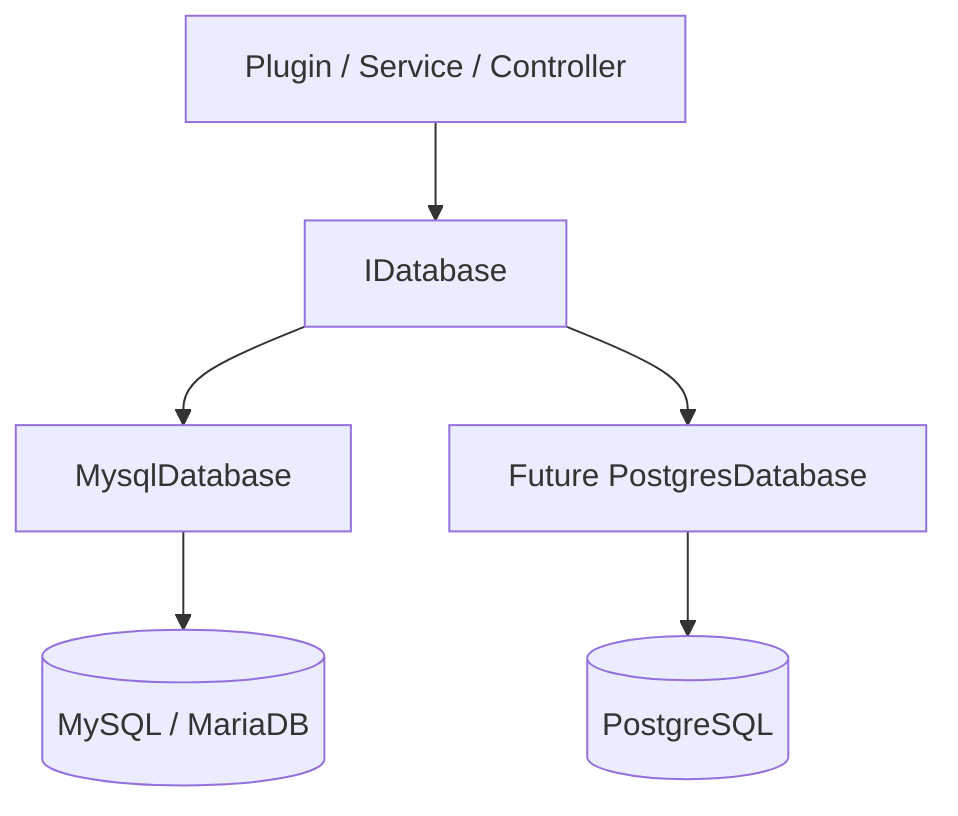
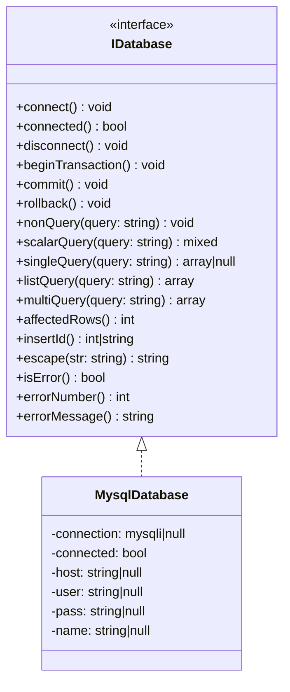
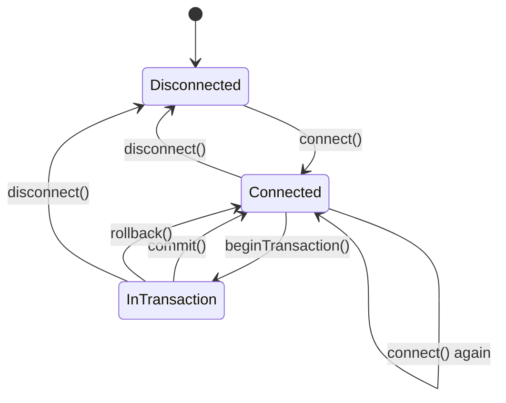
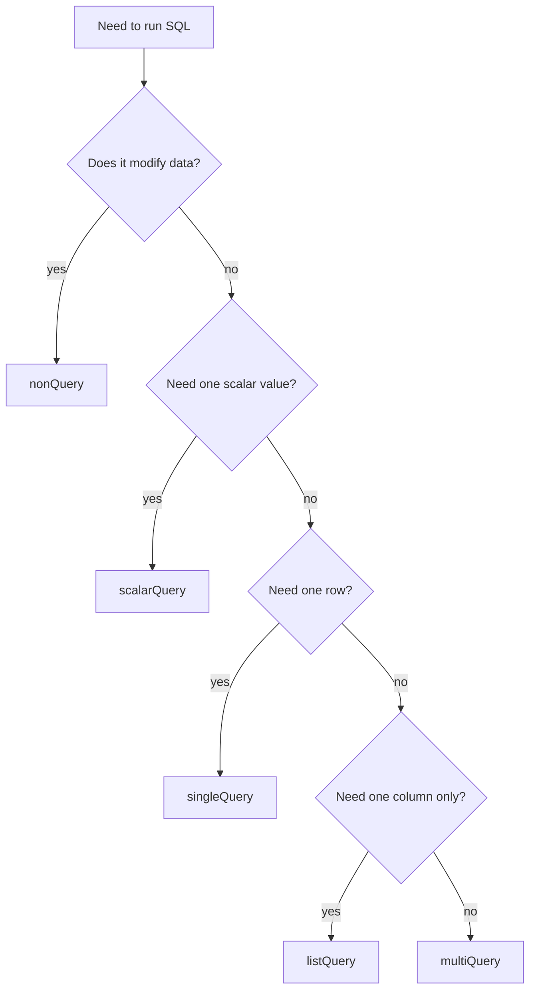
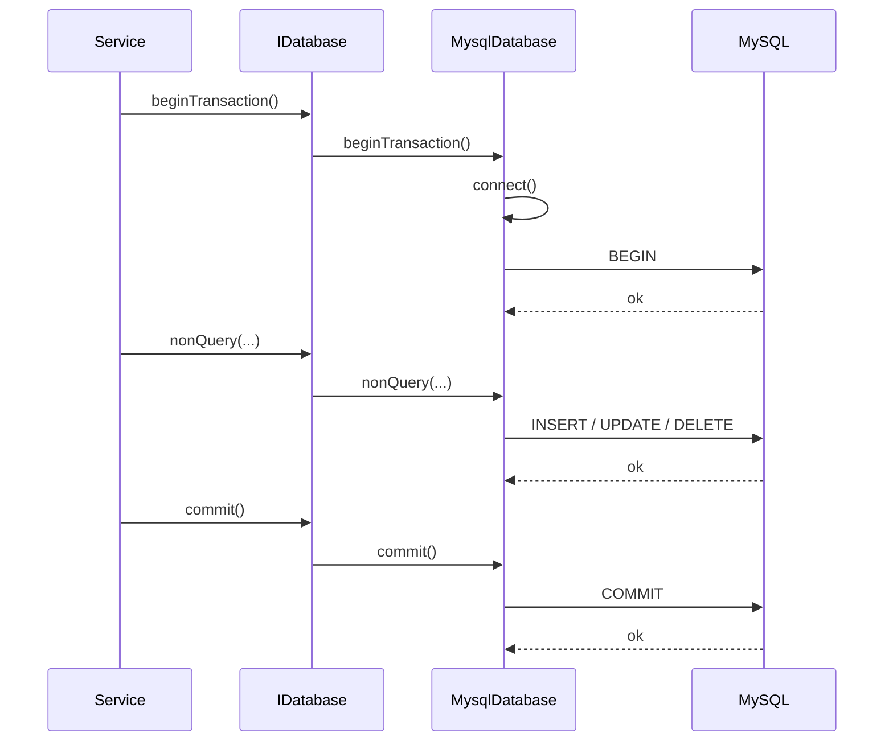
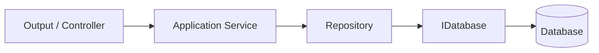

# BASE3 Framework Database Usage

## Purpose

This document explains how database access works in the BASE3 framework.

It is written for developers who want to build their own plugins and need a clear, practical understanding of how to use the framework's database layer correctly.

The focus is on:

* the `IDatabase` abstraction
* the lazy connection model
* dependency injection usage in plugins and services
* query methods and when to use each one
* transactions
* escaping and safe SQL construction
* MySQL-specific behavior of `MysqlDatabase`
* practical usage patterns and pitfalls

The goal is that after reading this document, a plugin developer can immediately start using the database service in a clean and framework-consistent way.

---

## 1. The big picture

BASE3 uses a small and explicit database abstraction:

* plugin and framework code depend on `Base3\Database\Api\IDatabase`
* concrete implementations such as `MysqlDatabase` provide the actual backend-specific behavior
* consumers are expected to work against the interface, not against `mysqli` directly

This keeps application code portable, testable, and consistent.

### Why this matters

Instead of scattering raw connection setup logic throughout plugins, BASE3 centralizes database access behind a single service contract.

That gives you:

* one shared programming model
* clean dependency injection
* predictable connection semantics
* a clear place for backend-specific behavior



---

## 2. Core abstraction: `IDatabase`

The central contract is `Base3\Database\Api\IDatabase`.

Its design is intentionally simple. It covers the operations most framework and plugin code needs:

* connection lifecycle
* transactions
* read queries
* write queries
* last insert ID / affected rows
* escaping
* error inspection

### Interface overview



### Key design decision: explicit lazy connection

A central rule in the interface documentation is this:

* implementations **must support lazy connections**
* calling `connect()` multiple times **must be safe**
* consumers **should call `connect()` proactively** before executing queries

This is a very important BASE3 convention.

It means:

* code should not try to guess whether a connection already exists
* code should simply call `connect()` before using the database
* repeated `connect()` calls are expected and harmless

That makes application code simpler and avoids fragile "am I connected already?" logic.

---

## 3. Connection lifecycle

The connection lifecycle in BASE3 is explicit.

The intended developer mindset is:

1. obtain `IDatabase` through dependency injection
2. call `connect()` when entering database work
3. run queries
4. optionally call `disconnect()` when you deliberately want to close the connection

### Connection state model



### Important semantic rule

`connect()` is not just an optional helper. It is part of the contract.

Consumers are expected to call it proactively.

That means code like this is correct and encouraged:

```php
<?php declare(strict_types=1);

namespace ExamplePlugin\Service;

use Base3\Database\Api\IDatabase;

class UserLookupService {

	public function __construct(
		private IDatabase $database
	) {
	}

	public function getUserById(int $id): ?array {
		$this->database->connect();

		$query = "SELECT * FROM usr_data WHERE usr_id = " . $id;
		return $this->database->singleQuery($query);
	}
}
```

### Why not check `connected()` first?

Because the framework deliberately avoids that pattern.

This is unnecessary:

```php
if (!$this->database->connected()) {
	$this->database->connect();
}
```

Prefer this instead:

```php
$this->database->connect();
```

It is shorter, clearer, and aligned with the interface contract.

---

## 4. The concrete MySQL implementation

The provided implementation shown here is `Base3\Database\Mysql\MysqlDatabase`.

It implements:

* `IDatabase`
* `ICheck`

### Configuration source

`MysqlDatabase` reads its settings from framework configuration section `database`:

```php
$cnf = $config->get('database');
$this->host = $cnf['host'] ?? null;
$this->user = $cnf['user'] ?? null;
$this->pass = $cnf['pass'] ?? null;
$this->name = $cnf['name'] ?? null;
```

So the expected structure is conceptually:

```php
[
	'database' => [
		'host' => '127.0.0.1',
		'user' => 'dbuser',
		'pass' => 'secret',
		'name' => 'my_database'
	]
]
```

### What `connect()` currently does

`MysqlDatabase::connect()`:

* returns immediately if already connected
* returns immediately if configuration values are incomplete
* opens a `mysqli` connection
* aborts silently if `connect_errno` is set
* sets charset to `utf8mb4`
* marks the instance as connected

This is the effective flow:

```mermaid
flowchart TD
	A[connect()] --> B{already connected?}
	B -- yes --> C[return]
	B -- no --> D{config complete?}
	D -- no --> C
	D -- yes --> E[create mysqli]
	E --> F{connect_errno?}
	F -- yes --> C
	F -- no --> G[set charset utf8mb4]
	G --> H[connected = true]
	H --> C
```

### Practical consequence

If connection setup fails, the current implementation does **not** throw inside `connect()`.

Instead, it simply remains unconnected.

That means plugin code should:

* call `connect()` first
* then execute queries
* inspect errors if needed
* ideally fail fast in your service logic when connectivity is required

A defensive pattern looks like this:

```php
<?php declare(strict_types=1);

namespace ExamplePlugin\Service;

use Base3\Database\Api\IDatabase;
use RuntimeException;

class HealthService {

	public function __construct(
		private IDatabase $database
	) {
	}

	public function requireConnection(): void {
		$this->database->connect();

		if (!$this->database->connected()) {
			throw new RuntimeException('Database connection could not be established.');
		}
	}
}
```

---

## 5. Getting the database service in plugins

In normal framework usage, plugin code should depend on `IDatabase` and receive it through dependency injection.

That is the preferred approach.

### Recommended pattern

```php
<?php declare(strict_types=1);

namespace ExamplePlugin\Repository;

use Base3\Database\Api\IDatabase;

class PackageRepository {

	public function __construct(
		private IDatabase $database
	) {
	}

	public function getAllPackages(): array {
		$this->database->connect();

		return $this->database->multiQuery(
			"SELECT id, name, url FROM packagist_package ORDER BY name ASC"
		);
	}
}
```

### Why depend on the interface?

Depending on `IDatabase` instead of `MysqlDatabase` gives you:

* cleaner architecture
* easier testing and mocking
* backend independence at the application level
* simpler refactoring later

### Legacy or standalone usage: `MysqlDatabase::getInstance()`

`MysqlDatabase` also provides a static helper:

```php
MysqlDatabase::getInstance($cnf = null)
```

This supports:

* resolving configuration through `ServiceLocator`
* creating an instance from a plain array
* creating an instance from an `ArrayConfiguration`

This can be useful for scripts, diagnostics, or isolated tooling.

Example:

```php
<?php declare(strict_types=1);

use Base3\Database\Mysql\MysqlDatabase;

$database = MysqlDatabase::getInstance([
	'database' => [
		'host' => '127.0.0.1',
		'user' => 'dbuser',
		'pass' => 'secret',
		'name' => 'base3data'
	]
]);

$database->connect();
$rows = $database->multiQuery("SELECT id, name FROM packagist_handle");
```

For regular plugin development, constructor injection is still the better choice.

---

## 6. Query methods and when to use them

One of the nicest parts of `IDatabase` is that the interface gives you intent-specific methods.

Instead of always writing the same fetch boilerplate, you choose the method that matches the expected result shape.

## 6.1 `nonQuery(string $query): void`

Use this for statements that modify data:

* `INSERT`
* `UPDATE`
* `DELETE`
* DDL statements such as `CREATE TABLE` when needed

Example:

```php
$this->database->connect();

$name = $this->database->escape($packageName);
$query = "INSERT INTO packagist_handle (name, lastcall) VALUES ('{$name}', NOW())";

$this->database->nonQuery($query);
```

Follow-up methods that are commonly used after `nonQuery()`:

* `insertId()`
* `affectedRows()`
* `isError()`
* `errorNumber()`
* `errorMessage()`

---

## 6.2 `scalarQuery(string $query): mixed`

Use this when you need exactly one value.

Examples:

* count rows
* get a maximum timestamp
* fetch a single setting value

Example:

```php
$this->database->connect();

$count = $this->database->scalarQuery(
	"SELECT COUNT(*) FROM packagist_package"
);
```

Behavior:

* returns `null` if no rows exist
* if multiple rows exist, only the first value of the first row is used

---

## 6.3 `singleQuery(string $query): ?array`

Use this when you expect one row as an associative array.

Example:

```php
$this->database->connect();

$id = 42;
$row = $this->database->singleQuery(
	"SELECT id, name, url FROM packagist_package WHERE id = " . $id
);
```

Behavior:

* returns `null` if no row exists
* returns only the first row if multiple rows match

Returned data shape:

```php
[
	'id' => '42',
	'name' => 'base3/framework',
	'url' => 'https://example.com/repo'
]
```

---

## 6.4 `listQuery(string $query): array`

Use this when you expect one column from many rows.

This is ideal for ID lists, names, slugs, or similar flat result sets.

Example:

```php
$this->database->connect();

$names = $this->database->listQuery(
	"SELECT name FROM packagist_handle ORDER BY name ASC"
);
```

Returned shape:

```php
[
	'base3',
	'clientstack',
	'datahawk'
]
```

---

## 6.5 `multiQuery(string $query): array`

Use this when you expect many rows as associative arrays.

Example:

```php
$this->database->connect();

$rows = $this->database->multiQuery(
	"SELECT id, name, downloads FROM packagist_package ORDER BY downloads DESC"
);
```

Returned shape:

```php
[
	[
		'id' => '1',
		'name' => 'base3/framework',
		'downloads' => '1000'
	],
	[
		'id' => '2',
		'name' => 'base3/clientstack',
		'downloads' => '800'
	]
]
```

---

## 6.6 Method selection guide



---

## 7. Transactions

`IDatabase` provides explicit transaction methods:

* `beginTransaction()`
* `commit()`
* `rollback()`

In `MysqlDatabase`, these methods:

* call `connect()` internally
* throw a `RuntimeException` if the connection is not available
* throw a `RuntimeException` if the underlying MySQL action fails

That makes transaction boundaries stricter than plain query methods.

### Transaction workflow



### Recommended pattern

Always wrap transactional write logic in `try/catch` and rollback on failure.

```php
<?php declare(strict_types=1);

namespace ExamplePlugin\Service;

use Base3\Database\Api\IDatabase;
use Throwable;

class PackageImportService {

	public function __construct(
		private IDatabase $database
	) {
	}

	public function importPackage(string $name, string $url): void {
		$this->database->beginTransaction();

		try {
			$escapedName = $this->database->escape($name);
			$escapedUrl = $this->database->escape($url);

			$this->database->nonQuery(
				"INSERT INTO packagist_package (name, url) VALUES ('{$escapedName}', '{$escapedUrl}')"
			);

			$this->database->commit();
		} catch (Throwable $e) {
			$this->database->rollback();
			throw $e;
		}
	}
}
```

### Important note on query methods inside transactions

Even though transaction methods auto-connect, your service code should still be written with the general BASE3 mindset that connection management is explicit.

The transaction methods are a convenience, not a reason to stop thinking clearly about database boundaries.

---

## 8. Escaping and safe SQL construction

`IDatabase` exposes:

```php
public function escape(string $str): string;
```

In `MysqlDatabase`, this calls:

```php
$this->connection->real_escape_string($str)
```

### Very important rule

`escape()` only escapes the value.

It does **not** add surrounding SQL quotes for you.

So this is wrong:

```php
$name = $this->database->escape($name);
$query = "SELECT * FROM table WHERE name = {$name}";
```

This is correct:

```php
$name = $this->database->escape($name);
$query = "SELECT * FROM table WHERE name = '{$name}'";
```

### Another important rule

`escape()` depends on an active connection in the current MySQL implementation.

So do this first:

```php
$this->database->connect();
$value = $this->database->escape($input);
```

### Safe manual SQL example

```php
<?php declare(strict_types=1);

namespace ExamplePlugin\Repository;

use Base3\Database\Api\IDatabase;

class HandleRepository {

	public function __construct(
		private IDatabase $database
	) {
	}

	public function findByName(string $name): ?array {
		$this->database->connect();

		$escapedName = $this->database->escape($name);
		$query = "SELECT id, name, lastcall FROM packagist_handle WHERE name = '{$escapedName}' LIMIT 1";

		return $this->database->singleQuery($query);
	}
}
```

### What this abstraction does not currently provide

Based on the shown code, the abstraction currently does **not** expose:

* prepared statement helpers
* parameter binding APIs
* query builder APIs
* automatic type conversion

So at this level, plugin developers write SQL strings manually and must escape values carefully.

---

## 9. Error handling

The interface offers explicit inspection methods:

* `isError()`
* `errorNumber()`
* `errorMessage()`

These reflect the last driver error.

### Example

```php
$this->database->connect();
$this->database->nonQuery("UPDATE some_table SET broken = ");

if ($this->database->isError()) {
	throw new \RuntimeException(
		'Query failed: #' . $this->database->errorNumber() . ' ' . $this->database->errorMessage()
	);
}
```

### Practical guidance

Use one of these styles consistently:

#### Style A: fail fast with exceptions in your own code

```php
$this->database->connect();
$this->database->nonQuery($query);

if ($this->database->isError()) {
	throw new \RuntimeException($this->database->errorMessage());
}
```

#### Style B: wrap database work in repository methods that normalize failure

```php
public function deleteById(int $id): bool {
	$this->database->connect();
	$this->database->nonQuery("DELETE FROM my_table WHERE id = " . $id);
	return !$this->database->isError();
}
```

### Important implementation detail

The current `nonQuery()`, `scalarQuery()`, `singleQuery()`, `listQuery()`, and `multiQuery()` methods do not throw on their own in the MySQL implementation.

Instead, they delegate to `mysqli` and leave error inspection to later checks.

Transaction methods behave differently because they do throw when critical transaction actions fail.

---

## 10. Result semantics you should know

The interface documents result behavior very clearly. These semantics are useful because they let you write simpler plugin code.

### `scalarQuery()`

* returns `null` if the query yields no rows
* uses the first value if multiple rows exist

### `singleQuery()`

* returns `null` if no row exists
* returns only the first row if multiple rows exist

### `listQuery()` and `multiQuery()`

* return arrays
* return empty arrays if nothing is found

### Practical example

```php
$user = $this->database->singleQuery($query);
if ($user === null) {
	return null;
}
```

```php
$rows = $this->database->multiQuery($query);
if ($rows === []) {
	return [];
}
```

That means you can express absence cleanly without custom wrappers.

---

## 11. Common plugin architecture pattern

A good BASE3 plugin structure is usually:

* controller or output class handles request flow
* service or repository encapsulates database work
* repository depends on `IDatabase`
* SQL stays inside repository/service classes, not in templates



### Example repository + service

```php
<?php declare(strict_types=1);

namespace ExamplePlugin\Repository;

use Base3\Database\Api\IDatabase;

class PackageRepository {

	public function __construct(
		private IDatabase $database
	) {
	}

	public function getTopPackages(int $limit = 10): array {
		$this->database->connect();

		$limit = max(1, $limit);

		return $this->database->multiQuery(
			"SELECT id, name, downloads
			 FROM packagist_package
			 ORDER BY downloads DESC
			 LIMIT " . $limit
		);
	}
}
```

```php
<?php declare(strict_types=1);

namespace ExamplePlugin\Service;

use ExamplePlugin\Repository\PackageRepository;

class PackageOverviewService {

	public function __construct(
		private PackageRepository $packageRepository
	) {
	}

	public function buildOverview(): array {
		return [
			'topPackages' => $this->packageRepository->getTopPackages(20)
		];
	}
}
```

This keeps responsibilities clean and makes later refactoring much easier.

---

## 12. Practical examples by use case

## 12.1 Insert a row and read back the insert ID

```php
<?php declare(strict_types=1);

namespace ExamplePlugin\Service;

use Base3\Database\Api\IDatabase;
use RuntimeException;

class HandleCreator {

	public function __construct(
		private IDatabase $database
	) {
	}

	public function create(string $name): int|string {
		$this->database->connect();

		$escapedName = $this->database->escape($name);
		$this->database->nonQuery(
			"INSERT INTO packagist_handle (name, lastcall) VALUES ('{$escapedName}', NOW())"
		);

		if ($this->database->isError()) {
			throw new RuntimeException($this->database->errorMessage());
		}

		return $this->database->insertId();
	}
}
```

## 12.2 Read a single configuration value

```php
$this->database->connect();

$lastCall = $this->database->scalarQuery(
	"SELECT MAX(lastcall) FROM packagist_handle"
);
```

## 12.3 Read a list of IDs

```php
$this->database->connect();

$ids = $this->database->listQuery(
	"SELECT id FROM packagist_package WHERE downloads_daily > 100"
);
```

## 12.4 Update rows and inspect affected rows

```php
$this->database->connect();

$this->database->nonQuery(
	"UPDATE packagist_package SET downloads_daily = 0 WHERE downloads_daily IS NULL"
);

$changed = $this->database->affectedRows();
```

## 12.5 Delete safely inside a transaction

```php
<?php declare(strict_types=1);

namespace ExamplePlugin\Service;

use Base3\Database\Api\IDatabase;
use Throwable;

class PackageDeletionService {

	public function __construct(
		private IDatabase $database
	) {
	}

	public function deletePackage(int $id): void {
		$this->database->beginTransaction();

		try {
			$this->database->nonQuery(
				"DELETE FROM packagist_topic WHERE repository_id = " . $id
			);

			$this->database->nonQuery(
				"DELETE FROM packagist_package WHERE id = " . $id
			);

			if ($this->database->isError()) {
				throw new \RuntimeException($this->database->errorMessage());
			}

			$this->database->commit();
		} catch (Throwable $e) {
			$this->database->rollback();
			throw $e;
		}
	}
}
```

---

## 13. Current implementation caveats you should understand

The current API is clean and useful, but plugin developers should be aware of several important implementation details from `MysqlDatabase`.

## 13.1 Query methods assume a ready connection

In the shown code, methods such as:

* `nonQuery()`
* `scalarQuery()`
* `singleQuery()`
* `listQuery()`
* `multiQuery()`
* `escape()`

operate directly on `$this->connection`.

That means they assume a valid connection already exists.

So this is a real best practice, not just style advice:

```php
$this->database->connect();
```

Call it before query execution.

## 13.2 `connect()` does not throw on failure

If credentials are missing or the server is unavailable, the current implementation simply stays disconnected.

So if your use case critically depends on DB access, verify the connection state and throw in your own application code.

## 13.3 Escape requires an active connection

Since escaping uses `real_escape_string()`, it depends on the current connection object and its character set.

Connect first, then escape.

## 13.4 Return data is driver-shaped

The MySQL implementation fetches associative arrays and scalar strings directly from `mysqli`.

So you should expect:

* numeric database values may arrive as strings
* no automatic DTO mapping happens here
* no automatic domain casting happens here

If you need stronger typing, do it in your repository or service layer.

Example:

```php
$row = $this->database->singleQuery($query);
$count = $row !== null ? (int) $row['downloads'] : 0;
```

---

## 14. Recommended coding guidelines for plugin authors

### Do

* inject `IDatabase`, not `MysqlDatabase`
* call `connect()` explicitly before query work
* keep SQL in repositories or dedicated services
* use the method matching the expected result shape
* wrap multi-step writes in transactions
* use `escape()` for dynamic string values
* inspect or normalize database errors consistently
* cast values in your domain layer when you need strict types

### Avoid

* writing SQL directly in templates
* mixing connection logic into many unrelated classes
* skipping `connect()` and hoping a connection exists
* interpolating raw user input into SQL
* depending on concrete `mysqli` behavior outside the DB layer

---

## 15. End-to-end example: a small plugin repository

This example shows a complete and realistic repository that a plugin developer could start with.

```php
<?php declare(strict_types=1);

namespace ExamplePlugin\Repository;

use Base3\Database\Api\IDatabase;
use RuntimeException;

class RepositoryOverviewRepository {

	public function __construct(
		private IDatabase $database
	) {
	}

	public function getRepositorySummary(string $handleName): array {
		$this->database->connect();

		if (!$this->database->connected()) {
			throw new RuntimeException('Database connection failed.');
		}

		$escapedHandleName = $this->database->escape($handleName);

		$handle = $this->database->singleQuery(
			"SELECT id, name, lastcall
			 FROM packagist_handle
			 WHERE name = '{$escapedHandleName}'
			 LIMIT 1"
		);

		if ($handle === null) {
			return [
				'handle' => null,
				'packages' => [],
				'packageCount' => 0
			];
		}

		$packages = $this->database->multiQuery(
			"SELECT id, name, url, downloads, favers
			 FROM packagist_package
			 WHERE handle_id = " . (int) $handle['id'] . "
			 ORDER BY downloads DESC"
		);

		return [
			'handle' => $handle,
			'packages' => $packages,
			'packageCount' => count($packages)
		];
	}
}
```

What this example demonstrates:

* interface-based dependency injection
* explicit connection handling
* connection validation for critical use cases
* correct escaping of dynamic strings
* use of `singleQuery()` and `multiQuery()` for natural result shapes
* returning application-friendly structured data

---

## 16. Summary

The BASE3 database layer is intentionally straightforward.

Its main ideas are:

* program against `IDatabase`
* keep connection management explicit
* call `connect()` proactively and without hesitation
* choose query methods by expected result shape
* use transactions for grouped write operations
* escape dynamic strings carefully
* keep database code inside services and repositories

For plugin developers, the most important habit is this:

> Treat `connect()` as a normal first step of database work, not as an exceptional action.

Once that convention is internalized, the rest of the API becomes very easy to use.

---

## 17. Quick reference

| Task                           | Method                                           |
| ------------------------------ | ------------------------------------------------ |
| Open connection lazily         | `connect()`                                      |
| Check connection state         | `connected()`                                    |
| Close connection               | `disconnect()`                                   |
| Begin transaction              | `beginTransaction()`                             |
| Commit transaction             | `commit()`                                       |
| Roll back transaction          | `rollback()`                                     |
| Run INSERT / UPDATE / DELETE   | `nonQuery()`                                     |
| Read one scalar                | `scalarQuery()`                                  |
| Read one row                   | `singleQuery()`                                  |
| Read one column from many rows | `listQuery()`                                    |
| Read many rows                 | `multiQuery()`                                   |
| Get last affected row count    | `affectedRows()`                                 |
| Get last insert ID             | `insertId()`                                     |
| Escape string value            | `escape()`                                       |
| Check last error               | `isError()` / `errorNumber()` / `errorMessage()` |

---

## 18. Final rule of thumb

When building a BASE3 plugin, a safe default repository method usually looks like this:

```php
public function runSomething(string $value): array {
	$this->database->connect();

	$escapedValue = $this->database->escape($value);

	return $this->database->multiQuery(
		"SELECT * FROM my_table WHERE my_column = '{$escapedValue}'"
	);
}
```

That pattern is simple, consistent, and aligned with the framework's database contract.

