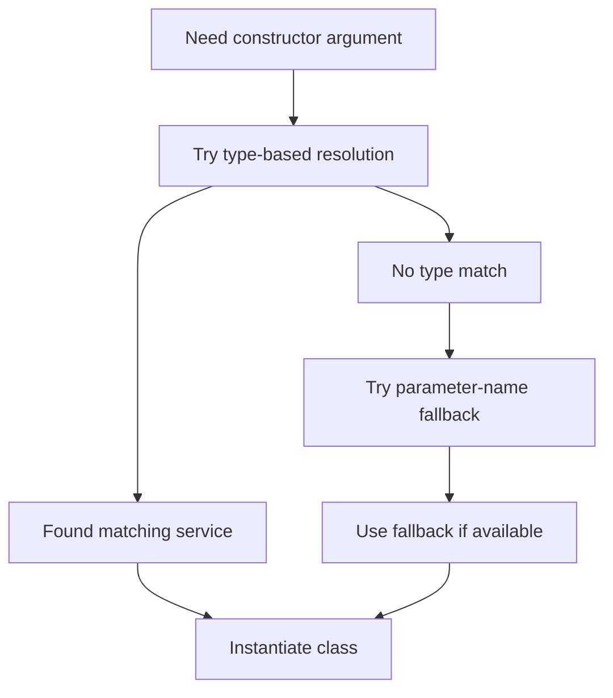
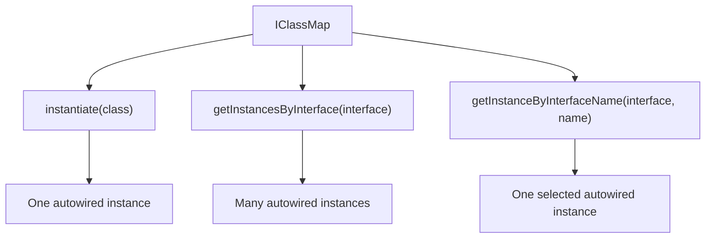
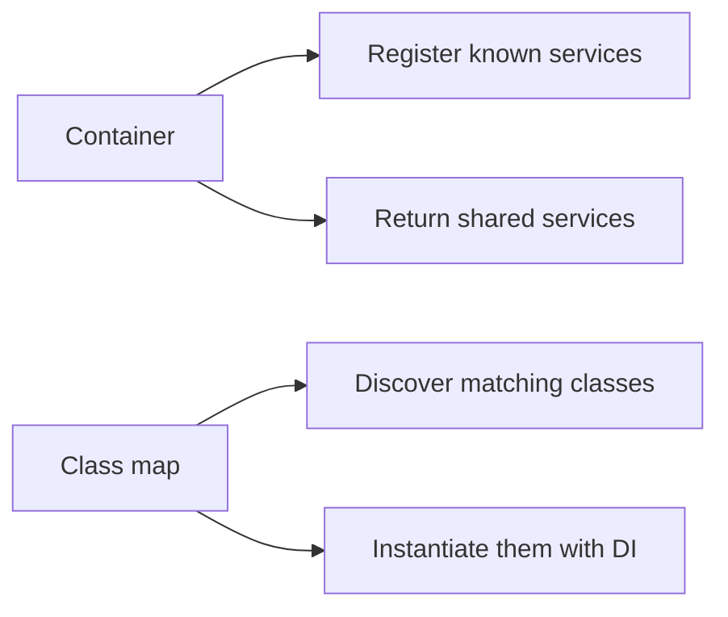
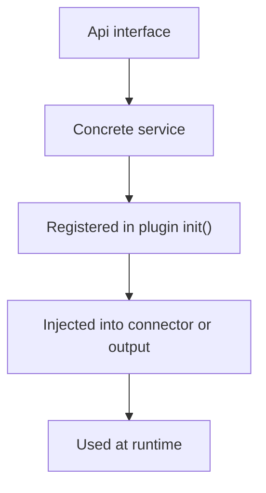

# BASE3 Framework DI and Autowiring for Plugin Developers

## Purpose

This document explains dependency injection in BASE3 from the perspective of a plugin developer.

It is meant to answer practical questions such as:

* How do I register services in my plugin?
* How should my own classes declare dependencies?
* How does BASE3 instantiate classes automatically?
* When should I use the container, and when should I use the class map?
* How does constructor autowiring behave in practice?

This document is intentionally focused on plugin development. It is not a bootstrap document.

The only background you need is this: before your plugin runs, the framework already provides a shared container with core services. Your plugin can then add more services, provide defaults, or replace implementations where appropriate.

---

## 1. The mental model you should use

As a plugin author, dependency injection in BASE3 usually happens in three places:

1. your plugin class receives the shared container
2. your plugin registers services in `init()`
3. your runtime classes receive their dependencies through the constructor

That is the core flow.


If you follow that pattern, your plugin stays modular and easy to extend.

---

## 2. The first important contract: `IPlugin`

A plugin implements `IPlugin`.

What matters for you is simple:

* the constructor receives `IContainer`
* `init()` is where you register your services

Example:

```php
class DemoPlugin implements IPlugin {

	public function __construct(private readonly IContainer $container) {}

	public static function getName(): string {
		return 'demoplugin';
	}

	public function init() {
		// register services here
	}
}
```

For plugin authors, the important thing is not the internal container implementation. The important thing is that `IContainer` is your shared registry for services and parameters.

---

## 3. What the container is for in plugin development

From the point of view of a plugin author, the container is where you do composition.

Typical uses are:

* register your own services
* provide default implementations under interfaces
* expose simple parameters
* define aliases when needed
* fetch already registered services during setup

So the container is not something you explain to end users. It is the place where your plugin joins the rest of the application.

A useful shortcut is:

* **container = shared service registry**

---

## 4. The most important task: register services in `init()`

The most common DI task in a plugin is registering services.

The DataHawk plugin is a good real-world example. It registers services under interfaces and builds them through closures.

That is the pattern plugin developers should copy.

### Pattern A: register under interfaces

```php
$container->set(IQueryService::class, ...);
```

Why is this useful?

Because other classes can depend on the interface instead of the concrete class.

That gives you:

* cleaner architecture
* easier replacement
* easier testing
* clearer extension points

### Pattern B: use closures when a service has dependencies

```php
$container->set(
	IReportExporterFactory::class,
	fn($c) => new ReportExporterFactory($c->get(IClassMap::class)),
	IContainer::SHARED
);
```

This is the safest default style.

Why?

Because many services need constructor arguments. A closure makes those dependencies explicit.

### Pattern C: provide a default without forcing it

Sometimes your plugin should register a default implementation, but allow a project or another plugin to choose a different one.

That is the practical meaning of `NOOVERWRITE`.

Use case:

* your plugin offers a default compiler
* another project provides its own compiler
* your plugin should not blindly replace that choice

### Pattern D: register the plugin itself only when useful

```php
$container->set(self::getName(), $this, IContainer::SHARED);
```

This is useful when something wants to check whether the plugin is available, or when code needs the plugin instance directly.

### Pattern E: store simple parameters as parameters

```php
$container->set('myplugin.export_path', DIR_TMP . 'exports/', IContainer::PARAMETER);
```

Use this for things like:

* file paths
* simple configuration values
* static arrays
* non-service data

---

## 5. Think in use cases, not flag numbers

For plugin authors, the useful meanings are these:

### Shared service

Use this when you want one reusable instance.

Typical examples:

* query services
* registries
* factories
* compilers
* adapters to infrastructure

### Default service

Use this when your plugin provides a standard implementation, but should stay replaceable.

Typical examples:

* default exporter factory
* default query compiler
* default schema provider

### Alias

Use this when two names should point to the same service.

This is mostly useful for compatibility or legacy naming. In new plugin code, interface-based access is usually cleaner.

### Parameter

Use this for plain values, not for objects that should be built and injected.

---

## 6. How your own classes should consume dependencies

Once a service exists, your own runtime classes should usually receive it through the constructor.

Good:

```php
class ReportController {

	public function __construct(
		private readonly IRequest $request,
		private readonly IQueryService $queryservice,
		private readonly IConfiguration $configuration
	) {}
}
```

Less good:

```php
class ReportController {

	public function __construct(private readonly IContainer $container) {}

	public function run() {
		$queryservice = $this->container->get(IQueryService::class);
	}
}
```

The second version works, but it hides the real dependencies.

### Practical rule

* use `IContainer` in your plugin class and other setup code
* use narrow constructor dependencies in runtime classes

That keeps the class self-explanatory.

---

## 7. What autowiring means in BASE3

In BASE3, autowiring means that when the framework instantiates a class, it inspects the constructor and tries to provide matching arguments automatically.

For plugin developers, the most important rule is:

* type-hint dependencies clearly
* prefer interfaces where replacement makes sense
* let BASE3 resolve them when the class is instantiated

Example:

```php
class PriceConnector implements IOutput {

	public function __construct(
		private readonly IRequest $request,
		private readonly IPriceCalculator $pricecalculator,
		private readonly ILogger $logger
	) {}
}
```

If the required services are known, BASE3 can instantiate this class automatically.

---

## 8. How constructor parameters are resolved

From the plugin developer perspective, the useful resolution order is:

1. inspect the constructor
2. try to resolve each parameter by type
3. if that does not work, try a fallback by parameter name
4. if a class is only being probed or inspected, additional fallback logic may be used so discovery does not fail too early

### Preferred case: resolution by type

```php
public function __construct(IRequest $request, IQueryService $queryservice)
```

If the container contains those services, this is the cleanest path.

### Fallback case: resolution by parameter name

If strict type-based resolution is not available, BASE3 can fall back to the parameter name.

That can help in older or less explicit code, but it is not the design you should aim for.

### Recommendation

Prefer explicit type hints whenever possible.

That gives you:

* clearer intent
* fewer accidental mismatches
* easier replacement of implementations
* better compatibility with automatic instantiation



---

## 9. Why `IClassMap` matters just as much as the container

Many plugin developers first focus only on the container. But in BASE3, `IClassMap` is equally important.

Why?

Because it combines:

* class discovery
* selection by interface or logical name
* automatic instantiation

A useful shortcut is:

* **class map = discovery plus instantiation**

The most important methods for plugin developers are these:

```php
public function instantiate(string $class);
public function getInstances(array $criteria = []);
public function getInstancesByInterface($interface);
public function getInstancesByAppInterface($app, $interface, $retry = false);
public function getInstanceByAppName($app, $name, $retry = false);
public function getInstanceByInterfaceName($interface, $name, $retry = false);
public function getInstanceByAppInterfaceName($app, $interface, $name, $retry = false);
```

---

## 10. What `instantiate()` means in practice

The `instantiate()` method is the practical bridge between discovery and DI.

For plugin developers, that means:

* the system knows about a class
* BASE3 creates an instance of it
* constructor dependencies are resolved automatically

So if the framework needs one of your connectors, exporters, handlers, providers, or other discovered classes, `instantiate()` is what makes that possible.

### Why that is useful

Not every class in your plugin needs to be registered manually as a fully built service.

Some classes are instead:

* discovered dynamically
* selected by interface or name
* instantiated on demand

That is especially helpful for plugin extension points.

---

## 11. Very practical class map use cases

### Use case A: get all implementations of an interface

```php
$exporters = $classMap->getInstancesByInterface(IReportExporter::class);

foreach ($exporters as $exporter) {
	// use exporter
}
```

This is ideal for extension points where multiple implementations should be picked up automatically.

Examples:

* exporters
* checks
* listeners
* providers
* processors

### Use case B: get all implementations for one app only

```php
$checks = $classMap->getInstancesByAppInterface('DataHawk', ICheck::class);
```

This is useful when one plugin contains a family of related components and you want only those.

### Use case C: get one implementation by logical name

```php
$instance = $classMap->getInstanceByInterfaceName(IOutput::class, 'myreportconnector');
```

This is useful when several classes implement the same interface and you want one exact target.

### Use case D: instantiate a known class directly

```php
$connector = $classMap->instantiate(MyConnector::class);
```

Use this when you know the class and want BASE3 to resolve its constructor dependencies.



---

## 12. A strong real-world example of constructor DI

This connector is a very good example of how plugin runtime classes should look:

```php
class DancephotographyphotoEditorConnector implements IOutput {

	public function __construct(
		private readonly IRequest $request,
		private readonly IEntityDataService $entitydataservice,
		private readonly DancephotographyFileStorageRegistry $storageregistry,
		private readonly IDancephotographyPublishService $publishservice,
		private readonly DancephotographyPhotoAdjustmentRegistry $photoadjustmentregistry,
		private readonly DancephotographyPhotoCropRegistry $photocropregistry,
		private readonly DancephotographyPhotoLogoRegistry $photologoregistry
	) {}
}
```

Why is this a good example?

Because it shows the intended style very clearly:

* dependencies are explicit
* framework services and plugin services are mixed naturally
* the class does not manually pull dependencies from the container
* the business logic stays separate from composition logic

Even though the constructor is long, this is often the better design. It makes the real dependency graph visible.

### Practical lesson

If a class genuinely depends on seven collaborators, it is better to declare seven collaborators than to hide them behind late container lookups.

---

## 13. Container versus class map: when to use which

This distinction is one of the most useful things a plugin developer can understand.

### Use the container when...

* you want to register a service
* you want one shared instance
* you want to expose a default implementation
* you want to define a parameter or alias
* you need a known service during setup

### Use the class map when...

* you want to discover implementations dynamically
* you want all classes implementing a certain interface
* you want one instance selected by interface or name
* you want BASE3 to instantiate a class on demand with autowiring



---

## 14. A clean plugin structure for DI

A good default structure is:

* `Api/` for interfaces
* `Service/` for implementations
* plugin class for registrations
* outputs, connectors, and handlers as runtime entry points
* registries and factories as constructor-injected collaborators



### Minimal example

#### Interface

```php
interface IPriceCalculator {
	public function calculate(array $data): float;
}
```

#### Implementation

```php
class DefaultPriceCalculator implements IPriceCalculator {

	public function __construct(
		private readonly IConfiguration $configuration
	) {}

	public function calculate(array $data): float {
		return 0.0;
	}
}
```

#### Plugin registration

```php
class DemoPlugin implements IPlugin {

	public function __construct(private readonly IContainer $container) {}

	public static function getName(): string {
		return 'demoplugin';
	}

	public function init() {
		$this->container->set(
			IPriceCalculator::class,
			fn($c) => new DefaultPriceCalculator(
				$c->get(IConfiguration::class)
			),
			IContainer::SHARED | IContainer::NOOVERWRITE
		);
	}
}
```

#### Consumer

```php
class PriceConnector implements IOutput {

	public function __construct(
		private readonly IRequest $request,
		private readonly IPriceCalculator $pricecalculator
	) {}

	public static function getName(): string {
		return 'priceconnector';
	}
}
```

This is the style most plugin developers should aim for.

---

## 15. What `DynamicMockFactory` means for plugin authors

There is also fallback logic for situations where the framework wants to inspect or probe classes before every real dependency is fully available.

One example is `DynamicMockFactory`.

For plugin developers, the important point is not its internal implementation, but its role:

* it helps framework discovery remain robust
* it can provide placeholder objects in probing scenarios
* it prevents some reflective inspection steps from failing too early

### Important recommendation

Do not design your plugin around fallback behavior.

Treat it as a safety net for discovery, not as a replacement for proper service registration.

If a class only works because probing used a placeholder, the real solution is usually to register the real dependency correctly.

---

## 16. Practical design rules

### Prefer interfaces when replacement matters

Good:

```php
public function __construct(IRequest $request, IQueryService $queryservice)
```

Less good:

```php
public function __construct($request, $queryservice)
```

### Prefer narrow dependencies

Good:

```php
public function __construct(IRequest $request, ILogger $logger)
```

Less good:

```php
public function __construct(IContainer $container)
```

### Long constructors are fine when they are honest

A long explicit constructor is often better than hidden lookups throughout the class.

### Use class dependencies directly when the class itself is the real contract

Not everything must be interface-based. Registries, small helpers, or internal utilities can be injected by concrete class when that is the right abstraction.

---

## 17. Common mistakes and better alternatives

### Mistake: manual container lookup inside business code

Better:

* inject the real dependency through the constructor
* keep the container in setup code

### Mistake: registering only a class string for a service with constructor dependencies

Better:

* register it through a closure
* make the dependencies explicit there

### Mistake: relying on parameter-name fallback as the normal design

Better:

* register services clearly
* type-hint dependencies clearly

### Mistake: exposing only concrete classes when an extension point is intended

Better:

* define an interface
* register the implementation under that interface

---

## 18. A small checklist for every new plugin service

Before adding a service, ask:

* should this be replaceable? then define an interface
* should there be only one instance? then make it shared
* is this only a default? then avoid overwriting an earlier choice
* will another class need it? then inject it through the constructor
* do I want to discover all implementations later? then make it class-map friendly and query it by interface

That is usually enough to keep BASE3 plugin DI clean.

---

## 19. Summary

For plugin developers, BASE3 dependency injection can be reduced to a few practical rules:

* your plugin receives the shared container through `IPlugin`
* use `init()` to register your services
* register replaceable services under interfaces
* use closures when services need dependencies
* inject dependencies into runtime classes through constructors
* prefer type-based injection over parameter-name fallback
* use `IClassMap` when you need discovery, bulk lookup, or on-demand instantiation
* think of the container as the registry and the class map as discovery plus autowired instantiation

If you follow these patterns, your plugin will fit naturally into BASE3 and remain easy to extend.

---

## 20. Final checklist for plugin developers

Before shipping a plugin, check the following:

* does the plugin implement `IPlugin`?
* are important services registered in `init()`?
* are replaceable services registered under interfaces?
* are runtime classes using constructor injection?
* are type hints explicit and meaningful?
* are closures used when constructor dependencies exist?
* are you using the class map where discovery or multiple implementations are needed?
* are you avoiding unnecessary direct container lookups in business code?

If yes, your plugin uses BASE3 DI in a clean and maintainable way.

