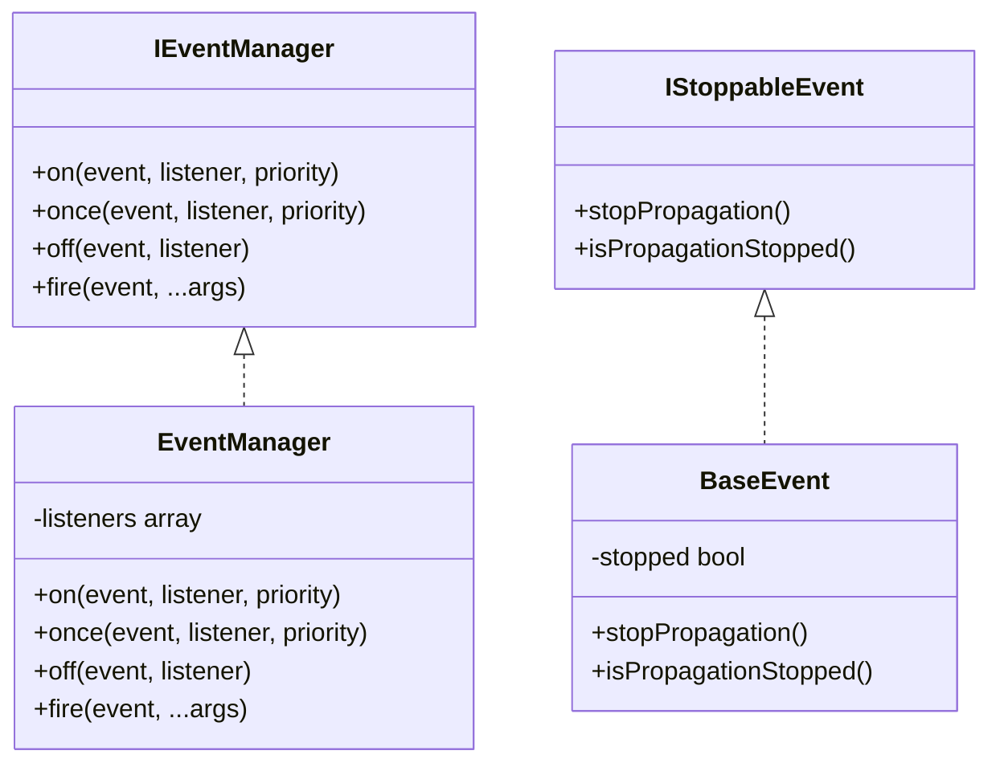
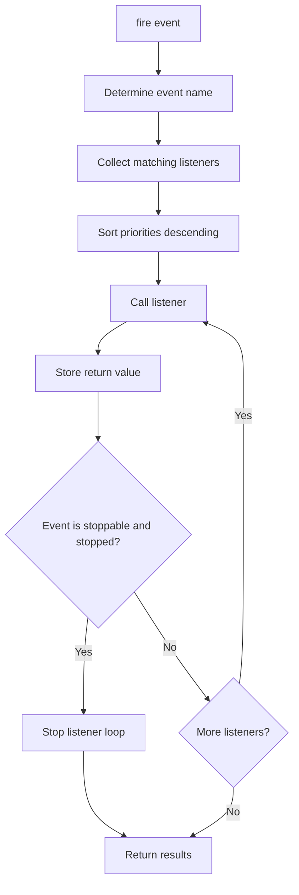

# BASE3 Framework Events

## Purpose

This document explains how the **Event** system works in the BASE3 framework.

It is written for developers who want to understand:

* what `IEventManager` is for
* how events are registered and fired
* how event listeners are ordered by priority
* how one-time listeners work
* how listeners can be removed
* how event propagation can be stopped
* how event objects should be designed
* how wildcard event listeners work
* how plugins can register event listeners
* when to use Events instead of Hooks
* when to use direct service calls instead of Events

After reading this document, a developer should understand how to use BASE3 events as a lightweight runtime notification system.

---

## 1. What the Event system is

The BASE3 Event system is a small synchronous event bus.

It allows one part of the application to announce that something happened, while other parts can react without being directly called by the source.

Example:

```php id="u93b7o"
$eventManager->fire(new UserDeletedEvent(42));
```

A listener can react:

```php id="oaw8iz"
$eventManager->on(UserDeletedEvent::class, function(UserDeletedEvent $event): void {
	// react to deleted user
});
```

The source component does not need to know which listeners exist.

---

## 2. Why this exists

Events are useful when code should announce something without owning all follow-up behavior.

Examples:

* a user was created
* a record was deleted
* a tool call started
* a tool call finished
* a tool call failed
* an import processed one item
* a connection was tested
* a cache entry was invalidated
* a background task changed status
* a domain object changed state

Without events, the source component would need direct dependencies on every follow-up component.

With events, the source component only depends on:

```php id="vyyhkg"
Base3\Event\Api\IEventManager
```

Other code can register listeners independently.

---

## 3. Core classes and interfaces

The event system consists of:

```text id="qznx2q"
Base3\Event\Api\IEventManager
Base3\Event\Api\IStoppableEvent
Base3\Event\BaseEvent
Base3\Event\EventManager
```



---

## 4. Event Manager interface

The central interface is:

```php id="mylknr"
<?php declare(strict_types=1);

namespace Base3\Event\Api;

interface IEventManager {

	public function on(string $event, callable $listener, int $priority = 0): void;

	public function once(string $event, callable $listener, int $priority = 0): void;

	public function off(string $event, callable $listener): void;

	public function fire(object|string $event, ...$args): array;
}
```

The interface supports:

* registering persistent listeners
* registering one-time listeners
* removing listeners
* firing string or object events
* collecting listener return values

---

## 5. Registration in the container

The event manager is a service.

It should usually be registered by a bootstrap or plugin before consuming services need it.

Conceptual registration:

```php id="giortz"
$container->set(
	IEventManager::class,
	fn() => new EventManager(),
	IContainer::SHARED
);
```

When a plugin registers the event manager, it may use a no-overwrite flag if the container supports it.

That allows a host system or bootstrap to provide a custom event manager implementation first.

Conceptually:

```php id="ov17e3"
$container->set(
	IEventManager::class,
	fn() => new EventManager(),
	IContainer::SHARED | IContainer::NOOVERWRITE
);
```

This pattern keeps the event system replaceable.

---

## 6. Event names

An event can be fired as a string or as an object.

### String event

```php id="gflgj8"
$eventManager->fire('user.deleted', 42);
```

The event name is the string itself:

```text id="c91w77"
user.deleted
```

A listener registers for the same string:

```php id="shvlq3"
$eventManager->on('user.deleted', function(string $event, int $userId): void {
	// react to user id
});
```

When a string event is fired, the listener receives the event name as the first argument.

---

### Object event

```php id="dr0968"
$eventManager->fire(new UserDeletedEvent(42));
```

When an object is fired, the event name is the class name of the object:

```php id="hqr7ki"
UserDeletedEvent::class
```

A listener registers for the event class:

```php id="opxn82"
$eventManager->on(UserDeletedEvent::class, function(UserDeletedEvent $event): void {
	// react to typed event object
});
```

Object events are usually preferred for domain behavior.

---

## 7. String events versus object events

Use string events for small generic notifications.

Example:

```php id="i64k6b"
$eventManager->fire('cache.clear');
```

Use object events when the event has structured data.

Example:

```php id="x2k1a9"
$eventManager->fire(new UserDeletedEvent($userId));
```

Object events are better when:

* listeners need typed data
* the event has multiple fields
* the event is part of a plugin API
* the event may become stoppable
* event data should be documented through methods

---

## 8. Event objects

An event object is a small data object that describes what happened.

Example:

```php id="wt7yvj"
<?php declare(strict_types=1);

namespace ExamplePlugin\Event;

use Base3\Event\BaseEvent;

final class UserDeletedEvent extends BaseEvent {

	public function __construct(
		private readonly int $userId
	) {}

	public function getUserId(): int {
		return $this->userId;
	}
}
```

The event object should carry event data.

It should not contain heavy business logic.

---

## 9. BaseEvent

`BaseEvent` is a simple base class for stoppable events.

```php id="s19tgq"
class BaseEvent implements IStoppableEvent {

	protected bool $stopped = false;

	public function stopPropagation(): void {
		$this->stopped = true;
	}

	public function isPropagationStopped(): bool {
		return $this->stopped;
	}
}
```

Extending `BaseEvent` is optional.

Use it when listeners should be able to stop further propagation.

---

## 10. Stoppable events

A stoppable event implements:

```php id="fbwnj3"
Base3\Event\Api\IStoppableEvent
```

The interface is:

```php id="dizqk5"
interface IStoppableEvent {

	public function stopPropagation(): void;

	public function isPropagationStopped(): bool;
}
```

When a listener calls:

```php id="prrom8"
$event->stopPropagation();
```

the event manager stops calling remaining listeners for that event.

Example:

```php id="bxafg6"
$eventManager->on(UserDeletedEvent::class, function(UserDeletedEvent $event): void {
	if ($event->getUserId() === 1) {
		$event->stopPropagation();
	}
}, 100);
```

If propagation is stopped, lower-priority listeners are not executed.

---

## 11. Registering listeners with `on()`

Use `on()` for normal persistent listeners.

```php id="jnapqi"
$eventManager->on(
	UserDeletedEvent::class,
	function(UserDeletedEvent $event): void {
		// listener code
	}
);
```

A listener can be any callable:

* closure
* function name
* object method array
* static method array
* invokable object

Example with a listener object:

```php id="lt160b"
$listener = new UserAuditListener($database);

$eventManager->on(
	UserDeletedEvent::class,
	[$listener, 'onUserDeleted']
);
```

---

## 12. Listener methods

Listener methods should usually be small and focused.

Example:

```php id="zv8j0a"
final class UserAuditListener {

	public function __construct(
		private readonly IDatabase $database
	) {}

	public function onUserDeleted(UserDeletedEvent $event): void {
		// write audit record
	}
}
```

A listener method should generally:

* accept the expected event object
* perform one specific reaction
* avoid changing unrelated state
* handle its own failures when the event source should not fail

---

## 13. One-time listeners with `once()`

Use `once()` when a listener should run only for the next matching event.

```php id="tup4qe"
$eventManager->once(
	UserDeletedEvent::class,
	function(UserDeletedEvent $event): void {
		// runs only once
	}
);
```

After the listener has executed, the event manager removes it automatically.

This is useful for:

* temporary listeners
* one-shot instrumentation
* initialization events
* short-lived workflow callbacks

---

## 14. Removing listeners with `off()`

Use `off()` to remove a previously registered listener.

```php id="hhxfx0"
$listener = [$auditListener, 'onUserDeleted'];

$eventManager->on(UserDeletedEvent::class, $listener);
$eventManager->off(UserDeletedEvent::class, $listener);
```

Important:

The listener passed to `off()` must match the originally registered callable.

This is easy with named methods or stored closures.

Example with stored closure:

```php id="nmfmar"
$listener = function(UserDeletedEvent $event): void {
	// ...
};

$eventManager->on(UserDeletedEvent::class, $listener);
$eventManager->off(UserDeletedEvent::class, $listener);
```

Anonymous inline closures cannot be removed later unless they are stored.

---

## 15. Listener priority

Listeners can have a priority.

```php id="i01fad"
$eventManager->on(UserDeletedEvent::class, $listenerA, 100);
$eventManager->on(UserDeletedEvent::class, $listenerB, 0);
$eventManager->on(UserDeletedEvent::class, $listenerC, -100);
```

Higher priority runs earlier.

Execution order:

```text id="ykrcz4"
100
0
-100
```

Use priority when ordering matters.

Examples:

* validation before persistence
* security checks before side effects
* normalization before logging
* early listener may stop propagation

Avoid relying on priority when the order is not important.

---

## 16. Firing events with `fire()`

Use `fire()` to trigger an event.

```php id="g30ld9"
$results = $eventManager->fire(new UserDeletedEvent(42));
```

The method returns an array with listener return values.

```php id="lp8ksm"
array<int, mixed>
```

Example:

```php id="w8jnbm"
$results = $eventManager->fire('health.collect');

foreach ($results as $result) {
	// aggregate listener results
}
```

For notification-style events, listener return values are often ignored.

---

## 17. Additional fire arguments

`fire()` accepts additional arguments.

```php id="bqg6rh"
$eventManager->fire('user.deleted', $userId, $context);
```

Listeners receive:

```php id="a3il92"
function(string $event, int $userId, array $context): void {
	// ...
}
```

For object events, the event object remains the first argument.

```php id="rw4fuj"
$eventManager->fire(new UserDeletedEvent($userId), $context);
```

Listener:

```php id="iwbx4k"
function(UserDeletedEvent $event, array $context): void {
	// ...
}
```

Prefer putting important event data into the event object instead of relying on many extra arguments.

---

## 18. Wildcard listeners

The event manager supports wildcard matching using event name patterns.

Example:

```php id="h0uzqr"
$eventManager->on('ExamplePlugin\\Event\\*', function(object $event): void {
	// reacts to all events in this namespace
});
```

This listener matches event classes such as:

```php id="a8lrgt"
ExamplePlugin\Event\UserCreatedEvent::class
ExamplePlugin\Event\UserDeletedEvent::class
```

Wildcard listeners can be useful for:

* logging
* debugging
* tracing
* metrics
* broad audit behavior

Use them carefully.

They may receive more events than expected.

---

## 19. Wildcard matching behavior

The event manager compares each registered pattern with the event name.

A listener matches when:

* the pattern is exactly equal to the event name
* or the pattern matches using wildcard matching

Conceptually:

```text id="j0poml"
pattern === eventName
or
fnmatch(pattern, eventName)
```

For object events, the event name is the class name.

For string events, the event name is the string.

---

## 20. Matching and execution flow



---

## 21. Plugin registration pattern

A plugin can register the event manager and its listeners during `init()`.

Conceptual example:

```php id="x7d6wo"
class ExamplePlugin implements IPlugin {

	public function __construct(
		private readonly IContainer $container
	) {}

	public function init() {
		$this->container
			->set(
				IEventManager::class,
				fn() => new EventManager(),
				IContainer::SHARED | IContainer::NOOVERWRITE
			);

		$listener = new ExampleEventListener(
			$this->container->get(IDatabase::class)
		);

		$eventManager = $this->container->get(IEventManager::class);

		$eventManager->on(ExampleStartedEvent::class, [$listener, 'onStarted']);
		$eventManager->on(ExampleFinishedEvent::class, [$listener, 'onFinished']);
		$eventManager->on(ExampleFailedEvent::class, [$listener, 'onFailed']);
	}
}
```

This is a practical pattern when a plugin owns both the event classes and the listener.

---

## 22. Firing events from a service

A service should receive the event manager through dependency injection.

```php id="wqqxwm"
final class ImportService {

	public function __construct(
		private readonly IEventManager $eventManager
	) {}

	public function importItem(int $id): void {
		$this->eventManager->fire(new ImportItemStartedEvent($id));

		try {
			// import item

			$this->eventManager->fire(new ImportItemFinishedEvent($id));
		}
		catch (\Throwable $e) {
			$this->eventManager->fire(new ImportItemFailedEvent($id, $e));
			throw $e;
		}
	}
}
```

This keeps the service focused.

The service announces what happened.

Listeners decide what to do with it.

---

## 23. Example event class

```php id="n8hxfd"
<?php declare(strict_types=1);

namespace ExamplePlugin\Event;

use Base3\Event\BaseEvent;

final class ToolStartedEvent extends BaseEvent {

	/**
	 * @param array<string,mixed> $arguments
	 * @param array<string,mixed> $trace
	 */
	public function __construct(
		private readonly string $nodeId,
		private readonly string $callId,
		private readonly string $toolName,
		private readonly string $label,
		private readonly array $arguments,
		private readonly int $iteration,
		private string $timestamp = '',
		private readonly int $callIndex = 0,
		private readonly array $trace = []
	) {
		if ($this->timestamp === '') {
			$this->timestamp = (new \DateTimeImmutable())->format('c');
		}
	}

	public function getNodeId(): string {
		return $this->nodeId;
	}

	public function getCallId(): string {
		return $this->callId;
	}

	public function getToolName(): string {
		return $this->toolName;
	}

	public function getLabel(): string {
		return $this->label;
	}

	/**
	 * @return array<string,mixed>
	 */
	public function getArguments(): array {
		return $this->arguments;
	}

	public function getIteration(): int {
		return $this->iteration;
	}

	public function getTimestamp(): string {
		return $this->timestamp;
	}

	public function getCallIndex(): int {
		return $this->callIndex;
	}

	/**
	 * @return array<string,mixed>
	 */
	public function getTrace(): array {
		return $this->trace;
	}
}
```

This style keeps event data immutable from the outside and exposes it through getters.

---

## 24. Example listener class

```php id="vce3v5"
<?php declare(strict_types=1);

namespace ExamplePlugin\Listener;

use ExamplePlugin\Event\ToolStartedEvent;
use ExamplePlugin\Event\ToolFinishedEvent;
use ExamplePlugin\Event\ToolFailedEvent;

final class ToolEventDisplayListener {

	public function onToolStarted(ToolStartedEvent $event): void {
		// record started state
	}

	public function onToolFinished(ToolFinishedEvent $event): void {
		// record finished state
	}

	public function onToolFailed(ToolFailedEvent $event): void {
		// record failed state
	}
}
```

A listener can handle several related event classes.

Method names should describe the event they handle.

---

## 25. Error handling in listeners

The event manager does not catch listener exceptions.

If a listener throws, event execution stops and the exception bubbles up to the caller.

This is useful when listener failure should fail the operation.

For non-critical listeners, catch exceptions inside the listener.

Example:

```php id="epeix4"
public function onToolStarted(ToolStartedEvent $event): void {
	try {
		// best-effort logging or display update
	}
	catch (\Throwable $e) {
		// ignore or log safely
	}
}
```

Use this pattern for best-effort side effects such as:

* diagnostics
* audit display
* metrics
* optional logging
* UI status mirrors

Do not silently ignore errors in listeners that enforce important business rules.

---

## 26. Events versus Hooks

BASE3 also has a Hook system.

Events and Hooks are related but serve different purposes.

### Use Hooks for framework lifecycle extension

Hooks are useful for known framework lifecycle points.

Examples:

```text id="e8n08o"
bootstrap.init
bootstrap.start
bootstrap.finish
```

A hook name is usually part of the framework lifecycle or extension contract.

### Use Events for runtime domain notifications

Events are useful for runtime things that happen inside services, plugins, jobs, workflows, or domain logic.

Examples:

```text id="pdkmi4"
ToolStartedEvent
ToolFinishedEvent
UserDeletedEvent
ImportItemProcessedEvent
ConnectionTestFailedEvent
```

### Practical rule

Use Hooks when extending a known framework phase.

Use Events when publishing something that happened during runtime behavior.

---

## 27. Events versus direct service calls

Events should not replace ordinary service calls.

Use a direct service call when the caller needs a specific result from a known dependency.

Example:

```php id="y5bd9n"
$user = $userRepository->getById($id);
```

Use an event when the caller wants to announce something and does not need to know who reacts.

Example:

```php id="pptgql"
$eventManager->fire(new UserDeletedEvent($id));
```

### Direct service call

Good for:

* required behavior
* returned values
* clear dependencies
* business-critical workflows

### Event

Good for:

* notifications
* optional reactions
* audit trails
* logging
* metrics
* UI mirrors
* plugin extension points

---

## 28. Events and transactions

Be careful when firing events inside database transactions.

If a listener performs database writes or external calls, it may run before the outer transaction is committed.

Possible strategies:

* fire events after commit
* keep listeners idempotent
* let listeners update independent projection tables
* avoid external side effects inside transactional events
* document whether an event means “will happen” or “has happened”

Name events clearly.

Example:

```text id="k86mth"
UserDeletingEvent   before deletion
UserDeletedEvent    after deletion
```

---

## 29. Before and after events

For important workflows, use separate event classes for before and after phases.

Example:

```php id="e9sfhb"
UserDeletingEvent
UserDeletedEvent
```

The before event can be stoppable.

```php id="rjjct2"
$event = new UserDeletingEvent($userId);
$eventManager->fire($event);

if ($event->isPropagationStopped()) {
	return;
}

$userRepository->delete($userId);
$eventManager->fire(new UserDeletedEvent($userId));
```

This makes the intent explicit.

---

## 30. Event naming conventions

For object events, use class names that describe what happened.

Good:

```text id="aq4bwl"
UserCreatedEvent
UserDeletedEvent
ImportStartedEvent
ImportFinishedEvent
ImportFailedEvent
ToolStartedEvent
ToolFinishedEvent
ToolFailedEvent
```

Avoid vague names:

```text id="q1q3os"
UserEvent
DataEvent
ActionEvent
ThingChangedEvent
```

Use past tense for completed events:

```text id="x9uxua"
UserDeletedEvent
ImportFinishedEvent
```

Use present participle for before events:

```text id="zss24r"
UserDeletingEvent
ImportStartingEvent
```

---

## 31. Listener naming conventions

Listener classes should describe what they react to or what they update.

Good:

```text id="mbyddx"
UserAuditListener
ImportMetricsListener
ToolEventDisplayListener
ConnectionHealthListener
```

Listener methods should describe the exact event.

Good:

```text id="wxm0pe"
onUserDeleted
onImportFinished
onToolFailed
```

---

## 32. Designing event payloads

An event payload should contain enough data for listeners to react.

Good event data:

* stable identifiers
* timestamps
* technical names
* labels
* arguments or metadata needed by listeners
* trace information
* status-relevant fields

Avoid putting large objects into event payloads unless necessary.

Prefer:

```php id="qln8aq"
new UserDeletedEvent($userId)
```

over:

```php id="wouaje"
new UserDeletedEvent($entireUserRepository, $fullApplicationState)
```

Events should be easy to serialize, log, inspect, and test.

---

## 33. Trace data

Some event classes may include a generic trace array.

Example:

```php id="rokkif"
[
	'turn_id' => '...',
	'config_group' => '...',
	'config_name' => '...',
	'user_id' => 123
]
```

Trace data is useful when events are used for diagnostics, monitoring, UI mirrors, or background execution.

Keep trace keys stable and documented if other components depend on them.

---

## 34. Return values from listeners

`fire()` returns all listener return values.

Example:

```php id="qmbi1u"
$results = $eventManager->fire('collect.metrics');
```

This can support collector-style events.

However, if the caller needs one authoritative result, prefer a direct service call.

Events are better for many listeners reacting independently.

---

## 35. Wildcard listeners and priority

Wildcard listeners participate in the same priority sorting as exact listeners.

Example:

```php id="wn5t7s"
$eventManager->on('ExamplePlugin\\Event\\*', $wildcardListener, -100);
$eventManager->on(UserDeletedEvent::class, $specificListener, 100);
```

The specific listener with priority `100` runs before the wildcard listener with priority `-100`.

Use lower priority for broad logging or tracing listeners so domain-specific listeners can run first.

---

## 36. Long-running processes

In long-running workers, listeners remain registered as long as the event manager instance remains alive.

This matters when registering temporary listeners.

Use `once()` for listeners that should only run once.

Use `off()` when a listener should be removed after a certain workflow phase.

Avoid registering the same listener repeatedly inside loops unless that is intentional.

---

## 37. Testing events

Event-producing services can be tested with a fake event manager.

Example:

```php id="b8w7ms"
final class RecordingEventManager implements IEventManager {

	public array $events = [];

	public function on(string $event, callable $listener, int $priority = 0): void {}

	public function once(string $event, callable $listener, int $priority = 0): void {}

	public function off(string $event, callable $listener): void {}

	public function fire(object|string $event, ...$args): array {
		$this->events[] = [$event, $args];
		return [];
	}
}
```

This allows tests to assert that a service fired the expected events.

---

## 38. Common mistakes

### Using events for required dependencies

Bad:

```php id="b4lorq"
$eventManager->fire('user.load', $id);
```

to get a user.

Use a repository or service instead.

### Forgetting to register the event manager

If no `IEventManager` is registered in the container, constructor injection will fail.

Register it in a bootstrap or plugin before services need it.

### Registering the same listener repeatedly

Avoid registering listeners inside request loops or worker loops unless you remove them later.

### Making event payloads too large

Events should carry useful data, not entire application state.

### Swallowing important errors

Best-effort listeners may catch exceptions.

Business-critical listeners should usually let errors surface.

### Using wildcard listeners too broadly

A wildcard listener can receive many unrelated events.

Keep wildcard patterns specific.

---

## 39. Practical rules

Use object events for structured domain behavior.

Use string events only for simple generic notifications.

Register `IEventManager` as a shared service.

Register plugin listeners during plugin `init()` or bootstrap composition.

Use priorities only when execution order matters.

Use `once()` for temporary one-shot listeners.

Use `off()` for explicit listener cleanup.

Use `BaseEvent` when propagation should be stoppable.

Keep event objects small and typed.

Keep listener methods focused.

Use events for notifications and extension points, not for required return values.

Use direct service calls for required business behavior.

Use hooks for framework lifecycle extension.

---

## 40. Summary

The BASE3 Event system provides a lightweight synchronous event bus.

The central service is:

```php id="q68xdo"
Base3\Event\Api\IEventManager
```

It supports:

```text id="jzwn34"
on()
once()
off()
fire()
```

Events can be strings or objects.

Object events are usually preferred because they provide typed payloads.

Listeners can be ordered by priority.

One-time listeners remove themselves after execution.

Events extending `BaseEvent` can stop propagation.

Wildcard listeners can observe groups of event names or event classes.

The event system is best used for runtime notifications, diagnostics, optional reactions, plugin extension points, and loosely coupled side effects.

In short:

```text id="sp61vz"
Use direct services for required behavior.
Use hooks for framework lifecycle points.
Use events for runtime things that happened.
```
