# BASE3 Hook System

## Purpose

This document explains the BASE3 hook system from a plugin developer's perspective.

It is meant for developers who want to:

* react to framework lifecycle events
* register hook listeners in their own plugins
* understand listener priority and execution order
* define custom hook points in their own code
* use hooks to extend behavior without hard dependencies

The explanations below are based on the current framework implementation shown in `Bootstrap`, `IHookManager`, `HookManager`, and `IHookListener`.

---

## 1. What the hook system is for

The BASE3 hook system is a lightweight event/listener mechanism.

A part of the framework or a plugin **dispatches** a named hook.
Registered listeners that subscribed to this hook are then executed.

This allows loose coupling:

* core code does not need to know which plugins react to an event
* plugins can extend framework behavior without modifying core classes
* plugins can expose their own extension points for other plugins

In practice, hooks are especially useful for:

* bootstrap lifecycle actions
* logging
* registration steps
* cache invalidation
* plugin-to-plugin extension points
* optional integration behavior

---

## 2. Core building blocks

The hook system has three main parts:

1. `IHookManager`
2. `HookManager`
3. `IHookListener`

### 2.1 `IHookManager`

The manager is responsible for:

* registering listeners
* dispatching hooks
* returning collected listener results

```php
<?php declare(strict_types=1);

namespace Base3\Hook;

interface IHookManager {

	public function dispatch(object|string $event, ...$args);

	public function addHookListener(IHookListener $listener): void;

}
```

Important points:

* A hook can be dispatched as a **string** or as an **object**.
* Additional arguments can be passed to listeners.
* The dispatch call returns an array with the listeners' return values.

### 2.2 `HookManager`

`HookManager` is the default implementation.

Its responsibilities are:

* storing listeners grouped by hook name and priority
* sorting listeners by priority
* invoking active listeners only
* collecting all return values

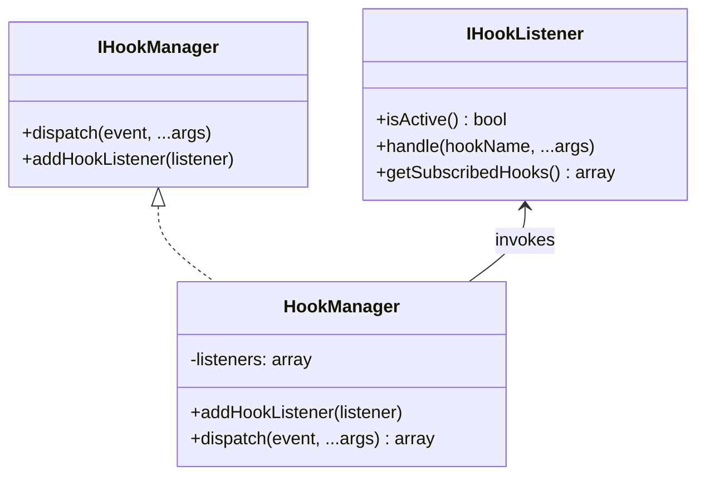

### 2.3 `IHookListener`

A hook listener is any class implementing `IHookListener`.

```php
<?php declare(strict_types=1);

namespace Base3\Hook;

interface IHookListener {

	public function isActive(): bool;

	public function handle(string $hookName, ...$args);

	public static function getSubscribedHooks(): array;

}
```

Each listener must define three things:

#### `isActive()`

Controls whether the listener should currently run.

#### `handle(string $hookName, ...$args)`

Contains the actual reaction to the hook.

#### `getSubscribedHooks()`

Returns an associative array of hook names and priorities.

Example:

```php
return [
	'bootstrap.init' => 10,
	'bootstrap.start' => 0,
	'bootstrap.finish' => -10,
];
```

---

## 3. How hooks are wired during bootstrap

The bootstrap process creates the container, registers the hook manager, discovers listeners through the class map, and then dispatches the first framework hooks.

The relevant part of `Bootstrap::run()` is:

```php
<?php declare(strict_types=1);

namespace Base3\Core;

use Base3\Api\IBootstrap;
use Base3\Api\IClassMap;
use Base3\Api\IContainer;
use Base3\Api\IPlugin;
use Base3\Api\IRequest;
use Base3\Api\ISystemService;
use Base3\Accesscontrol\Api\IAccesscontrol;
use Base3\Accesscontrol\No\NoAccesscontrol;
use Base3\Configuration\Api\IConfiguration;
use Base3\Configuration\ConfigFile\ConfigFile;
use Base3\Core\PluginClassMap;
use Base3\Core\Request;
use Base3\Core\ServiceLocator;
use Base3\Core\SystemService;
use Base3\Hook\HookManager;
use Base3\Hook\IHookListener;
use Base3\Hook\IHookManager;
use Base3\ServiceSelector\Api\IServiceSelector;
use Base3\ServiceSelector\Standard\StandardServiceSelector;

class Bootstrap implements IBootstrap {

	public function run(): void {

		$container = new ServiceLocator();
		ServiceLocator::useInstance($container);
		$container
			->set('servicelocator', $container, IContainer::SHARED)
			->set(ISystemService::class, fn() => new SystemService(), IContainer::SHARED)
			->set(IRequest::class, fn() => Request::fromGlobals(), IContainer::SHARED)
			->set(IContainer::class, 'servicelocator', IContainer::ALIAS)
			->set(IHookManager::class, fn() => new HookManager(), IContainer::SHARED)
			->set('configuration', fn() => new ConfigFile(), IContainer::SHARED)
			->set(IConfiguration::class, 'configuration', IContainer::ALIAS)
			->set('classmap', fn($c) => new PluginClassMap($c->get(IContainer::class)), IContainer::SHARED)
			->set(IClassMap::class, 'classmap', IContainer::ALIAS)
			->set('accesscontrol', fn() => new NoAccesscontrol(), IContainer::SHARED)
			->set(IAccesscontrol::class, 'accesscontrol', IContainer::ALIAS)
			->set(IServiceSelector::class, fn($c) => new StandardServiceSelector($c), IContainer::SHARED)
			->set('middlewares', []);

		$hookManager = $container->get(IHookManager::class);
		$listeners = $container->get(IClassMap::class)->getInstancesByInterface(IHookListener::class);
		foreach ($listeners as $listener) {
			$hookManager->addHookListener($listener);
		}
		$hookManager->dispatch('bootstrap.init');

		$plugins = $container->get(IClassMap::class)->getInstancesByInterface(IPlugin::class);
		foreach ($plugins as $plugin) {
			$plugin->init();
		}
		$hookManager->dispatch('bootstrap.start');

		echo $container->get(IServiceSelector::class)->go();
		$hookManager->dispatch('bootstrap.finish');
	}
}
```

### Key observation

Hook listeners are discovered **before** plugin `init()` is executed.

That means a listener class inside a plugin can participate in early lifecycle hooks as long as:

* the class is discoverable by the class map
* it implements `IHookListener`
* it is instantiable by the container/class map system

---

## 4. Bootstrap lifecycle hooks

The current bootstrap code dispatches three framework lifecycle hooks:

* `bootstrap.init`
* `bootstrap.start`
* `bootstrap.finish`

These hooks define the earliest framework-level extension points that plugin developers can rely on.

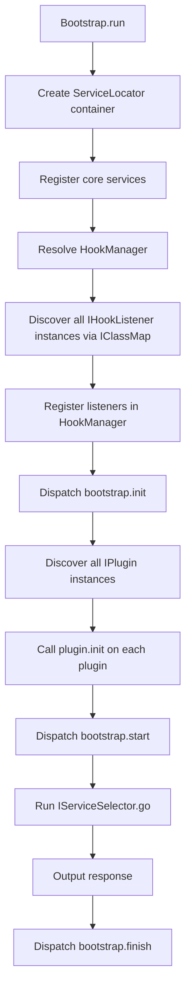

### Suggested interpretation

#### `bootstrap.init`

Use this for very early initialization that should happen as soon as listeners are registered.

Typical use cases:

* early environment checks
* very early registrations
* diagnostic logging
* setup steps that do not depend on plugin `init()` having already run

#### `bootstrap.start`

Use this for logic that should run **after plugin initialization** but **before request execution/output generation**.

Typical use cases:

* plugin coordination after all plugins finished `init()`
* service preparation
* additional registrations that require initialized plugins

#### `bootstrap.finish`

Use this for logic that should happen after the main request handling is complete.

Typical use cases:

* final logging
* cleanup
* profiling output
* post-response side effects

---

## 5. Listener discovery and registration

Listeners are not registered manually in bootstrap code one by one.
They are discovered generically through the class map:

```php
$listeners = $container->get(IClassMap::class)->getInstancesByInterface(IHookListener::class);
foreach ($listeners as $listener) {
	$hookManager->addHookListener($listener);
}
```

This means that in normal usage you only need to:

1. create a class implementing `IHookListener`
2. place it where the plugin/class map can discover it
3. make sure it can be instantiated

After that, the bootstrap process takes care of the rest.

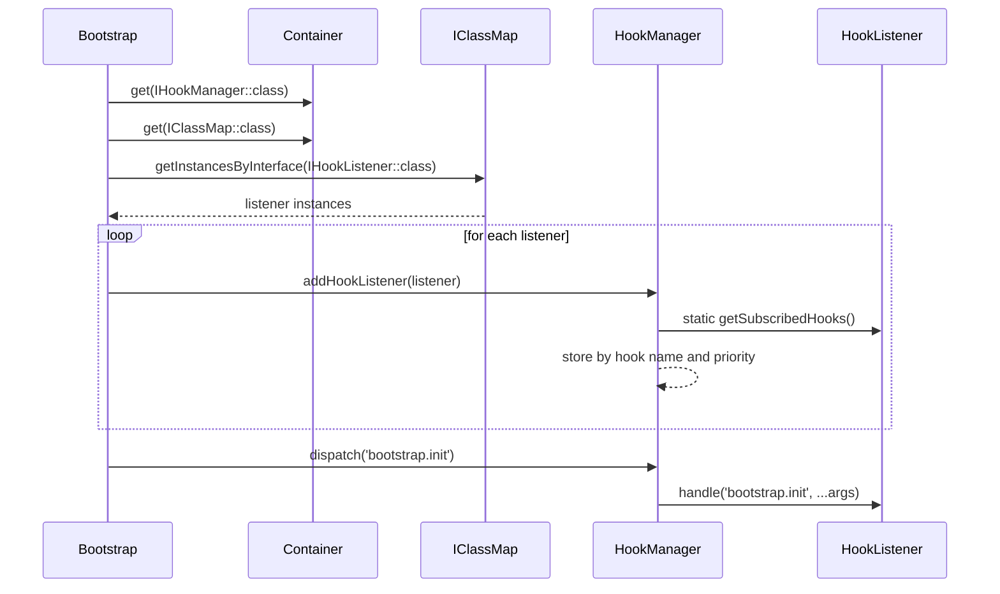

---

## 6. Priorities and execution order

Each listener subscribes to a hook with an integer priority.

Example:

```php
public static function getSubscribedHooks(): array {
	return [
		'bootstrap.init' => 100,
		'bootstrap.start' => 10,
		'bootstrap.finish' => -10,
	];
}
```

Inside `HookManager::dispatch()`, listeners are sorted with `krsort()`:

```php
krsort($this->listeners[$eventName]);
```

That means:

* **higher priority values run first**
* lower values run later

So the order is:

* `100` before `10`
* `10` before `0`
* `0` before `-10`

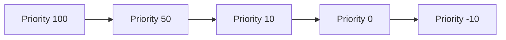

### Practical convention

A useful convention for teams is:

* `100+` very early / framework-critical listeners
* `10` early listeners
* `0` default listeners
* negative values for cleanup or post-processing

The framework itself does not enforce such a convention, but using one makes collaboration easier.

---

## 7. Active vs inactive listeners

Before calling `handle()`, the hook manager checks:

```php
if ($listener->isActive()) {
	$results[] = $listener->handle($eventName, ...$args);
}
```

So a listener can be registered but still decide not to run.

This is useful for:

* feature flags
* plugin configuration switches
* environment checks
* temporary disabling without removing the class

Example:

```php
public function isActive(): bool {
	return true;
}
```

or:

```php
public function isActive(): bool {
	return (bool) getenv('BASE3_ENABLE_BOOTSTRAP_LOGGING');
}
```

---

## 8. A minimal listener example

This is the small example adapted into a complete explanation:

```php
<?php declare(strict_types=1);

namespace Base3\Hook;

class BootstrapLoggingHookListener implements IHookListener {

	public function isActive(): bool {
		return false;
	}

	public static function getSubscribedHooks(): array {
		return [
			'bootstrap.init' => 10,
			'bootstrap.start' => 10,
			'bootstrap.finish' => 10,
		];
	}

	public function handle(string $hookName, ...$args) {
		error_log('[BootstrapLoggingListener] Hook triggered: ' . $hookName . ' at ' . date('Y-m-d H:i:s'));
		return true;
	}
}
```

### What this listener does

* it subscribes to three bootstrap hooks
* it uses the same priority for all three
* it logs whenever one of those hooks fires
* it currently does **not** run because `isActive()` returns `false`

To make it active:

```php
public function isActive(): bool {
	return true;
}
```

---

## 9. A realistic plugin listener example

The following example shows a listener that is more likely to appear in a real plugin.
It logs bootstrap phases only when a config flag is enabled.

```php
<?php declare(strict_types=1);

namespace ExamplePlugin\Hook;

use Base3\Configuration\Api\IConfiguration;
use Base3\Hook\IHookListener;

class BootstrapDiagnosticsHookListener implements IHookListener {

	public function __construct(
		protected IConfiguration $configuration
	) {
	}

	public static function getSubscribedHooks(): array {
		return [
			'bootstrap.init' => 20,
			'bootstrap.start' => 20,
			'bootstrap.finish' => -20,
		];
	}

	public function isActive(): bool {
		return (bool) $this->configuration->get('debug', 'hook_logging', false);
	}

	public function handle(string $hookName, ...$args) {
		error_log('[ExamplePlugin] ' . $hookName);
		return [
			'hook' => $hookName,
			'timestamp' => time(),
		];
	}
}
```

### Why this is useful

* the listener is controlled by configuration
* priorities are chosen deliberately
* `bootstrap.finish` uses a lower priority so it can run later than earlier cleanup listeners
* the return value becomes part of the dispatch result array

---

## 10. What `dispatch()` actually returns

`HookManager::dispatch()` collects the return value of every active listener and returns all results as an array.

Example:

```php
$results = $hookManager->dispatch('bootstrap.start');
```

Possible result:

```php
[
	true,
	['hook' => 'bootstrap.start', 'timestamp' => 1712345678],
	null,
]
```

This is useful if the dispatcher wants to inspect listener responses.

### Important note

The current system does **not** interpret the return values automatically.
There is no built-in stop propagation behavior, no veto logic, and no merging logic.

So if you want semantic behavior such as:

* first non-null result wins
* any `false` means abort
* collect all modifications

then the calling code that dispatches the hook must define and implement that convention explicitly.

---

## 11. Dispatching hooks yourself

Hooks are not limited to bootstrap.
Any part of the framework or any plugin can define and dispatch its own hook points.

The only thing needed is access to `IHookManager`, which is available from the container.

### Example: dispatching a custom hook inside a plugin service

```php
<?php declare(strict_types=1);

namespace ExamplePlugin\Service;

use Base3\Hook\IHookManager;

class ReportBuilder {

	public function __construct(
		protected IHookManager $hookManager
	) {
	}

	public function build(array $config): array {
		$report = [
			'title' => $config['title'] ?? 'Untitled report',
			'columns' => $config['columns'] ?? [],
		];

		$this->hookManager->dispatch('example.report.pre_build', $config, $report);

		$report['built_at'] = date('c');

		$this->hookManager->dispatch('example.report.post_build', $config, $report);

		return $report;
	}
}
```

This creates two hook points:

* `example.report.pre_build`
* `example.report.post_build`

Other plugins can now subscribe to them.

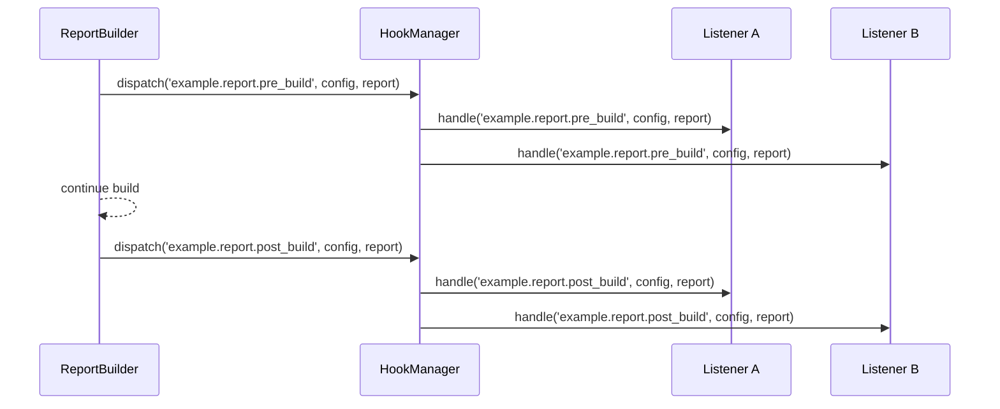

---

## 12. Subscribing to custom hook points from another plugin

Once a plugin exposes hook points, another plugin can subscribe to them like any other hook.

```php
<?php declare(strict_types=1);

namespace AnalyticsPlugin\Hook;

use Base3\Hook\IHookListener;

class ReportHookListener implements IHookListener {

	public static function getSubscribedHooks(): array {
		return [
			'example.report.pre_build' => 50,
			'example.report.post_build' => 10,
		];
	}

	public function isActive(): bool {
		return true;
	}

	public function handle(string $hookName, ...$args) {
		[$config, $report] = $args;

		if ($hookName === 'example.report.pre_build') {
			error_log('Preparing report build for: ' . ($config['title'] ?? 'untitled'));
		}

		if ($hookName === 'example.report.post_build') {
			error_log('Finished report build with ' . count($report['columns'] ?? []) . ' columns');
		}

		return null;
	}
}
```

This is the key architectural value of hooks:

* one plugin exposes extension points
* another plugin participates without direct hard-coded coupling

---

## 13. Naming hook points

The framework does not enforce a naming scheme, but consistent names matter a lot.

A good hook name should:

* be stable
* be descriptive
* be collision-resistant
* show where in the lifecycle it is triggered

### Recommended naming style

Use dot-separated names with a clear namespace-like prefix.

Examples:

* `bootstrap.init`
* `bootstrap.start`
* `bootstrap.finish`
* `example.report.pre_build`
* `example.report.post_build`
* `example.user.created`
* `example.cache.invalidate`

### Good practice

For plugin-defined hooks, prefix them with the plugin or domain name:

* `shop.order.before_save`
* `shop.order.after_save`
* `memora.index.before_write`
* `memora.index.after_write`

This reduces collisions and makes the origin obvious.

---

## 14. Designing useful custom hook APIs

When you expose a hook point, treat it as part of your plugin's public extension API.

Think about:

* **when** the hook is fired
* **which arguments** are passed
* **whether listeners may modify data**
* **what callers should expect from listener return values**
* **whether the hook is best-effort or business-critical**

### Example design questions

For a hook like `shop.order.before_save`:

* should listeners receive the order entity only?
* should they also receive the raw payload?
* may they mutate the order object?
* should a `false` return cancel saving?
* should exceptions from listeners abort the process?

The current BASE3 hook manager is intentionally simple.
So these semantics are defined by the code that dispatches the hook, not by the manager itself.

---

## 15. String hooks vs object hooks

`dispatch()` accepts either a string or an object:

```php
public function dispatch(object|string $event, ...$args);
```

Inside `HookManager`, the event name is derived like this:

```php
$eventName = is_string($event) ? $event : get_class($event);
```

So dispatching an object is effectively equivalent to dispatching its class name.

Example:

```php
$hookManager->dispatch('example.report.pre_build', $config);
```

and:

```php
$hookManager->dispatch(new \ExamplePlugin\Event\ReportPreBuildEvent(), $config);
```

In the second case, listeners would subscribe to:

```php
ExamplePlugin\Event\ReportPreBuildEvent::class
```

### Important limitation of the current implementation

The listener does **not** receive the event object itself.
It only receives the resolved event name string plus `...$args`.

That means this current implementation uses object dispatch mainly for naming by class name, not for rich event objects.

If you want listeners to inspect the original event object, you must pass it manually as an argument:

```php
$event = new \ExamplePlugin\Event\ReportPreBuildEvent();
$hookManager->dispatch($event, $event, $config);
```

Then the listener can access it from `...$args`.

---

## 16. Execution model and data flow

The hook manager does not mutate arguments automatically and does not implement by-reference conventions itself.
It simply forwards whatever arguments the caller provides.

That means there are two main patterns for hook-based collaboration:

### Pattern A: side effects only

Listeners log, write metrics, invalidate cache, notify services, and so on.

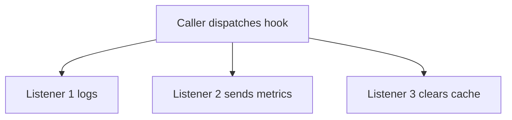

### Pattern B: cooperative processing via shared objects or dispatcher conventions

Listeners receive objects or arrays and the caller defines how modifications or return values should be interpreted.

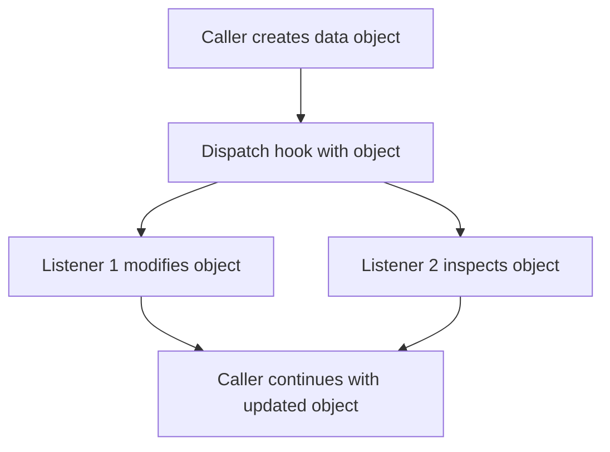

### Practical recommendation

If you want listeners to influence a workflow, prefer one of these approaches:

* pass a mutable object
* explicitly read the dispatch result array
* document the intended contract clearly

---

## 17. End-to-end example: exposing a hook API in your plugin

Below is a small but complete conceptual example.

### 17.1 Plugin service exposing hook points

```php
<?php declare(strict_types=1);

namespace ShopPlugin\Service;

use Base3\Hook\IHookManager;
use ShopPlugin\Model\Order;

class OrderService {

	public function __construct(
		protected IHookManager $hookManager
	) {
	}

	public function saveOrder(Order $order): void {
		$this->hookManager->dispatch('shop.order.before_save', $order);

		// actual persistence would happen here

		$this->hookManager->dispatch('shop.order.after_save', $order);
	}
}
```

### 17.2 Another plugin listening to the hook

```php
<?php declare(strict_types=1);

namespace AuditPlugin\Hook;

use Base3\Hook\IHookListener;
use ShopPlugin\Model\Order;

class OrderAuditHookListener implements IHookListener {

	public static function getSubscribedHooks(): array {
		return [
			'shop.order.before_save' => 30,
			'shop.order.after_save' => 30,
		];
	}

	public function isActive(): bool {
		return true;
	}

	public function handle(string $hookName, ...$args) {
		/** @var Order $order */
		$order = $args[0];

		if ($hookName === 'shop.order.before_save') {
			error_log('About to save order #' . $order->getId());
		}

		if ($hookName === 'shop.order.after_save') {
			error_log('Saved order #' . $order->getId());
		}

		return null;
	}
}
```

### 17.3 End-to-end flow

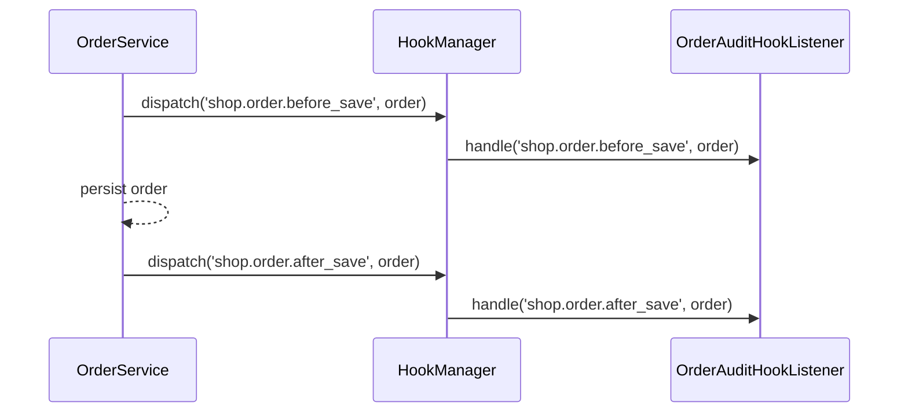

This is the typical pattern plugin authors should aim for.

---

## 18. How hook listeners fit into plugin architecture

A plugin can participate in the hook system in two ways:

1. **consume hooks** by implementing `IHookListener`
2. **provide hooks** by calling `dispatch()` in its own services/components

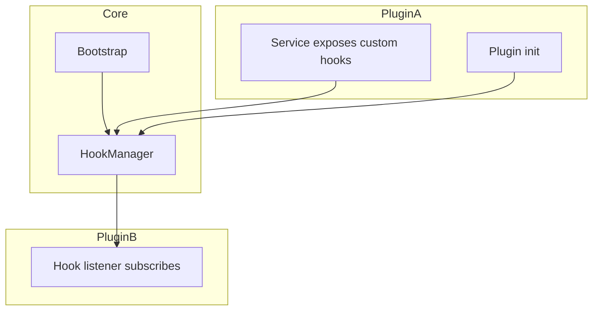

This means plugins are both:

* extension consumers
* extension providers

That is one of the reasons the hook system is so useful in framework-based development.

---

## 19. Error handling considerations

The current `HookManager` implementation does not wrap listener execution in `try/catch`.

So if a listener throws an exception, dispatching will stop unless the caller handles that exception somewhere above.

This is important when designing production hooks.

### Recommendations

If a hook is non-critical:

* catch exceptions in the listener itself
* log failures instead of breaking the request

Example:

```php
public function handle(string $hookName, ...$args) {
	try {
		error_log('Handling ' . $hookName);
		return true;
	} catch (\Throwable $e) {
		error_log('Hook failed: ' . $e->getMessage());
		return false;
	}
}
```

If a hook is business-critical, document clearly that failures are intended to propagate.

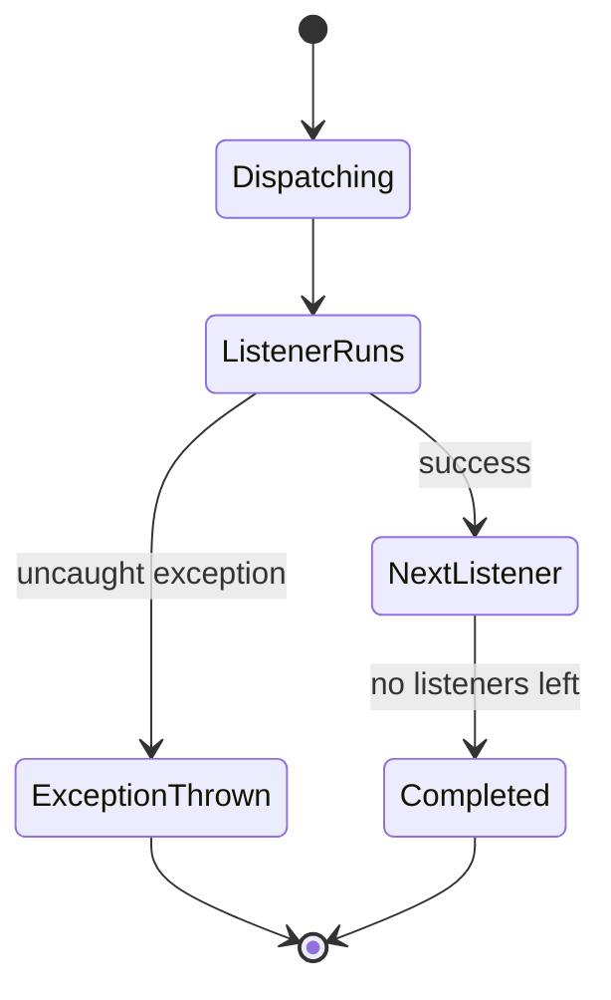

---

## 20. Best practices for plugin developers

### Do

* use clear hook names
* use stable naming conventions
* keep listener logic focused
* use `isActive()` for runtime control
* choose priorities deliberately
* document custom hooks you expose
* treat custom hooks as part of your public plugin API

### Avoid

* relying on undocumented hook arguments
* using hooks for hidden control flow nobody understands
* overloading one hook with too many responsibilities
* assuming listener execution order without explicit priorities
* returning meaningful values unless the dispatcher documents how they are interpreted

---

## 21. Recommended conventions for custom hooks

For a plugin exposing hooks, the following conventions work well:

### Use lifecycle pairs when appropriate

Examples:

* `feature.before_x`
* `feature.after_x`
* `feature.pre_build`
* `feature.post_build`

### Keep naming domain-specific

Examples:

* `shop.cart.before_calculate`
* `shop.cart.after_calculate`
* `search.index.before_write`
* `search.index.after_write`

### Document arguments explicitly

Example documentation snippet:

```md
Hook: shop.order.before_save
Arguments:
1. ShopPlugin\Model\Order $order
Meaning:
Triggered immediately before persistence.
Listeners may mutate the order object.
Return values are ignored.
```

That level of clarity makes custom hook APIs much easier to adopt.

---

## 22. A small reference implementation pattern

When creating a new custom hook point, the following pattern is usually enough:

```php
<?php declare(strict_types=1);

namespace ExamplePlugin\Service;

use Base3\Hook\IHookManager;

class ExampleProcessor {

	public function __construct(
		protected IHookManager $hookManager
	) {
	}

	public function process(array $payload): array {
		$this->hookManager->dispatch('example.processor.before_process', $payload);

		$result = [
			'processed' => true,
			'payload' => $payload,
		];

		$this->hookManager->dispatch('example.processor.after_process', $payload, $result);

		return $result;
	}
}
```

And a listener:

```php
<?php declare(strict_types=1);

namespace ExampleExtension\Hook;

use Base3\Hook\IHookListener;

class ExampleProcessorHookListener implements IHookListener {

	public static function getSubscribedHooks(): array {
		return [
			'example.processor.before_process' => 0,
			'example.processor.after_process' => 0,
		];
	}

	public function isActive(): bool {
		return true;
	}

	public function handle(string $hookName, ...$args) {
		if ($hookName === 'example.processor.before_process') {
			error_log('Before processing');
		}

		if ($hookName === 'example.processor.after_process') {
			error_log('After processing');
		}

		return null;
	}
}
```

---

## 23. Summary of the current system behavior

The current BASE3 hook system behaves as follows:

* the hook manager is registered in the container during bootstrap
* listeners are discovered via `IClassMap::getInstancesByInterface(IHookListener::class)`
* listeners declare hook subscriptions through `getSubscribedHooks()`
* listeners are grouped by hook name and priority
* higher priorities run first
* only active listeners run
* dispatch returns an array of listener return values
* custom hooks can be fired from anywhere that has access to `IHookManager`
* plugins can both subscribe to hooks and expose their own hook points
* object dispatch currently resolves to the object's class name, but the object itself is not forwarded automatically unless passed in `...$args`

---

## 24. Quick start checklist

If you want to use hooks in your plugin right away, this is the shortest path:

### To listen to existing hooks

1. create a class implementing `IHookListener`
2. return subscribed hook names from `getSubscribedHooks()`
3. return `true` from `isActive()` or make it config-driven
4. implement `handle()`
5. ensure the class is discoverable by the class map

### To expose your own hooks

1. inject `IHookManager` into your service
2. choose a clear hook name
3. dispatch the hook at the right moment
4. pass well-defined arguments
5. document the contract for other plugin developers

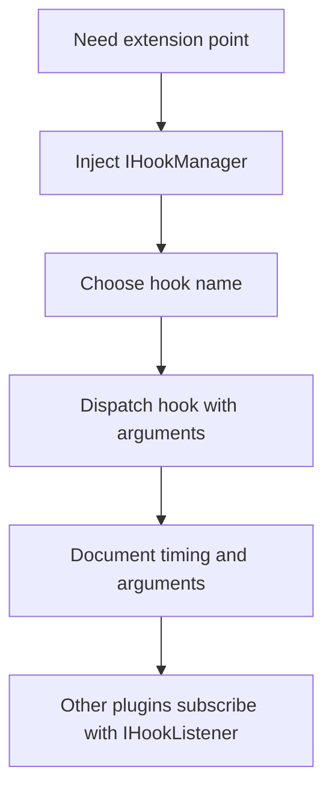

---

## 25. Final takeaway

The BASE3 hook system is intentionally small and easy to understand.
That simplicity is its main strength.

For plugin authors, the essential idea is:

* **listen** by implementing `IHookListener`
* **emit** by calling `IHookManager::dispatch()`
* **design custom hooks carefully** so other plugins can integrate cleanly

Once that pattern is understood, hooks become one of the central tools for building extensible BASE3 plugins.

