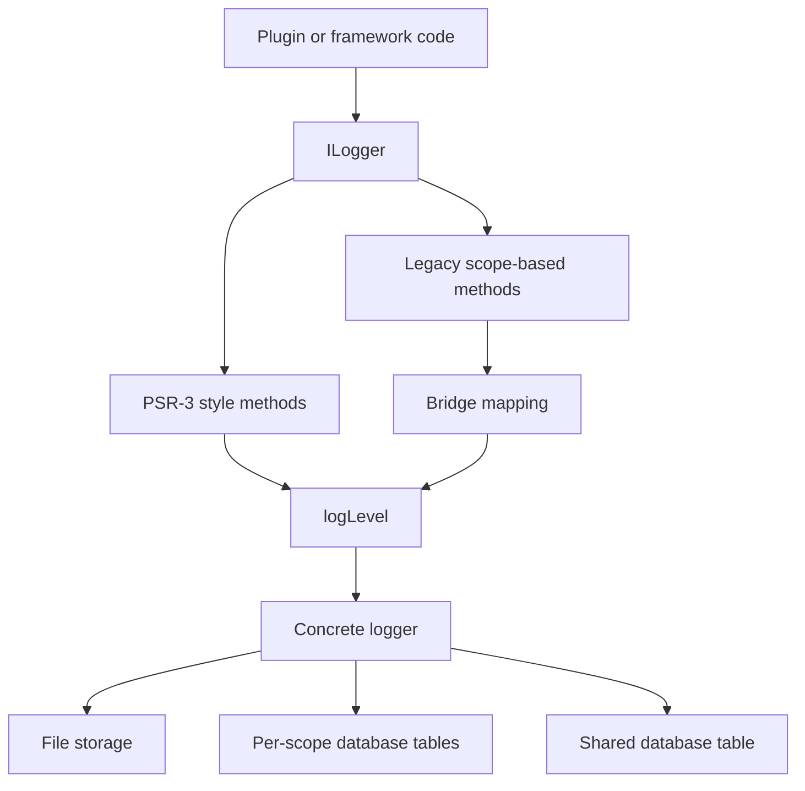
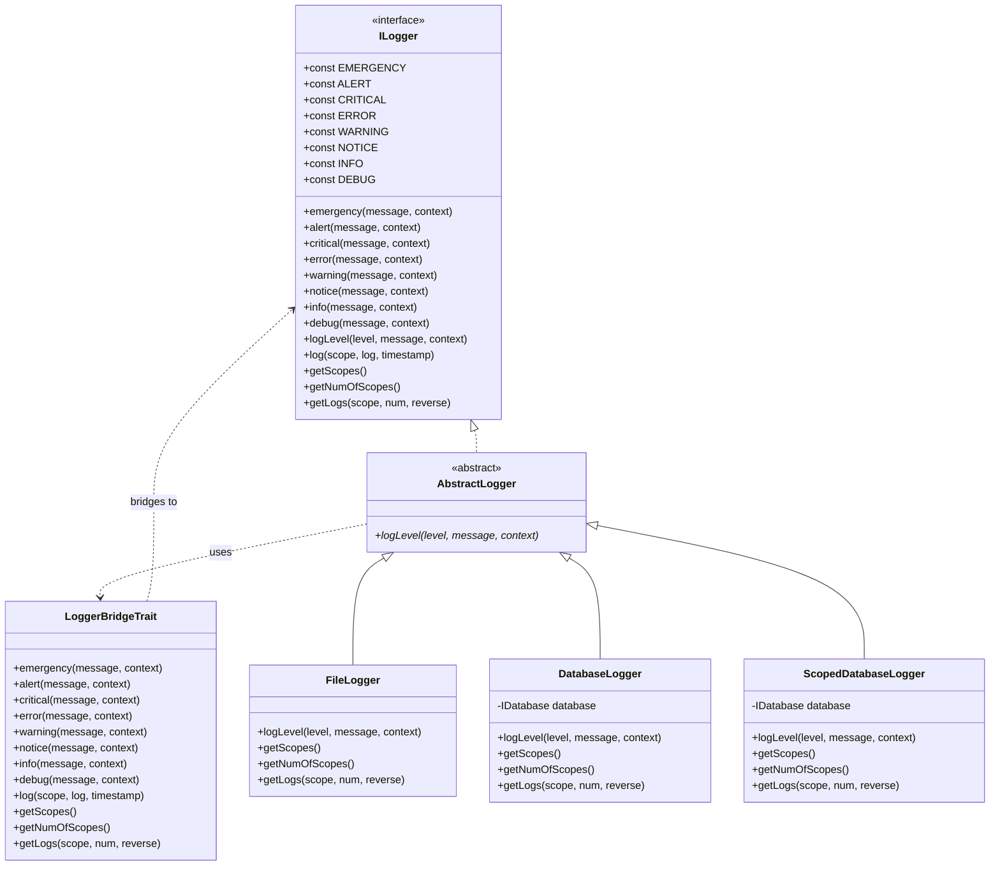
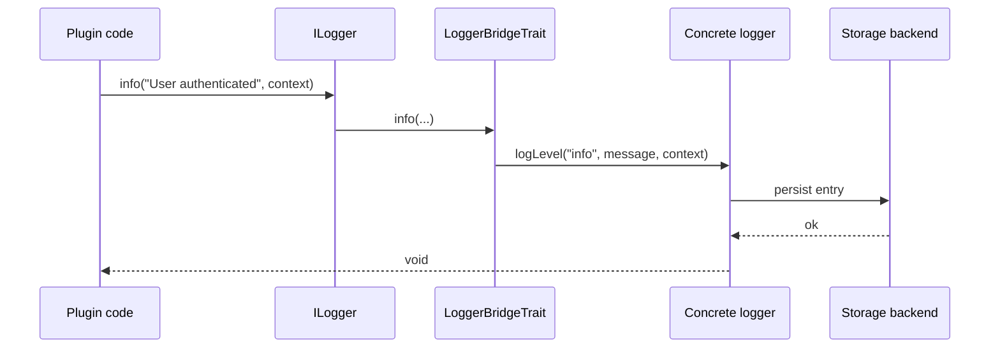
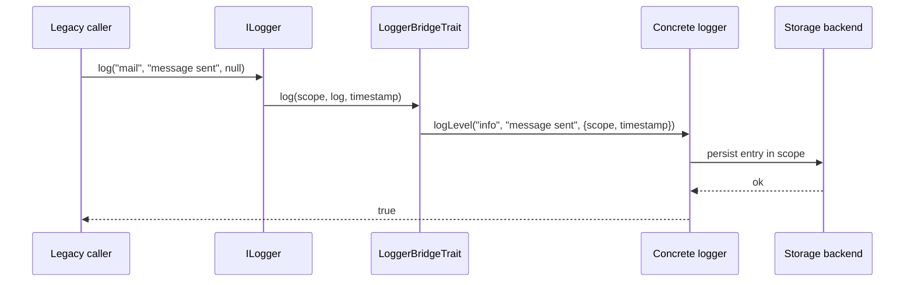
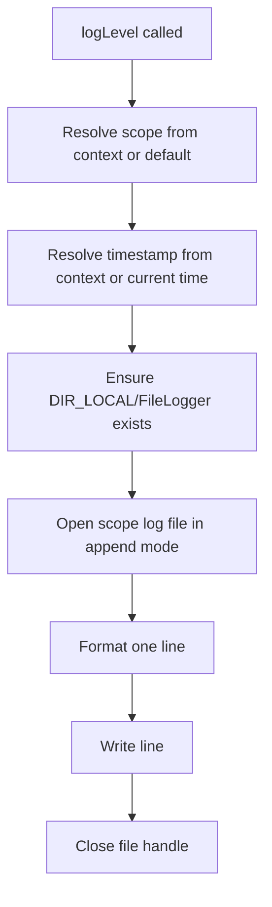
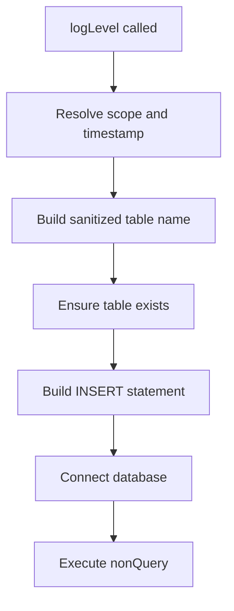
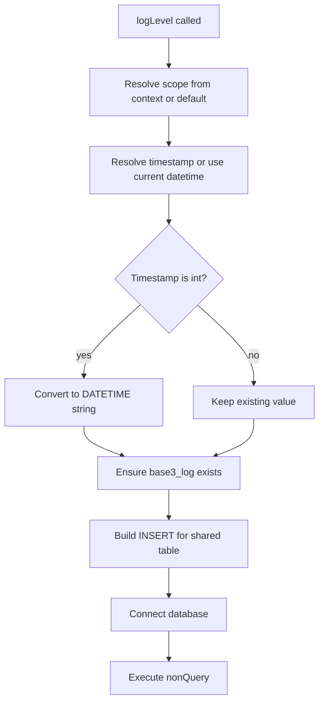
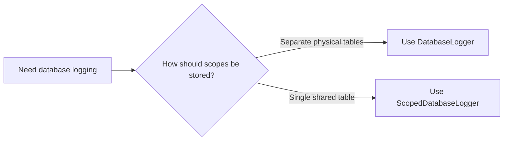
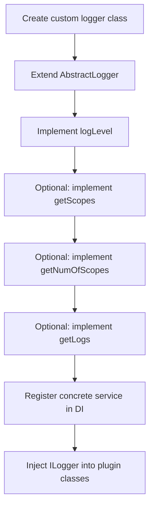
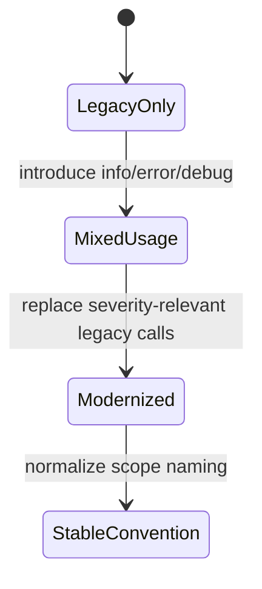

# BASE3 Framework Logging

## Purpose

This document explains how logging works in the BASE3 framework.

It is written for developers who build their own plugins and want to understand:

* which logging API they should depend on
* how PSR-3 style logging and legacy scope-based logging coexist
* how the bridge layer works internally
* how the built-in file and database loggers behave
* how to use logging cleanly in their own plugin classes
* how to create a custom logger implementation when needed

The goal is practical understanding. After reading this document, a plugin developer should be able to:

* inject and use `ILogger`
* choose an existing logger backend
* understand the meaning of scopes and levels in BASE3
* read back logs from supported logger implementations
* extend the logging system with their own backend

---

## 1. Overview

BASE3 logging exposes a single central interface:

* `Base3\Logger\Api\ILogger`

This interface combines two worlds:

1. **PSR-3 style log levels**

   * `emergency()`, `alert()`, `critical()`, `error()`, `warning()`, `notice()`, `info()`, `debug()`
   * plus the generic method `logLevel()`

2. **Legacy scope-based logging**

   * `log(string $scope, string $log, ?int $timestamp = null): bool`
   * `getScopes()`
   * `getNumOfScopes()`
   * `getLogs()`

This makes the logging system backward compatible while still allowing modern structured logging usage.

---

## 2. Core idea

At a high level, BASE3 logging works like this:

* plugin code depends on `ILogger`
* convenience methods such as `info()` or `error()` delegate to `logLevel()`
* the concrete logger decides where and how the log entry is stored
* legacy scope-based logging is translated into an `info`-level log call with extra context



The key design decision is that **`logLevel()` is the real backend entry point** for PSR-3 style logging.

---

## 3. The central interface: `ILogger`

### 3.1 What `ILogger` provides

`ILogger` defines:

* log level constants
* one method per PSR-3 level
* the generic `logLevel()` method
* legacy scope-based read/write methods

### 3.2 Supported log level constants

The interface declares the following constants:

* `ILogger::EMERGENCY`
* `ILogger::ALERT`
* `ILogger::CRITICAL`
* `ILogger::ERROR`
* `ILogger::WARNING`
* `ILogger::NOTICE`
* `ILogger::INFO`
* `ILogger::DEBUG`

These are plain strings and follow the common PSR-3 naming convention.

### 3.3 Why the generic method is called `logLevel()`

A classic PSR-3 logger would usually expose a method named `log($level, $message, $context)`.

BASE3 does **not** currently use that signature because the name `log()` is already occupied by the legacy method:

```php
public function log(string $scope, string $log, ?int $timestamp = null): bool;
```

To avoid ambiguity, the PSR-3 style generic entry point is currently named:

```php
public function logLevel(string $level, string|\Stringable $message, array $context = []): void;
```

That means:

* old code can continue calling `log($scope, $message)`
* new code should use `info()`, `error()`, `debug()`, and the other level methods
* custom logger implementations must implement `logLevel()`

---

## 4. Architecture of the logging layer

The logging subsystem shown here is built in layers.



### 4.1 `ILogger`

This is the API contract the rest of the framework and plugin code should depend on.

### 4.2 `LoggerBridgeTrait`

This trait implements the convenience methods and the compatibility bridge.

It does three things:

1. maps `emergency()`, `alert()`, `critical()`, etc. to `logLevel()`
2. maps the legacy `log($scope, $message, $timestamp)` call to an `info` log level with context
3. provides default fallback implementations for scope-reading methods

### 4.3 `AbstractLogger`

`AbstractLogger` is a thin base class that uses `LoggerBridgeTrait` and requires only one method to be implemented by subclasses:

```php
abstract public function logLevel(string $level, string|\Stringable $message, array $context = []): void;
```

This means custom loggers get the level helpers and legacy bridge behavior for free.

### 4.4 Concrete loggers

The provided code shows three concrete backends:

* `FileLogger`
* `DatabaseLogger`
* `ScopedDatabaseLogger`

Each implements `logLevel()` and overrides the scope-query methods with real storage access.

### 4.5 Two different database storage strategies

The database-backed variants intentionally use different persistence models:

* `DatabaseLogger` stores **one table per scope**
* `ScopedDatabaseLogger` stores **all log entries in one shared table** and keeps the logical scope in a column

That means BASE3 does not force one single database logging philosophy. It supports both:

* a scope-oriented table layout
* a centralized log table layout

---

## 5. How the bridge works

The bridge trait is an important part of the design.

### 5.1 PSR-3 style methods

All level-specific methods are simple wrappers:

```php
public function warning(string|\Stringable $message, array $context = []): void {
	$this->logLevel(ILogger::WARNING, $message, $context);
}
```

So whenever plugin code calls:

```php
$logger->warning('Cache file missing');
```

it becomes:

```php
$logger->logLevel('warning', 'Cache file missing', []);
```

### 5.2 Legacy method mapping

The legacy method is:

```php
public function log(string $scope, string $log, ?int $timestamp = null): bool;
```

Inside `LoggerBridgeTrait`, it is translated like this:

```php
$ctx = [
	'scope' => $scope,
	'timestamp' => $timestamp ?? time()
];
$this->logLevel(ILogger::INFO, $log, $ctx);
return true;
```

So a legacy call like:

```php
$logger->log('mail', 'message sent');
```

is transformed into:

* level: `info`
* message: `message sent`
* context:

  * `scope = mail`
  * `timestamp = current time`

### 5.3 Default fallbacks in the trait

The trait also returns empty defaults for:

* `getScopes()` → `[]`
* `getNumOfScopes()` → `0`
* `getLogs()` → `[]`

That means:

* a minimal custom logger only needs to implement `logLevel()`
* if it does not support log retrieval, the API still remains callable
* retrieval support is optional at the base layer, but expected for full logger implementations





---

## 6. `AbstractLogger`

`AbstractLogger` is intentionally small:

```php
abstract class AbstractLogger implements ILogger {
	use LoggerBridgeTrait;

	abstract public function logLevel(string $level, string|\Stringable $message, array $context = []): void;
}
```

This design gives plugin or framework developers a simple extension model.

To build a custom logger, they can:

1. extend `AbstractLogger`
2. implement `logLevel()`
3. optionally override `getScopes()`, `getNumOfScopes()`, and `getLogs()`

That avoids repeating the level wrapper methods in every backend.

---

## 7. File-based logging with `FileLogger`

`FileLogger` is the simplest visible concrete implementation.

### 7.1 Storage location

`FileLogger` uses:

* base directory: `DIR_LOCAL`
* log subdirectory: `DIR_LOCAL/FileLogger`

Each scope becomes its own log file:

* `default.log`
* `mail.log`
* `cron.log`
* `auth.log`

and so on.

### 7.2 Default scope behavior

If no scope is present in the context, `FileLogger` uses:

* scope: `default`

That is especially relevant for direct PSR-3 usage:

```php
$logger->info('Job started');
```

Because this call does not include a scope, it will go into:

* `DIR_LOCAL/FileLogger/default.log`

If you want a different scope while still using PSR-3 style logging, pass it through context:

```php
$logger->info('Job started', ['scope' => 'cron']);
```

### 7.3 Line format

A file log line looks like this:

```text
2025-09-20 18:30:00; [INFO]; message text
```

The logger writes:

* formatted timestamp
* uppercase level in brackets
* message text

### 7.4 Retrieval support

`FileLogger` supports:

* `getScopes()` by scanning `DIR_LOCAL/FileLogger`
* `getNumOfScopes()` by counting discovered `.log` files
* `getLogs($scope, $num, $reverse)` by reading and parsing the last lines of a scope file

### 7.5 Efficient tail reading

The implementation contains a private `tail()` helper that reads the last N lines efficiently rather than loading the entire file.

That makes the logger better suited for larger files when retrieving recent entries.

### 7.6 Runtime flow



### 7.7 Example usage

```php
<?php declare(strict_types=1);

use Base3\Logger\Api\ILogger;

class ExampleService {

	private ILogger $logger;

	public function __construct(ILogger $logger) {
		$this->logger = $logger;
	}

	public function run(): void {
		$this->logger->info('Service started');
		$this->logger->warning('Config value missing, using fallback', ['scope' => 'config']);
		$this->logger->error('Could not process payload', ['scope' => 'import']);
	}
}
```

### 7.8 What to keep in mind

`FileLogger` is useful when:

* you want very low setup overhead
* you want log files on disk
* you want a simple backend during development
* you want easy manual inspection with shell tools

It is less ideal when:

* you want central querying across many scopes
* you want SQL-based filtering or aggregation
* you want to integrate logs directly into database-driven admin tools

---

## 8. Database-backed logging with `DatabaseLogger`

`DatabaseLogger` stores each scope in its own table.

### 8.1 Dependency

It depends on:

* `Base3\Database\Api\IDatabase`

That dependency is injected through the constructor:

```php
public function __construct(IDatabase $database) {
	$this->database = $database;
}
```

### 8.2 Table naming strategy

For every scope, the logger creates or uses a table named:

```text
logger_<scope>
```

Before using the scope, unsafe characters are replaced with underscores:

```php
$safe = preg_replace('/[^a-zA-Z0-9_]/', '_', $scope);
return 'logger_' . $safe;
```

So examples become:

* `mail` → `logger_mail`
* `auth` → `logger_auth`
* `my-plugin/jobs` → `logger_my_plugin_jobs`

### 8.3 Table schema

The logger ensures that each table exists with this structure:

```sql
CREATE TABLE IF NOT EXISTS logger_scope (
	id INT AUTO_INCREMENT PRIMARY KEY,
	`timestamp` INT NOT NULL,
	level VARCHAR(20) NOT NULL,
	log TEXT NOT NULL
)
```

### 8.4 Insert behavior

When a log is written, the logger:

1. resolves scope and timestamp from context
2. computes the table name
3. creates the table if missing
4. inserts one row with timestamp, level, and message

### 8.5 Retrieval support

`DatabaseLogger` supports:

* `getScopes()` using `SHOW TABLES LIKE 'logger_%'`
* `getNumOfScopes()` by counting the discovered scope tables
* `getLogs($scope, $num, $reverse)` by selecting rows ordered by `id`

### 8.6 Runtime flow



### 8.7 Example usage

```php
<?php declare(strict_types=1);

use Base3\Logger\Api\ILogger;

class UserImportService {

	private ILogger $logger;

	public function __construct(ILogger $logger) {
		$this->logger = $logger;
	}

	public function import(array $rows): void {
		$this->logger->info('Import started', ['scope' => 'user_import']);

		foreach ($rows as $row) {
			try {
				// import logic
				$this->logger->debug('Imported one row', ['scope' => 'user_import']);
			} catch (\Throwable $e) {
				$this->logger->error(
					'Import failed: ' . $e->getMessage(),
					['scope' => 'user_import']
				);
			}
		}

		$this->logger->info('Import finished', ['scope' => 'user_import']);
	}
}
```

### 8.8 What to keep in mind

`DatabaseLogger` is useful when:

* you want logs available via SQL
* you want easier integration into admin UIs or dashboards
* you want scope discovery directly from the database
* you want centralized persistence in environments where local files are less convenient
* you explicitly want physical separation by scope at the table level

It is less ideal when:

* you want very lightweight logging without database interaction
* you want to avoid table creation per scope
* you want one single shared log table with advanced indexing

---

## 9. Shared-table database logging with `ScopedDatabaseLogger`

`ScopedDatabaseLogger` is a second database-backed variant.

Unlike `DatabaseLogger`, it does **not** create one table per scope. Instead, it logs everything into one shared table called `base3_log` and stores the logical scope in a dedicated column.

This makes it the most centralized built-in backend in the visible code.

### 9.1 Dependency

Like `DatabaseLogger`, it depends on:

* `Base3\Database\Api\IDatabase`

The constructor is equally simple:

```php
public function __construct(IDatabase $database) {
	$this->database = $database;
}
```

### 9.2 Storage model

All entries go into one table:

```text
base3_log
```

The logical separation happens through the `scope` column, not through separate files or tables.

This is a significant design difference compared to the other backends:

* `FileLogger` → one file per scope
* `DatabaseLogger` → one table per scope
* `ScopedDatabaseLogger` → one shared table for all scopes

### 9.3 Table schema

The logger ensures that the shared table exists with this structure:

```sql
CREATE TABLE IF NOT EXISTS base3_log (
	id INT AUTO_INCREMENT PRIMARY KEY,
	`timestamp` DATETIME NOT NULL,
	scope VARCHAR(190) NOT NULL,
	level VARCHAR(20) NOT NULL,
	log TEXT NOT NULL,
	INDEX idx_scope (scope),
	INDEX idx_timestamp (`timestamp`)
)
```

A few details are worth noting:

* the timestamp is stored as `DATETIME`
* scope is indexed
* timestamp is indexed
* the level and message are stored directly in columns

### 9.4 Timestamp handling

`ScopedDatabaseLogger` accepts an explicit timestamp in the context.

If no timestamp is provided, it uses the current date and time.

It also normalizes accidental UNIX timestamps:

```php
$timestamp = $context['timestamp'] ?? date('Y-m-d H:i:s');

if (is_int($timestamp)) {
	$timestamp = date('Y-m-d H:i:s', $timestamp);
}
```

That means both of the following are effectively supported:

```php
$logger->info('Started', ['scope' => 'cron']);
$logger->info('Started', ['scope' => 'cron', 'timestamp' => time()]);
```

Internally, the second form is converted into a `DATETIME` string before insertion.

### 9.5 Insert behavior

When a log is written, the logger:

1. resolves the scope from context or defaults to `default`
2. resolves the timestamp from context or uses the current date/time
3. normalizes integer timestamps into `Y-m-d H:i:s`
4. ensures that `base3_log` exists
5. inserts one row with timestamp, scope, level, and message

### 9.6 Retrieval support

`ScopedDatabaseLogger` supports:

* `getScopes()` by querying distinct scopes from `base3_log`
* `getNumOfScopes()` by counting distinct scopes
* `getLogs($scope, $num, $reverse)` by filtering the shared table by `scope`

The scope discovery query is effectively:

```sql
SELECT DISTINCT scope FROM base3_log ORDER BY scope ASC
```

And log retrieval uses the shared table like this conceptually:

```sql
SELECT `timestamp`, scope, level, log
FROM base3_log
WHERE scope = 'mail'
ORDER BY id DESC
LIMIT 50
```

### 9.7 Runtime flow



### 9.8 Example usage

```php
<?php declare(strict_types=1);

use Base3\Logger\Api\ILogger;

class WebhookService {

	private ILogger $logger;

	public function __construct(ILogger $logger) {
		$this->logger = $logger;
	}

	public function handle(array $payload): void {
		$scope = 'webhook';

		$this->logger->info('Webhook received', ['scope' => $scope]);

		try {
			// validation and processing
			$this->logger->debug('Webhook payload accepted', ['scope' => $scope]);
		} catch (\Throwable $e) {
			$this->logger->error(
				'Webhook handling failed: ' . $e->getMessage(),
				['scope' => $scope]
			);
			throw $e;
		}
	}
}
```

### 9.9 Example with explicit timestamp

```php
$this->logger->info(
	'Imported historical entry',
	[
		'scope' => 'import',
		'timestamp' => 1700000000
	]
);
```

With `ScopedDatabaseLogger`, that timestamp is normalized and stored as a `DATETIME` value.

### 9.10 What to keep in mind

`ScopedDatabaseLogger` is useful when:

* you want logs available via SQL
* you want a single central log table
* you want to query across multiple scopes more easily
* you want one schema object instead of many per-scope tables
* you want indexes on scope and timestamp in one place

It is less ideal when:

* you strongly prefer hard physical separation per scope
* you want each subsystem stored independently as separate tables
* you rely on table-per-scope as an organizational concept

### 9.11 Design trade-off compared to `DatabaseLogger`

The trade-off between the two database variants is mostly about physical data layout.

`DatabaseLogger` favors:

* direct per-scope table separation
* simple scope-local reads
* a structure where scope is encoded in the table name

`ScopedDatabaseLogger` favors:

* one central table
* simpler schema management
* easier global queries and indexing
* logical separation by a normal column



---

## 10. Choosing between file and database logging

A practical comparison:

| Aspect                   | FileLogger                | DatabaseLogger                | ScopedDatabaseLogger          |
| ------------------------ | ------------------------- | ----------------------------- | ----------------------------- |
| Storage model            | one `.log` file per scope | one DB table per scope        | one shared DB table           |
| Scope representation     | filename                  | table name                    | `scope` column                |
| Runtime dependency       | filesystem                | `IDatabase`                   | `IDatabase`                   |
| Setup complexity         | low                       | medium                        | medium                        |
| Human inspection         | very easy in shell/editor | requires DB tooling           | requires DB tooling           |
| Querying and filtering   | manual text processing    | SQL-based per scope table     | SQL-based in one table        |
| Cross-scope analysis     | limited                   | possible but less direct      | easiest of the built-ins      |
| Good fit for development | yes                       | yes, if DB is already present | yes, if DB is already present |
| Good fit for dashboards  | limited                   | strong                        | very strong                   |

### Rule of thumb

Use:

* **`FileLogger`** when you want something simple and local
* **`DatabaseLogger`** when you want SQL-backed logging with physical separation per scope
* **`ScopedDatabaseLogger`** when you want SQL-backed logging with one central table

---

## 11. Practical usage in plugins

### 11.1 Depend on `ILogger`, not on a concrete backend

Plugin code should normally use constructor injection with `ILogger`.

```php
<?php declare(strict_types=1);

namespace MyVendor\MyPlugin\Service;

use Base3\Logger\Api\ILogger;

class SyncService {

	private ILogger $logger;

	public function __construct(ILogger $logger) {
		$this->logger = $logger;
	}

	public function sync(): void {
		$this->logger->info('Sync started', ['scope' => 'sync']);

		// ... work ...

		$this->logger->info('Sync finished', ['scope' => 'sync']);
	}
}
```

This keeps the plugin independent from whether the application uses file logging, per-scope database tables, or a shared database table.

### 11.2 Prefer PSR-3 style methods in new code

For new plugin code, prefer:

* `debug()`
* `info()`
* `notice()`
* `warning()`
* `error()`
* `critical()`
* `alert()`
* `emergency()`

This is clearer and makes log severity explicit.

Example:

```php
$this->logger->debug('Starting API request', ['scope' => 'api']);
$this->logger->warning('Remote API responded slowly', ['scope' => 'api']);
$this->logger->error('Remote API request failed', ['scope' => 'api']);
```

### 11.3 Use the legacy `log()` method only for compatibility

The legacy method is still available and valid, but it expresses only the scope, not the severity.

```php
$this->logger->log('mail', 'message queued');
```

Internally this becomes an `info` log entry.

That means new code should normally prefer:

```php
$this->logger->info('message queued', ['scope' => 'mail']);
```

This version is more explicit and better communicates intent.

### 11.4 Use scopes deliberately

Scopes are a practical way to separate different log streams.

Good examples:

* `auth`
* `mail`
* `cron`
* `sync`
* `import`
* `webhook`
* `myplugin`
* `myplugin_payment`

Avoid overly random or unstable scope names, because:

* `FileLogger` creates separate files per scope
* `DatabaseLogger` creates separate tables per scope
* `ScopedDatabaseLogger` stores the value in a central indexed scope column, so uncontrolled scope growth still hurts discoverability and consistency

So scope naming is part of your storage design.

---

## 12. Recommended logging patterns for plugin developers

### 12.1 One stable scope per subsystem

A good pattern is to choose one stable scope per functional subsystem.

```php
$this->logger->info('Webhook received', ['scope' => 'webhook']);
$this->logger->warning('Webhook signature invalid', ['scope' => 'webhook']);
$this->logger->error('Webhook processing failed', ['scope' => 'webhook']);
```

This keeps retrieval simple and predictable.

### 12.2 Use severity meaningfully

Do not log everything as `info`.

A practical interpretation:

* `debug` → deep technical details for diagnosis
* `info` → normal process milestones
* `notice` → relevant but expected events
* `warning` → something unexpected but recoverable
* `error` → operation failed or significant issue occurred
* `critical` and above → serious infrastructure or application failure

### 12.3 Log around boundaries

Log around places where failures or important events happen:

* external HTTP requests
* scheduled jobs
* import/export operations
* authentication
* file operations
* database migrations
* webhook handling

### 12.4 Keep messages readable

Prefer messages that explain what happened without requiring the source code to be open.

Less useful:

```php
$this->logger->error('failed');
```

Better:

```php
$this->logger->error('CSV import failed while parsing row 42', ['scope' => 'import']);
```

---

## 13. Reading logs back

The interface also supports log retrieval.

### 13.1 Available methods

```php
$scopes = $logger->getScopes();
$count = $logger->getNumOfScopes();
$logs = $logger->getLogs('mail', 50, true);
```

### 13.2 Return shape of `getLogs()`

The shown concrete loggers return arrays with a broadly compatible shape, for example:

```php
[
	[
		'timestamp' => '2025-09-20 18:30:00',
		'level' => 'INFO',
		'log' => 'message text'
	],
	// ...
]
```

For `ScopedDatabaseLogger`, the returned rows additionally include the scope itself:

```php
[
	[
		'timestamp' => '2025-09-20 18:30:00',
		'scope' => 'mail',
		'level' => 'info',
		'log' => 'message text'
	],
		// ...
]
```

Be aware of a few subtle differences:

* `FileLogger` reads text lines and extracts the bracketed level
* `DatabaseLogger` formats the UNIX timestamp during retrieval
* `ScopedDatabaseLogger` reads a stored `DATETIME` value directly and includes `scope` in the returned row

So the retrieval API is conceptually aligned, but backend-specific details are still visible.

### 13.3 Example admin usage

```php
<?php declare(strict_types=1);

use Base3\Logger\Api\ILogger;

class LogOverviewService {

	private ILogger $logger;

	public function __construct(ILogger $logger) {
		$this->logger = $logger;
	}

	public function getRecentImportLogs(): array {
		return $this->logger->getLogs('import', 20, true);
	}
}
```

### 13.4 Reading multiple scopes in a shared-table setup

When the active backend is `ScopedDatabaseLogger`, `getScopes()` is especially useful for building log browsers because all scopes live in one shared table and can be discovered centrally.

That makes patterns like this straightforward:

```php
$availableScopes = $logger->getScopes();
$selectedScope = 'webhook';
$rows = $logger->getLogs($selectedScope, 100, true);
```

---

## 14. Building a custom logger backend

Because `AbstractLogger` already contains the bridge logic, custom logger backends are straightforward.

### 14.1 Minimal custom logger

A minimal logger only needs `logLevel()`.

```php
<?php declare(strict_types=1);

namespace MyVendor\MyPlugin\Logger;

use Base3\Logger\AbstractLogger;

class EchoLogger extends AbstractLogger {

	public function logLevel(string $level, string|\Stringable $message, array $context = []): void {
		$scope = $context['scope'] ?? 'default';
		$timestamp = $context['timestamp'] ?? time();

		echo sprintf(
			"[%s] [%s] [%s] %s\n",
			date('Y-m-d H:i:s', $timestamp),
			strtoupper($scope),
			strtoupper($level),
			(string) $message
		);
	}
}
```

This already supports:

* `info()`
* `error()`
* `debug()`
* legacy `log($scope, ...)`

because those methods come from the trait.

### 14.2 Full custom logger with retrieval support

If your backend also supports reading logs, override the retrieval methods.

```php
<?php declare(strict_types=1);

namespace MyVendor\MyPlugin\Logger;

use Base3\Logger\AbstractLogger;

class MemoryLogger extends AbstractLogger {

	/** @var array<string, array<int, array<string, string>>> */
	private array $data = [];

	public function logLevel(string $level, string|\Stringable $message, array $context = []): void {
		$scope = $context['scope'] ?? 'default';
		$timestamp = $context['timestamp'] ?? time();

		$this->data[$scope][] = [
			'timestamp' => date('Y-m-d H:i:s', $timestamp),
			'level' => strtoupper($level),
			'log' => (string) $message
		];
	}

	public function getScopes(): array {
		return array_keys($this->data);
	}

	public function getNumOfScopes() {
		return count($this->data);
	}

	public function getLogs(string $scope, int $num = 50, bool $reverse = true): array {
		$logs = array_slice($this->data[$scope] ?? [], -$num);
		return $reverse ? array_reverse($logs) : $logs;
	}
}
```

### 14.3 Extension flow



---

## 15. Important behavioral details

### 15.1 Context is passed through, not interpolated

The provided code passes context arrays to `logLevel()`, but the shown implementations do **not** perform PSR-3 placeholder interpolation such as:

```php
$logger->info('User {id} logged in', ['id' => 42]);
```

In the visible code, the message is written as-is, unless the concrete logger chooses to interpret context specially.

So in the currently visible implementations:

* `scope` matters
* `timestamp` matters
* other context fields are not automatically rendered into the message

That is important for plugin developers: do not assume full PSR-3 interpolation behavior unless your concrete logger explicitly adds it.

### 15.2 Scope is a storage concern

In BASE3 logging, the scope is not only semantic metadata. It directly affects storage layout.

For the shown backends:

* file backend → one file per scope
* per-scope database backend → one table per scope
* shared-table database backend → one logical partition key in the `scope` column

That means a scope is more significant than a normal free-form tag.

### 15.3 Retrieval defaults come from the trait

If a logger backend does not override retrieval methods, then:

* `getScopes()` returns an empty array
* `getNumOfScopes()` returns zero
* `getLogs()` returns an empty array

This is acceptable for write-only backends, but plugin developers should be aware of it.

### 15.4 Legacy `log()` always maps to `info`

This is an intentional compatibility behavior.

So this call:

```php
$logger->log('auth', 'invalid password');
```

does **not** preserve a warning or error semantic level. It becomes `info`.

When severity matters, always use the explicit level methods.

### 15.5 Timestamp semantics differ slightly by backend

There is an important implementation-level difference:

* `FileLogger` writes formatted text lines
* `DatabaseLogger` stores timestamps as integers
* `ScopedDatabaseLogger` stores timestamps as `DATETIME`

For most plugin code this difference does not matter, because everything is accessed through `ILogger`.

But it can matter when:

* you inspect raw storage directly
* you build admin tooling that expects a specific timestamp format
* you migrate log data between backends

---

## 16. Migration guidance for older code

When modernizing older plugin code, a useful migration path is:

### Step 1

Keep existing legacy calls working:

```php
$this->logger->log('mail', 'Message sent');
```

### Step 2

Switch new code to explicit level methods:

```php
$this->logger->info('Message sent', ['scope' => 'mail']);
```

### Step 3

Gradually upgrade old code where severity matters:

```php
$this->logger->warning('Mail queue is growing', ['scope' => 'mail']);
$this->logger->error('Mail delivery failed', ['scope' => 'mail']);
```

### Step 4

Use scope names consistently so retrieval remains clean.



---

## 17. Example: a plugin service with sensible logging

The following example shows a realistic service that logs start, success, and failure paths.

```php
<?php declare(strict_types=1);

namespace MyVendor\MyPlugin\Service;

use Base3\Logger\Api\ILogger;

class ReportSyncService {

	private ILogger $logger;

	public function __construct(ILogger $logger) {
		$this->logger = $logger;
	}

	public function synchronize(): void {
		$scope = 'report_sync';

		$this->logger->info('Report synchronization started', ['scope' => $scope]);

		try {
			$this->logger->debug('Loading remote report metadata', ['scope' => $scope]);

			// remote fetch
			// transformation
			// save

			$this->logger->info('Report synchronization finished successfully', ['scope' => $scope]);
		} catch (\Throwable $e) {
			$this->logger->error(
				'Report synchronization failed: ' . $e->getMessage(),
				['scope' => $scope]
			);
			throw $e;
		}
	}
}
```

Why this is a good pattern:

* one stable scope for the subsystem
* explicit level choice
* readable messages
* detailed debug entry before risky work
* error log in the exception path

---

## 18. Example: reading logs for an admin page

```php
<?php declare(strict_types=1);

namespace MyVendor\MyPlugin\Service;

use Base3\Logger\Api\ILogger;

class AdminLogService {

	private ILogger $logger;

	public function __construct(ILogger $logger) {
		$this->logger = $logger;
	}

	/**
	 * @return array<int, array<string, mixed>>
	 */
	public function getLogOverview(string $scope): array {
		return $this->logger->getLogs($scope, 100, true);
	}

	/**
	 * @return array<int, string>
	 */
	public function getScopes(): array {
		return $this->logger->getScopes();
	}
}
```

This works especially well when the configured backend supports retrieval, such as `FileLogger`, `DatabaseLogger`, or `ScopedDatabaseLogger`.

---

## 19. Design strengths of the BASE3 logging approach

The shown design has several practical strengths.

### 19.1 Simple extension point

A new backend only needs to implement `logLevel()` to become usable.

### 19.2 Backward compatibility

Older scope-based logging can continue to work.

### 19.3 Clear DI target

Framework and plugin code can depend on a single interface: `ILogger`.

### 19.4 Optional retrieval support

Write-only or read/write backends are both possible.

### 19.5 Scope-aware organization

Logs are naturally grouped by subsystem.

### 19.6 Multiple storage strategies without API changes

The same `ILogger` contract works for:

* file-based logging
* per-scope database tables
* a shared database table

That gives integrators room to choose the operational model that best fits their deployment.

---

## 20. Limitations and trade-offs visible in the current design

Grounded in the shown implementation, developers should be aware of a few trade-offs.

### 20.1 Not full PSR-3 parity yet

The generic method is named `logLevel()` instead of `log()`, because `log()` is still reserved for the legacy scope-based API.

### 20.2 Context is backend-defined

The visible code only treats `scope` and `timestamp` specially.

Other context values are not automatically interpolated into the message.

### 20.3 Scope-per-storage-unit can become very granular

Because scope maps to:

* a file in `FileLogger`
* a table in `DatabaseLogger`
* a distinct indexed value in `ScopedDatabaseLogger`

careless scope naming could lead to operational clutter.

### 20.4 Database backend behavior differs by variant

There is no single database storage model.

Instead, BASE3 currently shows two database strategies:

* one table per scope
* one shared table with a scope column

That is flexible, but plugin and operations developers should know which concrete backend is active when they build tooling around it.

---

## 21. Recommendations for plugin authors

For new plugin development in BASE3, the following conventions are sensible.

### Recommended

* inject `ILogger`
* use explicit level methods
* pass a stable scope in context
* choose scope names by subsystem, not by individual event
* write readable and actionable messages
* use `debug` for detail and `error` for failures

### Avoid

* depending directly on `FileLogger`, `DatabaseLogger`, or `ScopedDatabaseLogger` in normal plugin code
* using random or highly dynamic scope names
* using only legacy `log()` in new code
* assuming automatic context interpolation without verifying the backend

---

## 22. Summary

BASE3 logging is built around one central interface, `ILogger`, which combines:

* modern PSR-3 style level-based logging
* older scope-based compatibility methods

The architecture is intentionally simple:

* `LoggerBridgeTrait` provides the wrappers and compatibility mapping
* `AbstractLogger` gives a minimal extension base
* concrete backends implement `logLevel()` and optionally retrieval methods

The visible built-in backends show three storage strategies:

* `FileLogger` stores one file per scope
* `DatabaseLogger` stores one table per scope
* `ScopedDatabaseLogger` stores all entries in one shared table and keeps scope in a column

For plugin developers, the practical approach is straightforward:

1. inject `ILogger`
2. use `info()`, `warning()`, `error()`, and the other level methods
3. pass a stable scope in context
4. only use legacy `log()` when maintaining older code
5. extend `AbstractLogger` when building a new backend

That makes the logging system easy to adopt, easy to extend, and predictable across framework and plugin code.

---

## 23. Quick reference

### Typical write calls

```php
$logger->debug('Starting task', ['scope' => 'cron']);
$logger->info('Task started', ['scope' => 'cron']);
$logger->warning('Fallback value used', ['scope' => 'config']);
$logger->error('Task failed', ['scope' => 'cron']);
```

### Legacy compatibility call

```php
$logger->log('cron', 'Task started');
```

### Read calls

```php
$scopes = $logger->getScopes();
$count = $logger->getNumOfScopes();
$logs = $logger->getLogs('cron', 50, true);
```

### Custom backend starting point

```php
class MyLogger extends AbstractLogger {

	public function logLevel(string $level, string|\Stringable $message, array $context = []): void {
		// custom storage logic
	}
}
```

### Backend selection shorthand

* `FileLogger` → local files, very simple setup
* `DatabaseLogger` → SQL backend, one table per scope
* `ScopedDatabaseLogger` → SQL backend, one shared table with scope column

