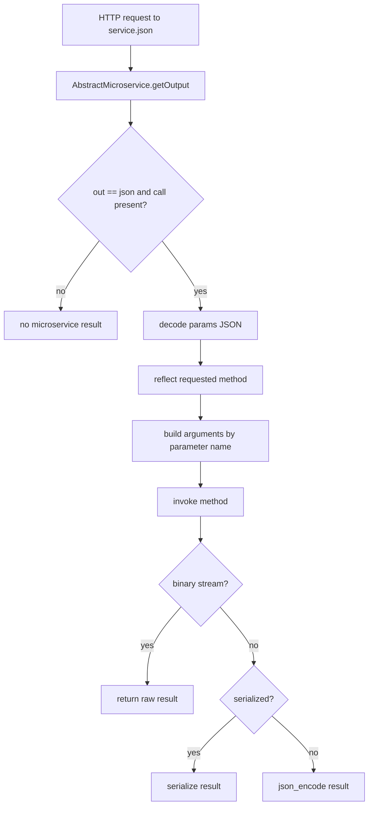

# BASE3 Microservices

## Purpose

This document explains the microservice subsystem currently present in BASE3.

It is written for developers who need to understand:

* what an `IMicroservice` endpoint is
* how `AbstractMicroservice` exposes method calls
* how microservice connectors turn interface methods into HTTP calls
* how service metadata is exchanged
* how internal HMAC authentication is constructed
* how user identity may be forwarded
* what the microservice flags mean
* how the helper and receiver classes work
* which parts are stable framework contracts and which parts are current implementation details

---

## 1. Main idea

BASE3 can expose selected service methods through normal routable output classes.

The current model has two sides:

```text
server side
  IMicroservice / AbstractMicroservice
  receives a routed .json request
  invokes one method
  serializes the result

client side
  AbstractMicroserviceConnector
  presents method-like calls locally
  sends an HTTP POST to the remote endpoint
  decodes the response
```

A helper layer can maintain a list of available service hosts and create connectors dynamically.

---

## 2. `IMicroservice`

The endpoint marker interface is:

```php
namespace Base3\Microservice\Api;

use Base3\Api\IOutput;

interface IMicroservice extends IOutput {}
```

An `IMicroservice` is therefore also an `IOutput` and is discoverable/routable through the normal BASE3 output mechanism.

The interface itself adds no additional methods.

---

## 3. `AbstractMicroservice`

`AbstractMicroservice` provides the built-in transport behavior.

It derives its technical name from the lowercased class name unless a subclass overrides `getName()`.

The endpoint only handles calls when:

```text
out = json
request contains call
```

The request may also contain:

```text
params
binarystream
serialized
```

---

## 4. Server-side invocation flow

The current flow is:



The transport uses reflection to obtain the target method parameters and maps request parameters by name.

---

## 5. Method addressing

A connector call conceptually becomes:

```text
POST /exampleservice.json

call=getData
params={"scope":"country","fields":["id","name_en"]}
```

The exact URL is derived from the service URL and technical service name.

The endpoint then calls the method named by `call`.

This is a highly dynamic transport. It should only expose classes that are deliberately intended to act as microservice endpoints.

---

## 6. Help output

`AbstractMicroservice::getHelp()` reflects the public methods on the class and generates example URLs.

Because `IHelp` is separate from `IOutput`, an endpoint that wants help exposure should explicitly implement or inherit that capability.

`AbstractMicroservice` currently provides `getHelp()` as a concrete method, even though `IMicroservice` itself does not require `IHelp`.

---

## 7. `IMicroserviceConnector`

The connector contract is intentionally small:

```php
interface IMicroserviceConnector {

	public function getMicroserviceUrl();
}
```

The current connector implementation provides dynamic remote method dispatch through `__call()`.

That dynamic behavior is an implementation feature of `AbstractMicroserviceConnector`, not a method declared by `IMicroserviceConnector`.

---

## 8. `AbstractMicroserviceConnector`

The abstract connector stores:

```text
url
service metadata
flags
access control service
microservice configuration
```

When an unknown method is called, `__call()`:

1. finds the method definition in the service metadata
2. maps positional local arguments to remote parameter names
3. JSON-encodes the parameter map
4. sends an HTTP POST
5. returns raw, unserialized, or JSON-decoded output depending on flags

---

## 9. Service metadata

The connector uses metadata shaped conceptually like:

```php
[
	'name' => 'exampleservice',
	'interfaces' => [ExampleInterface::class],
	'methods' => [
		[
			'name' => 'getData',
			'params' => ['scope', 'fields']
		]
	]
]
```

The helper classes build this metadata with reflection from an interface.

This allows the connector to know which remote method names and parameter names are allowed.

---

## 10. Microservice flags

`IMicroserviceFlags` defines three bit flags.

### `INTERNALONLY`

```text
1
```

Suppresses forwarding of the currently authenticated application user.

The internal transport authentication headers are still sent.

### `BINARYSTREAM`

```text
2
```

Treats the response as a raw binary stream.

The connector returns the raw HTTP response and the endpoint avoids JSON or PHP serialization.

### `SERIALIZED`

```text
4
```

Uses PHP `serialize()` and `unserialize()` for the result.

This is useful for PHP-specific values that are not represented adequately by JSON, but it tightly couples both sides to compatible PHP serialization semantics.

---

## 11. Internal HMAC request headers

The current connector authenticates internal transport requests with headers:

```text
user
time
token
hash
```

PHP receives them as:

```text
HTTP_USER
HTTP_TIME
HTTP_TOKEN
HTTP_HASH
```

The connector currently uses:

```text
user = internal
hash = sha1(masterpass + time + token)
```

The corresponding framework authentication strategy is:

```php
Base3\Accesscontrol\Authentication\InternalHmacAuth
```

That strategy validates:

* timestamp age
* token reuse
* internal username
* computed hash

See `accesscontrol-authentication.md`.

---

## 12. Forwarding application identity

Unless `INTERNALONLY` is set, the connector may add:

```text
auth: <current user id>
```

when the local `IAccesscontrol` has an authenticated user.

On the receiving side this becomes:

```text
HTTP_AUTH
```

`InternalHmacAuth` can return that value as the request user identity after transport authentication succeeds.

This means BASE3 distinguishes:

```text
transport identity
  internal HMAC-authenticated caller

represented application identity
  optional user forwarded in auth header
```

---

## 13. `MicroserviceConnector`

`Base3\Microservice\Microservice\MicroserviceConnector` is the normal internal connector implementation.

It extends `AbstractMicroserviceConnector` and implements `ICheck`.

Its dependency check verifies:

* microservice master password exists
* master password length is at least 32 characters
* the remote service can answer a `getName` call matching the expected service name

---

## 14. External connector

`MicroserviceExternConnector` uses the same base transport without depending on the internal service registry model.

`MicroserviceExternHelper` can create one directly from:

```text
URL + interface
```

It reflects the interface, constructs service metadata, and returns the connector.

This is useful when the caller already knows the remote endpoint URL.

---

## 15. `IMicroserviceHelper`

The current public interface is intentionally empty in executable terms. Its historical method declarations are commented out.

```php
interface IMicroserviceHelper {
	// current contract declares no callable methods
}
```

This is important for architecture.

The concrete helpers expose methods such as:

```text
connect
set
get
reset
getMicroserviceList
```

but those methods are not currently guaranteed by `IMicroserviceHelper`.

Reusable code must not treat them as a stable interface contract merely because the built-in implementations happen to provide them.

If these operations are intended as a supported framework API, the interface itself should be extended deliberately at the responsible architecture boundary.

---

## 16. `MicroserviceHelper`

The internal helper reads configuration and manages a local service list cache.

Relevant configuration values are read from:

```text
base/url
microservice/name
microservice/masterurl
microservice/masterpass
```

The service list file is:

```text
DIR_TMP/microservices.json
```

If no master URL is configured, the helper uses the local service list.

If a master URL exists, the helper contacts the master `microservicereceiver`, sends its services, and stores the combined result locally.

---

## 17. Service list model

The helper currently represents service locations conceptually as:

```php
[
	'service-a' => 'https://service-a.example/',
	'service-b' => 'https://service-b.example/'
]
```

The list is cached in `DIR_TMP/microservices.json`.

`reset()` removes that cache file so the next access can rebuild it.

---

## 18. `IMicroserviceReceiver`

The receiver contract is:

```php
interface IMicroserviceReceiver {

	public function ping();

	public function connect($services);
}
```

The built-in `MicroserviceReceiver` extends `AbstractMicroservice`.

It provides:

```text
ping() -> "pong"
connect($services) -> merges service registrations through the helper
```

The helper is resolved inside `connect()` rather than the constructor to avoid recursive construction.

---

## 19. `Microservice` control endpoint

The framework also contains an `IOutput` named:

```text
microservice
```

Its current supported JSON call is:

```text
connect
```

which asks the configured `microservicehelper` to rebuild/connect the service registry.

This is an infrastructure endpoint rather than a normal domain service.

---

## 20. Exposing an implementation remotely

A simple endpoint can extend `AbstractMicroservice` and implement an existing service interface:

```php
final class ExampleMicroservice extends AbstractMicroservice implements IExampleService {

	public function getValue(string $id) {
		// implementation
	}
}
```

The class is then discoverable as an `IOutput` through `IMicroservice` inheritance and can be routed under its technical `getName()`.

Only expose methods that are safe to invoke remotely in the deployment context.

---

## 21. Microservices and dependency injection

The current microservice subsystem contains legacy classes that use `ServiceLocator` directly.

For new endpoint implementations, normal runtime dependencies should still be constructor-injected where possible.

The remote transport layer does not justify pulling unrelated services from the global container inside domain methods.

---

## 22. Microservices and routing

Microservices rely on the ordinary output routing model.

A remote method endpoint is typically addressed as:

```text
<technical-name>.json
```

The route or service selector resolves the `IOutput`, and `AbstractMicroservice::getOutput()` interprets the `call` and `params` request fields.

See `routing.md`.

---

## 23. Security boundary

The current implementation provides its own HMAC-style internal request validation, but developers should understand its exact scope.

The framework contract does not promise a general-purpose API gateway, authorization layer, rate limiter, replay database, or transport encryption.

HTTPS, network restrictions, secret management, permission checks, and endpoint exposure policy remain deployment/application responsibilities where applicable.

Do not bypass the existing access-control boundary with a second ad-hoc authentication path inside a domain endpoint.

---

## 24. Current implementation limitations

The current subsystem contains several legacy characteristics:

* extensive reflection-based dispatch
* direct use of `$_REQUEST` in `AbstractMicroservice`
* `getOutput(): string` can currently return `null` on unsupported/non-call requests, which does not match the declared return type
* `ServiceLocator` use in infrastructure classes
* an effectively empty `IMicroserviceHelper` contract
* PHP serialization as an optional transport mode
* dynamic proxy behavior through `__call()`

These behaviors should be documented because they exist, but they should not be generalized into new architecture without a specific requirement.

---

## 25. Summary

```text
IMicroservice
  marker for routable microservice outputs

AbstractMicroservice
  reflective server-side method dispatch

IMicroserviceConnector
  minimal connector identity contract

AbstractMicroserviceConnector
  dynamic HTTP method proxy

IMicroserviceFlags
  internal-only, binary, serialized modes

IMicroserviceReceiver
  service registration receiver contract

MicroserviceHelper
  current internal service-list and connector helper

MicroserviceExternHelper
  direct URL-based connector helper
```

Use the subsystem as one transport mechanism, while keeping service contracts, authorization, and project composition at their existing architecture boundaries.
