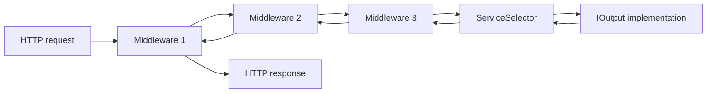
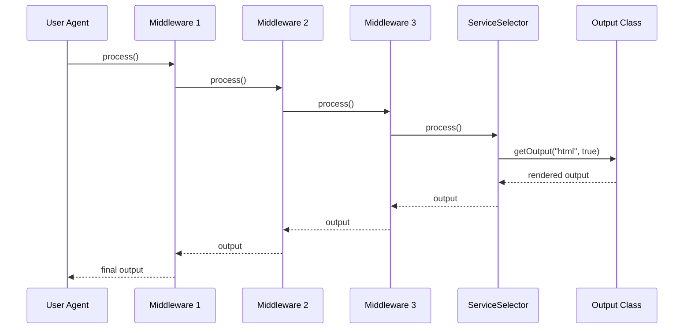
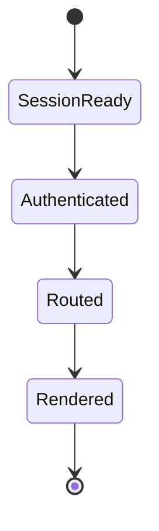
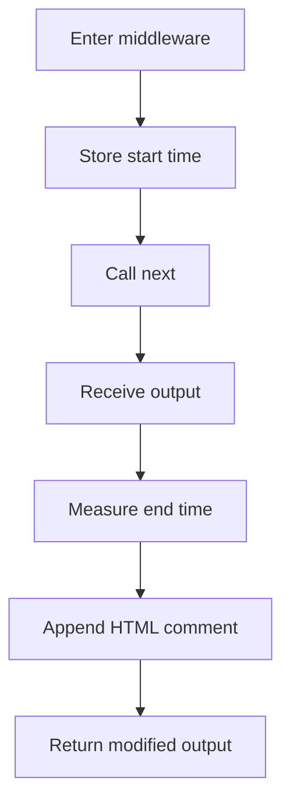
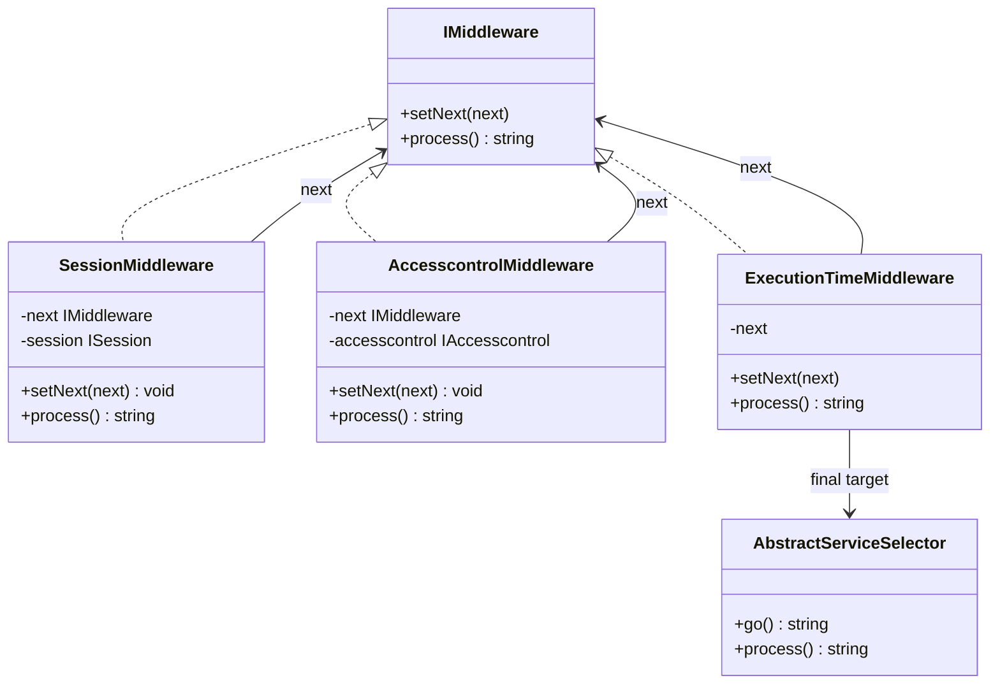
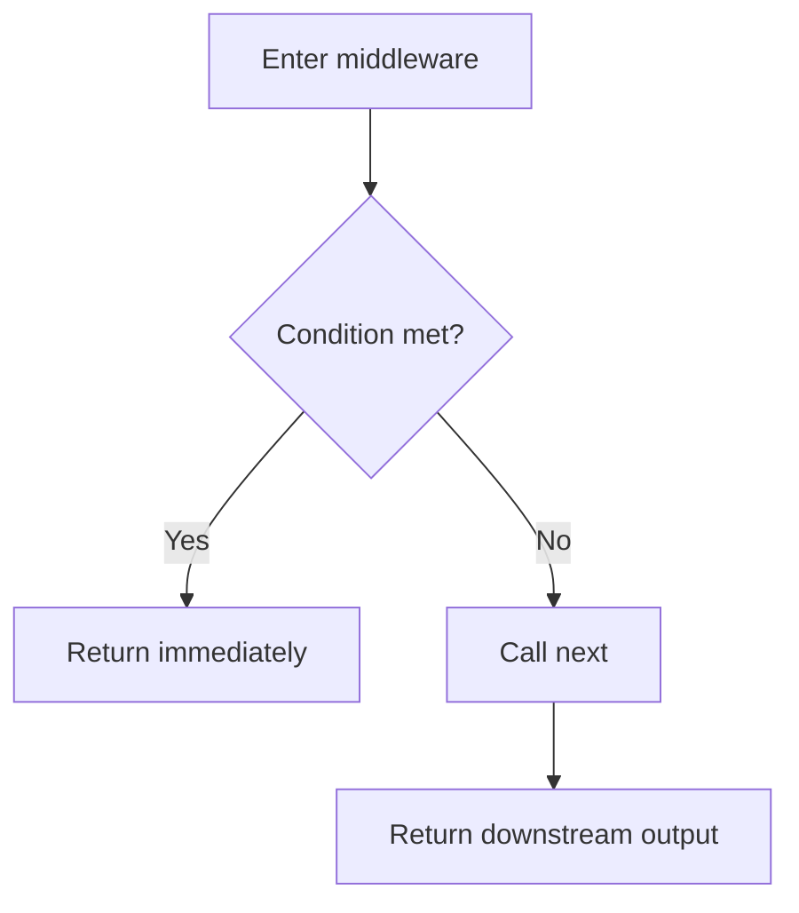
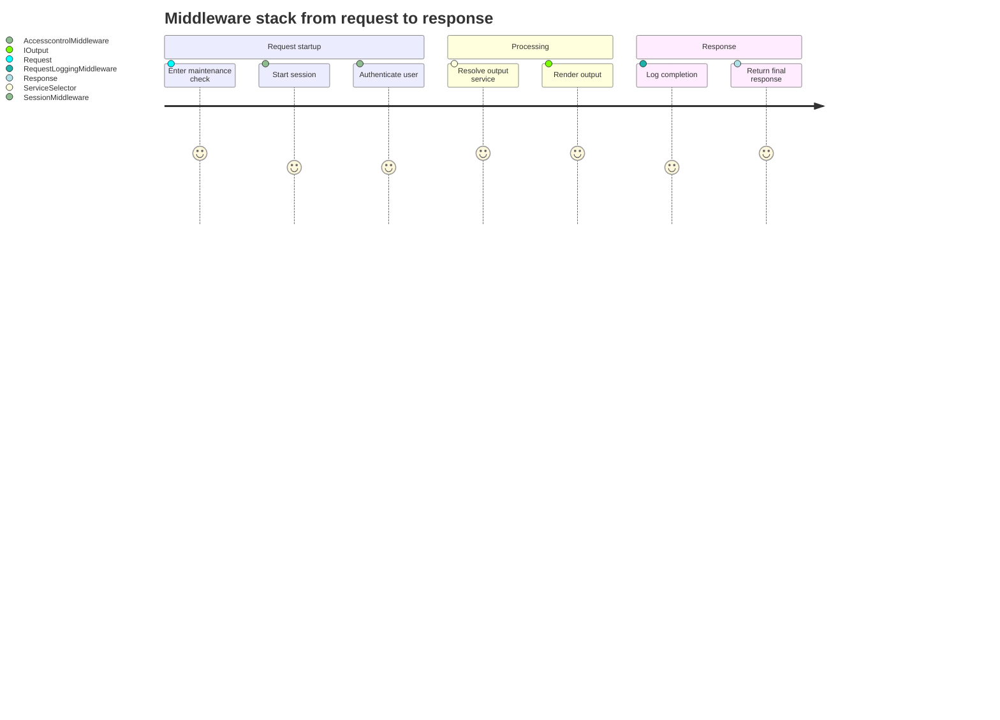

# BASE3 Framework Middlewares

## Purpose

This document explains how middleware works in the BASE3 framework and how plugin developers can add their own middleware classes using the dependency injection container.

The goal is practical understanding:

* what a middleware is
* how middleware is executed in BASE3
* how to register middleware in a plugin
* how to write custom middleware classes
* how middleware ordering affects behavior
* which design patterns work well in BASE3

This documentation is aimed at developers who want to build their own plugins for BASE3 and quickly understand how to use middlewares in a clean, DI-oriented way.

---

## What a middleware is

A middleware is a class that sits between the framework entry flow and the final output handler.

It can:

* perform work **before** the main request handling
* delegate execution to the next middleware
* perform work **after** the next middleware has finished
* stop the chain early if needed

This is a classic **chain of responsibility** pattern.

In BASE3, the middleware chain is executed by the service selector. The service selector itself acts as the final element in that chain.



The important idea is that a middleware may wrap the next step. That means a middleware can add logic both before and after calling the next handler.

---

## The middleware contract

BASE3 defines a very small middleware interface:

```php
<?php declare(strict_types=1);

namespace Base3\Middleware\Api;

interface IMiddleware {

	public function setNext($next);

	public function process(): string;
}
```

### What this means

A middleware must support two operations:

#### `setNext($next)`

This assigns the next element in the chain.

Usually, `$next` is:

* another middleware
* or the service selector as the final chain target

#### `process(): string`

This executes the middleware logic and returns the resulting output string.

A typical middleware does this:

1. do something before
2. call `$this->next->process()`
3. optionally modify the returned output
4. return the final string

---

## High-level execution model in BASE3

Plugin developers usually do **not** need to care about the low-level bootstrap details. What matters is this:

1. the container contains a `middlewares` entry
2. that entry returns an ordered list of middleware objects
3. the service selector reads that list
4. BASE3 chains the middleware objects together
5. the last middleware delegates to the service selector
6. the service selector resolves and executes the requested output class



This means middleware ordering is significant.

---

## How middlewares are registered

Middlewares are typically registered by a plugin through the DI container.

Example:

```php
->set('middlewares', fn($c) => [
	new SessionMiddleware($c->get(ISession::class)),
	new AccesscontrolMiddleware($c->get(IAccesscontrol::class))
])
```

This registration means:

* `SessionMiddleware` runs first
* `AccesscontrolMiddleware` runs second
* the service selector runs after that

Execution order is therefore:

1. Session middleware
2. Access control middleware
3. Service selector

Return flow is the reverse direction.

```mermaid
flowchart TD
	A[Container entry "middlewares"] --> B[SessionMiddleware]
	B --> C[AccesscontrolMiddleware]
	C --> D[ServiceSelector]
	D --> E[Resolved IOutput class]
```

---

## Why ordering matters

Middleware order is one of the most important design decisions.

For example, authentication often depends on an already started session.

That means this order makes sense:

```php
[
	new SessionMiddleware($c->get(ISession::class)),
	new AccesscontrolMiddleware($c->get(IAccesscontrol::class))
]
```

But this order may be wrong for many applications:

```php
[
	new AccesscontrolMiddleware($c->get(IAccesscontrol::class)),
	new SessionMiddleware($c->get(ISession::class))
]
```

If access control expects session-backed authentication data, starting access control before session initialization will likely break authentication behavior.

### Rule of thumb

Put prerequisites first.

Examples:

* session before authentication
* authentication before authorization-sensitive output generation
* logging before expensive processing if you want full timing coverage
* output decorators after the main processing if they modify the response



---

## Built-in example: `SessionMiddleware`

```php
<?php declare(strict_types=1);

namespace Base3\Middleware\Session;

use Base3\Middleware\Api\IMiddleware;
use Base3\Session\Api\ISession;

class SessionMiddleware implements IMiddleware {

	private IMiddleware $next;
	private ISession $session;

	public function __construct(ISession $session) {
		$this->session = $session;
	}

	public function setNext($next): void {
		$this->next = $next;
	}

	public function process(): string {
		$this->session->start();
		return $this->next->process();
	}
}
```

### What it does

This middleware ensures the session is started before the rest of the request is processed.

### Why it is useful

Many application concerns depend on session state:

* logged-in user information
* CSRF tokens
* language preferences
* flash messages
* per-user state

### Pattern used here

This is a **before-only middleware**:

* it performs work before delegation
* it does not alter the returned output


---

## Built-in example: `AccesscontrolMiddleware`

```php
<?php declare(strict_types=1);

namespace Base3\Middleware\Accesscontrol;

use Base3\Middleware\Api\IMiddleware;
use Base3\Accesscontrol\Api\IAccesscontrol;

class AccesscontrolMiddleware implements IMiddleware {

	private IMiddleware $next;

	public function __construct(
		private readonly IAccesscontrol $accesscontrol
	) {}

	public function setNext($next): void {
		$this->next = $next;
	}

	public function process(): string {
		$this->accesscontrol->authenticate();
		return $this->next->process();
	}
}
```

### What it does

This middleware triggers authentication before continuing.

### Why it is useful

It centralizes access-related initialization and removes the need to manually authenticate in every page or output class.

### Pattern used here

This is also a **before-only middleware**.

---

## Built-in example: `ExecutionTimeMiddleware`

```php
<?php declare(strict_types=1);

namespace Base3\Middleware\ExecutionTime;

use Base3\Middleware\Api\IMiddleware;

class ExecutionTimeMiddleware implements IMiddleware {

	private $next;

	public function setNext($next) {
		$this->next = $next;
	}

	public function process(): string {
		$start = microtime(true);

		$output = $this->next->process();

		$end = microtime(true);
		$durationInMs = ($end - $start) * 1000;
		$output .= "<!-- execution time " . round($durationInMs) . " ms -->\n";
		return $output;
	}
}
```

### What it does

This middleware measures how long the downstream processing took and appends an HTML comment to the output.

### Pattern used here

This is a classic **around middleware**:

* do something before
* call next
* do something after
* return modified output



### Practical note

This middleware is mainly useful for HTML output. For JSON APIs or binary responses, appending a comment may be inappropriate. In those cases, a logger-based timing middleware is often a better design.

---

## The middleware chain pattern

At runtime, BASE3 builds a linked chain.

If the middleware list is:

```php
[
	$mw1,
	$mw2,
	$mw3
]
```

BASE3 effectively creates this structure:

```text
$mw1 -> $mw2 -> $mw3 -> $serviceSelector
```

A simplified conceptual version looks like this:

```php
$mw1->setNext($mw2);
$mw2->setNext($mw3);
$mw3->setNext($serviceSelector);

return $mw1->process();
```



---

## The most common middleware styles

### 1. Before middleware

Performs work before calling the next handler.

Typical use cases:

* start session
* authenticate user
* initialize context
* validate request preconditions

Template:

```php
public function process(): string {
	// before
	return $this->next->process();
}
```

### 2. Around middleware

Wraps the next call and can modify the result.

Typical use cases:

* timing
* logging
* output decoration
* buffering
* exception translation

Template:

```php
public function process(): string {
	// before
	$output = $this->next->process();
	// after
	return $output;
}
```

### 3. Short-circuit middleware

Stops the chain and returns immediately.

Typical use cases:

* maintenance mode
* permission denied
* required input missing
* rate limiting

Template:

```php
public function process(): string {
	if ($this->mustStopRequest()) {
		return 'Request blocked';
	}

	return $this->next->process();
}
```



---

## Writing your own middleware

A custom middleware should usually follow this checklist:

1. implement `IMiddleware`
2. store the next chain element
3. inject required services through the constructor
4. keep the middleware focused on a single concern
5. always return a string
6. call `$this->next->process()` unless you intentionally want to stop the chain

### Minimal custom middleware

```php
<?php declare(strict_types=1);

namespace MyPlugin\Middleware\Example;

use Base3\Middleware\Api\IMiddleware;

class ExampleMiddleware implements IMiddleware {

	private IMiddleware $next;

	public function setNext($next): void {
		$this->next = $next;
	}

	public function process(): string {
		return $this->next->process();
	}
}
```

That class is technically valid, but it does not add any value yet.

---

## Example: request logging middleware

A more realistic middleware often depends on services from the container.

```php
<?php declare(strict_types=1);

namespace MyPlugin\Middleware\Logging;

use Base3\Middleware\Api\IMiddleware;
use Base3\Logger\Api\ILogger;
use Base3\Api\IRequest;

class RequestLoggingMiddleware implements IMiddleware {

	private IMiddleware $next;

	public function __construct(
		private readonly ILogger $logger,
		private readonly IRequest $request
	) {}

	public function setNext($next): void {
		$this->next = $next;
	}

	public function process(): string {
		$this->logger->info('Request started', [
			'name' => $this->request->get('name', 'index'),
			'out' => $this->request->get('out', 'html')
		]);

		$output = $this->next->process();

		$this->logger->info('Request finished');

		return $output;
	}
}
```

### Why this fits BASE3 well

* dependencies are injected through the constructor
* middleware is focused on one concern
* no global state is needed
* it composes cleanly with other middleware classes

---

## Example: maintenance mode middleware

This example demonstrates a short-circuiting middleware.

```php
<?php declare(strict_types=1);

namespace MyPlugin\Middleware\Maintenance;

use Base3\Middleware\Api\IMiddleware;
use Base3\Configuration\Api\IConfiguration;

class MaintenanceModeMiddleware implements IMiddleware {

	private IMiddleware $next;

	public function __construct(
		private readonly IConfiguration $configuration
	) {}

	public function setNext($next): void {
		$this->next = $next;
	}

	public function process(): string {
		$base = $this->configuration->get('base');
		$enabled = !empty($base['maintenance_mode']);

		if ($enabled) {
			header('HTTP/1.1 503 Service Unavailable');
			return '<h1>Maintenance</h1><p>Please try again later.</p>';
		}

		return $this->next->process();
	}
}
```

### What this shows

A middleware does **not** always have to call the next element. Returning early is valid if that is the intended behavior.

---

## Example: HTML footer decorator middleware

This example demonstrates output modification after downstream processing.

```php
<?php declare(strict_types=1);

namespace MyPlugin\Middleware\Html;

use Base3\Middleware\Api\IMiddleware;

class FooterCommentMiddleware implements IMiddleware {

	private IMiddleware $next;

	public function setNext($next): void {
		$this->next = $next;
	}

	public function process(): string {
		$output = $this->next->process();
		return $output . "\n<!-- rendered by FooterCommentMiddleware -->\n";
	}
}
```

This style is simple and useful, but only appropriate when appending to the response is actually safe.

---

## Registering custom middleware in a plugin

The normal integration point is the plugin `init()` method.

### Simple registration

```php
<?php declare(strict_types=1);

namespace MyPlugin;

use Base3\Api\IContainer;
use Base3\Api\IPlugin;
use Base3\Session\Api\ISession;
use Base3\Accesscontrol\Api\IAccesscontrol;
use Base3\Middleware\Session\SessionMiddleware;
use Base3\Middleware\Accesscontrol\AccesscontrolMiddleware;
use MyPlugin\Middleware\Logging\RequestLoggingMiddleware;

class MyPlugin implements IPlugin {

	public function __construct(private readonly IContainer $container) {}

	public static function getName(): string {
		return 'myplugin';
	}

	public function init() {
		$this->container
			->set('middlewares', fn($c) => [
				new SessionMiddleware($c->get(ISession::class)),
				new AccesscontrolMiddleware($c->get(IAccesscontrol::class)),
				new RequestLoggingMiddleware(
					$c->get(\Base3\Logger\Api\ILogger::class),
					$c->get(\Base3\Api\IRequest::class)
				)
			]);
	}
}
```

### Important note

The `middlewares` container entry is an **ordered list**. The sequence in that array is the sequence in which the middleware chain is built.

---

## Recommended registration style

For larger plugins, it is often cleaner to register middleware instances under their own service names first, and then assemble the list from those services.

This has several advantages:

* each middleware can be reused independently
* constructor dependencies stay centralized
* the `middlewares` definition becomes easier to read
* testing becomes simpler

```php
<?php declare(strict_types=1);

namespace MyPlugin;

use Base3\Api\IContainer;
use Base3\Api\IPlugin;
use Base3\Api\IRequest;
use Base3\Logger\Api\ILogger;
use Base3\Session\Api\ISession;
use Base3\Accesscontrol\Api\IAccesscontrol;
use Base3\Middleware\Session\SessionMiddleware;
use Base3\Middleware\Accesscontrol\AccesscontrolMiddleware;
use MyPlugin\Middleware\Logging\RequestLoggingMiddleware;
use MyPlugin\Middleware\Maintenance\MaintenanceModeMiddleware;

class MyPlugin implements IPlugin {

	public function __construct(private readonly IContainer $container) {}

	public static function getName(): string {
		return 'myplugin';
	}

	public function init() {
		$this->container
			->set('middleware.session', fn($c) => new SessionMiddleware($c->get(ISession::class)))
			->set('middleware.accesscontrol', fn($c) => new AccesscontrolMiddleware($c->get(IAccesscontrol::class)))
			->set('middleware.logging', fn($c) => new RequestLoggingMiddleware(
				$c->get(ILogger::class),
				$c->get(IRequest::class)
			))
			->set('middleware.maintenance', fn($c) => new MaintenanceModeMiddleware(
				$c->get(\Base3\Configuration\Api\IConfiguration::class)
			))
			->set('middlewares', fn($c) => [
				$c->get('middleware.maintenance'),
				$c->get('middleware.session'),
				$c->get('middleware.accesscontrol'),
				$c->get('middleware.logging')
			]);
	}
}
```

This approach is usually preferable in real-world plugins.

---

## Middleware design rules that work well in BASE3

### Keep one responsibility per middleware

Good:

* start session
* authenticate user
* log request metadata
* measure execution time
* enforce maintenance mode

Less ideal:

* a single middleware that starts sessions, authenticates users, logs requests, mutates HTML, and handles feature flags

Smaller middlewares compose better.

### Use constructor injection

Do not fetch services ad hoc from global state if constructor injection is possible.

Good:

```php
public function __construct(private readonly IConfiguration $configuration) {}
```

Less ideal:

```php
public function process(): string {
	$config = ServiceLocator::getInstance()->get('configuration');
	return $this->next->process();
}
```

### Be explicit about short-circuiting

If your middleware may stop the chain, that should be obvious from the code and the class name.

### Be careful when mutating output

Appending HTML comments is fine for HTML pages, but dangerous for:

* JSON output
* XML output
* file downloads
* redirects
* binary responses

### Avoid hidden side effects

A middleware should do something that can be understood by reading its name and constructor.

---

## A practical example stack

A common website-oriented middleware stack could look like this:

```php
->set('middlewares', fn($c) => [
	$c->get('middleware.maintenance'),
	$c->get('middleware.session'),
	$c->get('middleware.accesscontrol'),
	$c->get('middleware.logging')
])
```

### Why this order makes sense

1. **maintenance** may stop the request immediately
2. **session** prepares session-backed state
3. **accesscontrol** authenticates using available state
4. **logging** wraps the remaining execution and records the result



---

## Handling different output modes

BASE3 can route to different output modes such as HTML or JSON. Middleware authors should think about whether their middleware is output-agnostic.

### Output-agnostic middleware

Usually safe:

* session start
* authentication
* request logging
* feature flag initialization
* request-scoped context creation

### Output-sensitive middleware

Needs caution:

* HTML comment injection
* output rewriting
* response compression assumptions
* content-type-dependent decorations

A safer alternative is often to use logging instead of altering the response body.

---

## Example: output-aware middleware

If you do need different behavior for HTML and JSON, inject `IRequest` and branch explicitly.

```php
<?php declare(strict_types=1);

namespace MyPlugin\Middleware\Debug;

use Base3\Api\IRequest;
use Base3\Middleware\Api\IMiddleware;

class DebugFooterMiddleware implements IMiddleware {

	private IMiddleware $next;

	public function __construct(private readonly IRequest $request) {}

	public function setNext($next): void {
		$this->next = $next;
	}

	public function process(): string {
		$output = $this->next->process();
		$out = $this->request->get('out', 'html');

		if ($out !== 'html') {
			return $output;
		}

		return $output . "\n<!-- debug footer -->\n";
	}
}
```

This makes the behavior explicit and avoids corrupting non-HTML responses.

---

## Testing strategy for middleware

Middlewares are usually straightforward to test because they have a small contract.

A typical test strategy is:

1. inject fake dependencies
2. inject a fake `next` middleware
3. call `process()`
4. assert behavior and output

### Simple fake next middleware

```php
<?php declare(strict_types=1);

namespace MyPlugin\Tests\Double;

use Base3\Middleware\Api\IMiddleware;

class DummyNextMiddleware implements IMiddleware {

	public function setNext($next): void {
		// no-op
	}

	public function process(): string {
		return 'OK';
	}
}
```

### Example test idea

For `ExecutionTimeMiddleware`, verify that:

* it calls the next handler
* it returns the original output plus the appended timing marker

For `MaintenanceModeMiddleware`, verify that:

* it returns a maintenance message when enabled
* it does not call the next handler in that case

---

## Common mistakes

### 1. Forgetting to call `setNext()`

You normally do not wire the chain manually because BASE3 does that for you. But inside custom experiments or tests, forgetting `setNext()` means the middleware cannot delegate further.

### 2. Forgetting to return the output

Wrong:

```php
public function process(): string {
	$this->next->process();
}
```

Correct:

```php
public function process(): string {
	return $this->next->process();
}
```

### 3. Corrupting non-HTML output

Do not append HTML fragments to JSON or file responses.

### 4. Mixing too many responsibilities

A middleware should stay easy to understand and easy to reorder.

### 5. Registering middleware in the wrong order

If middleware B depends on side effects from middleware A, A must come first.

---

## Middleware template for plugin developers

This template is a good starting point for most custom middlewares.

```php
<?php declare(strict_types=1);

namespace MyPlugin\Middleware\Template;

use Base3\Middleware\Api\IMiddleware;

class TemplateMiddleware implements IMiddleware {

	private IMiddleware $next;

	public function __construct(
		// inject dependencies here
	) {}

	public function setNext($next): void {
		$this->next = $next;
	}

	public function process(): string {
		// before logic

		$output = $this->next->process();

		// after logic

		return $output;
	}
}
```

---

## Recommended mental model

When designing a middleware, ask these questions:

1. what concern should happen for many or all requests?
2. does it need to happen before the output class is resolved?
3. does it need to wrap the entire downstream execution?
4. is it allowed to stop the request early?
5. is it safe for all output types?
6. where should it appear in the chain?

If the answer fits those questions, middleware is probably the right mechanism.

If the logic belongs only to one page, one output class, or one specialized feature, putting it directly into that component may be the better design.

---

## Summary

BASE3 middlewares provide a simple and effective request pipeline.

The core ideas are:

* middlewares implement `IMiddleware`
* each middleware gets a `next` handler
* `process()` returns the response string
* plugins register an ordered middleware list in the container
* the service selector acts as the final chain target
* constructor injection is the preferred way to supply dependencies

The built-in examples show three common middleware styles:

* `SessionMiddleware` for setup before delegation
* `AccesscontrolMiddleware` for authentication before delegation
* `ExecutionTimeMiddleware` for wrapping and modifying the downstream result

Once you understand those patterns, you can create your own middlewares for concerns such as:

* request logging
* maintenance mode
* tenant initialization
* feature flags
* diagnostics
* rate limiting
* response decoration

In practice, the best BASE3 middleware design is usually:

* small
* explicit
* DI-driven
* safely ordered
* output-aware when needed

---

## Quick reference

### Minimal contract

```php
interface IMiddleware {
	public function setNext($next);
	public function process(): string;
}
```

### Typical plugin registration

```php
->set('middlewares', fn($c) => [
	new SessionMiddleware($c->get(ISession::class)),
	new AccesscontrolMiddleware($c->get(IAccesscontrol::class))
])
```

### Typical middleware skeleton

```php
class MyMiddleware implements IMiddleware {

	private IMiddleware $next;

	public function __construct(private readonly SomeDependency $dependency) {}

	public function setNext($next): void {
		$this->next = $next;
	}

	public function process(): string {
		$output = $this->next->process();
		return $output;
	}
}
```

### Key rule

Order is behavior.

