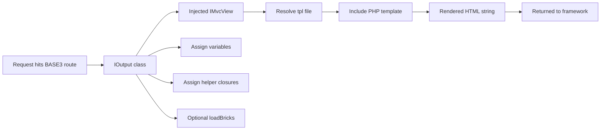
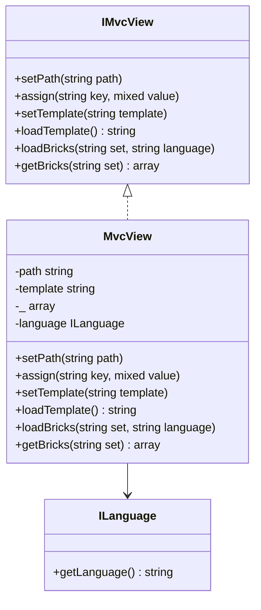
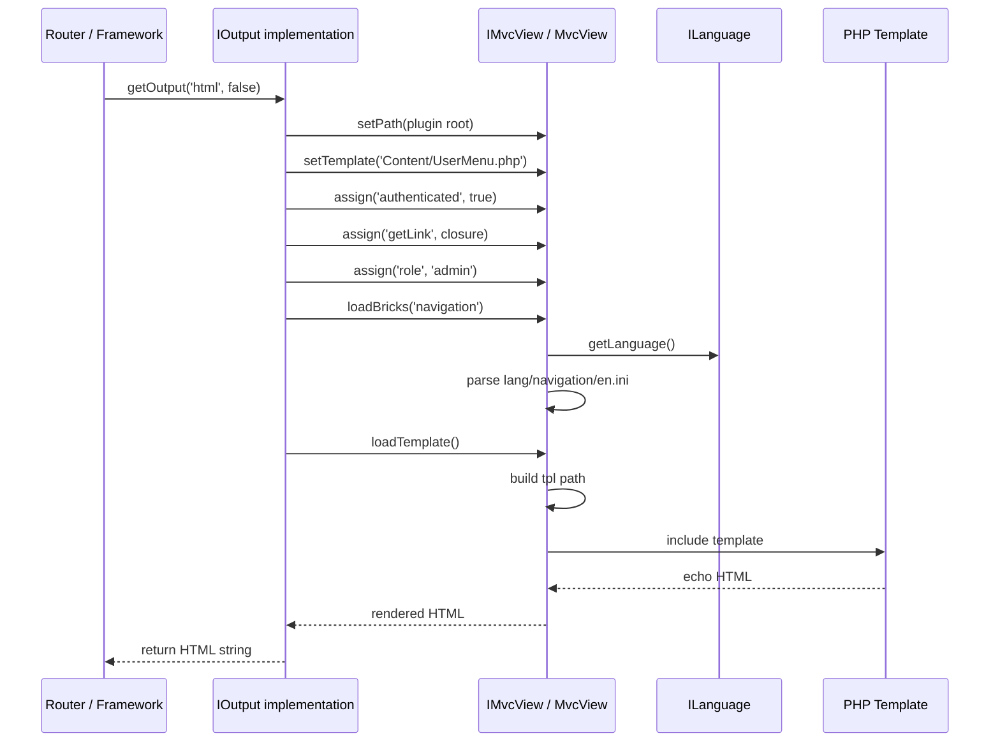
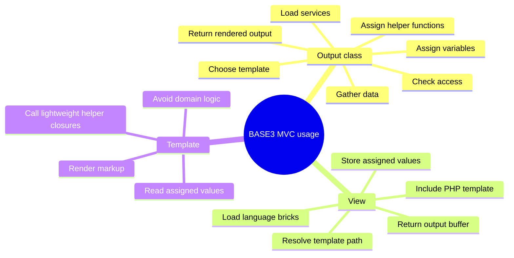
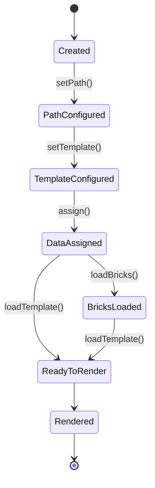

# BASE3 Framework MVC Support

## Developer Documentation for Plugin Authors

This document explains the MVC support visible in the provided BASE3 codebase, with a focus on how plugin developers can use it immediately.

The examples and explanations in this document are grounded in these components:

* `Base3\Api\IMvcView`
* `Base3\Core\MvcView`
* a typical `IOutput` implementation that uses `IMvcView`
* a PHP template file under `tpl/`

The goal is practical understanding: after reading this, a developer should be able to build a plugin output class, render a template through dependency injection, assign variables and callable helpers, load language bricks, and understand what actually happens at runtime.

---

## 1. What BASE3 MVC support means in the provided code

The MVC support shown here is intentionally lightweight.

It is not a large controller framework with a separate templating engine. Instead, the pattern is:

* an output class, usually implementing `IOutput`, acts as the orchestration layer
* an `IMvcView` instance is injected through DI
* the output class configures the view
* the view includes a PHP template file from the plugin
* assigned data is made available inside the template
* the rendered template is returned as a string

In practice, this means the **controller-like behavior** typically lives in your output class, while the **view rendering behavior** lives in `MvcView`.

### Mental model



---

## 2. Core API: `IMvcView`

The interface defines a minimal contract for template-based rendering.

```php
<?php declare(strict_types=1);

namespace Base3\Api;

interface IMvcView {

	public function setPath(string $path = '.');
	public function assign(string $key, $value);
	public function setTemplate(string $template = 'default');
	public function loadTemplate(): string;
	public function loadBricks(string $set, string $language = '');
	public function getBricks(string $set): ?array;
}
```

### Responsibilities of each method

#### `setPath(string $path = '.')`

Defines the base directory used for template and language file resolution.

In the current implementation, `MvcView` expects:

* templates under: `{path}/tpl/...`
* brick files under: `{path}/lang/...`

#### `assign(string $key, $value)`

Stores a value under a key. The template can later access that value.

The value can be:

* scalar values
* arrays
* objects
* closures / callables
* anything else a PHP template can work with

#### `setTemplate(string $template = 'default')`

Stores the relative template path.

Important detail: the implementation does **not** automatically append `.php`.
You must pass the exact template file name relative to the `tpl/` directory.

Example:

```php
$this->view->setTemplate('Content/Navigation.php');
```

#### `loadTemplate(): string`

Builds the file path, includes the template, captures output buffering, and returns the rendered result.

#### `loadBricks(string $set, string $language = '')`

Loads an INI file containing language-specific bricks into the view.

#### `getBricks(string $set): ?array`

Returns the loaded brick section for a given set, or `null` if not found.

---

## 3. How `MvcView` works internally

The provided implementation is short, but it reveals several important conventions.

### Internal structure



### Important implementation details

#### 3.1 Assigned variables are stored in `$this->_`

Inside `MvcView`, assigned values are stored in a private array named `$_`.

That means your template accesses assigned values like this:

```php
$this->_['authenticated']
$this->_['role']
$this->_['getlink']
```

This is one of the most important BASE3 conventions in the current MVC implementation.

#### 3.2 The template runs in the context of the `MvcView` object

Because the template is loaded with `include $file;` from inside the `MvcView` instance method, `$this` inside the template refers to the `MvcView` instance.

That is why the template can access:

* `$this->_[...]`
* potentially any visible members available from that context

In day-to-day usage, you should rely on assigned data through `$this->_[...]`.

#### 3.3 Template path resolution is explicit

The current implementation resolves the file like this:

```php
$file = $this->path . DIRECTORY_SEPARATOR . 'tpl' . DIRECTORY_SEPARATOR . $tpl;
```

So if you call:

```php
$this->view->setPath(DIR_PLUGIN . 'ContourzTestWebsite');
$this->view->setTemplate('Content/Navigation.php');
```

then the resolved template file is:

```text
DIR_PLUGIN . 'ContourzTestWebsite/tpl/Content/Navigation.php'
```

#### 3.4 Missing templates return a string error

If the template file does not exist, `loadTemplate()` returns a plain string:

```text
Unable to find template - <full path>
```

This is useful during development, but it also means template path mistakes will surface directly in output.

#### 3.5 Bricks are loaded from INI files

`loadBricks()` resolves files like this:

```text
{path}/lang/{set}/{language}.ini
```

Example:

```text
plugin/AcmeDemoWebsite/lang/navigation/en.ini
```

The file is parsed with:

```php
parse_ini_file($filename, true)
```

That means section-based INI files are supported and expected.

---

## 4. Runtime flow

The following sequence shows what happens when an output class renders a template.



---

## 5. Recommended plugin structure

A practical plugin layout using `IMvcView` looks like this:

```text
plugin/
└── AcmeDemoWebsite/
	├── src/
	│   └── Content/
	│       └── UserMenu.php
	├── tpl/
	│   └── Content/
	│       └── UserMenu.php
	└── lang/
	    └── navigation/
	        ├── en.ini
	        └── de.ini
```

### Why this structure fits the implementation

* `src/` contains PHP classes
* `tpl/` contains raw PHP templates
* `lang/` contains brick sets
* `setPath()` points to the plugin root
* `setTemplate()` points to a file relative to `tpl/`

---

## 6. End-to-end example

This example shows a complete plugin output flow using DI, assigned variables, assigned helper functions, and language bricks.

## 6.1 Output class

```php
<?php declare(strict_types=1);

namespace AcmeDemoWebsite\Content;

use Base3\Api\IMvcView;
use Base3\Api\IOutput;
use Base3\AccessControl\Api\IAccessControl;
use Base3\LinkTarget\Api\ILinkTargetService;

class UserMenu implements IOutput {

	public function __construct(
		private readonly IMvcView $view,
		private readonly IAccessControl $accesscontrol,
		private readonly ILinkTargetService $linktargetservice
	) {}

	public static function getName(): string {
		return 'usermenu';
	}

	public function getOutput(string $out = 'html', bool $final = false): string {
		$this->view->setPath(DIR_PLUGIN . 'AcmeDemoWebsite');
		$this->view->setTemplate('Content/UserMenu.php');
		$this->view->loadBricks('navigation');

		$userId = $this->accesscontrol->getUserId();
		$authenticated = $userId ? true : false;
		$role = $authenticated ? 'member' : 'guest';

		$this->view->assign('title', 'Developer Navigation');
		$this->view->assign('authenticated', $authenticated);
		$this->view->assign('role', $role);
		$this->view->assign('items', [
			[
				'label' => 'Dashboard',
				'target' => ['name' => 'dashboard'],
			],
			[
				'label' => 'Projects',
				'target' => ['name' => 'projects'],
			],
			[
				'label' => 'Profile',
				'target' => ['name' => 'profile'],
			],
		]);

		$this->view->assign('getLink', fn(array $target, array $params = []) => $this->linktargetservice->getLink($target, $params));
		$this->view->assign('formatRole', fn(string $value): string => strtoupper($value));

		return $this->view->loadTemplate();
	}

	public function getHelp(): string {
		return 'Renders the user menu.' . "\n";
	}
}
```

### What this example demonstrates

* `IMvcView` is injected via DI
* the plugin root path is passed to `setPath()`
* the template is selected explicitly
* a brick set is loaded before rendering
* scalar values are assigned
* arrays are assigned
* closures are assigned
* output is returned via `loadTemplate()`

---

## 6.2 Template file

File:

```text
plugin/AcmeDemoWebsite/tpl/Content/UserMenu.php
```

Template:

```php
<?php $bricks = $this->_['bricks']['navigation'] ?? []; ?>
<div class="user-menu">
	<h2><?php echo htmlspecialchars($this->_['title']); ?></h2>

	<div class="user-menu-meta">
		<span>
			<?php echo htmlspecialchars($bricks['status_label'] ?? 'Status'); ?>:
			<?php echo $this->_['authenticated'] ? htmlspecialchars($bricks['logged_in'] ?? 'Logged in') : htmlspecialchars($bricks['guest'] ?? 'Guest'); ?>
		</span>
		<span>
			<?php echo htmlspecialchars($bricks['role_label'] ?? 'Role'); ?>:
			<?php echo htmlspecialchars(($this->_['formatRole'])($this->_['role'])); ?>
		</span>
	</div>

	<ul class="user-menu-list">
		<?php foreach ($this->_['items'] as $item) { ?>
			<li>
				<a href="<?php echo htmlspecialchars(($this->_['getLink'])($item['target'])); ?>">
					<?php echo htmlspecialchars($item['label']); ?>
				</a>
			</li>
		<?php } ?>
	</ul>
</div>
```

### Why this template is important

It shows the exact access pattern used by the BASE3 view implementation:

* data is read from `$this->_[...]`
* functions are invoked from `$this->_[...]`
* loaded bricks are available under `$this->_['bricks']`

### Template context diagram

```mermaid
flowchart TD
	A[MvcView::assign('title', 'Developer Navigation')] --> B[$this->_['title']]
	C[MvcView::assign('items', [...])] --> D[$this->_['items']]
	E[MvcView::assign('getLink', closure)] --> F[$this->_['getLink']]
	G[MvcView::loadBricks('navigation')] --> H[$this->_['bricks']['navigation']]
	B --> I[Template renders title]
	D --> J[Template loops items]
	F --> K[Template builds URLs]
	H --> L[Template renders labels]
```

---

## 6.3 Language bricks for multilingual plugins

Bricks are the localization mechanism exposed by the current `IMvcView` / `MvcView` implementation.

They are especially useful when building multilingual plugins, because they keep translatable UI text outside the template and outside the output class.

A good mental model is:

* templates render structure
* output classes prepare data
* bricks provide translatable UI labels

### Typical brick directory layout

A plugin can organize brick sets like this:

```text
plugin/
└── AcmeDemoWebsite/
	└── lang/
	    ├── Bricks/
	    │   ├── en.ini
	    │   ├── de.ini
	    │   └── es.ini
	    └── Navigation/
	        ├── en.ini
	        ├── de.ini
	        └── es.ini
```

This layout matches the resolution logic of `MvcView`:

```text
{pluginRoot}/lang/{set}/{language}.ini
```

So these calls would resolve to:

```php
$this->view->loadBricks('Bricks');
$this->view->loadBricks('Navigation');
```

which become, for example:

```text
plugin/AcmeDemoWebsite/lang/Bricks/en.ini
plugin/AcmeDemoWebsite/lang/Navigation/en.ini
```

### Example brick file

File:

```text
plugin/AcmeDemoWebsite/lang/Navigation/en.ini
```

```ini
[navigation]
status_label = "Status"
logged_in = "Logged in"
guest = "Guest"
role_label = "Role"
```

German example:

```text
plugin/AcmeDemoWebsite/lang/Navigation/de.ini
```

```ini
[navigation]
status_label = "Status"
logged_in = "Angemeldet"
guest = "Gast"
role_label = "Rolle"
```

### How brick loading works

If you call:

```php
$this->view->loadBricks('Navigation');
```

then `MvcView`:

1. asks `ILanguage` for the current language if no explicit language was passed
2. resolves `{path}/lang/Navigation/<language>.ini`
3. parses the INI file with sections enabled
4. merges the parsed result into the internal brick storage
5. stores the merged result under `$this->_['bricks']`

### Section names and set names are different concerns

A common source of confusion is that:

* the **set name** is the directory name passed to `loadBricks()`
* the **section name** is the INI section inside the file

Example:

```php
$this->view->loadBricks('Navigation');
```

with this file:

```ini
[navigation]
status_label = "Status"
```

means:

* set name: `Navigation`
* section name: `navigation`

and the template reads the value from:

```php
$this->_['bricks']['navigation']['status_label']
```

The implementation does not automatically normalize these concepts for you. The directory path is based on the set name, while the returned array shape depends on the INI section names.

### Multiple brick sets can be combined

Because `loadBricks()` merges brick data into the existing brick array, a view can load more than one set.

Example:

```php
$this->view->loadBricks('Bricks');
$this->view->loadBricks('Navigation');
```

This is useful when you want:

* a shared, plugin-wide set of common labels
* an additional feature-specific set for the current screen

### When to call `loadBricks()`

There are two technically valid places:

#### Preferred: in the output class

```php
$this->view->loadBricks('Navigation');
return $this->view->loadTemplate();
```

This keeps preparation logic outside the template and makes dependencies more explicit.

#### Also possible: directly inside the template

Because the template runs in the `MvcView` object context, this also works:

```php
<?php $this->loadBricks('Navigation'); ?>
```

That can be practical in small or highly reusable templates, but as a general documentation guideline, plugin authors should prefer loading bricks in the output class so that template dependencies stay visible in PHP orchestration code.

### Template usage example

```php
<?php $navigation = $this->_['bricks']['navigation'] ?? []; ?>
<span><?php echo htmlspecialchars($navigation['status_label'] ?? 'Status'); ?></span>
```

### Why bricks are useful

For multilingual applications, bricks provide a clean separation between:

* translatable UI wording
* rendering structure
* application logic

That makes them a good fit for:

* button labels
* menu entries
* toolbar text
* status labels
* repeated UI phrases used across multiple templates

---

## 7. Using `getBricks()` explicitly

Most templates will directly read from `$this->_['bricks']`, because `loadBricks()` assigns the merged brick data there.

But the interface also exposes `getBricks(string $set): ?array`.

Example:

```php
$navigationBricks = $this->view->getBricks('navigation');
```

If the loaded INI data contains:

```ini
[navigation]
status_label = "Status"
```

then `getBricks('navigation')` returns:

```php
[
	'status_label' => 'Status',
]
```

This is useful if your output class wants to inspect or preprocess translated labels before the template is rendered.

### Important nuance

`getBricks()` expects the **section key inside the merged brick array**, not the original directory name passed to `loadBricks()`.

So in a setup like this:

```php
$this->view->loadBricks('Navigation');
```

with this INI file:

```ini
[navigation]
status_label = "Status"
```

then the correct access is:

```php
$this->view->getBricks('navigation');
```

not necessarily:

```php
$this->view->getBricks('Navigation');
```

This distinction matters in multilingual plugins, because the section keys define how translations are read back from the parsed INI structure.

---

## 8. Assigning functions and closures

One of the strengths of the current BASE3 MVC support is that assigned values are not limited to plain data.
You can assign closures and use them in the template.

This is already visible in your real example through `getlink`.

### Example: assign a route helper

```php
$this->view->assign('getLink', fn(array $target, array $params = []) => $this->linktargetservice->getLink($target, $params));
```

Usage in template:

```php
<a href="<?php echo htmlspecialchars(($this->_['getLink'])(['name' => 'dashboard'])); ?>">Dashboard</a>
```

### Example: assign a formatting helper

```php
$this->view->assign('formatRole', fn(string $role): string => ucfirst($role));
```

Usage in template:

```php
<span><?php echo htmlspecialchars(($this->_['formatRole'])($this->_['role'])); ?></span>
```

### Why this is useful

It keeps templates simple while still allowing small view-oriented helpers, such as:

* link generation
* formatting labels
* formatting dates
* conditional CSS helpers
* icon name resolution

### Guidance

Use assigned closures for **presentation helpers**, not for business logic.

Good examples:

* URL generation
* label formatting
* badge class selection

Avoid pushing complex domain logic into templates through closures.

---

## 9. How the provided `Navigation` example works

Your original example already demonstrates the essential BASE3 pattern.

### Simplified interpretation

```mermaid
flowchart TD
	A[Navigation::getOutput()] --> B[setPath(DIR_PLUGIN . 'ContourzTestWebsite')]
	B --> C[setTemplate('Content/Navigation.php')]
	C --> D[assign authenticated]
	D --> E[assign getlink closure]
	E --> F[assign role]
	F --> G[loadTemplate()]
	G --> H[tpl/Content/Navigation.php]
	H --> I[HTML output]
```

### What the example teaches

#### 9.1 The output class is the controller-like layer

It gathers data, configures the view, and decides which template to render.

#### 9.2 `IMvcView` is obtained through DI

This is the preferred usage pattern.

You do **not** manually instantiate `MvcView` in normal plugin code.

#### 9.3 Templates are raw PHP

There is no separate template DSL in the provided implementation.

#### 9.4 Assigned callables are first-class citizens

The `getlink` closure shows that templates can delegate URL generation back into framework services.

---

## 10. MVC responsibility boundaries

This is a useful way to think about responsibility separation in BASE3 plugin code.



### Practical rule set

#### Put into the output class

* access control decisions
* service calls
* data retrieval
* transformation into template-friendly arrays
* selection of template and language brick sets

#### Put into the template

* HTML structure
* loops and simple conditions
* output escaping
* calls to small presentation helpers

#### Avoid in the template

* database access
* service locator calls
* permission calculations
* deep application logic

---

## 11. Best practices for plugin developers

## 11.1 Always get `IMvcView` via DI

Recommended:

```php
public function __construct(
	private readonly IMvcView $view
) {}
```

Not recommended in normal plugin code:

```php
$view = new MvcView(...);
```

The framework should provide the implementation.

## 11.2 Always set the plugin root path explicitly

Because template and brick resolution depend on the base path, make this one of the first things you do.

```php
$this->view->setPath(DIR_PLUGIN . 'AcmeDemoWebsite');
```

## 11.3 Pass the exact template path

The current implementation does not append `.php` automatically.

Correct:

```php
$this->view->setTemplate('Content/UserMenu.php');
```

Potentially wrong:

```php
$this->view->setTemplate('Content/UserMenu');
```

## 11.4 Keep assigned values template-friendly

Instead of assigning a service object and doing lots of work inside the template, prefer assigning already prepared data.

Good:

```php
$this->view->assign('items', $items);
$this->view->assign('authenticated', $authenticated);
```

Less good:

```php
$this->view->assign('projectService', $projectService);
```

## 11.5 Escape template output consciously

Because templates are raw PHP, escaping is your responsibility.

Example:

```php
<?php echo htmlspecialchars($this->_['title']); ?>
```

This is especially important for:

* user-generated content
* request-dependent output
* translated strings if their source is not fully trusted

## 11.6 Use closures for presentation helpers only

Small helpers are a good fit. Complex behavior belongs in PHP classes outside the template.

---

## 12. Common pitfalls

## 12.1 Wrong base path

If `setPath()` points to the wrong directory, templates and brick files will not be found.

Symptom:

```text
Unable to find template - ...
```

## 12.2 Missing `.php` in `setTemplate()`

Because the implementation uses the template string as-is, forgetting the file extension can break resolution.

## 12.3 Expecting assigned variables as local PHP variables

The current implementation does not `extract()` assigned variables.

So this will **not** work automatically:

```php
<?php echo $title; ?>
```

You must use:

```php
<?php echo $this->_['title']; ?>
```

## 12.4 Putting too much logic into the template

Because templates are full PHP, it is easy to overdo it.

A maintainable template should mostly:

* read prepared data
* loop
* branch lightly
* echo markup

## 12.5 Assuming bricks are loaded automatically

They are not. You must call `loadBricks()` yourself if the template expects them.

## 12.6 Confusing brick set names with INI section names

These are related, but not identical.

Example:

* `loadBricks('Navigation')` uses the directory `lang/Navigation/`
* `[navigation]` defines the section key inside the parsed INI array
* the template then reads `$this->_['bricks']['navigation']`

If the directory name and section name use different casing or wording, that is valid, but developers must stay consistent when reading the parsed data.

## 12.7 Not handling missing brick keys gracefully

A template should ideally use fallbacks where appropriate.

Example:

```php
<?php echo htmlspecialchars($navigation['status_label'] ?? 'Status'); ?>
```

## 12.8 Hiding multilingual dependencies inside templates without a clear convention

Calling `loadBricks()` directly in a template is technically supported, but if some templates do this and others expect bricks to be preloaded in the output class, maintenance becomes harder.

Pick a convention for your plugin and keep it consistent.

For most plugin code, the better default is:

* load bricks in the output class
* read bricks in the template

---

## 13. State model of view preparation

The following state view helps explain the lifecycle of an `IMvcView` instance during rendering.



This does not mean every step is strictly mandatory. In the current implementation:

* `setPath()` is effectively mandatory for plugin-based templates
* `setTemplate()` is effectively mandatory unless the default name is actually intended
* `assign()` is optional but usually needed
* `loadBricks()` is optional and only needed if the template uses bricks

---

## 14. Minimal example for quick start

If a developer wants the smallest possible working pattern, this is the essential flow.

### Output class

```php
<?php declare(strict_types=1);

namespace AcmeDemoWebsite\Content;

use Base3\Api\IMvcView;
use Base3\Api\IOutput;

class HelloWorld implements IOutput {

	public function __construct(
		private readonly IMvcView $view
	) {}

	public static function getName(): string {
		return 'helloworld';
	}

	public function getOutput(string $out = 'html', bool $final = false): string {
		$this->view->setPath(DIR_PLUGIN . 'AcmeDemoWebsite');
		$this->view->setTemplate('Content/HelloWorld.php');
		$this->view->assign('headline', 'Hello BASE3 MVC');
		$this->view->assign('message', 'This template was rendered through IMvcView.');

		return $this->view->loadTemplate();
	}

	public function getHelp(): string {
		return 'Renders a minimal hello world template.' . "\n";
	}
}
```

### Template

```php
<h1><?php echo htmlspecialchars($this->_['headline']); ?></h1>
<p><?php echo htmlspecialchars($this->_['message']); ?></p>
```

### Quick-start flow

```mermaid
flowchart LR
	A[Inject IMvcView] --> B[setPath()]
	B --> C[setTemplate()]
	C --> D[assign()]
	D --> E[loadTemplate()]
	E --> F[Return HTML]
```

---

## 15. Advanced example: combining data, closures, and bricks

This example demonstrates a slightly more realistic rendering setup.

### Output class

```php
<?php declare(strict_types=1);

namespace AcmeDemoWebsite\Content;

use Base3\Api\IMvcView;
use Base3\Api\IOutput;
use Base3\LinkTarget\Api\ILinkTargetService;

class ProjectList implements IOutput {

	public function __construct(
		private readonly IMvcView $view,
		private readonly ILinkTargetService $linktargetservice
	) {}

	public static function getName(): string {
		return 'projectlist';
	}

	public function getOutput(string $out = 'html', bool $final = false): string {
		$this->view->setPath(DIR_PLUGIN . 'AcmeDemoWebsite');
		$this->view->setTemplate('Content/ProjectList.php');
		$this->view->loadBricks('projectlist');

		$projects = [
			['id' => 10, 'title' => 'Apollo', 'status' => 'active'],
			['id' => 11, 'title' => 'Beacon', 'status' => 'planned'],
			['id' => 12, 'title' => 'Cygnus', 'status' => 'archived'],
		];

		$this->view->assign('projects', $projects);
		$this->view->assign('getLink', fn(array $target, array $params = []) => $this->linktargetservice->getLink($target, $params));
		$this->view->assign('statusClass', function(string $status): string {
			return match ($status) {
				'active' => 'badge badge-success',
				'planned' => 'badge badge-warning',
				'archived' => 'badge badge-muted',
				default => 'badge',
			};
		});

		return $this->view->loadTemplate();
	}

	public function getHelp(): string {
		return 'Renders a project list.' . "\n";
	}
}
```

### Template

```php
<?php $bricks = $this->_['bricks']['projectlist'] ?? []; ?>
<div class="project-list">
	<h2><?php echo htmlspecialchars($bricks['headline'] ?? 'Projects'); ?></h2>

	<ul>
		<?php foreach ($this->_['projects'] as $project) { ?>
			<li>
				<a href="<?php echo htmlspecialchars(($this->_['getLink'])(['name' => 'projectdetail'], ['id' => $project['id']])); ?>">
					<?php echo htmlspecialchars($project['title']); ?>
				</a>
				<span class="<?php echo htmlspecialchars(($this->_['statusClass'])($project['status'])); ?>">
					<?php echo htmlspecialchars($project['status']); ?>
				</span>
			</li>
		<?php } ?>
	</ul>
</div>
```

### Brick file

```ini
[projectlist]
headline = "Projects"
```

### Why this example is useful

It demonstrates a balanced use of the current MVC support:

* data preparation happens in PHP
* presentation decisions remain simple
* templates stay readable
* helper closures reduce repetition
* translated labels stay outside the template source code

---

## 16. How to explain BASE3 MVC to a new developer in one minute

A concise explanation for onboarding:

> In the current BASE3 implementation, MVC rendering is built around `IMvcView`. Your plugin output class gets an `IMvcView` through dependency injection, points it to the plugin root, selects a template from `tpl/`, assigns data and optional helper closures, optionally loads language bricks from `lang/`, and finally returns `loadTemplate()`. The template itself is plain PHP and reads assigned values through `$this->_[...]`.

---

## 17. Checklist for building a new plugin view

Use this checklist when creating a new output/template pair.

### Output class checklist

* inject `IMvcView`
* inject any other needed framework services
* implement `IOutput`
* set the plugin root with `setPath()`
* set the template with `setTemplate()`
* optionally call `loadBricks()`
* assign all template data explicitly
* assign only lightweight helper closures
* return `$this->view->loadTemplate()`

### Template checklist

* read assigned values from `$this->_[...]`
* use `htmlspecialchars()` where appropriate
* keep logic simple
* use loaded bricks or safe fallbacks
* avoid framework service calls inside the template

### File layout checklist

* class under `src/`
* template under `tpl/`
* bricks under `lang/<set>/<language>.ini`

---

## 18. Summary

The BASE3 MVC support shown in the provided code is small, explicit, and effective.

Its core ideas are:

* **rendering is driven from the output class**
* **the view is injected via DI**
* **templates are plain PHP files**
* **assigned values are available as `$this->_[...]`**
* **language bricks are loaded from INI files**
* **closures can be assigned as presentation helpers**

For plugin developers, the practical recipe is straightforward:

1. inject `IMvcView`
2. set the plugin root path
3. select a template under `tpl/`
4. assign data and lightweight helper functions
5. optionally load bricks
6. return `loadTemplate()`

That is enough to build clear, maintainable plugin views in BASE3.

---

## 19. Reference cheatsheet

### Smallest useful rendering example

```php
$this->view->setPath(DIR_PLUGIN . 'AcmeDemoWebsite');
$this->view->setTemplate('Content/HelloWorld.php');
$this->view->assign('headline', 'Hello BASE3');
return $this->view->loadTemplate();
```

### Template access pattern

```php
<?php echo htmlspecialchars($this->_['headline']); ?>
```

### Assigning a helper closure

```php
$this->view->assign('getLink', fn(array $target, array $params = []) => $this->linktargetservice->getLink($target, $params));
```

### Loading bricks

```php
$this->view->loadBricks('navigation');
```

### Brick path convention

```text
{pluginRoot}/lang/{set}/{language}.ini
```

### Template path convention

```text
{pluginRoot}/tpl/{template}
```

