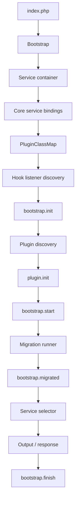

# BASE3 Framework Overview

## Purpose

This document gives a high-level overview of the BASE3 framework.

It is written for developers who are new to BASE3 and want to understand:

* what BASE3 is
* how the framework starts
* how plugins are discovered
* how services are wired
* how request handling works
* how framework core, plugins, foundation plugins, and project plugins fit together
* where to look next in the detailed documentation

This is not a replacement for the detailed subsystem documents.

It is the entry point.

---

## 1. What BASE3 is

BASE3 is a lightweight modular PHP framework for building extensible applications.

It can run in two main modes:

```text
standalone
embedded
```

In standalone mode, BASE3 owns the application entry point, bootstrap, plugin directory, routing, and runtime.

In embedded mode, BASE3 runs inside another host system. In that case, the host integration may provide a different bootstrap, different directory constants, different service implementations, and a different class map.

The core idea stays the same:

```text
BASE3 provides a small core.
Plugins provide features.
Foundation plugins define shared contracts.
Project plugins wire the final application.
```

---

## 2. Main architectural parts

A BASE3 application is built from these parts:

```text
index.php
Bootstrap
Service container
PluginClassMap
Plugins
Foundation plugins
Project plugins
Service selector
Outputs / Displays / MVC templates
Usermanager / RBAC
Settings / State / Configuration
Database migrations
Hooks / Events
Workers / Jobs
```

The most important rule is:

```text
Known services are provided by the container.
Discoverable components are found through the class map.
Final project choices are made in project plugins or custom bootstraps.
```

---

## 3. Typical directory structure

A standalone BASE3 application usually looks like this:

```text
Base3Framework/
├── cnf/
├── docs/
├── index.php
├── local/
├── plugin/
├── src/
├── test/
├── tmp/
├── userfiles/
├── vendor/
└── VERSION
```

The framework source lives in:

```text
src/
```

Plugins live in:

```text
plugin/<PluginName>/
```

A typical plugin contains:

```text
plugin/<PluginName>/
├── assets/
├── docs/
├── install/
├── lang/
├── local/
├── README.md
├── src/
├── test/
├── tpl/
└── VERSION
```

Only `src/` is scanned by the default plugin class map for PHP classes.

Templates, assets, language files, local files, tests, and docs are supporting files and are loaded by their respective systems.

---

## 4. Startup flow

The normal startup flow is:

```text
index.php
  -> Bootstrap
     -> create container
     -> register core services
     -> register PluginClassMap
     -> discover hook listeners
     -> dispatch bootstrap.init
     -> discover plugins
     -> call plugin.init()
     -> dispatch bootstrap.start
     -> run migration runner
     -> dispatch bootstrap.migrated
     -> run service selector
     -> dispatch bootstrap.finish
```

In diagram form:



The bootstrap is the first composition root.

It defines the initial runtime.

Plugins can extend this runtime during `init()`.

A host integration can replace the bootstrap when BASE3 is embedded.

---

## 5. Service container

The service container stores known services.

Examples:

```text
IConfiguration
IRequest
IClassMap
ISettingsStore
IStateStore
IDatabase
IMigrationRunner
ILogger
IEventManager
IAssetResolver
```

A class should receive known dependencies through constructor injection.

Example:

```php
public function __construct(
	private readonly ISettingsStore $settingsStore,
	private readonly IClassMap $classMap
) {}
```

The consuming class should depend on interfaces, not on concrete project-specific implementations.

---

## 6. PluginClassMap

The `PluginClassMap` discovers framework and plugin classes.

It scans:

```text
DIR_SRC
DIR_PLUGIN/<PluginName>/src
```

It indexes classes by:

```text
app
interface
name
```

This makes it possible to find classes by role:

```php
$classMap->getInstancesByInterface(IPlugin::class);
$classMap->getInstancesByInterface(IHookListener::class);
$classMap->getInstancesByInterface(IJob::class);
```

or by role and technical name:

```php
$classMap->getInstanceByInterfaceName(IOutput::class, 'dashboard');
$classMap->getInstanceByInterfaceName(IJob::class, 'mailimportjob');
```

The class map is the main reason BASE3 plugins do not need many central registries or factories.

---

## 7. Plugins

Plugins are feature modules.

A plugin may provide:

* services
* displays
* outputs
* jobs
* checks
* events
* listeners
* assets
* templates
* settings UIs
* config value modes
* domain APIs

A plugin becomes active when:

1. its PHP classes live under `plugin/<PluginName>/src`
2. its namespace matches the plugin path
3. it has a class implementing `IPlugin`
4. the class map discovers it
5. the bootstrap calls `init()`

A plugin's `init()` method registers services and listeners.

It should not run heavy request logic.

---

## 8. Foundation plugins

Foundation plugins are special plugins that mainly define contracts.

They usually contain:

```text
Api/
Dto/
Model/
Exception/
Proxy/
```

They are intended to define plugin slots.

Example slots:

```text
IQueryService
IQuerySchemaProvider
IFileStorage
IEntityDataService
```

Foundation plugins should avoid final business implementation.

They make plugins replaceable by giving different implementation plugins a shared contract.

---

## 9. Project plugins

A project plugin wires the final application.

It decides which implementation should fill which slot.

Example:

```php
$this->container
	->set(ISettingsStore::class, fn($c) => new DatabaseSettingsStore(
		$c->get(IDatabase::class)
	), IContainer::SHARED)

	->set(IQuerySchemaProvider::class, fn($c) => new ProjectQuerySchemaProvider(), IContainer::SHARED)

	->set(IReportConfigProvider::class, fn($c) => new ProjectReportConfigProvider(), IContainer::SHARED);
```

The project plugin is allowed to know concrete implementation plugins.

Most ordinary plugins should not.

This keeps dependencies intentional.

---

## 10. Request handling

After bootstrap and plugin initialization, the service selector handles the request.

A request typically resolves to an output or display component.

The selected class usually:

1. receives dependencies through DI
2. reads request data through `IRequest`
3. loads settings through `ISettingsStore` if needed
4. prepares data
5. renders through MVC or returns a raw response

A display or output class is commonly selected through the class map by `getName()`.

---

## 11. MVC support

BASE3 commonly uses a parallel structure for display classes and templates.

Example:

```text
src/Display/DataSchemaDisplay.php
tpl/Display/DataSchemaDisplay.php
```

The PHP class prepares data and selects the template.

The template renders markup and client-side bootstrapping.

This keeps business logic out of templates and HTML out of services.

---

## 12. Configuration, Settings, State, and Config Values

BASE3 separates several kinds of data.

### Configuration

Project or framework configuration.

Use for static configuration that is known at startup or deployment time.

### Settings Store

Grouped, named settings datasets.

Use for editable runtime configuration such as provider configs, connection definitions, UI settings, and reusable service definitions.

### State Store

Operational runtime state.

Use for timestamps, locks, progress markers, and job state.

### Config Value Resolver

Late value resolution.

Use when a value may come from:

```text
fixed
configuration
env
file
custom resolver mode
```

This is especially useful for secrets and deployment-specific values.

---

## 13. Database migrations

BASE3 provides a migration slot but does not assume that every project has a database.

The default bootstrap registers a no-op migration runner. A project plugin replaces it with a database-backed runner only when the project wires `IDatabase` and wants database migrations to run automatically.

Migration providers are discoverable components. They own one schema area and decide whether they are active based on the final runtime composition. This means a database-backed configuration service can provide its own migrations, while a file-backed configuration service needs none.

Read `migrations.md` for the full model.

---

## 14. Hooks and Events

BASE3 has both hooks and events.

Use hooks for framework lifecycle and named extension points.

Examples:

```text
bootstrap.init
bootstrap.start
bootstrap.finish
```

Use events for runtime domain notifications.

Examples:

```text
ToolStartedEvent
ToolFinishedEvent
ImportFailedEvent
UserDeletedEvent
```

Hooks are mostly lifecycle-oriented.

Events are mostly runtime behavior-oriented.

---

## 15. Workers and jobs

BASE3 includes a worker system for background jobs.

Jobs are discoverable through the class map.

A worker can find all jobs:

```php
$classMap->getInstancesByInterface(IJob::class);
```

A specific job can be resolved by name:

```php
$classMap->getInstanceByInterfaceName(IJob::class, 'cleanupjob');
```

Jobs may use execution policies to decide whether they should run.

This allows plugins to add background behavior without changing the worker core.

---

## 16. Standalone and embedded runtime

In standalone mode, BASE3 owns the runtime.

In embedded mode, another system provides the outer runtime and BASE3 runs as a subsystem.

Embedded setups may replace:

* bootstrap
* class map
* asset resolver
* system service
* request implementation
* access control
* usermanager / RBAC adapter
* routing
* configuration
* settings store
* storage services

Code should therefore depend on interfaces and avoid hardcoded assumptions about paths, URLs, users, sessions, or asset locations.

---

## 17. Recommended reading order

A new developer should read the docs in this order:

```text
overview.md
architecture-principles.md
bootstrap.md
dependency-injection.md
classmap.md
plugins.md
migrations.md
extension-cookbook.md
routing.md
mvc.md
configuration.md
configvalue.md
settingsstore.md
statestore.md
hooks.md
events.md
worker.md
assets.md
request-data.md
systemservice.md
usermanager.md
```

Not every project needs every subsystem immediately.

But the first eight documents explain the mental model.

---

## 18. Summary

BASE3 is built around a small set of architectural rules:

```text
Bootstrap creates the runtime.
The container stores known services.
PluginClassMap discovers plugin components.
Plugins register services.
Foundation plugins define contracts.
Project plugins wire final implementations.
Outputs and displays handle requests.
Usermanager provides framework-level users, groups, roles, and permissions.
Settings, state, and config are separated.
Migrations update active database schemas before request handling.
Hooks extend lifecycle.
Events announce runtime behavior.
Workers run background jobs.
```

The most important practical distinction is:

```text
Use the container for known services.
Use the class map for discoverable components.
Use foundation plugins for shared contracts.
Use project plugins for final application wiring.
```
