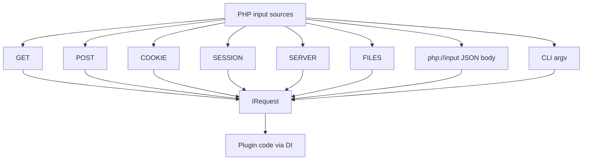
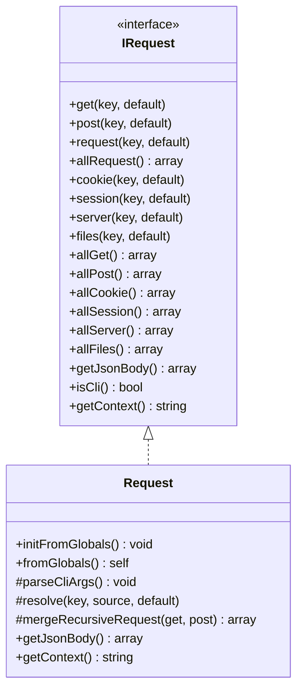
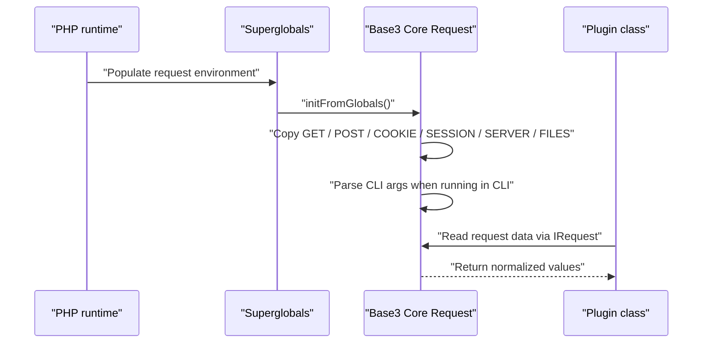
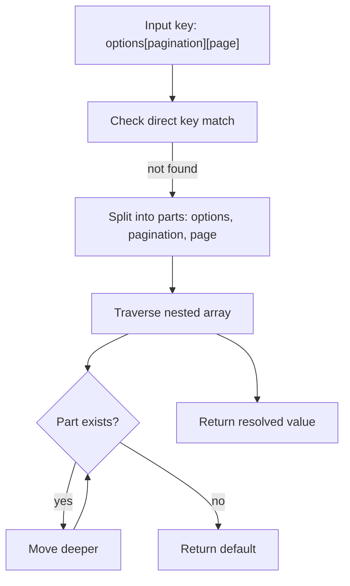
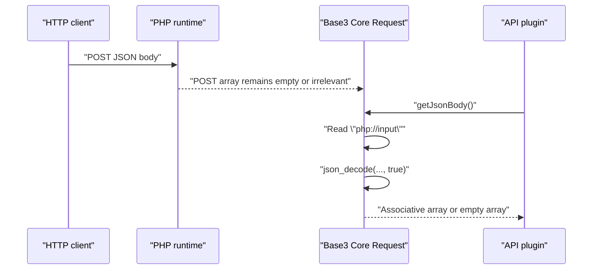
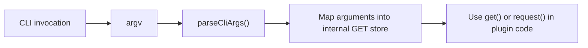
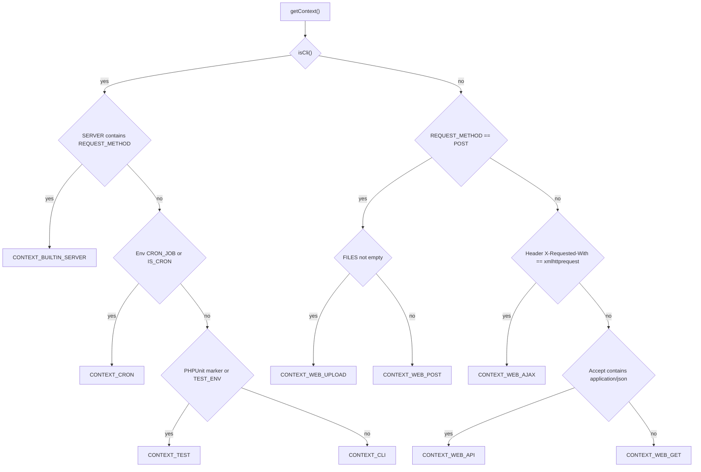

# BASE3 Framework Request Data

## Purpose

This document explains how request data works in the BASE3 framework.

It is written for developers who build their own plugins and want to understand, very quickly and very clearly:

* which request API they should depend on
* how request data from `GET`, `POST`, `COOKIE`, `SESSION`, `SERVER`, and `FILES` is accessed
* how merged request access works
* how nested array notation such as `filters[type]` is resolved
* how JSON request bodies are handled
* how CLI arguments are mapped into request data
* how BASE3 detects the current request context
* how to use `IRequest` cleanly via dependency injection

The goal is practical understanding. After reading this document, a plugin developer should be able to inject `IRequest`, read request data safely, choose the right accessor method, and understand what happens internally.

---

## 1. The main idea

BASE3 provides a single abstraction for inbound request data:

* `Base3\Api\IRequest`

The framework implementation is:

* `Base3\Core\Request`

Instead of reading PHP superglobals directly, plugin code should usually depend on `IRequest`.

That gives you a single, framework-level API for:

* classic web requests
* API-style JSON requests
* file uploads
* session and cookie access
* CLI execution
* context detection

In other words, `IRequest` acts as the framework boundary around raw PHP input sources.



---

## 2. Why plugin code should depend on `IRequest`

In plain PHP, it is tempting to access `$_GET`, `$_POST`, `$_SERVER`, or `$_FILES` directly.

That works for small scripts, but it creates several problems in framework-based code:

* your plugin becomes tightly coupled to PHP globals
* it becomes harder to test
* request handling logic gets scattered across classes
* CLI and web usage need separate handling in many places
* JSON bodies need special treatment outside of `$_POST`

By using `IRequest`, you centralize all of that behind one interface.

A typical plugin class should therefore look like this:

```php
<?php declare(strict_types=1);

namespace MyVendor\MyPlugin\Page;

use Base3\Api\IOutput;
use Base3\Api\IRequest;

class ExamplePage implements IOutput {

	private IRequest $request;

	public function __construct(IRequest $request) {
		$this->request = $request;
	}

	public function getOutput(): string {
		$id = (string) $this->request->get('id', '');
		$mode = (string) $this->request->request('mode', 'default');

		return 'ID: ' . $id . ' / mode: ' . $mode;
	}
}
```

This is the normal BASE3 style:

* depend on the interface
* let the container provide the concrete implementation
* keep framework access consistent across your plugin

---

## 3. The `IRequest` interface at a glance

`IRequest` is intentionally broad. It covers both raw access to specific sources and higher-level convenience methods.

The interface provides access to these data groups:

* `get()` for `GET`
* `post()` for `POST`
* `request()` for merged `POST` and `GET`
* `cookie()` for `COOKIE`
* `session()` for `SESSION`
* `server()` for `SERVER`
* `files()` for `FILES`
* `getJsonBody()` for JSON request bodies

It also provides bulk access methods:

* `allGet()`
* `allPost()`
* `allRequest()`
* `allCookie()`
* `allSession()`
* `allServer()`
* `allFiles()`

And it exposes environment information:

* `isCli()`
* `getContext()`

The context constants are defined directly in the interface:

* `CONTEXT_CLI`
* `CONTEXT_WEB_GET`
* `CONTEXT_WEB_POST`
* `CONTEXT_WEB_AJAX`
* `CONTEXT_WEB_API`
* `CONTEXT_WEB_UPLOAD`
* `CONTEXT_CRON`
* `CONTEXT_TEST`
* `CONTEXT_BUILTIN_SERVER`



---

## 4. How `Request` is initialized

The framework implementation stores request data internally in these properties:

* `$get`
* `$post`
* `$cookie`
* `$session`
* `$server`
* `$files`

These are populated from PHP superglobals by `initFromGlobals()`.

```php
public function initFromGlobals(): void {
	$this->get = $_GET;
	$this->post = $_POST;
	$this->cookie = $_COOKIE;
	$this->session = $_SESSION ?? [];
	$this->server = $_SERVER;
	$this->files = $_FILES;

	if ($this->isCli()) {
		$this->parseCliArgs();
	}
}
```

There is also a convenience factory:

```php
public static function fromGlobals(): self {
	$self = new self();
	$self->initFromGlobals();
	return $self;
}
```

In everyday plugin development, you usually do **not** instantiate `Request` manually. You inject `IRequest` and let the framework container supply the ready-to-use object.



---

## 5. Source-specific access methods

### 5.1 `get()`

Use `get()` when you explicitly want a value from the URL query string.

```php
$page = (int) $request->get('page', 1);
$sort = (string) $request->get('sort', 'name');
```

This does **not** inspect `POST`. It reads only the internal `GET` source.

### 5.2 `post()`

Use `post()` when you explicitly want form body data from a classic `POST` request.

```php
$title = (string) $request->post('title', '');
$published = (bool) $request->post('published', false);
```

This does **not** inspect `GET`.

### 5.3 `request()`

Use `request()` when the origin does not matter and you want a merged request view.

`POST` takes precedence over `GET`.

```php
$mode = (string) $request->request('mode', 'list');
```

If both are present:

* `GET[mode] = "preview"`
* `POST[mode] = "save"`

then:

* `request('mode')` returns `"save"`

This makes `request()` the most convenient general-purpose accessor, but also the least source-specific one.

### 5.4 `cookie()`

```php
$token = (string) $request->cookie('remember_token', '');
```

### 5.5 `session()`

```php
$userId = (int) $request->session('user_id', 0);
$isAdmin = (bool) $request->session('is_admin', false);
```

### 5.6 `server()`

```php
$method = (string) $request->server('REQUEST_METHOD', 'GET');
$uri = (string) $request->server('REQUEST_URI', '');
```

### 5.7 `files()`

```php
$avatar = $request->files('avatar');
```

This is useful for upload handlers and gives direct access to the corresponding entry from `$_FILES`.

---

## 6. Nested array notation

One of the most practical features of BASE3 request access is support for nested array notation such as:

* `filters[type]`
* `options[pagination][page]`
* `data[user][email]`

Internally, `Request` uses a resolver that can traverse nested arrays based on bracket notation.

Example request data:

```php
$_GET['filters'] = [
	'type' => 'open',
	'status' => 'active',
];
```

Then this works:

```php
$type = (string) $request->get('filters[type]', '');
$status = (string) $request->get('filters[status]', '');
```

And for deeper nesting:

```php
$page = (int) $request->request('options[pagination][page]', 1);
```

Internally the logic is roughly:

1. check whether the exact key exists as-is
2. if not, split the key by bracket notation
3. walk the nested array step by step
4. return the default if any segment is missing



This is very useful when working with HTML forms that submit structured arrays.

---

## 7. `request()` precedence and an important nuance

The `request()` method does more than a simple merge lookup.

The implementation enforces **strict POST precedence**.

That means:

* if a flat key exists in `POST`, that value is returned immediately
* this is true even if the value is `null`
* only if the key is not present in `POST` does the method fall back to `GET`

For nested keys, the method first checks whether the full nested path exists in `POST`.
Only if that path does not exist does it look in `GET`.

This is important because it preserves the semantic meaning of submitted data.

### Example: flat precedence

```php
$_GET['mode'] = 'preview';
$_POST['mode'] = null;
```

Then:

```php
$request->request('mode', 'default');
```

returns `null`, not `preview` and not `default`.

That is deliberate. The existence of the `POST` key wins.

### Example: nested precedence

```php
$_GET['options'] = [
	'type' => 'simple',
];

$_POST['options'] = [
	'type' => 'advanced',
];
```

Then:

```php
$request->request('options[type]', 'fallback');
```

returns:

```php
'advanced'
```

### Recommendation

Use:

* `get()` when you explicitly want URL/query data
* `post()` when you explicitly want form body data
* `request()` when you intentionally want `POST > GET` behavior

---

## 8. Bulk access methods

Sometimes you need all values from a source instead of a single key.

BASE3 provides one bulk method per source.

### `allGet()`

```php
$queryParams = $request->allGet();
```

### `allPost()`

```php
$formData = $request->allPost();
```

### `allCookie()`

```php
$cookies = $request->allCookie();
```

### `allSession()`

```php
$sessionData = $request->allSession();
```

### `allServer()`

```php
$server = $request->allServer();
```

### `allFiles()`

```php
$files = $request->allFiles();
```

### `allRequest()`

This one is especially important.

It returns a **deep merge** of `GET` and `POST`, with `POST` overriding `GET`.

```php
$data = $request->allRequest();
```

If both contain nested arrays, the merge is recursive.

Example:

```php
$_GET = [
	'filters' => [
		'type' => 'task',
		'status' => 'open',
	],
];

$_POST = [
	'filters' => [
		'status' => 'closed',
		'priority' => 'high',
	],
];
```

Then `allRequest()` returns:

```php
[
	'filters' => [
		'type' => 'task',
		'status' => 'closed',
		'priority' => 'high',
	],
]
```

This is useful when you want a complete merged view instead of one specific key.

---

## 9. JSON request bodies

Classic HTML form requests populate `$_POST`.
JSON API requests usually do not.

That is why `IRequest` exposes:

* `getJsonBody()`

The implementation reads from `php://input`, decodes JSON, and caches the result.

```php
public function getJsonBody(): array {
	if ($this->jsonBody === null) {
		$this->jsonBody = json_decode(file_get_contents('php://input'), true) ?? [];
	}
	return $this->jsonBody;
}
```

Important behavior:

* the body is decoded only once
* the result is cached in `$jsonBody`
* invalid or missing JSON produces an empty array
* the return type is always an associative array

### Example: API endpoint

```php
<?php declare(strict_types=1);

namespace MyVendor\MyPlugin\Api;

use Base3\Api\IOutput;
use Base3\Api\IRequest;

class SaveSettingsApi implements IOutput {

	private IRequest $request;

	public function __construct(IRequest $request) {
		$this->request = $request;
	}

	public function getOutput(): string {
		$payload = $this->request->getJsonBody();

		$name = (string) ($payload['name'] ?? '');
		$enabled = (bool) ($payload['enabled'] ?? false);

		return json_encode([
			'ok' => true,
			'name' => $name,
			'enabled' => $enabled,
		], JSON_PRETTY_PRINT);
	}
}
```

### When to use `getJsonBody()`

Use it when:

* the request body is JSON
* `Content-Type` is typically `application/json`
* `$_POST` is empty or not the primary source of truth

Do **not** expect `request()` or `post()` to automatically read JSON bodies. That is a separate access path by design.



---

## 10. CLI support

The `Request` implementation also works in CLI mode.

When `isCli()` returns `true`, `initFromGlobals()` calls `parseCliArgs()`.

This parser turns CLI flags into `GET`-like entries.

Supported forms:

* `--name=value`
* `--flag`

### Example

Command:

```bash
php myscript.php --user=42 --verbose
```

This becomes effectively similar to:

```php
[
	'user' => '42',
	'verbose' => true,
]
```

and can then be read via:

```php
$user = (string) $request->get('user', '');
$verbose = (bool) $request->get('verbose', false);
```

### Internal parsing behavior

The first argument, which is the script name, is removed.
After that:

* `--key=value` maps to `$get['key'] = 'value'`
* `--key` maps to `$get['key'] = true`

This is intentionally simple and pragmatic.

### Example: CLI command class

```php
<?php declare(strict_types=1);

namespace MyVendor\MyPlugin\Cli;

use Base3\Api\IOutput;
use Base3\Api\IRequest;

class ReindexCommand implements IOutput {

	private IRequest $request;

	public function __construct(IRequest $request) {
		$this->request = $request;
	}

	public function getOutput(): string {
		$index = (string) $this->request->get('index', 'default');
		$force = (bool) $this->request->get('force', false);

		return 'Reindexing ' . $index . ' / force: ' . ($force ? 'yes' : 'no');
	}
}
```



---

## 11. Context detection

Beyond raw data access, `Request` can classify the current execution environment.

That is what `getContext()` does.

This is useful when plugin behavior should vary depending on whether the current execution is:

* CLI
* cron
* tests
* PHP built-in server
* classic web `GET`
* classic web `POST`
* file upload
* Ajax-style request
* JSON-oriented API request

### Available context constants

```php
IRequest::CONTEXT_CLI
IRequest::CONTEXT_WEB_GET
IRequest::CONTEXT_WEB_POST
IRequest::CONTEXT_WEB_AJAX
IRequest::CONTEXT_WEB_API
IRequest::CONTEXT_WEB_UPLOAD
IRequest::CONTEXT_CRON
IRequest::CONTEXT_TEST
IRequest::CONTEXT_BUILTIN_SERVER
```

### 11.1 CLI-related contexts

The method first checks `isCli()`.

If the process is running under CLI SAPI, it then distinguishes between several subcases.

#### Built-in server

If CLI is active **and** `REQUEST_METHOD` is set in `$_SERVER`, the context is:

```php
IRequest::CONTEXT_BUILTIN_SERVER
```

This reflects the fact that PHP's built-in web server runs under CLI SAPI.

#### Cron

If either of these environment variables is present:

* `CRON_JOB`
* `IS_CRON`

then the context is:

```php
IRequest::CONTEXT_CRON
```

#### Test environment

If either of these markers is present:

* the constant `PHPUNIT_COMPOSER_INSTALL`
* the environment variable `TEST_ENV`

then the context is:

```php
IRequest::CONTEXT_TEST
```

#### Default CLI

Otherwise:

```php
IRequest::CONTEXT_CLI
```

### 11.2 Web-related contexts

If not running in CLI mode, `getContext()` inspects the web request.

The logic is:

1. inspect `REQUEST_METHOD`
2. if it is `POST` and files are present, return upload context
3. if it is `POST` without files, return web post context
4. otherwise check whether it looks like Ajax
5. otherwise check whether it looks like an API request
6. otherwise treat it as a normal web `GET`

### Important implementation detail

In the current implementation, `POST` is checked **before** Ajax and API detection.

That means:

* a `POST` request with files becomes `CONTEXT_WEB_UPLOAD`
* a `POST` request without files becomes `CONTEXT_WEB_POST`
* even if that `POST` request also has an Ajax header or JSON accept header, the method has already returned

So in practice:

* `CONTEXT_WEB_AJAX` is only reached for non-`POST` requests
* `CONTEXT_WEB_API` is only reached for non-`POST` requests that are not classified as Ajax

That is not a bug in this documentation. It is the actual behavior of the provided implementation.



### Example usage

```php
$context = $request->getContext();

switch ($context) {
	case IRequest::CONTEXT_WEB_UPLOAD:
		// handle upload-specific flow
		break;

	case IRequest::CONTEXT_WEB_API:
		// return JSON-oriented response
		break;

	case IRequest::CONTEXT_CLI:
		// command-line behavior
		break;
}
```

---

## 12. `isCli()`

The method is intentionally simple:

```php
public function isCli(): bool {
	return \php_sapi_name() === 'cli';
}
```

This means the framework uses PHP's SAPI name as the baseline indicator.

That has one important consequence:

* PHP's built-in web server also starts from CLI SAPI, so it is first recognized as CLI and then refined into `CONTEXT_BUILTIN_SERVER` by `getContext()`

Use `isCli()` when you only need a coarse yes-or-no answer.
Use `getContext()` when you need more specific behavior.

---

## 13. Internal helper behavior

The implementation contains a few internal helpers that are useful to understand conceptually.

### 13.1 `toArray()`

Internally, request sources are stored as `array` or `ArrayAccess`.
Before resolving values, the implementation converts the source into a plain array.

That keeps the rest of the logic simple and consistent.

### 13.2 `resolve()`

This helper resolves:

* flat keys such as `page`
* bracket notation such as `filters[type]`

It returns the provided default when resolution fails.

### 13.3 `mergeRecursiveRequest()`

This helper is used by `allRequest()`.

It performs a recursive merge where:

* base data comes from `GET`
* `POST` overrides conflicting keys
* nested arrays are merged recursively

This is a practical merged view, not merely a shallow `array_merge()`.

---

## 14. Practical plugin patterns

### 14.1 Page controller or output class

For normal page output, `request()` is often the most convenient option.

```php
<?php declare(strict_types=1);

namespace MyVendor\MyPlugin\Page;

use Base3\Api\IOutput;
use Base3\Api\IRequest;

class ProductPage implements IOutput {

	private IRequest $request;

	public function __construct(IRequest $request) {
		$this->request = $request;
	}

	public function getOutput(): string {
		$productId = (int) $this->request->request('product_id', 0);
		$tab = (string) $this->request->request('tab', 'overview');

		return 'Product ' . $productId . ', tab ' . $tab;
	}
}
```

### 14.2 Form handler

When source specificity matters, prefer `post()`.

```php
<?php declare(strict_types=1);

namespace MyVendor\MyPlugin\Form;

use Base3\Api\IOutput;
use Base3\Api\IRequest;

class SaveArticleAction implements IOutput {

	private IRequest $request;

	public function __construct(IRequest $request) {
		$this->request = $request;
	}

	public function getOutput(): string {
		$title = trim((string) $this->request->post('title', ''));
		$body = trim((string) $this->request->post('body', ''));

		if ($title === '') {
			return 'Title is required';
		}

		return 'Saved article: ' . $title;
	}
}
```

### 14.3 Upload handler

For uploads, use both `files()` and `getContext()`.

```php
<?php declare(strict_types=1);

namespace MyVendor\MyPlugin\Upload;

use Base3\Api\IOutput;
use Base3\Api\IRequest;

class AvatarUploadAction implements IOutput {

	private IRequest $request;

	public function __construct(IRequest $request) {
		$this->request = $request;
	}

	public function getOutput(): string {
		if ($this->request->getContext() !== IRequest::CONTEXT_WEB_UPLOAD) {
			return 'No upload context';
		}

		$file = $this->request->files('avatar');
		if (!is_array($file) || empty($file['tmp_name'])) {
			return 'No avatar uploaded';
		}

		return 'Uploaded file: ' . (string) ($file['name'] ?? 'unknown');
	}
}
```

### 14.4 JSON API handler

For JSON payloads, use `getJsonBody()`.

```php
<?php declare(strict_types=1);

namespace MyVendor\MyPlugin\Api;

use Base3\Api\IOutput;
use Base3\Api\IRequest;

class UpdatePreferencesApi implements IOutput {

	private IRequest $request;

	public function __construct(IRequest $request) {
		$this->request = $request;
	}

	public function getOutput(): string {
		$data = $this->request->getJsonBody();
		$theme = (string) ($data['theme'] ?? 'default');

		return json_encode([
			'ok' => true,
			'theme' => $theme,
		], JSON_PRETTY_PRINT);
	}
}
```

### 14.5 Session-backed behavior

```php
<?php declare(strict_types=1);

namespace MyVendor\MyPlugin\Page;

use Base3\Api\IOutput;
use Base3\Api\IRequest;

class DashboardPage implements IOutput {

	private IRequest $request;

	public function __construct(IRequest $request) {
		$this->request = $request;
	}

	public function getOutput(): string {
		$username = (string) $this->request->session('username', 'guest');
		$filter = (string) $this->request->request('filter', 'all');

		return 'Hello ' . $username . ', current filter: ' . $filter;
	}
}
```

---

## 15. Choosing the right method

A practical rule of thumb is:

| Situation                                       | Recommended method |
| ----------------------------------------------- | ------------------ |
| You want a query-string value                   | `get()`            |
| You want a classic form value                   | `post()`           |
| You want `POST` to override `GET`               | `request()`        |
| You want all merged request values              | `allRequest()`     |
| You want cookies                                | `cookie()`         |
| You want session state                          | `session()`        |
| You want server metadata                        | `server()`         |
| You want upload information                     | `files()`          |
| You want JSON payload data                      | `getJsonBody()`    |
| You want to know whether this is CLI            | `isCli()`          |
| You want a more specific runtime classification | `getContext()`     |

---

## 16. Testing considerations

Because plugin classes depend on `IRequest`, they are easier to test than code that directly reads superglobals.

For unit tests, the cleanest approach is often to provide a dedicated test double that implements `IRequest`.

### Example: tiny fake request

```php
<?php declare(strict_types=1);

namespace MyVendor\MyPlugin\Tests\Double;

use Base3\Api\IRequest;

class FakeRequest implements IRequest {

	private array $get;
	private array $post;
	private array $jsonBody;
	private string $context;

	public function __construct(array $get = [], array $post = [], array $jsonBody = [], string $context = self::CONTEXT_WEB_GET) {
		$this->get = $get;
		$this->post = $post;
		$this->jsonBody = $jsonBody;
		$this->context = $context;
	}

	public function get(string $key, $default = null) {
		return $this->get[$key] ?? $default;
	}

	public function post(string $key, $default = null) {
		return $this->post[$key] ?? $default;
	}

	public function request(string $key, $default = null) {
		if (array_key_exists($key, $this->post)) {
			return $this->post[$key];
		}
		return $this->get[$key] ?? $default;
	}

	public function allRequest(): array {
		return array_merge($this->get, $this->post);
	}

	public function cookie(string $key, $default = null) {
		return $default;
	}

	public function session(string $key, $default = null) {
		return $default;
	}

	public function server(string $key, $default = null) {
		return $default;
	}

	public function files(string $key, $default = null) {
		return $default;
	}

	public function allGet(): array {
		return $this->get;
	}

	public function allPost(): array {
		return $this->post;
	}

	public function allCookie(): array {
		return [];
	}

	public function allSession(): array {
		return [];
	}

	public function allServer(): array {
		return [];
	}

	public function allFiles(): array {
		return [];
	}

	public function getJsonBody(): array {
		return $this->jsonBody;
	}

	public function isCli(): bool {
		return $this->context === self::CONTEXT_CLI;
	}

	public function getContext(): string {
		return $this->context;
	}
}
```

This lets your test focus on plugin behavior instead of PHP globals.

---

## 17. Practical recommendations

### Prefer `IRequest` over superglobals

Inside plugin classes, avoid direct use of:

* `$_GET`
* `$_POST`
* `$_COOKIE`
* `$_SESSION`
* `$_SERVER`
* `$_FILES`

Inject `IRequest` instead.

### Use source-specific methods when intent matters

If you care whether a value came from query string or form body, do not use `request()`.
Use `get()` or `post()` explicitly.

### Use `request()` intentionally, not automatically

It is convenient, but it is also opinionated:

* `POST` wins
* nested paths are checked strictly in `POST` before `GET`

That is exactly what you often want, but it should be a conscious choice.

### Use `getJsonBody()` for JSON

Do not treat JSON APIs as regular `POST` forms.
Those are different request styles with different data sources.

### Use `getContext()` when behavior depends on runtime type

Context detection can be valuable for:

* upload-specific handling
* CLI commands
* cron scripts
* tests
* API-style responses

### Remember the current implementation order

The provided implementation classifies `POST` before Ajax or API detection.
So if you need more nuanced distinctions for `POST`-based JSON APIs or `POST`-based Ajax calls, you should be aware of this exact behavior.

---

## 18. Common pitfalls

### Pitfall 1: expecting JSON inside `post()`

`post()` reads the internal `POST` source, not `php://input` JSON.

Use `getJsonBody()` for JSON payloads.

### Pitfall 2: assuming `request()` is a simple fallback helper

It is more specific than that.
It enforces strict `POST` precedence.

### Pitfall 3: assuming `CONTEXT_WEB_AJAX` covers all Ajax calls

In the current implementation, a `POST` request returns early as `CONTEXT_WEB_POST` or `CONTEXT_WEB_UPLOAD`.
That means Ajax classification is effectively relevant only for non-`POST` requests.

### Pitfall 4: reading raw superglobals in some places and `IRequest` in others

That creates inconsistent behavior and makes the code harder to reason about.
Choose one framework-level approach and stick to it.

### Pitfall 5: forgetting nested key support

If a form submits arrays, you do not need to manually traverse them every time.
Use bracket notation like `settings[notifications][email]`.

---

## 19. Mental model for plugin developers

A good way to think about BASE3 request handling is this:

* `IRequest` is the contract your plugin code should consume
* `Request` is the default framework implementation
* the implementation normalizes multiple input channels into one API
* method choice expresses intent
* context detection gives you additional runtime awareness

```mermaid
mindmap
  root((BASE3 Request Data))
    Read values
      get()
      post()
      request()
      cookie()
      session()
      server()
      files()
    Read collections
      allGet()
      allPost()
      allRequest()
      allFiles()
    Special sources
      getJsonBody()
      CLI argv mapped into GET
    Environment
      isCli()
      getContext()
    Plugin style
      Inject IRequest
      Avoid direct superglobals
```

---

## 20. Summary

The BASE3 request layer is deliberately straightforward, but it is more capable than a thin wrapper around superglobals.

Its key strengths are:

* one unified interface for all major request sources
* clear separation between `GET`, `POST`, merged request access, JSON body access, and file access
* support for nested bracket notation
* recursive merged request data via `allRequest()`
* simple CLI argument support
* runtime context detection for web, CLI, cron, tests, uploads, and API-like scenarios
* clean usage via dependency injection

For most plugin developers, the most important takeaway is simple:

**Inject `IRequest`, choose the accessor that matches your intent, and let the framework own the low-level details of inbound request handling.**

---

## 21. Quick reference

```php
// Query string
$request->get('page', 1);

// Form body
$request->post('title', '');

// POST first, then GET
$request->request('mode', 'list');

// Nested values
$request->request('filters[type]', 'all');

// Whole merged request
$request->allRequest();

// JSON payload
$request->getJsonBody();

// Upload data
$request->files('avatar');

// Session value
$request->session('user_id', 0);

// Server info
$request->server('REQUEST_METHOD', 'GET');

// Runtime inspection
$request->isCli();
$request->getContext();
```

