# BASE3 Routing Overview

## Purpose

This document explains how routing works in the BASE3 framework.

It covers:

* the classic query-based routing flow
* the `ServiceSelector`-based dispatch model
* the route-based selector for running multiple routing styles in parallel
* the role of `IBase::getName()` and `IOutput`
* the pretty-name variant using Apache `mod_rewrite`
* link generation via `ILinkTargetService`
* extension points for custom routes

Related topics such as class map internals, instantiation, DI, and autowiring are documented separately.

---

## 1. Main concepts

At a high level, BASE3 separates routing into two concerns:

1. **Incoming request resolution**

   * determine what the request means
   * find the correct output class
   * execute it

2. **Outgoing link generation**

   * build links that point back into the routing system
   * optionally generate pretty URLs instead of raw query strings

The two sides belong to the same domain, but they are separate responsibilities.

---

## 2. Core building blocks

### `IBase`

Every routable output has a unique technical name.

```php
interface IBase {
	public static function getName(): string;
}
```

This name is globally unique and acts as the central identifier used by the framework.

### `IOutput`

A routable output implements `IOutput`.

```php
interface IOutput extends IBase {
	public function getOutput(string $out = 'html', bool $final = false): string;
	public function getHelp(): string;
}
```

This means a class is routable when:

* it has a globally unique technical name via `getName()`
* it can render itself via `getOutput()`

This is the most important routing convention in BASE3.

### The `final` parameter

The `final` parameter indicates whether an `IOutput` is being executed as a final endpoint.

In the classic `ServiceSelector` flow, selectors call `getOutput()` with `final=true`.

Only the `ServiceSelector` family does this in the current built-in implementation. Other built-in routes such as `GenericOutputRoute` and `CliRoute` currently call `getOutput()` without `final=true`.

This makes it possible to distinguish between two use cases:

* direct execution as a routed endpoint
* internal reuse of the same `IOutput` from within application code

An `IOutput` can therefore be implemented in a way that allows internal use, while rejecting direct external execution.

A common pattern is:

* allow the logic when `final === false`
* reject or return nothing when `final === true`

This is useful for outputs that should exist as reusable building blocks, but should not be directly callable through a web link.

---

## 3. The `getName()` model

In BASE3, `IOutput` classes act as routable controllers. Routing is centered on the technical output name returned by `getName()`.

A request typically resolves to:

* a technical output name, for example `index`, `navigation`, `imprint`, `chatsync`
* an output format, for example `html`, `json`, `xml`, `help`
* optional extra context, such as language in `data`

The central routing question is therefore:

> Which `IOutput` implementation has the requested `getName()` value?

### Example

If a class returns:

```php
public static function getName(): string {
	return 'navigation';
}
```

then the framework can route requests to that output under the technical name `navigation`.

This can happen in multiple URL styles:

* query style: `?name=navigation&out=html`
* pretty style: `navigation.html`
* language + pretty style: `de/navigation.html`
* route-based resolution through `RoutingServiceSelector`

The **semantic target** stays the same. Only the external URL form changes.

---

## 4. High-level request flow

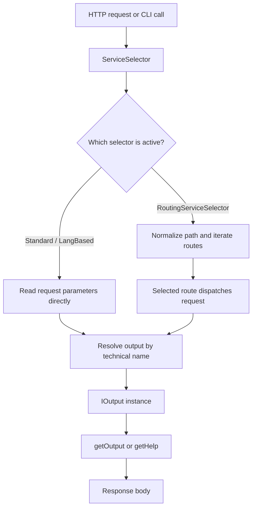

---

## 5. Classic selector flow: `AbstractServiceSelector`

The traditional BASE3 flow is implemented in `AbstractServiceSelector`.

It reads the request directly from the query parameters and resolves an output instance.

### Relevant request parameters

* `name`: technical output name
* `out`: output format, default `html`
* `app`: optional application namespace / app context
* `data`: optional extra data, often used for language

### Core process

1. load core services from the container
2. read `out`, `data`, `app`, `name` from the request
3. optionally redirect authenticated users from `index`
4. call `handleLanguage($data)`
5. resolve the output instance through the class map
6. return `getHelp()` or call `getOutput($out, true)`

### Flow

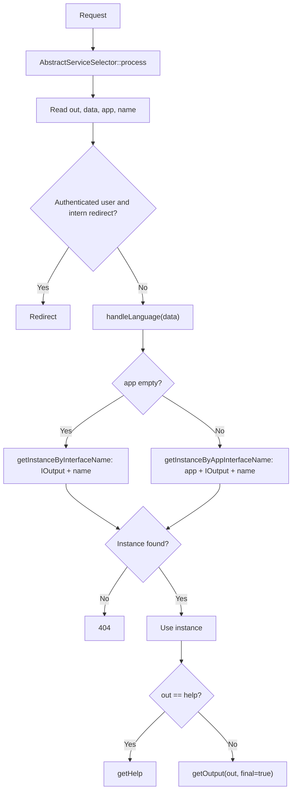

### Important characteristic

This selector does **not** primarily match on the path. It mainly reads request parameters and resolves the target output by name.

That is why query-style routing works naturally here.

It is also the built-in flow that marks endpoint execution explicitly via `final=true`.

---

## 6. Language-aware selector: `LangBasedServiceSelector`

`LangBasedServiceSelector` extends `AbstractServiceSelector` and only customizes the language hook.

If `data` is a two-letter value such as `de` or `en`, it sets the language accordingly.

### Flow

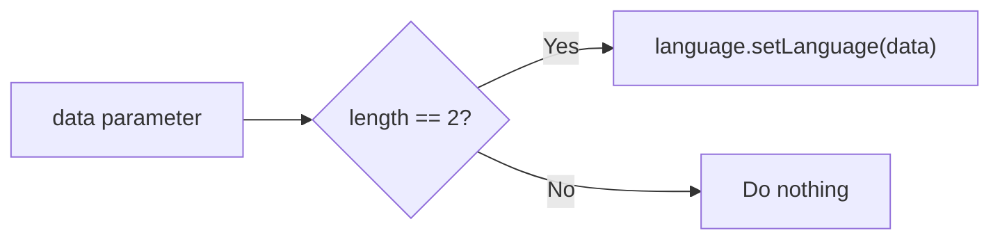

This means language is not a completely separate routing layer. In this selector family it is simply an interpreted routing parameter.

---

## 7. Pretty names via Apache `mod_rewrite`

BASE3 can expose pretty URLs while still keeping the internal request format query-based.

### `.htaccess`

```apache
RewriteRule ^$ index.php
RewriteRule ^(.+)/(.+)\.(.+) index.php?data=$1&name=$2&out=$3 [L,QSA]
RewriteRule ^(.+)\.(.+) index.php?name=$1&out=$2 [L,QSA]
```

### Meaning

#### Root

* `/` becomes `index.php`

#### Pretty URL without language

* `navigation.html`
* internally becomes `index.php?name=navigation&out=html`

#### Pretty URL with language prefix

* `de/navigation.html`
* internally becomes `index.php?data=de&name=navigation&out=html`

### Flow

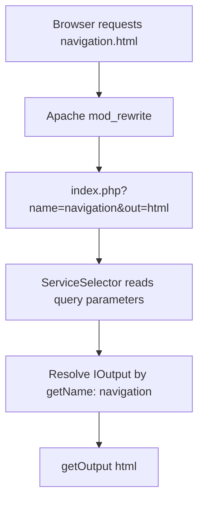

### Important point

Pretty-name routing here is **not** a separate execution model by itself.

It is an alternative external URL shape that gets rewritten into the classic internal query format.

So the execution still follows the normal selector flow after rewriting.

---

## 8. Link generation with `ILinkTargetService`

Incoming request resolution and outgoing link generation are separate concerns.

For outgoing links, BASE3 can use `ILinkTargetService` implementations.

Typical BASE3 target data:

```php
[
	'name' => 'imprint',
	'out' => 'html'
]
```

Additional query parameters:

```php
[
	'a' => 1
]
```

### Standard link target service

Generates query-style links.

Example:

```php
getLink([
	'name' => 'imprint',
	'out' => 'html'
], [
	'a' => 1
]);
```

Result:

```text
?name=imprint&out=html&a=1
```

If `out` is omitted, the default is:

```text
php
```

### Pretty-name link target service

Generates path-style links.

Example:

```php
getLink([
	'name' => 'imprint',
	'out' => 'html'
], [
	'a' => 1
]);
```

Result:

```text
imprint.html?a=1
```

This is intended to be rewritten by Apache back into the standard internal form.

### Link generation overview

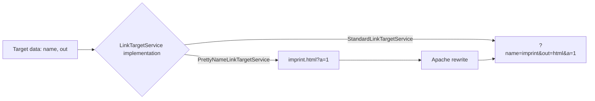

### Key architectural point

The target identity is stable:

* `name = imprint`
* `out = html`

Only the external link representation changes.

---

## 9. Route-based selector: `RoutingServiceSelector`

`RoutingServiceSelector` makes it possible to run multiple routing styles in parallel.

Instead of directly reading query parameters first, it:

1. normalizes the request path
2. loads configured route objects
3. asks each route whether it matches
4. lets the first matching route dispatch the request
5. falls back to the classic selector behavior if no route matches

### Core idea

This selector acts as a routing orchestrator.

It does not hardcode one URL style. It delegates path interpretation to route classes.

### Flow

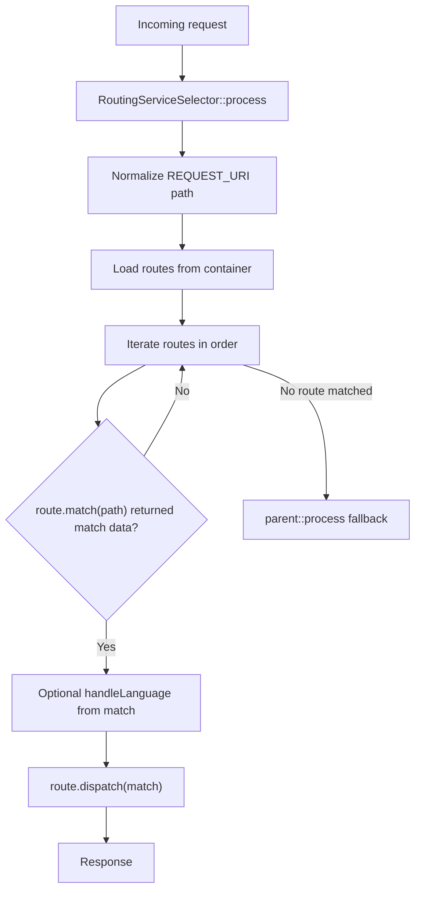

### Important rule

**The first matching route wins.**

This means route order matters.

---

## 10. Built-in route types

### 10.1 `QueryLegacyRoute`

This route preserves the old query-based behavior.

It matches when any of these are present:

* `name`
* `out`
* `app`

It then delegates execution back to `AbstractServiceSelector`.

### Flow

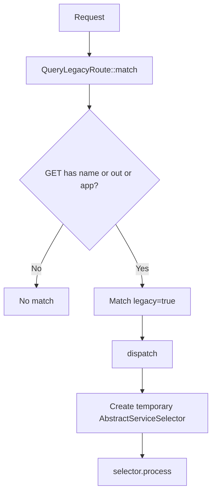

### Why this is useful

It allows route-based routing to coexist with the historical BASE3 query model.

So a project can move to `RoutingServiceSelector` without losing the classic behavior.

Because it delegates back to the selector flow, it also preserves the classic `getOutput(..., true)` behavior.

---

### 10.2 `GenericOutputRoute`

This route is especially important because it demonstrates the `getName()` model in a path-based style.

It matches these URL forms:

* `de/navigation.html`
* `navigation.html`
* `/`
* `/index.php`

It then resolves the output instance by the technical output name.

### Matching rules

#### Language + output name + format

Example:

```text
de/navigation.html
```

Extracted match:

* `data = de`
* `name = navigation`
* `out = html`

#### Output name + format

Example:

```text
navigation.json
```

Extracted match:

* `data = ''`
* `name = navigation`
* `out = json`

#### Root

Example:

```text
/
```

Extracted match:

* `name = index`
* `out = php`

### Important normalization detail

Inside `dispatch()`, `php` is converted to `html`.

So external URL style may use `.php`, while the `IOutput` receives the normalized format `html`.

### Flow

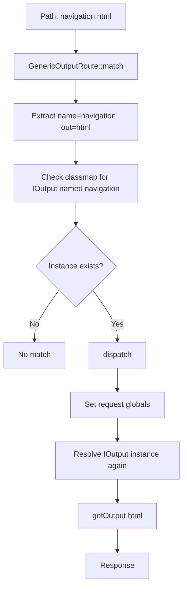

### Why this route matters

This route shows that BASE3 can use path-style routing without abandoning the central `IOutput` + `getName()` lookup model.

The framework still resolves outputs by technical name.

Only the external route syntax changes.

### Important note about `final`

In the current built-in implementation, `GenericOutputRoute` calls `getOutput()` without passing `final=true`.

So direct execution through this route is currently different from the classic `ServiceSelector` flow with respect to the `final` flag.

---

### 10.3 `CliRoute`

This route handles CLI execution.

Example:

```bash
php index.php --name=check --out=php
```

It matches only when `PHP_SAPI === 'cli'` and `name` is present.

It then resolves the output by name and runs it directly.

### Flow

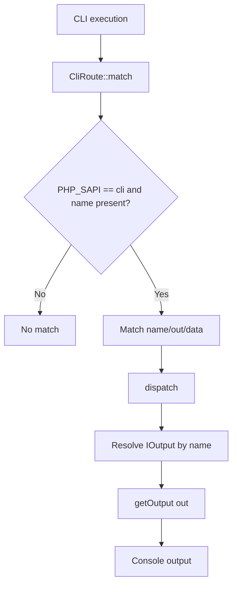

This proves that BASE3 routing is not limited to browser URLs. The same output resolution model can be reused in CLI mode.

### Important note about `final`

In the current built-in implementation, `CliRoute` also calls `getOutput()` without passing `final=true`.

So CLI execution through this route does not currently set the same endpoint marker as the classic selector flow.

---

## 11. The `getName()` variant in detail

This is the most important pattern to understand.

### The central rule

A class becomes directly routable because it provides a unique technical name.

For example:

```php
class Navigation implements IOutput {

	public static function getName(): string {
		return 'navigation';
	}

	public function getOutput(string $out = 'html', bool $final = false): string {
		...
	}
}
```

The framework does not need a hardcoded controller map in this case.

Instead, it asks the class map for:

* an `IOutput` implementation
* whose technical name is `navigation`

### Conceptual lookup

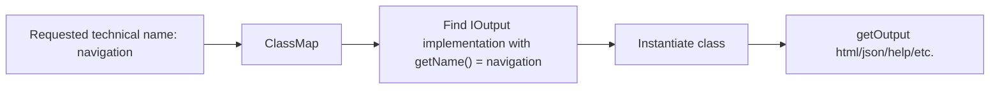

### Why this is powerful

It gives BASE3 a simple and uniform target model:

* route to a technical output name
* use output format as a second dimension
* let the class itself define how rendering works

This works equally well for:

* query routing
* pretty-name routing
* explicit route objects
* CLI routes

### URL examples for the same output

Assume:

* `getName()` returns `navigation`

Then all of these can conceptually point to the same output:

* `?name=navigation&out=html`
* `navigation.html`
* `de/navigation.html`
* route-based dispatch that extracts `name = navigation`
* CLI: `--name=navigation --out=html`

### The important abstraction

The stable thing is not the URL.

The stable thing is the **technical output name**.

That is the key idea behind BASE3 routing.

## 11.1 Endpoint vs internal execution

The `final` flag adds an important distinction.

When an `IOutput` is reached through the classic selector flow, the selector passes `final=true`.

When an `IOutput` is reused internally, application code can call it with `final=false`.

Example:

```php
$content = $someOutput->getOutput('html', false);
```

This allows a class to support internal rendering without automatically exposing the same behavior as a public endpoint.

A restrictive implementation can explicitly deny final execution:

```php
public function getOutput(string $out = 'html', bool $final = false): string {
	if ($final) {
		return '';
	}

	return '<div>Internal content</div>';
}
```

Only the `ServiceSelector` family sets `final=true` in the current built-in implementation.

This means an `IOutput` can be useful as an internal building block without necessarily being intended as a normal web endpoint.

If direct addressing should be prevented, the implementation can check whether `final === true` and reject output in that case.

## 11.2 Complete example: `page1` and `page2`

The following minimal example shows two `IOutput` classes. `page1` generates a link to `page2` via `ILinkTargetService`.

### `Page1.php`

```php
<?php declare(strict_types=1);

namespace Example\Content;

use Base3\Api\IOutput;
use Base3\LinkTarget\Api\ILinkTargetService;

class Page1 implements IOutput {

	public function __construct(
		private readonly ILinkTargetService $linktargetservice
	) {}

	public static function getName(): string {
		return 'page1';
	}

	public function getOutput(string $out = 'html', bool $final = false): string {
		$link = $this->linktargetservice->getLink([
			'name' => 'page2',
			'out' => 'html'
		]);

		return '<!DOCTYPE html>'
			. '<html>'
			. '<head><title>Page 1</title></head>'
			. '<body>'
			. '<h1>Page 1</h1>'
			. '<p><a href="' . htmlspecialchars($link, ENT_QUOTES, 'UTF-8') . '">Go to page 2</a></p>'
			. '</body>'
			. '</html>';
	}

	public function getHelp(): string {
		return 'Help of Page1' . "\n";
	}

}
```

### `Page2.php`

```php
<?php declare(strict_types=1);

namespace Example\Content;

use Base3\Api\IOutput;

class Page2 implements IOutput {

	public static function getName(): string {
		return 'page2';
	}

	public function getOutput(string $out = 'html', bool $final = false): string {
		return '<!DOCTYPE html>'
			. '<html>'
			. '<head><title>Page 2</title></head>'
			. '<body>'
			. '<h1>Page 2</h1>'
			. '<p>You have reached page 2.</p>'
			. '</body>'
			. '</html>';
	}

	public function getHelp(): string {
		return 'Help of Page2' . "\n";
	}

}
```

### Resulting links

With `StandardLinkTargetService`, `page1` generates:

```text
?name=page2&out=html
```

With `PrettyNameLinkTargetService`, the same target becomes:

```text
page2.html
```

Both links point to the same semantic target:

* output class: `Page2`
* technical name: `page2`
* output format: `html`

## 12. Combining multiple routing styles

With `RoutingServiceSelector`, different routing versions can coexist.

For example, a project might support at the same time:

* legacy query links for backward compatibility
* pretty-name output URLs
* custom special routes for dedicated endpoints
* CLI route execution

### Combined flow

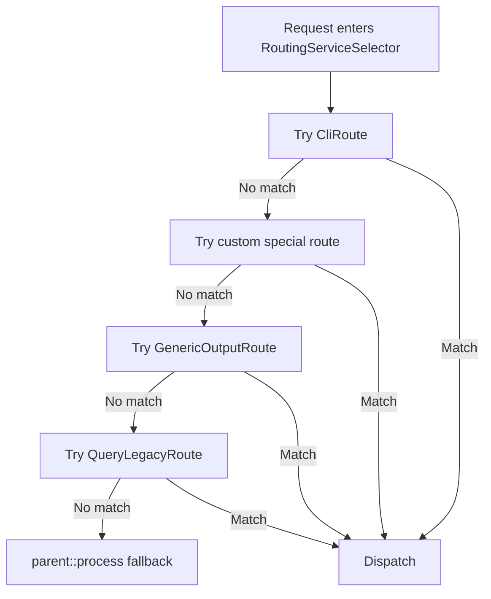

### Result

This makes the routing system extensible without forcing a big-bang migration.

New route styles can be introduced while old links keep working.

---

## 13. Special routes

A route implementation can define its own matching logic completely independently from the generic output-name convention.

That means BASE3 supports two broad categories of routes:

### A. Generic output resolution routes

These still route to `IOutput` by `getName()`.

Examples:

* legacy query route
* generic output route
* pretty-name via rewrite into query parameters

### B. Special-purpose routes

These can do their own logic.

For example, a custom route could:

* match a fixed endpoint
* parse complex path segments
* decide access rules
* dispatch to a completely custom handler
* still optionally resolve an `IOutput`
* or bypass `IOutput` entirely if needed

### Conceptual extension point

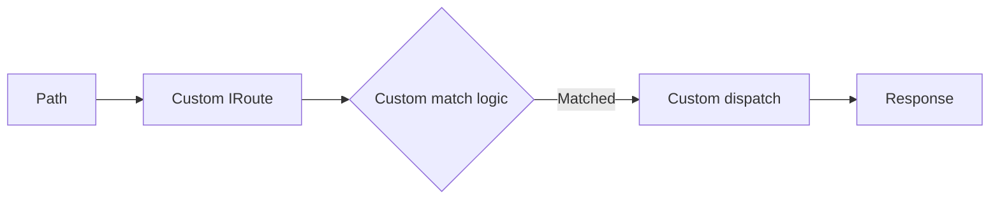

This is what makes `RoutingServiceSelector` the flexible integration point for parallel routing systems.

---

## 14. How pretty-name routing relates to route objects

There are two possible pretty-name stories in BASE3.

### Variant 1: Apache rewrite to query parameters

* browser requests `navigation.html`
* Apache rewrites to `index.php?name=navigation&out=html`
* classic selector logic handles the rest

### Variant 2: direct path matching through a route object

* browser requests `navigation.html`
* `RoutingServiceSelector` sees the raw path
* `GenericOutputRoute` matches it directly
* route dispatches to the correct output

### Comparison

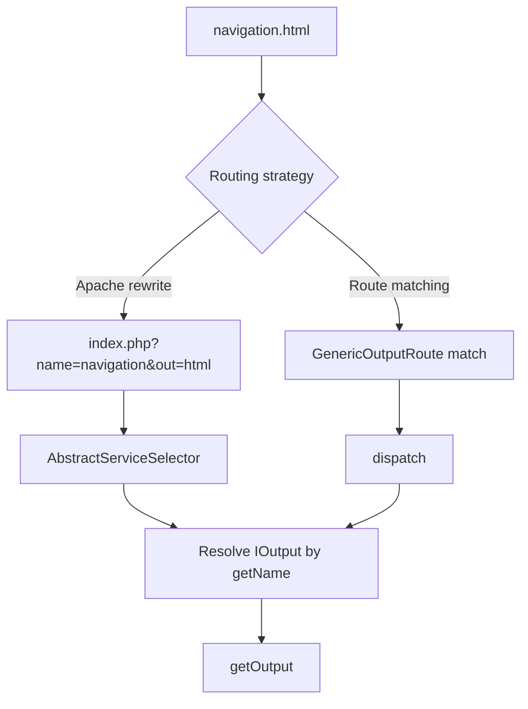

### Meaning

Both variants can serve the same output.

The difference is where the transformation happens:

* either in the web server
* or inside the PHP routing layer

---

## 15. Practical mental model

A useful way to think about BASE3 routing is this:

### Layer 1: external request shape

Examples:

* `?name=navigation&out=html`
* `navigation.html`
* `de/navigation.html`
* `php index.php --name=navigation --out=html`

### Layer 2: routing interpretation

Examples:

* direct selector parameter reading
* Apache rewrite into selector parameters
* route object path matching

### Layer 3: stable semantic target

Usually:

* `IOutput`
* identified by `getName()`
* rendered via `getOutput($out)`

### Diagram

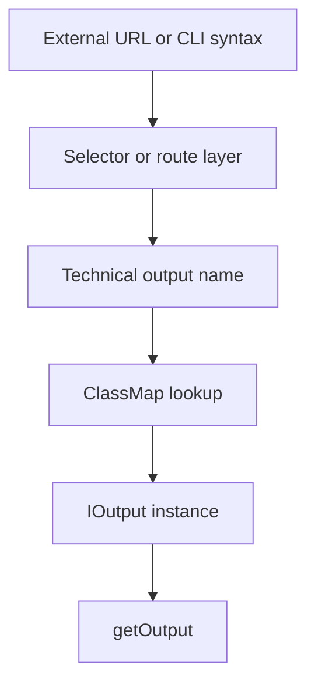

This is why `getName()` is the most important routing anchor in the framework.

---

## 16. Summary

### Stable core idea

BASE3 routing is fundamentally centered on **technical output names**.

The framework typically resolves an `IOutput` implementation by its `IBase::getName()` value and then executes `getOutput()`.

### Supported styles

The same logical target can be reached through different routing styles:

* classic query parameters
* pretty names via `mod_rewrite`
* route objects under `RoutingServiceSelector`
* CLI route execution

### Why this is flexible

Because the URL form is not the real target identity.

The real identity is usually:

* output class implementing `IOutput`
* technical name returned by `getName()`

### Link generation

Outgoing link generation mirrors this with `ILinkTargetService` implementations such as:

* `StandardLinkTargetService`
* `PrettyNameLinkTargetService`

These services generate different link shapes for the same semantic target.

### `final` behavior

In the classic selector flow, `getOutput()` is called with `final=true`.

This makes it possible to distinguish direct endpoint execution from internal reuse of the same `IOutput`.

In the current built-in implementation, this marker is set by the `ServiceSelector` family, while routes such as `GenericOutputRoute` and `CliRoute` currently call `getOutput()` without `final=true`.

### Extension strategy

Projects can:

* keep old query routing
* add pretty-name URLs
* introduce path-based routes
* create highly specialized custom routes
* still preserve the `IOutput` + `getName()` lookup model where useful

---

## 17. Out of scope for this document

The following related topics are intentionally left for separate documentation:

* class map internals
* DI and autowiring
* `instantiate()` mechanics
* application-specific namespacing via `app`
* page modules and catch-all page behavior in more detail

Those topics influence how classes are found and created, but they are not required to understand the routing model itself.

