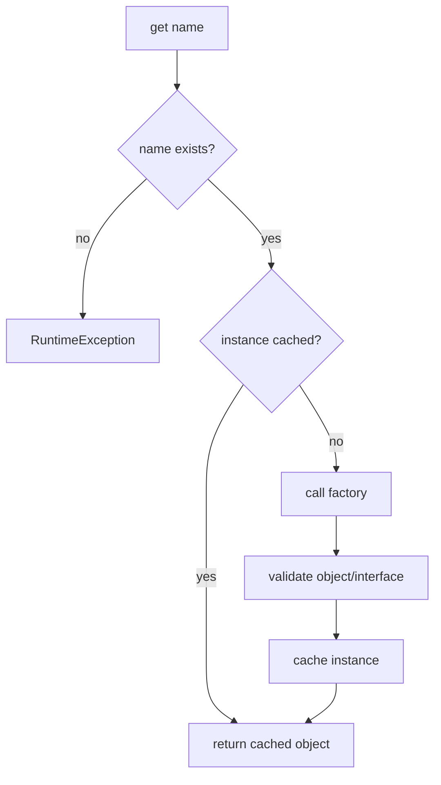

# BASE3 Service Registry

## Purpose

This document explains `IServiceRegistry` and `DefaultServiceRegistry`.

The service registry solves one specific composition problem:

> One service interface has multiple explicitly named runtime implementations, and consumers need to select one by name or use a configured default.

It is not a replacement for the container, class map, or configured components.

---

## 1. Core contract

```php
namespace Base3\Api;

interface IServiceRegistry {

	public function get(string $name): object;

	public function has(string $name): bool;

	public function getDefault(): object;

	public function listNames(): array;
}
```

A registry instance is configured for one interface.

Example mental model:

```text
IFileStorage registry
  default -> local
  local   -> LocalFileStorage
  archive -> ArchiveFileStorage
```

---

## 2. Why this exists

The normal container answers:

```text
What is the active service for this known service id?
```

A service registry answers:

```text
Which named instance of this one service family should I use?
```

This is useful when multiple parallel implementations are intentionally active at the same time.

---

## 3. `DefaultServiceRegistry`

The built-in implementation is:

```php
Base3\Core\DefaultServiceRegistry
```

It is constructed with:

```php
new DefaultServiceRegistry(
	$interfaceFqcn,
	$defaultName,
	$factories
);
```

Example:

```php
$registry = new DefaultServiceRegistry(
	IFileStorage::class,
	'default',
	[
		'default' => fn() => new LocalStorage(),
		'archive' => fn() => new ArchiveStorage(),
	]
);
```

---

## 4. Lazy construction

Factories are not executed during registry construction.

The first call to:

```php
$registry->get('archive');
```

creates the object and caches it.

Later calls return the same cached instance for that name.

Conceptually:



---

## 5. Interface validation

Every created instance is checked with:

```php
is_a($obj, $interfaceFqcn)
```

If the factory returns the wrong type, the registry throws a `RuntimeException`.

This ensures all named entries conform to the service family selected when the registry was constructed.

---

## 6. Configuration validation

`DefaultServiceRegistry` validates its configuration immediately.

It requires:

* a non-empty interface FQCN
* an interface that actually exists
* a non-empty default name
* a factory for the default name
* non-empty string instance names
* callable factories

Invalid composition fails at the registry boundary rather than being silently repaired later.

---

## 7. `get()`

```php
$storage = $registry->get('archive');
```

`get()` throws when:

* the name is unknown
* the factory does not return an object
* the object does not implement the configured interface

This is deliberate. A configured registry should not silently substitute another service when a requested name is invalid.

---

## 8. `has()`

```php
if ($registry->has('archive')) {
	// registry definition exists
}
```

`has()` checks whether a named factory is configured.

It does not need to instantiate the service.

---

## 9. `getDefault()`

```php
$storage = $registry->getDefault();
```

This resolves the name selected as the default during registry construction.

The default is therefore a composition choice, not a naming convention hardcoded into consumers.

---

## 10. `listNames()`

```php
$names = $registry->listNames();
```

The method returns all configured instance names.

This is useful for:

* settings UIs
* diagnostics
* runtime selection controls
* configuration validation

---

## 11. Registry versus container

Use the container when one known service identity should resolve to the active implementation:

```text
ISettingsStore -> DatabaseSettingsStore
```

Use a service registry when several explicitly named instances of the same service interface are active:

```text
IFileStorage registry
  default
  archive
  temporary
```

Do not turn every container service into a registry.

---

## 12. Registry versus class map

Use `IClassMap` when implementations are discoverable by interface and technical `getName()`.

Example:

```text
Which IJob implementations exist?
Which IOutput is named dashboard?
```

Use `IServiceRegistry` when the project has already composed named runtime service instances through explicit factories.

The registry does not scan classes.

---

## 13. Registry versus configured components

Configured components solve a different problem.

```text
IComponentResolver
  one discovered implementation class may have multiple configured runtime instances
  each component has an instance id
  construction still uses class-map autowiring and ComponentDefinition

IServiceRegistry
  explicit named factories create service instances
  registry owns lazy caching for those names
```

Use configured components when implementation discovery plus per-instance configuration is the core requirement.

Use a registry when explicit project composition of named services is sufficient and clearer.

See `components.md`.

---

## 14. Registry wiring

A project may register a typed registry under a project/foundation-specific service id.

Conceptually:

```php
$container->set(
	'filestorage.registry',
	fn($c) => new DefaultServiceRegistry(
		IFileStorage::class,
		'default',
		[
			'default' => fn() => $c->get(ILocalFileStorage::class),
			'archive' => fn() => $c->get(IArchiveFileStorage::class),
		]
	),
	IContainer::SHARED
);
```

The exact service id and interface normally belong to the foundation or plugin that owns the service family.

---

## 15. Avoid duplicated selection layers

Do not add another router or fallback chain in front of a registry merely to hide invalid names.

If selection is wrong, fix the configuration or registry composition at the responsible boundary.

The registry deliberately throws for unknown names because a missing configured service is a composition error.

---

## 16. Summary

```text
IContainer
  active known services

IClassMap
  discovered implementation classes

IComponentResolver
  configured instances of discovered component implementations

IServiceRegistry
  explicitly composed named lazy service instances
```

Choose the mechanism that matches the actual problem and avoid parallel registries for the same responsibility.
