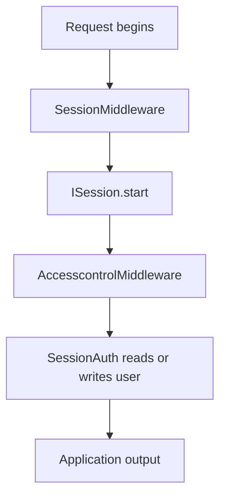

# BASE3 Session System

## Purpose

This document explains the session abstraction in BASE3.

It covers:

* the `ISession` contract
* the lifecycle of a session
* the built-in session implementations
* the difference between `PhpSession`, `BasicSession`, `DomainSession`, and `NoSession`
* how session middleware starts a session
* how authentication strategies use session state
* how language selection can use session state
* how projects should wire a session implementation

---

## 1. Main idea

BASE3 places PHP session access behind:

```php
Base3\Session\Api\ISession
```

This gives runtime code one small contract for:

* checking whether a session is active
* obtaining the session id
* starting and destroying the session
* reading and writing values
* checking and removing values

The abstraction allows projects to deliberately choose whether sessions exist and how they are initialized.

---

## 2. `ISession`

The current contract is:

```php
interface ISession {

	public function started(): bool;

	public function getId(): string;

	public function start(): bool;

	public function destroy(): bool;

	public function get(string $key, mixed $default = null): mixed;

	public function set(string $key, mixed $value): void;

	public function has(string $key): bool;

	public function remove(string $key): void;
}
```

The interface deliberately does not expose PHP session configuration details.

Those belong to the selected implementation or project configuration.

---

## 3. Normal lifecycle

A typical web request uses the session like this:



The middleware only starts the session. Application services can then consume `ISession` through dependency injection.

---

## 4. `AbstractSession`

`AbstractSession` implements the shared storage behavior for PHP-backed sessions.

It provides:

```text
started()
getId()
destroy()
get()
set()
has()
remove()
```

Subclasses only need to implement:

```php
public function start(): bool;
```

### Important behavior

The base implementation considers a session started only when both conditions are true:

```text
internal isStarted flag is true
PHP session_status() is PHP_SESSION_ACTIVE
```

This means application code should not assume that the presence of `$_SESSION` alone means the configured `ISession` is active.

---

## 5. `PhpSession`

`PhpSession` is the smallest normal PHP-backed implementation.

Its `start()` method:

* returns `true` if already started
* returns `false` under CLI
* calls `session_start()` when no PHP session exists
* marks the session as started

Use it when normal PHP session behavior is sufficient.

---

## 6. `BasicSession`

`BasicSession` receives `IConfiguration`.

It reads the `session` configuration group and currently defines defaults for:

```text
extensions
cookiedomain
```

The current implementation otherwise starts a normal PHP session.

The configuration read is retained for compatibility and future/session-specific behavior.

---

## 7. `DomainSession`

`DomainSession` also receives `IConfiguration` and reads:

```text
session/cookiedomain
```

When a cookie domain is configured it applies:

```php
ini_set('session.cookie_domain', $config['cookiedomain']);
```

before starting the PHP session.

This is useful when multiple hosts or subdomains intentionally share one session cookie domain.

### Example configuration

```ini
[session]
cookiedomain = ".example.org"
```

The exact domain configuration is project-specific.

---

## 8. `NoSession`

`NoSession` is a null-object implementation.

Its behavior is deterministic:

```text
started() -> false
getId() -> ""
start() -> false
destroy() -> false
get() -> provided default
set() -> no-op
has() -> false
remove() -> no-op
```

Use it when a project deliberately has no session support but consumers should still be able to depend on `ISession` without null checks.

---

## 9. CLI behavior

The PHP-backed implementations intentionally do not start a PHP session under CLI:

```php
if (PHP_SAPI === 'cli') {
	return false;
}
```

CLI jobs should use explicit runtime state mechanisms such as `IStateStore` when they need persistence across executions.

A browser session is not a worker state backend.

---

## 10. Reading and writing session values

Consumers should use the interface:

```php
final class WizardState {

	public function __construct(
		private readonly ISession $session
	) {}

	public function rememberStep(int $step): void {
		$this->session->set('wizard.step', $step);
	}

	public function getStep(): int {
		return (int) $this->session->get('wizard.step', 1);
	}
}
```

This is preferable to direct `$_SESSION` access in new runtime services because it keeps the session boundary explicit and replaceable.

---

## 11. Session middleware

The built-in middleware is:

```php
Base3\Middleware\Session\SessionMiddleware
```

It does exactly one thing before delegating:

```php
$this->session->start();
return $this->next->process();
```

It does not enforce that session startup succeeded.

If a project requires an active session, that requirement should be checked at the appropriate application or infrastructure boundary.

---

## 12. Sessions and authentication

`SessionAuth` uses `ISession` as one authentication strategy.

The intended chain is typically:

```text
SessionMiddleware
  starts PHP session

AccesscontrolMiddleware
  calls IAccesscontrol.authenticate

SessionAuth
  reads or persists user identity in the active session
```

This separation avoids making the session implementation itself responsible for authentication.

See `accesscontrol-authentication.md`.

---

## 13. Sessions and language selection

`MultiLang` depends on both `IConfiguration` and `ISession`.

Its dependency check expects the session to be started.

The current implementation stores the selected language under:

```text
$_SESSION["language"]
```

That means projects using `MultiLang` should normally start the session before language-dependent request processing occurs.

See `language-translation.md`.

---

## 14. Session versus State Store

Do not use browser session state for operational worker state.

Use `ISession` for request/user session concerns such as:

* login state
* browser workflow state
* language preference for the active session
* short-lived per-user interaction state

Use `IStateStore` for operational state such as:

* worker locks
* last-run timestamps
* cursors
* checkpoints
* cross-process coordination

See `statestore.md`.

---

## 15. Wiring a session service

A project or bootstrap can expose a session implementation under `ISession`:

```php
$container->set(
	ISession::class,
	fn($c) => new DomainSession($c->get(IConfiguration::class)),
	IContainer::SHARED
);
```

If middleware uses the session, register the middleware with the same service instance.

The final backend choice belongs to project composition.

---

## 16. Current implementation notes

Some older framework classes still access `$_SESSION` directly even when they also depend on `ISession`.

For new code, prefer `ISession` where the contract is sufficient.

Do not add parallel session abstractions to compensate for legacy direct access. New runtime code should use the existing session boundary.

---

## 17. Summary

```text
ISession
  session lifecycle and key/value access

PhpSession
  basic PHP session

BasicSession
  configuration-aware PHP session

DomainSession
  PHP session with configurable cookie domain

NoSession
  explicit no-session implementation

SessionMiddleware
  starts the configured session before downstream request handling
```

Choose the implementation in composition code and keep consumers dependent on `ISession`.
