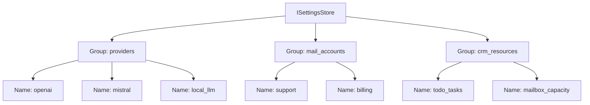
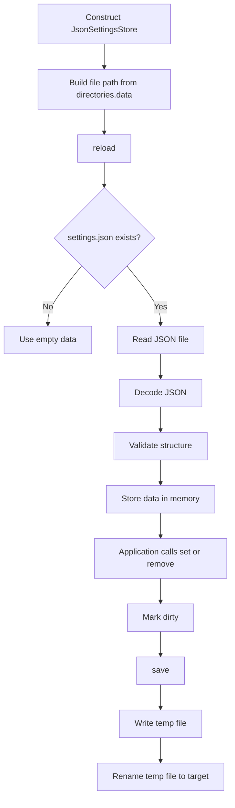
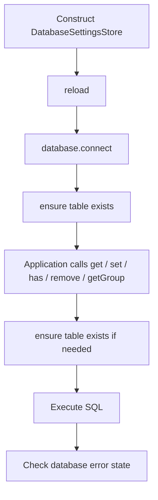
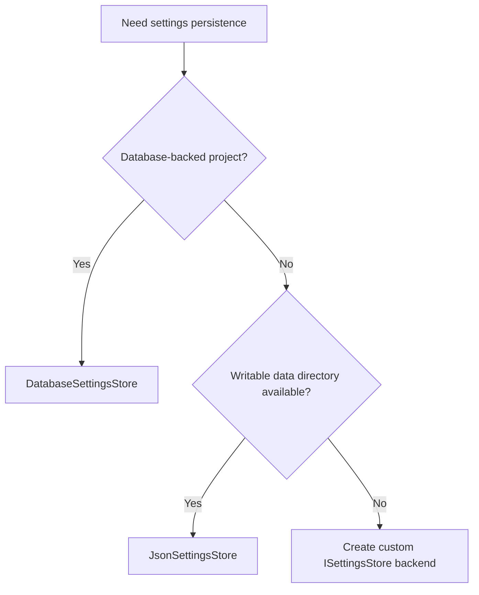

# BASE3 Framework Settings Store

## Purpose

This document explains how the **Settings Store** works in the BASE3 framework.

It is written for developers who build plugins or project-specific services and want to understand:

* what `ISettingsStore` is for
* how settings datasets are addressed by group and name
* when to use the Settings Store instead of `IConfiguration`
* when not to use it as runtime state storage
* how the JSON-backed implementation behaves
* how the database-backed implementation behaves
* how to consume the Settings Store through dependency injection
* how to design grouped settings for providers, integrations, accounts, resources, and plugin features

After reading this document, a plugin developer should be able to:

* inject `ISettingsStore`
* read and write named settings datasets
* list all datasets inside a group
* choose between JSON and database storage
* understand `save()` and `reload()` behavior
* design stable group and name conventions
* avoid mixing static configuration, operational state, and user-managed settings

---

## 1. What the Settings Store is

The BASE3 Settings Store is a small persistence abstraction for **grouped, named settings datasets**.

A dataset is always addressed by two identifiers:

```text
group + name
```

Example:

```text
group: providers
name: openai
```

The dataset itself is an associative array:

```php
[
	'label' => 'OpenAI',
	'endpoint' => 'https://api.example.com',
	'model' => 'default-model',
	'enabled' => true
]
```

This gives BASE3 a practical model for settings that are more dynamic than static framework configuration, but more structured than simple key-value runtime state.

---

## 2. Mental model

Think of the Settings Store as:

> A registry of named settings records, grouped by domain.

Each group contains multiple named datasets.



The important distinction is that each dataset is not just one scalar value. It is an array of related settings.

---

## 3. Why this exists

`IConfiguration` is useful for framework-level and plugin-level configuration sections.

`IStateStore` is useful for runtime markers such as last-run timestamps, locks, cursors, and temporary operational state.

The Settings Store fills a different gap.

It is useful when the application needs to manage **multiple named configuration-like records** at runtime.

Examples:

* API providers
* mail accounts
* CRM resources
* worker profiles
* export profiles
* webhook endpoints
* import source definitions
* AI model presets
* tenant-specific service settings
* project-defined integrations

Instead of forcing these into one large config section, the Settings Store gives each dataset a stable group and name.

---

## 4. Settings Store vs Configuration vs State Store

### Use `IConfiguration` for framework or plugin configuration

Configuration answers questions like:

* Which database host should the framework use?
* Which logger backend is configured?
* Is a plugin enabled?
* What is the default layout?

Configuration is usually relatively stable and often loaded during bootstrap.

### Use `ISettingsStore` for named settings records

Settings Store answers questions like:

* Which providers are configured?
* Which mail accounts exist?
* What settings belong to the `support` mail account?
* Which CRM resource definitions are available?
* What are the settings for the `nightly_export` profile?

These settings are usually edited through admin screens or project tooling.

### Use `IStateStore` for runtime state

State Store answers questions like:

* When did this job last run?
* Which remote item ID was processed last?
* Is a lock currently held?
* When may this service run again?

State is produced by execution. Settings are edited configuration-like records.

---

## 5. Core interface

The central contract is:

```php
<?php declare(strict_types=1);

namespace Base3\Settings\Api;

interface ISettingsStore {

	public function get(string $group, string $name, array $default = []): array;

	public function set(string $group, string $name, array $settings): void;

	public function has(string $group, string $name): bool;

	public function remove(string $group, string $name): void;

	public function getGroup(string $group): array;

	public function save(): void;

	public function reload(): void;
}
```

The interface is intentionally compact.

It does not expose low-level storage details. It only models the operations plugin code normally needs:

* read one dataset
* replace one dataset
* check whether a dataset exists
* remove one dataset
* list a whole group
* persist pending changes
* reload from storage

---

## 6. Addressing model

Every dataset is addressed by:

```text
group/name
```

Example:

```php
$settings = $settingsStore->get('providers', 'openai');
```

This reads the dataset:

```text
providers/openai
```

The returned value is always an array.

If the dataset does not exist, the provided default is returned:

```php
$settings = $settingsStore->get('providers', 'openai', [
	'label' => 'OpenAI',
	'enabled' => false
]);
```

---

## 7. Dataset structure

A dataset should contain related settings for one named thing.

Good:

```php
[
	'label' => 'Support Mailbox',
	'host' => 'imap.example.com',
	'port' => 993,
	'encryption' => 'ssl',
	'username' => 'support@example.com',
	'enabled' => true
]
```

Less good:

```php
[
	'support_mail_host' => 'imap.example.com',
	'billing_mail_host' => 'imap.example.com',
	'openai_endpoint' => '...',
	'cleanup_enabled' => true
]
```

A dataset should describe one thing, not many unrelated things.

---

## 8. Method-by-method explanation

## 8.1 `get()`

```php
$settings = $settingsStore->get('providers', 'openai', []);
```

`get()` returns one settings dataset.

If the dataset does not exist, the default array is returned.

This makes read-side code simple:

```php
$provider = $settingsStore->get('providers', 'openai', [
	'enabled' => false
]);

if (empty($provider['enabled'])) {
	return;
}
```

Important behavior:

* the result is always an array
* missing datasets return the provided default
* invalid stored JSON or invalid stored structure may throw an exception in concrete backends

---

## 8.2 `set()`

```php
$settingsStore->set('providers', 'openai', [
	'label' => 'OpenAI',
	'endpoint' => 'https://api.example.com',
	'model' => 'default-model',
	'enabled' => true
]);
```

`set()` replaces one dataset completely.

It is not a partial merge.

That means this call:

```php
$settingsStore->set('providers', 'openai', [
	'enabled' => false
]);
```

replaces the whole `providers/openai` dataset with only:

```php
[
	'enabled' => false
]
```

If you want to update one field while preserving existing values, read first, merge in application code, then write back:

```php
$settings = $settingsStore->get('providers', 'openai', []);
$settings['enabled'] = false;

$settingsStore->set('providers', 'openai', $settings);
$settingsStore->save();
```

---

## 8.3 `has()`

```php
if ($settingsStore->has('providers', 'openai')) {
	// dataset exists
}
```

`has()` checks whether one dataset exists.

Use it when existence matters independently from the settings content.

Example:

```php
if (!$settingsStore->has('mail_accounts', 'support')) {
	throw new RuntimeException('Support mailbox is not configured.');
}
```

---

## 8.4 `remove()`

```php
$settingsStore->remove('providers', 'openai');
```

`remove()` deletes one dataset.

In the JSON implementation, the parent group is removed as well when it becomes empty.

In the database implementation, the matching row is deleted.

---

## 8.5 `getGroup()`

```php
$providers = $settingsStore->getGroup('providers');
```

`getGroup()` returns all datasets inside one group.

The returned array is keyed by dataset name:

```php
[
	'openai' => [
		'label' => 'OpenAI',
		'enabled' => true
	],
	'mistral' => [
		'label' => 'Mistral',
		'enabled' => false
	]
]
```

If the group does not exist, an empty array is returned.

This is useful for:

* admin overview pages
* provider registries
* account lists
* resource definitions
* dynamic integration selection

---

## 8.6 `save()`

```php
$settingsStore->save();
```

`save()` persists pending changes.

The exact behavior depends on the backend.

### JSON backend

`JsonSettingsStore` keeps settings in memory and marks them dirty when they change.

`save()` writes the full JSON file.

### Database backend

`DatabaseSettingsStore` writes changes immediately in `set()` and `remove()`.

For this backend, `save()` is intentionally a no-op.

This difference is important when writing backend-independent plugin code.

Recommended style:

```php
$settingsStore->set('providers', 'openai', $settings);
$settingsStore->save();
```

This works with both implementations:

* JSON backend: `save()` persists the pending change
* Database backend: the change was already persisted; `save()` does nothing

---

## 8.7 `reload()`

```php
$settingsStore->reload();
```

`reload()` reloads the underlying storage.

This is useful in long-running processes such as:

* workers
* daemons
* CLI loops
* import services
* background synchronization jobs

Example:

```php
while (true) {
	$settingsStore->reload();

	$providers = $settingsStore->getGroup('providers');

	// process using current settings
}
```

Without reload support, a long-running process may keep using stale settings.

---

## 9. JSON-backed settings store

The JSON implementation is:

```php
Base3\Settings\Json\JsonSettingsStore
```

It stores all grouped settings in one JSON file.

The file path is built from framework configuration:

```text
<directories.data>/cnf/settings.json
```

The implementation receives `IConfiguration` through the constructor and reads:

```php
$configuration->getString('directories', 'data', '')
```

If the `directories.data` value is missing, construction fails with an exception.

---

## 10. JSON file structure

The JSON file contains a nested object:

```json
{
	"providers": {
		"openai": {
			"label": "OpenAI",
			"endpoint": "https://api.example.com",
			"enabled": true
		},
		"mistral": {
			"label": "Mistral",
			"endpoint": "https://api.example.com",
			"enabled": false
		}
	},
	"mail_accounts": {
		"support": {
			"label": "Support",
			"host": "imap.example.com",
			"port": 993
		}
	}
}
```

This maps directly to the addressing model:

```text
providers/openai
providers/mistral
mail_accounts/support
```

---

## 11. JSON backend lifecycle



The JSON backend uses an in-memory array.

Changes made with `set()` or `remove()` are not durable until `save()` is called.

---

## 12. JSON backend validation

On reload, the JSON backend validates the structure.

Expected shape:

```text
group => name => settings array
```

Invalid examples:

```json
{
	"providers": "wrong"
}
```

```json
{
	"providers": {
		"openai": "wrong"
	}
}
```

Both are invalid because groups and datasets must be objects or arrays.

This protects application code from receiving unexpected scalar values.

---

## 13. JSON backend save behavior

When `save()` is called, the JSON backend:

1. ensures the parent directory exists
2. encodes the full settings data as pretty JSON
3. writes to a temporary file
4. renames the temporary file to the final path
5. resets the dirty flag

This write pattern avoids writing directly into the target file.

If writing or renaming fails, an exception is thrown.

---

## 14. Database-backed settings store

The database implementation is:

```php
Base3\Settings\Database\DatabaseSettingsStore
```

It stores each dataset as one database row.

The table name is:

```text
base3_settingsstore
```

The storage model is:

```text
group    logical settings group
name     dataset name inside the group
settings JSON-encoded settings array
```

---

## 15. DatabaseSettingsStore and migrations

The database-backed settings store owns its private settings table. A guarded table initialization step is acceptable for the minimal table that the backend needs to function.

Later schema changes should be represented as migration steps owned by the database-backed settings implementation. They should not be copied into every project plugin that chooses this backend.

If a project uses the JSON-backed settings store, no settings-store database migration is relevant. A settings-store migration provider should therefore check the active runtime composition before returning active migrations.

---

## 16. Database table schema

The database backend ensures the table exists automatically.

Conceptual schema:

```sql
CREATE TABLE IF NOT EXISTS base3_settingsstore (
	`group` VARCHAR(190) NOT NULL,
	`name` VARCHAR(190) NOT NULL,
	`settings` LONGTEXT NOT NULL,
	PRIMARY KEY (`group`, `name`)
)
```

The composite primary key means one group can contain many names, but the same group/name pair can exist only once.

Examples:

```text
providers/openai
providers/mistral
mail_accounts/support
mail_accounts/billing
```

---

## 17. Database backend lifecycle



The database backend is write-through.

That means:

* `set()` persists immediately
* `remove()` persists immediately
* `save()` does nothing
* `reload()` reconnects and ensures the table exists

---

## 18. Database backend write behavior

`set()` serializes the settings array to JSON and writes it with an upsert:

```sql
INSERT INTO base3_settingsstore (`group`, `name`, `settings`)
VALUES (...)
ON DUPLICATE KEY UPDATE `settings` = ...
```

This means the same method handles both:

* creating a new dataset
* replacing an existing dataset

The stored value must decode back to an array.

If JSON encoding or decoding fails, the backend throws an exception.

---

## 19. Database backend read behavior

`get()` loads the JSON payload for one group/name pair.

If no row exists, the default is returned.

`getGroup()` loads all rows for one group and returns them keyed by dataset name.

Conceptual result:

```php
[
	'openai' => [
		'label' => 'OpenAI',
		'enabled' => true
	],
	'mistral' => [
		'label' => 'Mistral',
		'enabled' => false
	]
]
```

The backend validates each row while loading.

If a row cannot be decoded into an array, an exception is thrown.

---

## 20. Choosing the backend

Use `JsonSettingsStore` when:

* you want a simple file-based setup
* settings are edited rarely
* deployment already has a writable data directory
* the project is small or standalone
* database persistence is not required

Use `DatabaseSettingsStore` when:

* settings should be managed centrally in the database
* multiple processes or requests may update settings
* admin tools should query settings through SQL
* file writes are inconvenient in the host environment
* settings belong naturally to a database-backed application



---

## 21. Dependency injection usage

Plugin code should depend on the interface:

```php
Base3\Settings\Api\ISettingsStore
```

Recommended:

```php
<?php declare(strict_types=1);

namespace ExamplePlugin\Service;

use Base3\Settings\Api\ISettingsStore;

final class ProviderRegistry {

	public function __construct(
		private readonly ISettingsStore $settingsStore
	) {}

	public function getProvider(string $name): array {
		return $this->settingsStore->get('providers', $name, []);
	}

	public function getProviders(): array {
		return $this->settingsStore->getGroup('providers');
	}
}
```

Avoid depending on a concrete backend in normal plugin code.

Less good:

```php
public function __construct(
	private readonly JsonSettingsStore $settingsStore
) {}
```

The project should decide which backend is bound to `ISettingsStore`.

---

## 22. Example registration

The exact registration depends on the project bootstrap, but conceptually the container maps the interface to one backend.

### JSON backend

```php
<?php declare(strict_types=1);

use Base3\Configuration\Api\IConfiguration;
use Base3\Settings\Api\ISettingsStore;
use Base3\Settings\Json\JsonSettingsStore;

$container->set(
	ISettingsStore::class,
	fn($c) => new JsonSettingsStore($c->get(IConfiguration::class)),
	IContainer::SHARED
);
```

### Database backend

```php
<?php declare(strict_types=1);

use Base3\Database\Api\IDatabase;
use Base3\Settings\Api\ISettingsStore;
use Base3\Settings\Database\DatabaseSettingsStore;

$container->set(
	ISettingsStore::class,
	fn($c) => new DatabaseSettingsStore($c->get(IDatabase::class)),
	IContainer::SHARED
);
```

The important part is that consumers receive only `ISettingsStore`.

---

## 23. Example: provider settings

A common use case is a provider registry.

```php
$settingsStore->set('providers', 'openai', [
	'label' => 'OpenAI',
	'type' => 'llm',
	'endpoint' => 'https://api.example.com',
	'model' => 'default-model',
	'enabled' => true
]);

$settingsStore->set('providers', 'local', [
	'label' => 'Local Model',
	'type' => 'llm',
	'endpoint' => 'http://localhost:11434',
	'model' => 'local-model',
	'enabled' => false
]);

$settingsStore->save();
```

Read one provider:

```php
$provider = $settingsStore->get('providers', 'openai', []);
```

Read all providers:

```php
$providers = $settingsStore->getGroup('providers');
```

Filter enabled providers:

```php
$enabled = array_filter(
	$settingsStore->getGroup('providers'),
	fn(array $provider): bool => !empty($provider['enabled'])
);
```

---

## 24. Example: mail account settings

```php
$settingsStore->set('mail_accounts', 'support', [
	'label' => 'Support Mailbox',
	'host' => 'imap.example.com',
	'port' => 993,
	'encryption' => 'ssl',
	'username' => 'support@example.com',
	'enabled' => true
]);

$settingsStore->save();
```

A mail import service can then read the account by name:

```php
$account = $settingsStore->get('mail_accounts', 'support');

if (empty($account['enabled'])) {
	return;
}
```

This keeps the mail account definition outside the job logic.

---

## 25. Example: CRM resource settings

For CRM-style resource monitoring, each resource can be a named dataset.

```php
$settingsStore->set('crm_resources', 'todo_tasks', [
	'label' => 'Open TODO tasks',
	'type' => 'counter',
	'source' => 'crm',
	'query' => 'todo.open',
	'warning_threshold' => 20,
	'critical_threshold' => 50,
	'enabled' => true
]);

$settingsStore->set('crm_resources', 'database_backup', [
	'label' => 'Database backup status',
	'type' => 'healthcheck',
	'source' => 'crm',
	'check' => 'backup_age',
	'max_age_hours' => 24,
	'enabled' => true
]);

$settingsStore->save();
```

A monitoring service can load all resource definitions:

```php
$resources = $settingsStore->getGroup('crm_resources');

foreach ($resources as $name => $resource) {
	if (empty($resource['enabled'])) {
		continue;
	}

	// evaluate resource
}
```

---

## 26. Group and name conventions

Use stable, readable group names.

Recommended group examples:

```text
providers
mail_accounts
crm_resources
import_profiles
export_profiles
webhook_endpoints
worker_profiles
```

Use stable, URL-safe names when possible.

Recommended names:

```text
openai
mistral
support
billing
nightly_export
todo_tasks
database_backup
```

Avoid names that are empty, user-hostile, or unstable.

Less good:

```text
Provider 1
My new test thing!!!
2026-06-29 temporary maybe
```

The implementation only rejects empty group and name values, but projects should still define stronger naming conventions where needed.

---

## 27. Suggested naming pattern

A practical convention is:

```text
group: plural domain name
name: stable technical identifier
```

Examples:

```text
providers/openai
providers/mistral
mail_accounts/support
mail_accounts/billing
crm_resources/todo_tasks
crm_resources/database_backup
export_profiles/monthly_report
```

This keeps admin screens and code predictable.

---

## 28. Validation responsibility

The Settings Store validates only the storage shape:

* group must not be empty
* name must not be empty
* dataset must be an array
* JSON must decode correctly
* backend operations must not fail

It does not know the domain-specific schema of your settings.

That means plugin code should validate its own expected fields.

Example:

```php
$provider = $settingsStore->get('providers', 'openai', []);

if (($provider['endpoint'] ?? '') === '') {
	throw new RuntimeException('Provider endpoint is missing.');
}

if (($provider['model'] ?? '') === '') {
	throw new RuntimeException('Provider model is missing.');
}
```

For larger plugins, create a dedicated settings service instead of spreading validation everywhere.

---

## 29. Recommended wrapper service

A wrapper service keeps access consistent.

```php
<?php declare(strict_types=1);

namespace ExamplePlugin\Provider;

use Base3\Settings\Api\ISettingsStore;
use RuntimeException;

final class ProviderSettingsService {

	public function __construct(
		private readonly ISettingsStore $settingsStore
	) {}

	public function getProvider(string $name): array {
		$provider = $this->settingsStore->get('providers', $name, []);

		if ($provider === []) {
			throw new RuntimeException('Provider not found: ' . $name);
		}

		if (($provider['endpoint'] ?? '') === '') {
			throw new RuntimeException('Provider endpoint is missing: ' . $name);
		}

		return $provider;
	}

	public function getEnabledProviders(): array {
		return array_filter(
			$this->settingsStore->getGroup('providers'),
			fn(array $provider): bool => !empty($provider['enabled'])
		);
	}

	public function saveProvider(string $name, array $settings): void {
		$this->settingsStore->set('providers', $name, $settings);
		$this->settingsStore->save();
	}
}
```

This has several advantages:

* group names are centralized
* defaults are centralized
* validation is centralized
* consuming code stays clean
* the backend remains replaceable

---

## 30. Error handling

Concrete implementations throw exceptions for invalid or failed storage operations.

Typical failure cases:

* empty group
* empty name
* JSON encoding failure
* JSON decoding failure
* invalid JSON file structure
* missing `directories.data` for the JSON backend
* database connection or query errors
* settings payload that does not decode to an array

Plugin code should decide where to catch these exceptions.

For admin screens, catch and show a controlled error.

For background services, catch and log.

Example:

```php
try {
	$settings = $settingsStore->get('providers', 'openai');
}
catch (RuntimeException $e) {
	$logger->error('Failed to load provider settings: ' . $e->getMessage(), [
		'scope' => 'settings'
	]);

	return;
}
```

---

## 31. Security considerations

The Settings Store persists plain array data.

It does not automatically encrypt fields.

Be careful with sensitive values such as:

* API keys
* passwords
* access tokens
* refresh tokens
* private webhook secrets

If sensitive values are stored here, the project should ensure:

* strict file permissions for JSON storage
* restricted database access for database storage
* no accidental display in admin screens
* no logging of full settings arrays
* optional project-specific encryption for secret fields

A safer pattern is to store references to secrets instead of raw secrets when the host project provides a secret manager.

---

## 32. Common usage patterns

### 31.1 Admin settings form

```php
public function saveProviderFromForm(array $form): void {
	$name = (string)($form['name'] ?? '');

	$settings = [
		'label' => (string)($form['label'] ?? ''),
		'endpoint' => (string)($form['endpoint'] ?? ''),
		'model' => (string)($form['model'] ?? ''),
		'enabled' => !empty($form['enabled'])
	];

	$this->settingsStore->set('providers', $name, $settings);
	$this->settingsStore->save();
}
```

### 31.2 Runtime lookup by name

```php
$accountName = (string)$request->get('account', 'support');
$account = $settingsStore->get('mail_accounts', $accountName, []);

if ($account === []) {
	return 'Unknown account.';
}
```

### 31.3 Listing options for a UI

```php
$options = [];

foreach ($settingsStore->getGroup('providers') as $name => $settings) {
	$options[$name] = $settings['label'] ?? $name;
}
```

### 31.4 Replacing one dataset

```php
$settingsStore->set('export_profiles', 'monthly_report', [
	'label' => 'Monthly Report',
	'format' => 'xlsx',
	'recipients' => [
		'finance@example.com'
	],
	'enabled' => true
]);

$settingsStore->save();
```

### 31.5 Removing a dataset

```php
$settingsStore->remove('export_profiles', 'monthly_report');
$settingsStore->save();
```

---

## 33. Long-running processes

Long-running workers should call `reload()` when they need current settings.

Example:

```php
public function go() {
	$this->settingsStore->reload();

	$accounts = $this->settingsStore->getGroup('mail_accounts');

	foreach ($accounts as $name => $account) {
		if (empty($account['enabled'])) {
			continue;
		}

		// process account
	}

	return 'Mail accounts processed.';
}
```

This avoids stale in-memory settings in the JSON backend and makes the intent clear for all backends.

---

## 34. Backend-independent write style

Because `save()` behaves differently depending on the backend, plugin code should use this simple pattern:

```php
$settingsStore->set($group, $name, $settings);
$settingsStore->save();
```

This is safe for both included backends.

For `JsonSettingsStore`, `save()` is necessary.

For `DatabaseSettingsStore`, `save()` is harmless.

This keeps plugin code portable.

---

## 35. What should not go into the Settings Store

Do not use the Settings Store for high-volume domain data.

Bad examples:

* all imported CRM contacts
* all mail messages
* all user records
* large report result sets
* log entries
* job execution history
* cache payloads
* rapidly changing counters

Use proper domain tables, loggers, cache, or the state store for those concerns.

The Settings Store is best for compact, named settings records.

---

## 36. Custom implementations

A project can provide another implementation of `ISettingsStore`.

Possible custom backends:

* tenant-aware database settings store
* encrypted settings store
* remote settings service
* read-only deployment settings store
* hybrid file/database settings store
* settings store backed by a host platform

A custom implementation must preserve the interface behavior:

* `get()` returns one dataset or the default
* `set()` replaces one dataset
* `has()` checks dataset existence
* `remove()` deletes one dataset
* `getGroup()` returns all datasets in a group keyed by name
* `save()` persists pending changes if the backend buffers writes
* `reload()` refreshes from the underlying storage

---

## 37. Recommended plugin structure

A plugin that uses settings heavily should keep settings access behind service classes.

```text
plugin/
└── ExamplePlugin/
	└── src/
	    ├── Provider/
	    │   ├── ProviderSettingsService.php
	    │   └── ProviderRegistry.php
	    ├── Mail/
	    │   └── MailAccountSettingsService.php
	    └── Resource/
	        └── ResourceSettingsService.php
```

This avoids scattering raw group and name strings across unrelated classes.

---

## 38. Practical rules

Use `ISettingsStore` through constructor injection.

Use stable group names.

Use stable dataset names.

Keep each dataset focused on one named thing.

Treat `set()` as full replacement, not as merge.

Call `save()` after writes in backend-independent code.

Call `reload()` in long-running processes when external changes matter.

Validate domain-specific settings in your own service layer.

Do not store large domain data in the Settings Store.

Do not log complete settings arrays when they may contain secrets.

---

## 39. Summary

The BASE3 Settings Store provides a compact abstraction for grouped, named settings datasets.

It is especially useful for project-managed records such as providers, accounts, resources, profiles, and integration definitions.

The interface stays small:

* `get()`
* `set()`
* `has()`
* `remove()`
* `getGroup()`
* `save()`
* `reload()`

The included backends cover two common deployment models:

* `JsonSettingsStore` for file-based settings
* `DatabaseSettingsStore` for database-backed settings

Plugin code should depend on `ISettingsStore`, not on a concrete backend.

This keeps settings access portable, testable, and consistent across BASE3 projects.
