# BASE3 Framework State Store

## Purpose

This document explains how the **State Store** works in the BASE3 framework.

It is written for developers who build their own plugins and want to understand:

* what `IStateStore` is for
* when to use it instead of configuration or cache
* how keys, TTL, locks, and prefixes work
* how the built-in database-backed implementation behaves
* how to consume the state store through dependency injection
* how to design safe runtime-state patterns in your own services
* how to implement a custom backend when needed

The goal is practical understanding. After reading this document, a plugin developer should be able to:

* inject `IStateStore`
* persist runtime markers safely
* use TTL-based entries and lock-like keys correctly
* inspect state entries by prefix
* understand the behavior of `DatabaseStateStore`
* create their own `IStateStore` implementation if their project needs a different backend

---

## 1. What the State Store is

The BASE3 state store is a **persistent runtime state storage** for services.

It is intended for values that are **produced while the system is running** and that may need to survive across requests, jobs, or process restarts.

Typical examples are:

* next scheduled run timestamps
* last successful execution timestamps
* cursors and checkpoints
* lock markers to prevent duplicate work
* feature/process flags that are runtime-driven
* temporary coordination data between services

This is fundamentally different from framework configuration.

### Runtime state vs configuration

Configuration answers questions like:

* which database host should I use
* which plugin option is enabled
* what API key is configured

Runtime state answers questions like:

* when did this job last run
* which item ID was processed last
* is another process currently holding a lock
* when is this service allowed to run again

### Runtime state vs cache

A cache usually exists to avoid recomputing something expensive.

A state store exists to preserve **operational truth** used by services to coordinate behavior.

A cache entry can usually disappear without breaking semantics.
A state entry often changes system behavior directly.

---

## 2. Core interface

The central contract is:

```php
<?php declare(strict_types=1);

namespace Base3\State\Api;

interface IStateStore {
	public function get(string $key, mixed $default = null): mixed;
	public function has(string $key): bool;
	public function set(string $key, mixed $value, ?int $ttlSeconds = null): void;
	public function delete(string $key): bool;
	public function setIfNotExists(string $key, mixed $value, ?int $ttlSeconds = null): bool;
	public function listKeys(string $prefix): array;
	public function flush(): void;
}
```

This interface is deliberately compact. It provides just enough operations for typical runtime-state use cases without turning the state store into a query language or service locator.

---

## 3. Mental model

A good way to think about `IStateStore` is:

> A small key-value storage for operational state, with optional expiration and basic atomic creation semantics.

Each key should belong clearly to one service or concern.

Recommended format:

```text
<domain>.<service>.<name>
```

Examples:

```text
jobs.cleanup.nextrun
jobs.cleanup.lastrun
jobs.import.cursor
locks.jobs.cleanup
mailer.digest.last_user_id
```

This naming style keeps state organized, readable, and easy to inspect by prefix.

---

## 4. High-level lifecycle

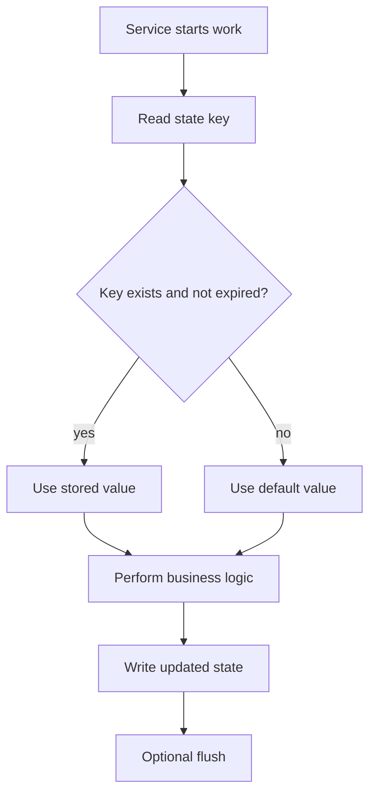

This pattern appears in many real services:

* read current runtime marker
* decide what to do
* run work
* persist updated marker

---

## 5. Method-by-method explanation

## 5.1 `get()`

```php
$value = $stateStore->get('jobs.cleanup.lastrun', 0);
```

`get()` retrieves a value by key.

If the key does not exist, or if it has expired, the provided default is returned.

Important implications:

* callers do not need to distinguish between “missing” and “expired” in the common case
* expired values are treated as absent
* the caller chooses a safe default

Typical defaults:

* `null` for optional values
* `0` for timestamps or counters
* `[]` for arrays
* `false` for flags

### Example

```php
$nextRun = $stateStore->get('jobs.cleanup.nextrun', 0);
if ($nextRun > time()) {
	return;
}
```

---

## 5.2 `has()`

```php
if ($stateStore->has('locks.jobs.cleanup')) {
	return;
}
```

`has()` checks whether a key exists and is still valid.

This can be useful for very simple presence checks, but in many concurrent scenarios you should prefer `setIfNotExists()` instead of doing a separate `has()` followed by `set()`.

Why?
Because `has()` plus `set()` is **not atomic**.
Two processes could both see the key as absent and both create it.

---

## 5.3 `set()`

```php
$stateStore->set('jobs.cleanup.lastrun', time());
$stateStore->set('jobs.cleanup.nextrun', time() + 3600);
$stateStore->set('temporary.preview.token', $tokenData, 600);
```

`set()` stores a value under a key.

The third argument is an optional TTL in seconds:

* `null` means no expiration
* a positive number means the value expires in that many seconds
* backend implementations define how expiration is stored and enforced

Use `set()` for:

* timestamps
* IDs and cursors
* status markers
* small structured data that belongs to a runtime concern

---

## 5.4 `delete()`

```php
$stateStore->delete('locks.jobs.cleanup');
```

`delete()` removes a key and returns whether it existed.

Typical uses:

* releasing locks
* clearing obsolete markers
* resetting job state during maintenance

---

## 5.5 `setIfNotExists()`

```php
$ok = $stateStore->setIfNotExists('locks.jobs.cleanup', time(), 300);
```

This is the most important method for lock-like behavior.

It atomically stores a value **only if the key does not already exist**, or if the existing entry has already expired.

This lets you model single-run guards safely.

### Why this matters

A naive lock implementation is wrong:

```php
if (!$stateStore->has('locks.jobs.cleanup')) {
	$stateStore->set('locks.jobs.cleanup', time(), 300);
}
```

That sequence has a race condition.

The correct version is atomic:

```php
if (!$stateStore->setIfNotExists('locks.jobs.cleanup', time(), 300)) {
	return;
}
```

### Lock flow

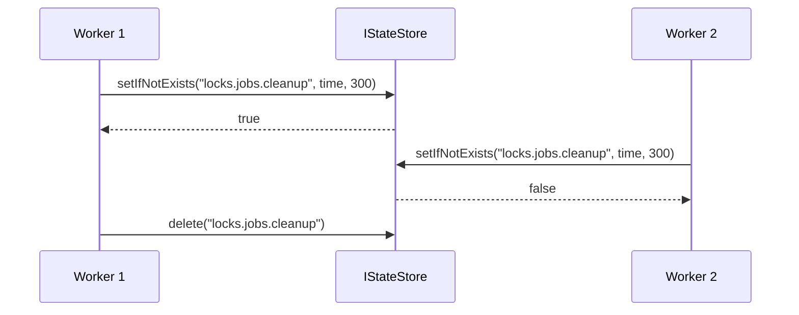

### Important recommendation

For locks, always use a TTL.

Without a TTL, a crashed process could leave a lock behind indefinitely.

---

## 5.6 `listKeys()`

```php
$keys = $stateStore->listKeys('jobs.cleanup.');
```

`listKeys()` is intended for:

* debugging
* administrative tooling
* lightweight introspection
* support pages in plugin backends

It is **not** meant for large-scale iteration or as a general data-query mechanism.

Implementations are allowed to:

* return best-effort results
* limit the number of keys
* return keys without strong ordering guarantees

This is why application logic should not depend on full scans.

---

## 5.7 `flush()`

`flush()` exists for implementations that buffer writes.

Examples:

* file-based stores that collect multiple changes before writing
* hybrid backends that batch operations for efficiency

Some backends write immediately. In those cases `flush()` is simply a no-op.

The database-backed implementation shown below is immediate and does not buffer writes.

---

## 6. What should go into the state store

Good state-store data is:

* operational
* small
* scoped to a service
* easy to recompute only with difficulty or cost
* meaningful across requests or job executions

Examples that fit well:

* `jobs.cleanup.lastrun`
* `jobs.cleanup.nextrun`
* `jobs.import.cursor`
* `locks.mailer.digest`
* `sync.crm.contacts.last_id`
* `reports.monthly_invoice.last_generated_at`

Examples that do **not** fit well:

* static plugin configuration
* large domain datasets
* user content
* entire report payloads
* complex searchable business data

---

## 7. Key naming conventions

Use stable, explicit, namespaced keys.

A good convention is:

```text
<domain>.<service>.<name>
```

### Recommended patterns

```text
jobs.cleanup.lastrun
jobs.cleanup.nextrun
jobs.cleanup.last_error
jobs.import.cursor
locks.jobs.cleanup
locks.mailer.digest
sync.shop.orders.last_remote_id
```

### Why namespacing matters

Namespacing gives you:

* collision avoidance between plugins
* readable administration output
* easier migration and cleanup
* clean prefix-based inspection

### Example structure

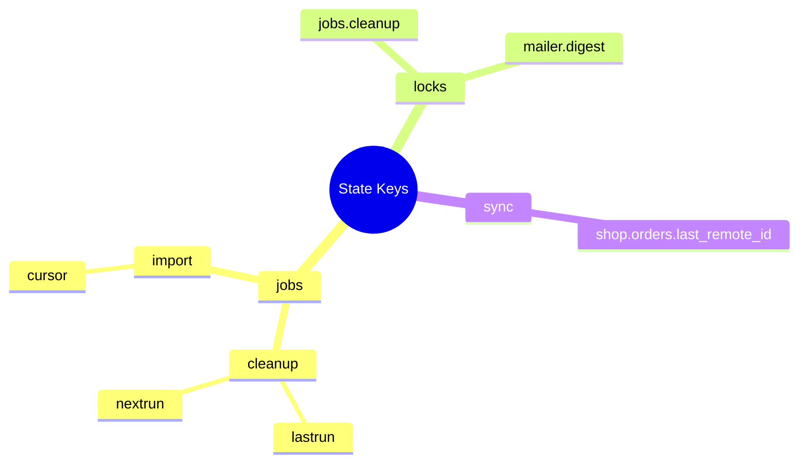

---

## 8. Dependency injection usage

In typical BASE3 code, the state store is consumed through constructor injection.

### Example: service class

```php
<?php declare(strict_types=1);

namespace Vendor\ExamplePlugin\Service;

use Base3\State\Api\IStateStore;

class CleanupScheduler {

	private IStateStore $stateStore;

	public function __construct(IStateStore $stateStore) {
		$this->stateStore = $stateStore;
	}

	public function shouldRunNow(): bool {
		$nextRun = (int)$this->stateStore->get('jobs.cleanup.nextrun', 0);
		return $nextRun <= time();
	}

	public function markRun(int $delaySeconds): void {
		$this->stateStore->set('jobs.cleanup.lastrun', time());
		$this->stateStore->set('jobs.cleanup.nextrun', time() + $delaySeconds);
	}
}
```

### Example: output class using an injected service

```php
<?php declare(strict_types=1);

namespace Vendor\ExamplePlugin\Output;

use Base3\Api\IOutput;
use Vendor\ExamplePlugin\Service\CleanupScheduler;

class CleanupStatusOutput implements IOutput {

	private CleanupScheduler $scheduler;

	public function __construct(CleanupScheduler $scheduler) {
		$this->scheduler = $scheduler;
	}

	public function getOutput(): string {
		return $this->scheduler->shouldRunNow()
			? 'Cleanup may run now.'
			: 'Cleanup is waiting for its next scheduled slot.';
	}
}
```

### Typical registration idea

The concrete wiring depends on your project setup, but conceptually the DI container maps `IStateStore` to a concrete implementation such as `DatabaseStateStore`.

```php
<?php declare(strict_types=1);

use Base3\State\Api\IStateStore;
use Base3\State\Database\DatabaseStateStore;

// Illustrative example only.
// The exact registration API depends on your container/bootstrap setup.
$container->set(IStateStore::class, function($container) {
	return new DatabaseStateStore($container->get(\Base3\Database\Api\IDatabase::class));
});
```

The important architectural point is this:

* your plugin code depends on `IStateStore`
* the project decides which implementation to bind
* your service remains portable across environments

---

## 9. Common usage patterns

## 9.1 Scheduled job marker

```php
<?php declare(strict_types=1);

namespace Vendor\ExamplePlugin\Job;

use Base3\State\Api\IStateStore;

class CleanupJob {

	private IStateStore $stateStore;

	public function __construct(IStateStore $stateStore) {
		$this->stateStore = $stateStore;
	}

	public function run(): void {
		$nextRun = (int)$this->stateStore->get('jobs.cleanup.nextrun', 0);
		if ($nextRun > time()) {
			return;
		}

		// ... do cleanup work ...

		$this->stateStore->set('jobs.cleanup.lastrun', time());
		$this->stateStore->set('jobs.cleanup.nextrun', time() + 3600);
	}
}
```

This is the simplest and most common pattern.

---

## 9.2 Lock-protected execution

```php
<?php declare(strict_types=1);

namespace Vendor\ExamplePlugin\Job;

use Base3\State\Api\IStateStore;

class DigestMailerJob {

	private IStateStore $stateStore;

	public function __construct(IStateStore $stateStore) {
		$this->stateStore = $stateStore;
	}

	public function run(): void {
		$lockKey = 'locks.mailer.digest';

		if (!$this->stateStore->setIfNotExists($lockKey, [
			'acquired_at' => time(),
			'worker' => getmypid(),
		], 300)) {
			return;
		}

		try {
			// ... send digest emails ...
		} finally {
			$this->stateStore->delete($lockKey);
		}
	}
}
```

Important details:

* lock acquisition is atomic
* lock has a TTL to avoid stale deadlocks
* `finally` ensures cleanup on normal failure paths

---

## 9.3 Cursor-based import

```php
<?php declare(strict_types=1);

namespace Vendor\ExamplePlugin\Service;

use Base3\State\Api\IStateStore;

class RemoteImportService {

	private IStateStore $stateStore;

	public function __construct(IStateStore $stateStore) {
		$this->stateStore = $stateStore;
	}

	public function runBatch(): void {
		$lastId = (int)$this->stateStore->get('jobs.import.cursor', 0);
		$rows = $this->fetchRemoteRowsAfter($lastId);

		foreach ($rows as $row) {
			$this->importRow($row);
			$lastId = (int)$row['id'];
			$this->stateStore->set('jobs.import.cursor', $lastId);
		}
	}

	private function fetchRemoteRowsAfter(int $lastId): array {
		return [];
	}

	private function importRow(array $row): void {
	}
}
```

This pattern is useful for:

* incremental imports
* API synchronization jobs
* queue-like polling jobs
* long-running progress tracking across executions

---

## 9.4 Runtime flag with expiration

```php
$this->stateStore->set('temporary.maintenance.banner', true, 1800);

if ($this->stateStore->has('temporary.maintenance.banner')) {
	// show the banner
}
```

This is useful for temporary runtime switches where explicit cleanup is optional because expiration handles it.

---

## 9.5 Admin/debug page

```php
$keys = $this->stateStore->listKeys('jobs.');
```

A plugin backend can expose a simple administration view showing relevant state entries by prefix.

Do not build core business logic around `listKeys()`. Use it for inspection, not for transactional workflows.

---

## 10. Built-in database implementation

The provided implementation shown here is:

* `Base3\State\Database\DatabaseStateStore`

It implements `IStateStore` using a relational database table.

### Constructor

```php
public function __construct(IDatabase $db, string $tableName = 'base3_statestore')
```

Dependencies:

* `IDatabase` for all database interaction
* optional table name override

This makes the implementation easy to integrate into the existing BASE3 database abstraction.

---

## 11. DatabaseStateStore architecture

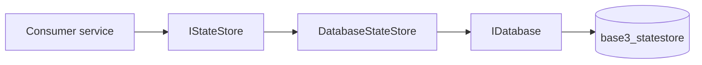

The service code only sees the `IStateStore` contract.
The database details are hidden inside the implementation.

---

## 12. Lazy connection and automatic initialization

`DatabaseStateStore` follows an important BASE3 pattern:

* it calls `connect()` lazily
* it ensures the storage table exists when needed
* it does not assume the database connection is already open

### Readiness flow

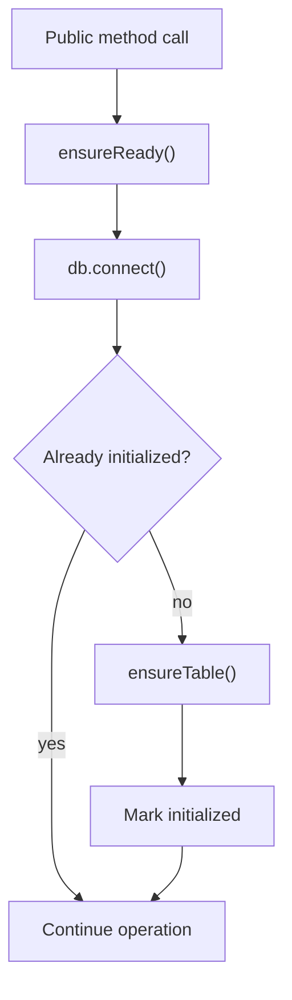

This keeps the service convenient for runtime use:

* no separate setup call is required
* the table is created automatically
* database access still respects lazy-connect behavior

---

## 13. Storage schema

`DatabaseStateStore` creates a table with this logical structure:

* `key` as primary key
* `value` as JSON text
* `updated_at` for diagnostics and administration
* `expires_at` for TTL support

### Schema diagram

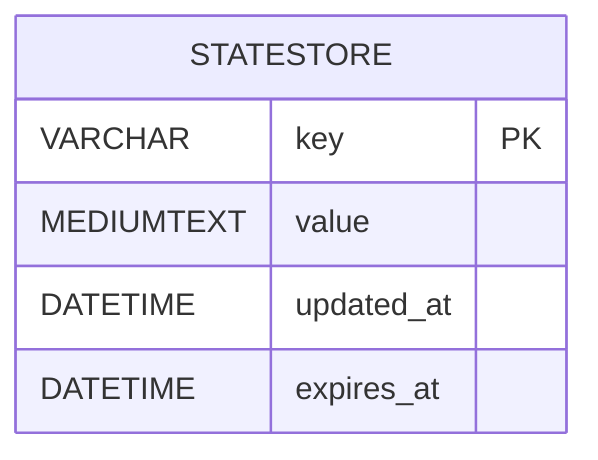

### Effective SQL shape

```sql
CREATE TABLE IF NOT EXISTS `base3_statestore` (
	`key` VARCHAR(255) NOT NULL,
	`value` MEDIUMTEXT NOT NULL,
	`updated_at` DATETIME NOT NULL,
	`expires_at` DATETIME NULL,
	PRIMARY KEY (`key`),
	INDEX `idx_expires_at` (`expires_at`)
) ENGINE=InnoDB DEFAULT CHARSET=utf8mb4;
```

---

## 14. TTL semantics

TTL support is implemented through the `expires_at` column.

### Meaning of TTL values

* `null` => no expiration
* `> 0` => expire after that many seconds
* `<= 0` => expire immediately

### TTL timeline

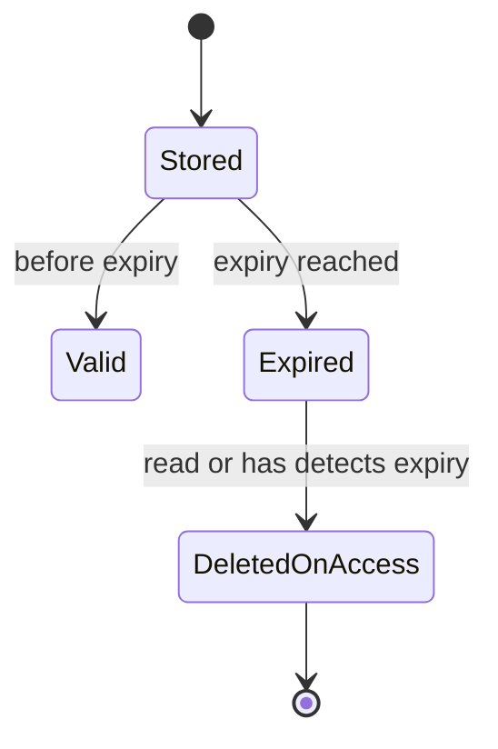

Important detail:

Expired entries are not necessarily removed immediately by a background cleanup process.
Instead, they are treated as invalid and may be deleted when accessed.

This means expiration is primarily **semantic** from the caller’s perspective.

---

## 15. How reads behave

When `get()` is called, `DatabaseStateStore` does the following:

1. ensure connection and table readiness
2. load the row by key
3. return the default if the key does not exist
4. check whether the row is expired
5. delete expired rows on access
6. decode JSON and return the stored value

### Read flow

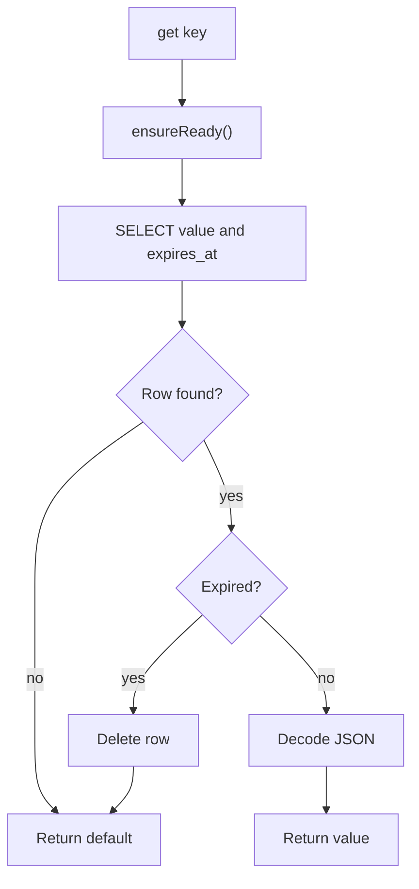

This is a very practical behavior for runtime state because callers automatically see expired entries as absent.

---

## 16. How writes behave

`set()` uses an upsert strategy.

That means:

* if the key does not exist, it is inserted
* if the key already exists, it is updated

The implementation updates:

* `value`
* `updated_at`
* `expires_at`

### Write flow

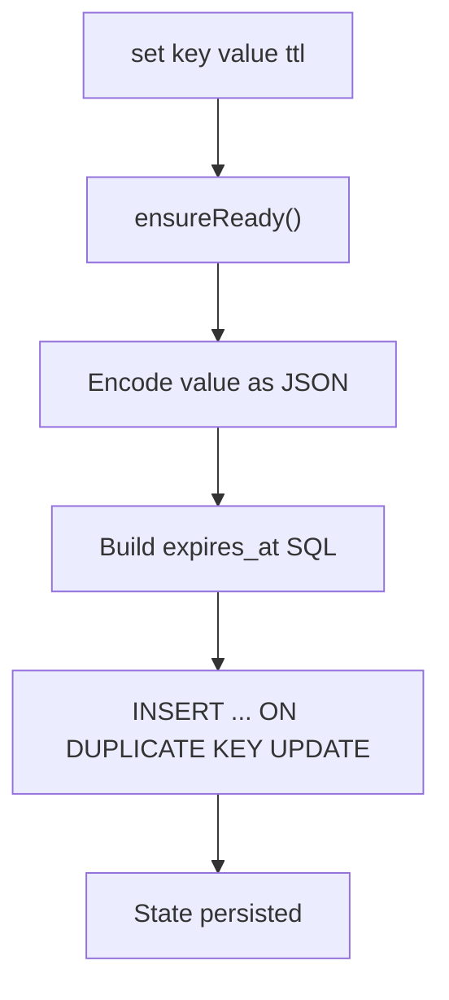

This gives predictable overwrite behavior for ordinary runtime markers.

---

## 17. Atomic creation and lock semantics in DatabaseStateStore

`setIfNotExists()` is implemented with a single SQL statement using `INSERT ... ON DUPLICATE KEY UPDATE` and conditional update logic.

This gives the following behavior:

* new key => inserted
* existing valid key => remains unchanged
* existing expired key => refreshed with new value and new expiry

### Result interpretation

The implementation interprets database `affectedRows()` like this:

* `1` => inserted
* `2` => expired row refreshed
* `0` => key already existed and was still valid

So the method returns `true` when the caller successfully acquired the key and `false` when a still-valid entry already existed.

### Lock-acquisition decision diagram

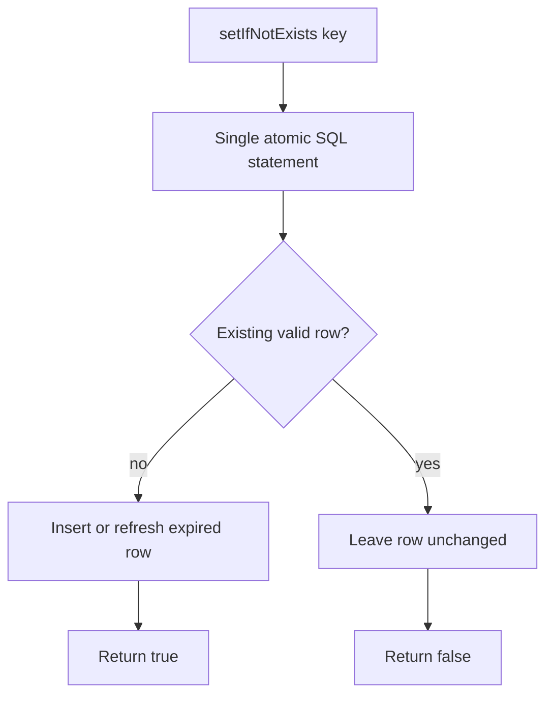

This is exactly the behavior you want for lock-like keys.

---

## 18. Serialization behavior

`DatabaseStateStore` stores values as JSON.

That has two important consequences:

1. stored values should be JSON-serializable
2. returned values are decoded from JSON into PHP data structures

### Practical examples

```php
$stateStore->set('jobs.cleanup.lastrun', time());
$stateStore->set('jobs.import.meta', [
	'last_id' => 123,
	'count' => 50,
	'finished' => false,
]);
$stateStore->set('runtime.flag', true);
```

### Encoding failure strategy

The implementation does not throw on JSON encoding failure.
Instead, it stores a structured error marker.

### Decoding failure strategy

If JSON decoding fails during `get()`, the implementation returns the default value instead of throwing.

This is intentionally pragmatic. The state store is runtime plumbing, and the implementation favors service robustness over strict serialization exceptions.

---

## 19. Expired rows and list behavior

The database implementation removes expired rows opportunistically when they are accessed by `get()` or `has()`.

A consequence is that `listKeys()` may still observe expired rows until they are touched or separately cleaned up.

That is consistent with the interface contract, which describes `listKeys()` as best-effort introspection rather than a strict administrative query API.

So when using `listKeys()`:

* treat it as informative
* not as transactionally exact
* not as a complete source of truth for runtime decisions

---

## 20. `flush()` in DatabaseStateStore

The database implementation writes immediately.

Because of that, `flush()` is intentionally empty.

```php
public function flush(): void {
	// DB backend is immediate; nothing buffered.
}
```

This still matters architecturally because it keeps the interface flexible enough for file-based or buffered implementations.

---

## 21. Database portability notes

The shown `DatabaseStateStore` implementation assumes a MySQL or MariaDB style dialect for:

* `CREATE TABLE IF NOT EXISTS`
* `INSERT ... ON DUPLICATE KEY UPDATE`
* `NOW()`
* `DATE_ADD(..., INTERVAL ... SECOND)`

That means the class is designed for the common BASE3 relational setup, but it is not a generic SQL abstraction for every database engine.

If your project uses a different database dialect, you may need:

* a database-specific variant
* a custom implementation of `IStateStore`
* or an adjusted SQL strategy

---

## 22. Operational recommendations

## 22.1 Always namespace keys

Bad:

```text
lastrun
lock
cursor
```

Good:

```text
jobs.cleanup.lastrun
locks.jobs.cleanup
sync.shop.orders.cursor
```

---

## 22.2 Prefer small values

Good:

* integers
* strings
* booleans
* small arrays
* compact structured metadata

Avoid:

* huge payloads
* full result sets
* large logs
* binary data
* objects that serialize unpredictably

---

## 22.3 Use TTL for locks

Bad:

```php
$stateStore->setIfNotExists('locks.jobs.cleanup', time());
```

Better:

```php
$stateStore->setIfNotExists('locks.jobs.cleanup', time(), 300);
```

TTL protects you against stale locks after crashes.

---

## 22.4 Use `try` and `finally` for lock release

```php
if (!$stateStore->setIfNotExists('locks.jobs.cleanup', time(), 300)) {
	return;
}

try {
	// do work
} finally {
	$stateStore->delete('locks.jobs.cleanup');
}
```

This should be your default pattern.

---

## 22.5 Do not use the state store as configuration

Wrong use:

```php
$apiKey = $stateStore->get('plugin.example.api_key');
```

Correct use:

* configuration belongs in `IConfiguration`
* runtime progress belongs in `IStateStore`

A useful rule is:

> If a value is configured by humans and should remain stable until changed intentionally, it is configuration.
> If a value changes because the system runs, it is state.

---

## 22.6 Do not use `listKeys()` as a data model

Wrong idea:

* store many records as state keys
* scan them to reconstruct application data

Correct idea:

* keep state store usage focused on runtime markers
* keep domain data in your normal persistence model

---

## 23. Example: building a plugin service around state

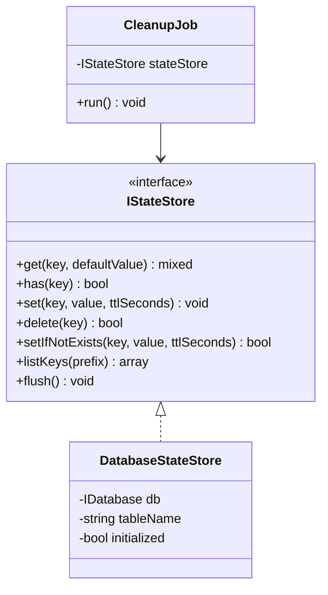

This is the intended dependency structure:

* consumers know only the interface
* implementations remain swappable
* plugin code stays portable and testable

---

## 24. Testing strategies

When testing services that depend on `IStateStore`, you usually have three options.

### Option 1: use a simple fake implementation

For pure unit tests, a small in-memory test double is often enough.

```php
<?php declare(strict_types=1);

namespace Vendor\ExamplePlugin\Tests\Double;

use Base3\State\Api\IStateStore;

class InMemoryStateStore implements IStateStore {

	private array $data = [];

	public function get(string $key, mixed $default = null): mixed {
		return $this->has($key) ? $this->data[$key]['value'] : $default;
	}

	public function has(string $key): bool {
		if (!isset($this->data[$key])) {
			return false;
		}

		$expiresAt = $this->data[$key]['expiresAt'];
		if ($expiresAt !== null && $expiresAt <= time()) {
			unset($this->data[$key]);
			return false;
		}

		return true;
	}

	public function set(string $key, mixed $value, ?int $ttlSeconds = null): void {
		$this->data[$key] = [
			'value' => $value,
			'expiresAt' => $ttlSeconds === null ? null : time() + $ttlSeconds,
		];
	}

	public function delete(string $key): bool {
		$exists = isset($this->data[$key]);
		unset($this->data[$key]);
		return $exists;
	}

	public function setIfNotExists(string $key, mixed $value, ?int $ttlSeconds = null): bool {
		if ($this->has($key)) {
			return false;
		}

		$this->set($key, $value, $ttlSeconds);
		return true;
	}

	public function listKeys(string $prefix): array {
		return array_values(array_filter(array_keys($this->data), function(string $key) use ($prefix): bool {
			return str_starts_with($key, $prefix);
		}));
	}

	public function flush(): void {
	}
}
```

### Option 2: integration test with a real database

For backend-specific guarantees such as atomic upsert behavior, use a real database integration test.

### Option 3: test the consumer against the interface contract

The more your service only depends on the documented behavior of `IStateStore`, the easier it becomes to swap implementations later.

---

## 25. Implementing your own backend

You may want a custom implementation when:

* your project wants file-based runtime state
* you already have a Redis-like store available
* you need a multi-node lock strategy
* you want a specialized backend per deployment environment

### Minimal implementation checklist

Your implementation should answer these questions clearly:

* how are values serialized
* how is expiration represented
* what exactly counts as atomic for `setIfNotExists()`
* is `flush()` immediate or buffered
* does `listKeys()` return exact or best-effort results

### Skeleton

```php
<?php declare(strict_types=1);

namespace Vendor\ExamplePlugin\State;

use Base3\State\Api\IStateStore;

class CustomStateStore implements IStateStore {

	public function get(string $key, mixed $default = null): mixed {
		return $default;
	}

	public function has(string $key): bool {
		return false;
	}

	public function set(string $key, mixed $value, ?int $ttlSeconds = null): void {
	}

	public function delete(string $key): bool {
		return false;
	}

	public function setIfNotExists(string $key, mixed $value, ?int $ttlSeconds = null): bool {
		return false;
	}

	public function listKeys(string $prefix): array {
		return [];
	}

	public function flush(): void {
	}
}
```

### Design guideline

The most important semantic contract to preserve is:

* `get()` treats expired state as absent
* `has()` returns `false` for expired state
* `setIfNotExists()` is safe for lock-like usage

If those semantics are preserved, consumers can usually switch implementations without code changes.

---

## 26. Example decision table

| Requirement                            | Good fit for `IStateStore` | Better elsewhere      |
| -------------------------------------- | -------------------------- | --------------------- |
| Last processed import ID               | Yes                        | No                    |
| Temporary runtime lock                 | Yes                        | No                    |
| Next execution timestamp               | Yes                        | No                    |
| Plugin configuration option            | No                         | `IConfiguration`      |
| Full business entity storage           | No                         | Database/domain model |
| Expensive derived value cache          | Sometimes                  | Cache layer           |
| Runtime feature marker with expiration | Yes                        | No                    |

---

## 27. Summary

The BASE3 state store is a small but very important infrastructure component.

It gives plugin developers a clean, DI-friendly way to persist runtime coordination data across requests and executions.

The key points are:

* depend on `IStateStore`, not on a concrete backend
* use clear, namespaced keys
* use TTL for locks and temporary markers
* prefer `setIfNotExists()` for concurrency-sensitive acquisition
* keep stored values small and operational
* use `listKeys()` for introspection, not for primary business logic
* understand that `DatabaseStateStore` is immediate, JSON-based, lazily connected, and automatically initializes its table

When used correctly, the state store becomes the natural home for scheduling markers, cursors, flags, and lock semantics in BASE3-based plugins.

---

## 28. Practical takeaway

If you are building a plugin and need to remember something that the system learned while running, ask yourself:

* is this runtime state rather than configuration
* is it small and service-scoped
* would TTL help
* does it need atomic creation semantics

If the answer is yes, `IStateStore` is likely the right tool.

