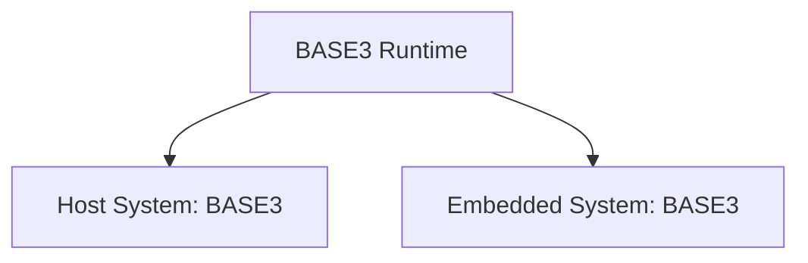
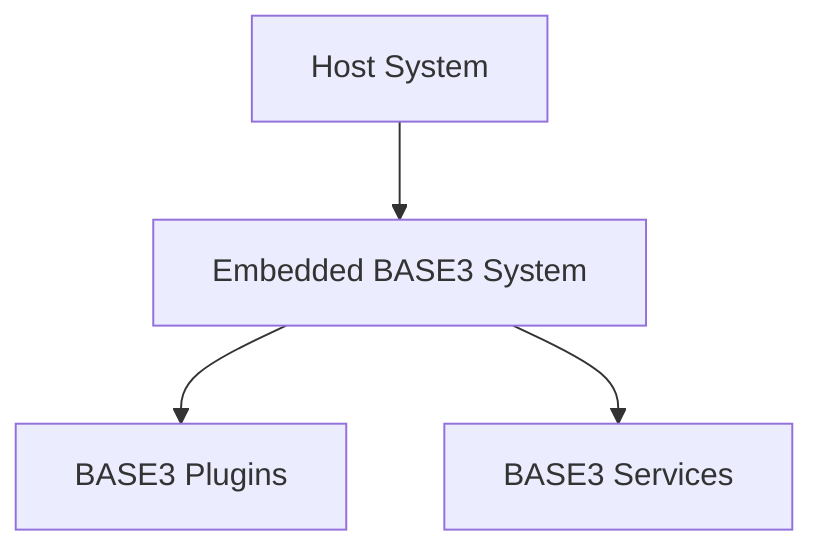
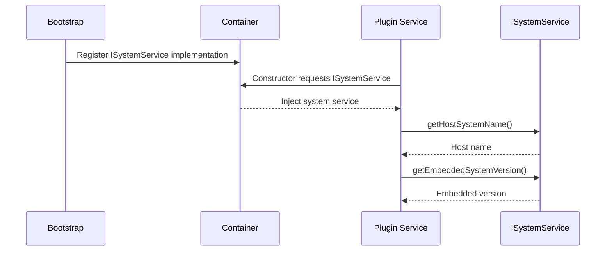
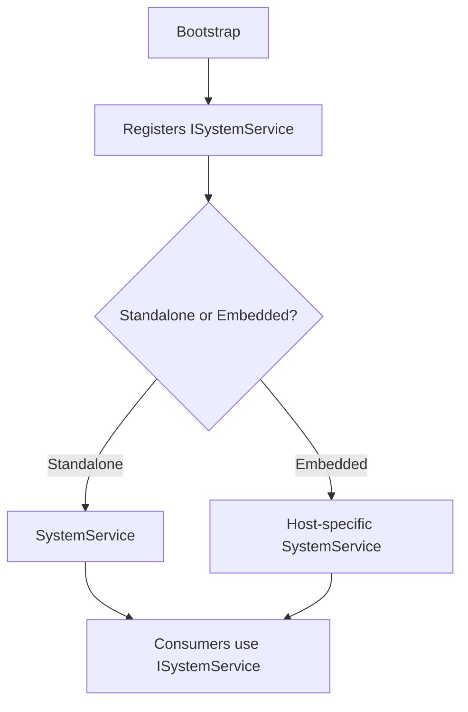

# BASE3 Framework System Service

## Purpose

This document explains how the **System Service** works in the BASE3 framework.

It is written for developers who want to understand:

* what `ISystemService` is for
* how BASE3 distinguishes standalone and embedded execution
* what host system and embedded system mean
* how code can react to system name and version through dependency injection
* how the default standalone implementation behaves
* how host integrations can replace the default implementation
* what version values mean and what they do not mean
* when to use `ISystemService` instead of configuration or environment constants

After reading this document, a developer should understand how BASE3 exposes runtime environment metadata in a portable way.

---

## 1. What the System Service is

The System Service provides information about the runtime environment in which BASE3 is running.

The central interface is:

```php id="r0ui6n"
Base3\Api\ISystemService
```

It exposes four values:

* host system name
* host system version
* embedded system name
* embedded system version

The purpose is simple:

> Code can ask the runtime where BASE3 is running and adapt behavior when necessary.

This is especially useful because BASE3 can run in two modes:

1. standalone
2. embedded into another host system

---

## 2. Why this exists

BASE3 is not limited to one deployment style.

In a standalone installation, BASE3 is the full application runtime.

In an embedded installation, BASE3 can run inside another application, platform, CMS, LMS, administration system, or project-specific host.

Those environments can differ in:

* available services
* authentication model
* routing model
* filesystem layout
* version constraints
* asset paths
* user handling
* permission logic
* integration APIs

Plugin or framework code may therefore need to know:

```text id="r1fmid"
Which host system am I running inside?
Which version of that host system is active?
Which BASE3 or BASE3-based embedded system version is active?
```

The System Service provides this through dependency injection instead of forcing code to inspect global constants, files, or host-specific APIs directly.

---

## 3. Standalone versus embedded mode

## 3.1 Standalone mode

In standalone mode, BASE3 is the host system.

That means:

```text id="sqx2ps"
host system     = BASE3
embedded system = BASE3
```

The host and embedded system are effectively identical.



This is the default framework setup.

---

## 3.2 Embedded mode

In embedded mode, BASE3 runs inside another host system.

That means:

```text id="br4z2a"
host system     = outer application or platform
embedded system = BASE3 or BASE3-based subsystem
```



The host owns the outer runtime.

BASE3 provides a subsystem inside that runtime.

A host-specific bootstrap can then replace framework defaults such as:

* system service
* configuration
* access control
* request handling
* routing
* asset resolution
* logging
* settings and state storage

---

## 4. Core interface

The interface is intentionally small.

```php id="s2jvt3"
<?php declare(strict_types=1);

namespace Base3\Api;

interface ISystemService {

	public function getHostSystemName(): string;

	public function getHostSystemVersion(): string;

	public function getEmbeddedSystemName(): string;

	public function getEmbeddedSystemVersion(): string;
}
```

The service is read-only.

It does not configure the system.

It only exposes metadata about the current runtime environment.

---

## 5. Terminology

## 5.1 Host system

The host system is the outer runtime that provides the process and integration environment.

In standalone mode, this is BASE3 itself.

In embedded mode, this is the system into which BASE3 has been integrated.

Examples in abstract terms:

```text id="kqm833"
HostApplication
CustomerPlatform
EnterprisePortal
LearningSystem
AdministrationSuite
```

The concrete value depends on the integration.

---

## 5.2 Embedded system

The embedded system is the BASE3 system or BASE3-based application running inside the host.

In standalone mode, this is also BASE3.

In embedded mode, this is usually:

```text id="wbhkbp"
BASE3
```

or a BASE3-based subsystem name defined by the project.

---

## 6. Returned values

The interface returns strings.

If a value is unknown, the implementation should return an empty string:

```php id="disy30"
''
```

It should not throw an exception only because a name or version cannot be determined.

This makes the service safe to use in diagnostics, feature checks, admin pages, and compatibility handling.

---

## 7. Version values

Version values are human-readable strings.

Examples:

```text id="qlrr0k"
4.0.1
10.2
2026.06
dev-main
```

The interface itself does not define comparison semantics.

That means `ISystemService` only returns the value.

It does not say whether:

```text id="u5jpl7"
10.0
```

is greater than:

```text id="nqfomr"
9.9
```

or whether a custom version format is comparable at all.

If a project needs version comparison, that comparison belongs in the consuming code or in a dedicated compatibility service.

---

## 8. Default implementation

The default implementation is:

```php id="fsryfs"
Base3\Core\SystemService
```

It is designed for standalone BASE3 installations.

In standalone mode, host and embedded system are identical.

Therefore the default implementation returns:

```text id="pwsqg0"
host system name       BASE3
embedded system name   BASE3
```

Both version methods read the BASE3 version from the same source.

---

## 9. Default version lookup

The default implementation reads the BASE3 version from a file named:

```text id="o28952"
VERSION
```

under:

```text id="khviv9"
DIR_ROOT
```

Conceptual path:

```text id="vl9i6k"
DIR_ROOT/VERSION
```

The lookup rules are intentionally defensive:

* if `DIR_ROOT` is not defined, return `""`
* if the file does not exist, return `""`
* if the file is not readable, return `""`
* if the file cannot be read, return `""`
* if the trimmed content is empty, return `""`
* if the file contains multiple lines, use the first non-empty trimmed line where possible

The default implementation should not emit warnings and should not throw exceptions for missing version metadata.

---

## 10. Default standalone behavior

Conceptually, the default implementation behaves like this:

```php id="gy5gde"
final class SystemService implements ISystemService {

	public function getHostSystemName(): string {
		return 'BASE3';
	}

	public function getHostSystemVersion(): string {
		return $this->getBase3Version();
	}

	public function getEmbeddedSystemName(): string {
		return 'BASE3';
	}

	public function getEmbeddedSystemVersion(): string {
		return $this->getBase3Version();
	}
}
```

This gives standalone projects deterministic metadata without requiring additional configuration.

---

## 11. Dependency injection usage

Consumers should receive the system service through constructor injection.

```php id="jx59hw"
<?php declare(strict_types=1);

namespace ExamplePlugin\Service;

use Base3\Api\ISystemService;

final class RuntimeAwareService {

	public function __construct(
		private readonly ISystemService $systemService
	) {}

	public function describeRuntime(): array {
		return [
			'host_name' => $this->systemService->getHostSystemName(),
			'host_version' => $this->systemService->getHostSystemVersion(),
			'embedded_name' => $this->systemService->getEmbeddedSystemName(),
			'embedded_version' => $this->systemService->getEmbeddedSystemVersion()
		];
	}
}
```

This keeps runtime detection behind one interface.

The consuming code does not need to know whether BASE3 is standalone or embedded.

---

## 12. Default bootstrap registration

The default bootstrap registers the standalone system service.

Conceptually:

```php id="uajlr7"
$container->set(
	ISystemService::class,
	fn() => new SystemService(),
	IContainer::SHARED
);
```

This means any class can type-hint:

```php id="u07wqr"
ISystemService
```

and receive the current runtime metadata service.

A custom bootstrap can replace this binding with a host-specific implementation.

---

## 13. Custom implementation for embedded systems

A host integration can provide its own `ISystemService`.

Example:

```php id="way8jz"
<?php declare(strict_types=1);

namespace Project\Base3;

use Base3\Api\ISystemService;

final class HostSystemService implements ISystemService {

	public function getHostSystemName(): string {
		return 'HostApplication';
	}

	public function getHostSystemVersion(): string {
		return $this->readHostVersion();
	}

	public function getEmbeddedSystemName(): string {
		return 'BASE3';
	}

	public function getEmbeddedSystemVersion(): string {
		return $this->readEmbeddedVersion();
	}

	private function readHostVersion(): string {
		// Read from the host system, a constant, API, file, or service.
		return '';
	}

	private function readEmbeddedVersion(): string {
		// Read from BASE3 VERSION file or project-specific metadata.
		return '';
	}
}
```

The exact host version lookup is project-specific.

The important point is that the rest of the BASE3 code still depends only on `ISystemService`.

---

## 14. Binding a custom implementation

A custom bootstrap can bind the host-specific service before plugins are initialized.

```php id="q2imsl"
$container->set(
	ISystemService::class,
	fn($c) => new HostSystemService(),
	IContainer::SHARED
);
```

After that, plugins and framework services receive the host-aware implementation automatically.

This is the correct place for host-specific runtime metadata.

Plugins should not usually try to detect the host system manually.

---

## 15. Runtime flow



The service binding determines what metadata is returned.

The consuming code stays unchanged.

---

## 16. Typical use cases

## 16.1 Compatibility handling

A plugin may need different behavior depending on host system capabilities.

```php id="uopqya"
if ($this->systemService->getHostSystemName() === 'HostApplication') {
	// Use host-specific compatibility path.
}
```

This should be used sparingly.

Prefer capability checks where possible.

Use system-name checks when a real platform distinction is necessary.

---

## 16.2 Feature switches by host version

A host integration may expose different APIs depending on host version.

```php id="mn5880"
$hostVersion = $this->systemService->getHostSystemVersion();

if ($hostVersion !== '' && version_compare($hostVersion, '10.0', '>=')) {
	// Use newer host integration behavior.
}
```

Only do this when the version format is known to be compatible with the comparison method.

The `ISystemService` interface itself does not guarantee semantic versioning.

---

## 16.3 Diagnostics

Admin or health-check pages can display runtime metadata.

```php id="u8ao95"
[
	'host_system' => $systemService->getHostSystemName(),
	'host_version' => $systemService->getHostSystemVersion(),
	'embedded_system' => $systemService->getEmbeddedSystemName(),
	'embedded_version' => $systemService->getEmbeddedSystemVersion()
]
```

This helps operators understand which BASE3 integration is active.

---

## 16.4 Logging context

Services can enrich logs with runtime metadata.

```php id="rh465u"
$this->logger->info('Import started', [
	'scope' => 'import',
	'host_system' => $this->systemService->getHostSystemName(),
	'embedded_system' => $this->systemService->getEmbeddedSystemName()
]);
```

Be careful not to add this to every log entry if it creates unnecessary noise.

It is most useful in startup, diagnostics, migration, compatibility, or integration logs.

---

## 16.5 Conditional service behavior

A service can select behavior based on host and embedded system metadata.

```php id="pf8iku"
public function getStorageMode(): string {
	if ($this->systemService->getHostSystemName() !== 'BASE3') {
		return 'host-integrated';
	}

	return 'standalone';
}
```

This keeps the decision local and explicit.

---

## 17. What not to use it for

Do not use `ISystemService` as a general configuration service.

Bad:

```php id="x7ymb5"
if ($systemService->getHostSystemName() === 'BASE3') {
	$debug = true;
}
```

Use `IConfiguration` for configuration.

Do not use it as a runtime state store.

Bad:

```php id="spqtys"
$lastRun = $systemService->getEmbeddedSystemVersion();
```

Use `IStateStore` for runtime state.

Do not use it as a settings registry.

Bad:

```php id="iqxuh5"
$providerName = $systemService->getHostSystemName();
```

Use `ISettingsStore` for named settings datasets.

The System Service is for environment identity and version metadata only.

---

## 18. System Service versus Configuration

`IConfiguration` answers:

```text id="csa7ed"
What did the project configure?
```

`ISystemService` answers:

```text id="oeehd4"
Where is BASE3 running?
```

Examples for configuration:

* database host
* enabled plugins
* logger backend
* default layout
* feature flags

Examples for system service:

* host system name
* host system version
* embedded system name
* embedded system version

These concerns should stay separate.

---

## 19. System Service versus Bootstrap

The bootstrap decides which implementation is active.

The System Service exposes metadata from that implementation.



This means embedded support is not hardcoded into the default system service.

It is achieved by replacing the service binding in the host-specific bootstrap.

---

## 20. System Service versus Host APIs

Embedded integrations often have host-specific APIs or constants.

Plugin code should avoid using those directly unless it is explicitly host-specific.

Less portable:

```php id="yrv4io"
$version = HOST_PLATFORM_VERSION;
```

More portable:

```php id="oyjdwm"
$version = $this->systemService->getHostSystemVersion();
```

This keeps generic BASE3 plugins independent from one specific host.

Host-specific plugins may still use host APIs directly when that is their explicit purpose.

---

## 21. Recommended consumer style

A good consumer class should depend on the interface:

```php id="g3fyt2"
use Base3\Api\ISystemService;

final class IntegrationDiagnostics {

	public function __construct(
		private readonly ISystemService $systemService
	) {}
}
```

Avoid depending on the concrete default class:

```php id="mk6vm6"
use Base3\Core\SystemService;
```

The concrete class only represents standalone BASE3 behavior.

Using the interface keeps the class compatible with embedded runtimes.

---

## 22. Recommended implementation style

A custom implementation should be:

* small
* deterministic
* read-only
* defensive
* free of heavy side effects
* safe when version metadata is missing

Good behavior:

```php id="qg5v7v"
public function getHostSystemVersion(): string {
	if (!defined('HOST_VERSION')) {
		return '';
	}

	return trim((string) HOST_VERSION);
}
```

Less good:

```php id="l59b7g"
public function getHostSystemVersion(): string {
	throw new RuntimeException('Host version missing.');
}
```

Missing version metadata should usually produce `""`, not a hard failure.

---

## 23. Handling unknown values

Consumers should expect empty strings.

Example:

```php id="qbtm03"
$hostName = $systemService->getHostSystemName();

if ($hostName === '') {
	$hostName = 'Unknown host';
}
```

This is useful for diagnostics.

For compatibility logic, unknown values should usually lead to conservative behavior.

```php id="qyvk0d"
$hostVersion = $systemService->getHostSystemVersion();

if ($hostVersion === '') {
	return $this->useSafeFallback();
}
```

---

## 24. Version comparison guidance

The interface does not promise semantic versioning.

Before using `version_compare()`, make sure the concrete version format is compatible.

Safer pattern:

```php id="alwr8l"
$version = $systemService->getHostSystemVersion();

if ($version === '') {
	return false;
}

if (!preg_match('/^\d+(\.\d+)*$/', $version)) {
	return false;
}

return version_compare($version, '10.0', '>=');
```

For complex compatibility rules, create a dedicated service:

```php id="h3g51c"
HostCompatibilityService
```

That service can consume `ISystemService` and encapsulate version parsing.

---

## 25. Example: compatibility service

```php id="mhd5ws"
<?php declare(strict_types=1);

namespace ExamplePlugin\Compatibility;

use Base3\Api\ISystemService;

final class HostCompatibilityService {

	public function __construct(
		private readonly ISystemService $systemService
	) {}

	public function supportsModernAssetMode(): bool {
		if ($this->systemService->getHostSystemName() === 'BASE3') {
			return true;
		}

		$version = $this->systemService->getHostSystemVersion();

		if ($version === '' || !preg_match('/^\d+(\.\d+)*$/', $version)) {
			return false;
		}

		return version_compare($version, '10.0', '>=');
	}
}
```

This keeps raw host/version checks out of the rest of the plugin.

---

## 26. Example: diagnostics output

```php id="a8zmjm"
<?php declare(strict_types=1);

namespace ExamplePlugin\Output;

use Base3\Api\IOutput;
use Base3\Api\ISystemService;

final class SystemInfoOutput implements IOutput {

	public function __construct(
		private readonly ISystemService $systemService
	) {}

	public static function getName(): string {
		return 'systeminfo';
	}

	public function getOutput(string $out = 'html', bool $final = false): string {
		return json_encode([
			'host' => [
				'name' => $this->systemService->getHostSystemName(),
				'version' => $this->systemService->getHostSystemVersion()
			],
			'embedded' => [
				'name' => $this->systemService->getEmbeddedSystemName(),
				'version' => $this->systemService->getEmbeddedSystemVersion()
			]
		], JSON_PRETTY_PRINT);
	}

	public function getHelp(): string {
		return 'Shows system runtime information.';
	}
}
```

This can be useful during development or in protected admin diagnostics.

---

## 27. Example: custom bootstrap binding

A host-specific bootstrap can replace the default service before plugin initialization.

```php id="az55es"
<?php declare(strict_types=1);

namespace Project\Base3;

use Base3\Api\IBootstrap;
use Base3\Api\IContainer;
use Base3\Api\ISystemService;
use Base3\Core\ServiceLocator;

final class ProjectBootstrap implements IBootstrap {

	public function run(): void {
		$container = new ServiceLocator();
		ServiceLocator::useInstance($container);

		$container
			->set('servicelocator', $container, IContainer::SHARED)
			->set(IContainer::class, 'servicelocator', IContainer::ALIAS)
			->set(ISystemService::class, fn() => new HostSystemService(), IContainer::SHARED);

		// register remaining services, hooks, plugins, and selector
	}
}
```

The exact bootstrap can differ by project.

The important part is that `ISystemService` is bound to the correct implementation for the runtime.

---

## 28. Good use cases

Use `ISystemService` for:

* runtime diagnostics
* host integration checks
* compatibility handling
* feature fallback decisions
* host-aware service behavior
* logging important environment metadata
* selecting behavior in integration code
* displaying framework and host version information

---

## 29. Poor use cases

Do not use `ISystemService` for:

* normal plugin configuration
* account settings
* database settings
* feature flags that belong in config
* runtime state
* locks
* cache data
* user preferences
* business records
* secret storage

Use the correct subsystem instead:

```text id="lydq9q"
IConfiguration   static/project configuration
ISettingsStore   grouped named settings datasets
IStateStore      runtime state
ILogger          logs
IDatabase        domain persistence
ISystemService   runtime system identity and versions
```

---

## 30. Practical rules

Depend on `ISystemService`, not on `SystemService`.

Use it for environment identity and version metadata.

Expect empty strings for unknown values.

Do not assume all versions are semver-compatible.

Keep host-specific lookup logic inside the concrete implementation.

Register host-specific implementations in the custom bootstrap.

Avoid scattering raw host/version checks across many classes.

Create a compatibility service if checks become complex.

Do not use the System Service as configuration or state storage.

---

## 31. Summary

The BASE3 System Service exposes metadata about the runtime environment.

It answers four questions:

```text id="vbl00t"
What is the host system name?
What is the host system version?
What is the embedded system name?
What is the embedded system version?
```

The default implementation is for standalone BASE3.

In standalone mode:

```text id="z5ikkw"
host system     = BASE3
embedded system = BASE3
```

In embedded mode, a custom bootstrap can bind a host-specific implementation of `ISystemService`.

This allows generic BASE3 code and plugins to react to runtime environment differences through dependency injection, without hardcoding host-specific constants or APIs.
