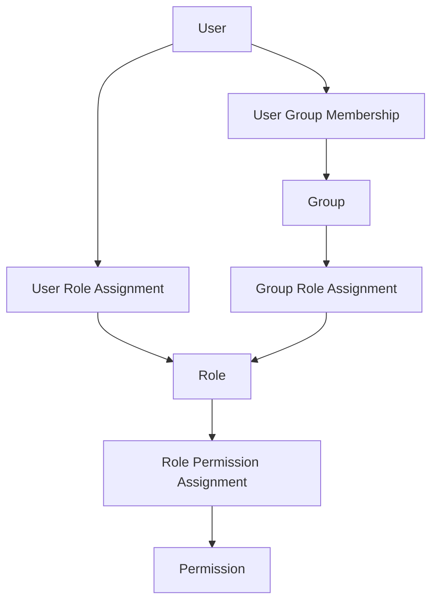

# BASE3 Usermanager and RBAC

## Purpose

This document explains the BASE3 Usermanager subsystem and its role-based access control model.

It is written for developers who want to understand:

* what `IUsermanager` is responsible for
* how users, groups, roles, and permissions relate to each other
* how the compatibility user role value still fits into the newer RBAC model
* how to check roles and permissions in framework and plugin code
* how role and permission assignments are stored in the default database-backed implementation
* how host systems can provide their own Usermanager implementation
* how Usermanager differs from authentication, access control middleware, and entry-level ACLs
* how to use the API safely from reusable plugins

After reading this document, a developer should be able to inject `IUsermanager`, read the current user, check permissions, assign roles, and design plugins that depend on the framework RBAC contract instead of a concrete user backend.

---

## 1. What the Usermanager is

The Usermanager is the framework service for identity and authorization metadata.

It answers questions such as:

```text
Who is the current user?
Which groups does the user belong to?
Which roles are effective for the user?
Which permissions are effective for the user?
May the user perform this capability?
```

The central interface is:

```php
Base3\Usermanager\Api\IUsermanager
```

The interface is intentionally framework-level. It does not require one specific storage backend.

A standalone BASE3 installation may use the database-backed implementation. An embedded BASE3 runtime may provide an adapter that maps an external host user model to BASE3 `User`, `Group`, `Role`, and `Permission` objects.

---

## 2. Mental model

The model has four main objects.

```text
User
  a person or technical account known to the runtime

Group
  a collection of users

Role
  a named responsibility or authorization profile

Permission
  a concrete capability expressed as scope + permission
```

Typical relationship graph:



A user receives effective permissions through:

```text
1. roles assigned directly to the user
2. roles assigned to groups of the user
3. permissions assigned to those effective roles
```

---

## 3. Usermanager versus related systems

BASE3 separates several concerns that are often mixed in smaller applications.

### Authentication

Authentication verifies who the user is.

Examples:

```text
login
logout
session validation
external host authentication
```

Authentication code may establish the current user, but it should not be the place where all permission logic lives.

### Accesscontrol

`IAccesscontrol` and `AccesscontrolMiddleware` are request-level infrastructure.

They answer questions such as:

```text
Is a request authenticated?
Which framework user id is active?
Should the request continue?
```

The middleware runs during request processing and usually prepares authentication state before outputs and services execute.

### Usermanager

`IUsermanager` exposes user data and RBAC checks to application code.

It is the service that reusable plugins should use when they need to check roles or permissions.

### Entry-level ACLs

Entry-level ACLs belong to data backends such as Memora or other resource systems.

For example, an XRM entity may grant entry access through:

```text
entry -> user
entry -> group
```

That is different from Usermanager RBAC.

The Usermanager may provide a permission such as:

```text
entry/admin
```

which a resource backend can interpret as an admin bypass. But ordinary entry ownership or visitor/moderator grants remain part of the resource backend.

---

## 4. Core interface

The current `IUsermanager` interface contains compatibility methods and RBAC methods.

```php
<?php declare(strict_types=1);

namespace Base3\Usermanager\Api;

use Base3\Usermanager\Permission;
use Base3\Usermanager\Role;

interface IUsermanager {

    public function getUser();

    public function getGroups();

    public function getRoles();

    public function getPermissions();

    public function hasRole(Role $role): bool;

    public function can(Permission $permission): bool;

    public function registUser($userid, $password, $data = null);

    public function changePassword($oldpassword, $newpassword);

    public function getAllUsers();

    public function getAllGroups();

    public function getAllRoles();

    public function getAllPermissions();

    public function assignRoleToUser($userid, Role $role): bool;

    public function revokeRoleFromUser($userid, Role $role): bool;

    public function assignRoleToGroup($groupid, Role $role): bool;

    public function revokeRoleFromGroup($groupid, Role $role): bool;

    public function addPermissionToRole(Role $role, Permission $permission): bool;

    public function removePermissionFromRole(Role $role, Permission $permission): bool;
}
```

The method name `registUser()` is kept for backward compatibility. New code should not introduce a second registration method unless the interface is intentionally versioned.

---

## 5. Data objects

The Usermanager uses small data objects. They are intentionally simple because implementations may receive data from a local database, a remote microservice, or an embedded host runtime.

### User

```php
namespace Base3\Usermanager;

class User {
    public $id;
    public $userid;
    public $name;
    public $email;
    public $lang;
    public $role;
    public $roles = array();
}
```

Important fields:

```text
id       internal numeric or backend-specific id
userid   stable login or external user identifier where available
name     display name
email    email address
lang     preferred language
role     compatibility value: visit, member, or admin
roles    effective role list
```

The `role` field is a compatibility bridge for older framework code.

New code should prefer:

```php
$usermanager->hasRole(Role::named('admin'));
$usermanager->can(Permission::for('system', 'admin'));
```

### Group

```php
namespace Base3\Usermanager;

class Group {
    public $id;
    public $name;
    public $info;
    public $archive;
    public $roles = array();
}
```

Groups model membership.

A group should answer:

```text
Who belongs together?
```

It should not itself define detailed capabilities. Capabilities are attached through roles and permissions.

### Role

```php
namespace Base3\Usermanager;

class Role {
    public $id;
    public $name;
    public $label;
    public $info;
    public $archive;
    public $permissions = array();

    public static function named(string $name): self;
}
```

Roles model responsibility profiles.

A role should answer:

```text
What responsibility or authorization profile does this user have?
```

Examples:

```text
admin
member
editor
reviewer
support
crm-manager
```

Use stable lowercase role names for technical checks.

### Permission

```php
namespace Base3\Usermanager;

class Permission {
    public $id;
    public $scope;
    public $permission;
    public $label;
    public $info;
    public $archive;

    public static function for(string $scope, string $permission): self;
}
```

Permissions are atomic capabilities.

A permission answers:

```text
May the user do this specific thing?
```

The permission key is:

```text
scope + permission
```

Examples:

```text
system/admin
entry/admin
entry/create
user/manage
group/manage
role/manage
```

The scope keeps permission names from different domains separate.

---

## 6. Roles versus permissions

Roles and permissions solve different problems.

```text
Role
  stable named bundle or responsibility
  assigned to users or groups
  example: admin

Permission
  concrete action or capability
  assigned to roles
  example: entry/admin
```

Recommended rule:

```text
Check permissions for behavior.
Check roles for role-specific UI or workflow decisions.
```

For example, a delete operation should usually check a permission:

```php
if (!$usermanager->can(Permission::for('entry', 'delete'))) {
    throw new RuntimeException('Missing permission: entry/delete');
}
```

A UI badge may check a role:

```php
if ($usermanager->hasRole(Role::named('admin'))) {
    echo 'Administrator';
}
```

---

## 7. Default database-backed model

The database-backed implementation uses the `base3system_sys*` tables.

### Users and groups

```text
base3system_sysuser
base3system_sysgroup
base3system_sysusergroup
```

Typical responsibilities:

```text
sysuser       user records
sysgroup      group records
sysusergroup  user -> group memberships
```

### Roles and role assignments

```text
base3system_sysrole
base3system_sysuserrole
base3system_sysgrouprole
```

Typical responsibilities:

```text
sysrole       role records
sysuserrole   user -> role assignments
sysgrouprole  group -> role assignments
```

### Permissions

```text
base3system_syspermission
base3system_sysrolepermission
```

Typical responsibilities:

```text
syspermission       permission records using scope + permission
sysrolepermission   role -> permission assignments
```

### Entry ACL is separate

Entry ACL is not stored in `sysroleaccess`.

For XRM/resource entries the active entry-level ACL model is:

```text
base3system_sysuseraccess
base3system_sysgroupaccess
```

The retired table is:

```text
base3system_sysroleaccess
```

It must not be used for the active Usermanager RBAC model.

---

## 8. Effective role resolution

An implementation should treat a user's effective roles as the union of:

```text
direct user roles
group roles from all groups of the user
```

Conceptual SQL:

```sql
SELECT DISTINCT r.*
FROM base3system_sysuserrole ur
INNER JOIN base3system_sysrole r
    ON r.id = ur.role_id
WHERE ur.user_id = :user_id
  AND r.archive = 0

UNION

SELECT DISTINCT r.*
FROM base3system_sysusergroup ug
INNER JOIN base3system_sysgrouprole gr
    ON gr.group_id = ug.group_id
INNER JOIN base3system_sysrole r
    ON r.id = gr.role_id
WHERE ug.user_id = :user_id
  AND r.archive = 0;
```

The exact query shape may differ by backend, but the semantics should remain the same.

---

## 9. Effective permission resolution

An implementation should treat a user's effective permissions as the union of permissions attached to all effective roles.

Conceptual SQL:

```sql
SELECT DISTINCT p.*
FROM base3system_sysuserrole ur
INNER JOIN base3system_sysrole r
    ON r.id = ur.role_id
INNER JOIN base3system_sysrolepermission rp
    ON rp.role_id = r.id
INNER JOIN base3system_syspermission p
    ON p.id = rp.permission_id
WHERE ur.user_id = :user_id
  AND r.archive = 0
  AND p.archive = 0

UNION

SELECT DISTINCT p.*
FROM base3system_sysusergroup ug
INNER JOIN base3system_sysgrouprole gr
    ON gr.group_id = ug.group_id
INNER JOIN base3system_sysrole r
    ON r.id = gr.role_id
INNER JOIN base3system_sysrolepermission rp
    ON rp.role_id = r.id
INNER JOIN base3system_syspermission p
    ON p.id = rp.permission_id
WHERE ug.user_id = :user_id
  AND r.archive = 0
  AND p.archive = 0;
```

The important rule is that permissions are not granted directly to users. They are granted to roles.

---

## 10. Typical seed permissions

A minimal system may use these permissions:

```text
system/admin
entry/admin
entry/create
user/manage
group/manage
role/manage
```

Example meaning:

```text
system/admin  full system administration
entry/admin   bypass normal entry ACL checks in compatible resource backends
entry/create  create entries in compatible resource backends
user/manage   manage users
group/manage  manage groups
role/manage   manage roles and permissions
```

A project or plugin can define more permissions when it owns a clear domain.

Examples:

```text
report/view
report/export
import/run
media/render
assistant/run
workflow/approve
```

Use stable lowercase identifiers.

---

## 11. Service registration

A concrete Usermanager should be registered in the container under the interface.

```php
use Base3\Api\IContainer;
use Base3\Usermanager\Api\IUsermanager;
use Base3\Usermanager\Base3System\Base3SystemUsermanager;

$container->set(
    IUsermanager::class,
    fn($c) => new Base3SystemUsermanager(),
    IContainer::SHARED
);
```

The exact constructor depends on the implementation.

Reusable plugins should not instantiate a concrete usermanager. They should consume the interface.

---

## 12. Injecting the Usermanager

A normal service or output receives the Usermanager through constructor injection.

```php
<?php declare(strict_types=1);

namespace ExamplePlugin\Service;

use Base3\Usermanager\Api\IUsermanager;
use Base3\Usermanager\Permission;
use RuntimeException;

final class ExportService {

    public function __construct(
        private readonly IUsermanager $usermanager
    ) {}

    public function exportReport(): array {
        if (!$this->usermanager->can(Permission::for('report', 'export'))) {
            throw new RuntimeException('Missing permission: report/export');
        }

        return [
            'ok' => true,
            'rows' => []
        ];
    }
}
```

This keeps the service independent from the concrete user backend.

---

## 13. Reading the current user

```php
use Base3\Usermanager\Api\IUsermanager;

$user = $usermanager->getUser();

if ($user === null) {
    return 'No user is active.';
}

echo htmlspecialchars((string)$user->name);
```

A typical returned user may look like this:

```php
[
    'id' => 2,
    'userid' => 'ddahme',
    'name' => 'Daniel Dahme',
    'email' => 'user@example.org',
    'lang' => 'de',
    'role' => 'admin',
    'roles' => [
        [
            'id' => 1,
            'name' => 'admin',
            'label' => 'Administrator'
        ]
    ]
]
```

The concrete object is usually a `Base3\Usermanager\User`, but proxy or host implementations may internally normalize arrays into the same model.

---

## 14. Checking a role

Use `Role::named()` for role checks by technical name.

```php
use Base3\Usermanager\Role;

if ($usermanager->hasRole(Role::named('admin'))) {
    echo 'User is an administrator.';
}
```

Role checks are useful for UI decisions.

Example:

```php
$menu = [];

$menu[] = 'Dashboard';

if ($usermanager->hasRole(Role::named('admin'))) {
    $menu[] = 'Administration';
}
```

Do not use role names as a replacement for every permission check.

---

## 15. Checking a permission

Use `Permission::for()` for capability checks.

```php
use Base3\Usermanager\Permission;

if (!$usermanager->can(Permission::for('entry', 'create'))) {
    throw new RuntimeException('You may not create entries.');
}
```

Permissions are the preferred check for behavior.

Example for an admin bypass:

```php
if ($usermanager->can(Permission::for('entry', 'admin'))) {
    return 'edit';
}
```

Example for user management:

```php
if (!$usermanager->can(Permission::for('user', 'manage'))) {
    return 'Access denied';
}
```

---

## 16. Listing roles and permissions

```php
$roles = $usermanager->getRoles();
$permissions = $usermanager->getPermissions();

foreach ($roles as $role) {
    echo htmlspecialchars((string)$role->name) . "\n";
}

foreach ($permissions as $permission) {
    echo htmlspecialchars($permission->scope . '/' . $permission->permission) . "\n";
}
```

`getRoles()` and `getPermissions()` return effective values for the current user.

For administration screens, use:

```php
$allRoles = $usermanager->getAllRoles();
$allPermissions = $usermanager->getAllPermissions();
```

---

## 17. Assigning roles to users

```php
use Base3\Usermanager\Role;

$ok = $usermanager->assignRoleToUser(2, Role::named('admin'));

if (!$ok) {
    throw new RuntimeException('Role assignment failed.');
}
```

The implementation should resolve the role name to the backend role id.

Revoking works the same way:

```php
$usermanager->revokeRoleFromUser(2, Role::named('admin'));
```

---

## 18. Assigning roles to groups

```php
use Base3\Usermanager\Role;

$usermanager->assignRoleToGroup(5, Role::named('editor'));
```

All users in group `5` receive the role effectively.

Revoking:

```php
$usermanager->revokeRoleFromGroup(5, Role::named('editor'));
```

---

## 19. Assigning permissions to roles

```php
use Base3\Usermanager\Permission;
use Base3\Usermanager\Role;

$usermanager->addPermissionToRole(
    Role::named('editor'),
    Permission::for('entry', 'create')
);
```

Removing:

```php
$usermanager->removePermissionFromRole(
    Role::named('editor'),
    Permission::for('entry', 'create')
);
```

The implementation should resolve the role by `name` and the permission by `scope + permission`.

---

## 20. Admin compatibility

Older BASE3 code may still read:

```php
$user = $usermanager->getUser();

if ($user->role === 'admin') {
    // legacy behavior
}
```

This compatibility value remains available.

However, new code should prefer:

```php
use Base3\Usermanager\Permission;
use Base3\Usermanager\Role;

$usermanager->hasRole(Role::named('admin'));
$usermanager->can(Permission::for('system', 'admin'));
```

The compatibility role values are:

```text
visit
member
admin
```

They should not be extended into a full role model. Real roles belong in `Role` objects and role assignment tables.

---

## 21. Entry access integration

Resource backends may use Usermanager permissions as a global capability check.

Example:

```php
use Base3\Usermanager\Permission;

if ($this->usermanager->can(Permission::for('entry', 'admin'))) {
    return 'edit';
}
```

If the user does not have `entry/admin`, the resource backend should continue with its normal entry ACL checks.

Typical entry ACL sources:

```text
entry -> current user
entry -> public user
entry -> current user's groups
entry -> default group
```

The Usermanager does not replace resource-specific access tables.

---

## 22. Example: protecting an output

```php
<?php declare(strict_types=1);

namespace ExamplePlugin\Content;

use Base3\Api\IOutput;
use Base3\Usermanager\Api\IUsermanager;
use Base3\Usermanager\Permission;

final class AdminPage implements IOutput {

    public function __construct(
        private readonly IUsermanager $usermanager
    ) {}

    public static function getName(): string {
        return 'adminpage';
    }

    public function getOutput(string $out = 'html', bool $final = false): string {
        if (!$this->usermanager->can(Permission::for('system', 'admin'))) {
            return 'Access denied';
        }

        return '<h1>Administration</h1>';
    }

    public function getHelp(): string {
        return 'Shows an admin-only page.';
    }
}
```

---

## 23. Example: conditional UI controls

```php
use Base3\Usermanager\Permission;

$canCreate = $usermanager->can(Permission::for('entry', 'create'));

if ($canCreate) {
    echo '<button>Create entry</button>';
}
```

This pattern is useful for hiding controls the user cannot use.

The backend action should still check the permission again.

---

## 24. Example: permission constants in a plugin

A plugin can centralize its permission names.

```php
<?php declare(strict_types=1);

namespace ExamplePlugin;

use Base3\Usermanager\Permission;

final class ExamplePermissions {

    public static function viewReports(): Permission {
        return Permission::for('example-report', 'view');
    }

    public static function exportReports(): Permission {
        return Permission::for('example-report', 'export');
    }
}
```

Usage:

```php
if (!$usermanager->can(ExamplePermissions::exportReports())) {
    throw new RuntimeException('Missing permission.');
}
```

This keeps permission names stable and avoids typos.

---

## 25. Example: administration overview

```php
$users = $usermanager->getAllUsers();
$groups = $usermanager->getAllGroups();
$roles = $usermanager->getAllRoles();
$permissions = $usermanager->getAllPermissions();

return [
    'users' => $users,
    'groups' => $groups,
    'roles' => $roles,
    'permissions' => $permissions
];
```

An admin UI can use these lists to display the current RBAC state.

Write operations should still check a management permission first:

```php
if (!$usermanager->can(Permission::for('role', 'manage'))) {
    throw new RuntimeException('Missing permission: role/manage');
}
```

---

## 26. NoUsermanager

`NoUsermanager` is the safe fallback implementation.

It should return empty data and deny role/permission checks.

Typical use cases:

```text
development without user backend
runtime without authentication
framework defaults before a project plugin wires a real implementation
```

A no-op Usermanager should not pretend that a user is admin.

---

## 27. Database-backed Usermanager

`Base3SystemUsermanager` is the default database-backed implementation for BASE3's own system tables.

Responsibilities include:

```text
load current user
load current groups
load effective roles
load effective permissions
check hasRole()
check can()
list users, groups, roles, permissions
assign/revoke roles
add/remove permissions to roles
```

It is appropriate for standalone BASE3 installations and projects that use the BASE3 system tables as the source of truth.

---

## 28. UsermanagerProxy

`UsermanagerProxy` is useful when a runtime consumes a remote Usermanager service.

Conceptual flow:

```text
consumer plugin
  -> UsermanagerProxy
  -> microservice connector
  -> provider endpoint
  -> concrete Usermanager implementation
```

This allows one BASE3 runtime to use identity and RBAC data from another runtime, as long as both sides agree on the `IUsermanager` contract and data shapes.

---

## 29. Host adapters

An embedded BASE3 runtime may map an external host user system into BASE3.

A host adapter should:

```text
implement IUsermanager
read current host user
map host user fields to Base3\Usermanager\User
map host groups to Base3\Usermanager\Group
map host roles to Base3\Usermanager\Role
map host capabilities to Base3\Usermanager\Permission
return false for unsupported write operations unless it can safely write to the host
```

The adapter should not expose host-specific classes to reusable BASE3 plugins.

Reusable plugins should see only:

```text
IUsermanager
User
Group
Role
Permission
```

---

## 30. Designing permission scopes

Choose scopes by domain owner.

Good examples:

```text
system
entry
user
group
role
report
import
media
assistant
workflow
```

Avoid overly broad names:

```text
admin
misc
data
plugin
```

A good permission should be readable as:

```text
scope/permission
```

Examples:

```text
report/export
assistant/run
workflow/approve
media/render
```

---

## 31. Recommended checks by use case

### System administration

```php
$usermanager->can(Permission::for('system', 'admin'));
```

### Entry ACL bypass

```php
$usermanager->can(Permission::for('entry', 'admin'));
```

### Entry creation

```php
$usermanager->can(Permission::for('entry', 'create'));
```

### User administration

```php
$usermanager->can(Permission::for('user', 'manage'));
```

### Group administration

```php
$usermanager->can(Permission::for('group', 'manage'));
```

### Role and permission administration

```php
$usermanager->can(Permission::for('role', 'manage'));
```

---

## 32. Debugging RBAC

Useful debug output:

```php
$user = $usermanager->getUser();
$groups = $usermanager->getGroups();
$roles = $usermanager->getRoles();
$permissions = $usermanager->getPermissions();

return [
    'user' => $user,
    'groups' => $groups,
    'roles' => $roles,
    'permissions' => $permissions,
    'can_entry_admin' => $usermanager->can(Permission::for('entry', 'admin')),
    'can_system_admin' => $usermanager->can(Permission::for('system', 'admin'))
];
```

Useful SQL for the database-backed implementation:

```sql
SELECT DISTINCT
    p.scope,
    p.permission,
    p.label,
    r.name AS role_name,
    'direct' AS source
FROM base3system_sysuserrole ur
INNER JOIN base3system_sysrole r
    ON r.id = ur.role_id
INNER JOIN base3system_sysrolepermission rp
    ON rp.role_id = r.id
INNER JOIN base3system_syspermission p
    ON p.id = rp.permission_id
WHERE ur.user_id = 2
  AND r.archive = 0
  AND p.archive = 0

UNION

SELECT DISTINCT
    p.scope,
    p.permission,
    p.label,
    r.name AS role_name,
    'group' AS source
FROM base3system_sysusergroup ug
INNER JOIN base3system_sysgrouprole gr
    ON gr.group_id = ug.group_id
INNER JOIN base3system_sysrole r
    ON r.id = gr.role_id
INNER JOIN base3system_sysrolepermission rp
    ON rp.role_id = r.id
INNER JOIN base3system_syspermission p
    ON p.id = rp.permission_id
WHERE ug.user_id = 2
  AND r.archive = 0
  AND p.archive = 0
ORDER BY scope, permission, role_name;
```

---

## 33. Common mistakes

### Hardcoding the compatibility role

Less good:

```php
if ($user->role === 'admin') {
    // allow
}
```

Better:

```php
if ($usermanager->can(Permission::for('system', 'admin'))) {
    // allow
}
```

### Treating groups as permissions

Less good:

```text
Group: can_export_reports
```

Better:

```text
Group: reporting-team
Role: report-editor
Permission: report/export
```

### Putting entry ownership into roles

Less good:

```text
Role: owner
```

Better:

```text
Entry ACL: user 2 owns entry 19384
Permission: entry/admin for bypass behavior
```

### Using `sysroleaccess`

The active RBAC model does not use `base3system_sysroleaccess`.

Do not build new code around that table.

---

## 34. Testing recommendations

Test these cases for every Usermanager implementation:

```text
anonymous or no user
normal user without roles
user with direct role
user with group role
role with no permissions
role with multiple permissions
archived role
archived permission
permission check by scope + permission
role check by name
unsupported write operation
```

Example assertions:

```php
assert($usermanager->hasRole(Role::named('admin')) === true);
assert($usermanager->can(Permission::for('entry', 'admin')) === true);
assert($usermanager->can(Permission::for('unknown', 'permission')) === false);
```

---

## 35. Summary

The Usermanager is the framework RBAC boundary.

```text
Users identify actors.
Groups collect users.
Roles describe responsibility profiles.
Permissions describe concrete capabilities.
```

Reusable code should depend on:

```php
Base3\Usermanager\Api\IUsermanager
```

and should check behavior with:

```php
Permission::for($scope, $permission)
```

The compatibility `User::$role` value remains available, but new framework and plugin code should prefer roles and permissions.
