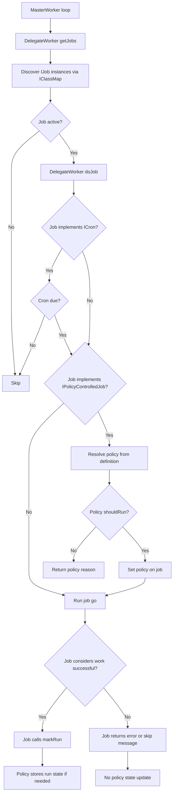
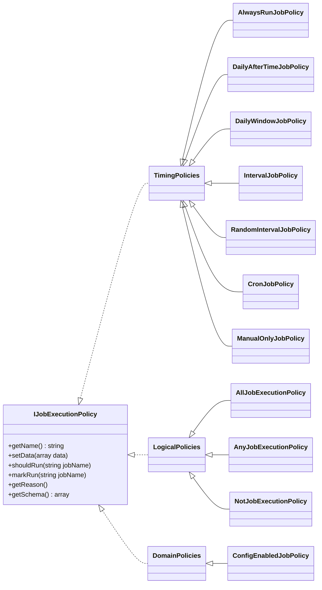

# BASE3 Worker, Job, and Execution Policy System

## Overview

The BASE3 worker system executes background jobs in a repeated worker loop. Jobs are discovered through the `IClassMap`, scheduled by workers, and executed by the `DelegateWorker`.

The execution policy system adds a structured, discoverable, and configurable layer for deciding whether a job may run in the current worker cycle.

The core design goals are:

* Jobs stay simple.
* Jobs define their own execution policy as structured data.
* Policies are discoverable through `IClassMap`.
* Policies are instantiated through the framework container and can use dependency injection.
* Policies describe their expected configuration through schemas.
* The worker decides whether a job may start.
* The job itself decides whether its work was successful and calls `markRun()` only when appropriate.

## Core Concepts

### Worker

A worker is responsible for collecting jobs and executing them.

The default worker implementation is:

```php
Base3\Worker\DelegateWorker
```

The `DelegateWorker`:

1. Discovers all `IJob` instances through `IClassMap`.
2. Checks whether the job is active.
3. Checks legacy cron logic for `ICron` jobs.
4. If the job implements `IPolicyControlledJob`, resolves and evaluates its execution policy.
5. Executes the job by calling `go()`.

### Job

A job contains the actual work.

A normal job implements:

```php
Base3\Worker\Api\IJob
```

A policy-controlled job implements:

```php
Base3\Worker\Api\IPolicyControlledJob
```

Policy-controlled jobs still keep the normal `IJob` methods:

```php
public function isActive();
public function getPriority();
public function go();
```

The additional policy methods are:

```php
public function getPolicyDefinition(): array;
public function setExecutionPolicy(IJobExecutionPolicy $policy): void;
public function markRun(): void;
```

The job defines the policy as data, but it does not resolve the policy class manually.

### Execution Policy

A policy decides whether a job may run.

Policies implement:

```php
Base3\Worker\Api\IJobExecutionPolicy
```

Policies are:

* discoverable through `IBase::getName()`
* configurable through `setData(array $data)`
* describable through `ISchemaProvider::getSchema()`
* evaluated through `shouldRun(string $jobName)`
* updated through `markRun(string $jobName)`

The policy may use constructor dependency injection. For example, a timing policy may receive `IStateStore`, and a configuration policy may receive `IConfiguration`.

The job never passes these services manually.

## Interfaces

### `IJobExecutionPolicy`

```php
<?php declare(strict_types=1);

namespace Base3\Worker\Api;

use Base3\Api\IBase;
use Base3\Api\ISchemaProvider;

interface IJobExecutionPolicy extends IBase, ISchemaProvider {

	public function setData(array $data);

	public function shouldRun(string $jobName);

	public function markRun(string $jobName);

	public function getReason();

}
```

### `IPolicyControlledJob`

```php
<?php declare(strict_types=1);

namespace Base3\Worker\Api;

interface IPolicyControlledJob extends IJob {

	public function getPolicyDefinition(): array;

	public function setExecutionPolicy(IJobExecutionPolicy $policy): void;

	public function markRun(): void;

}
```

## Policy-Controlled Job Trait

Jobs should usually use the provided trait instead of implementing policy storage manually.

```php
<?php declare(strict_types=1);

namespace Base3\Worker\Policy;

use Base3\Worker\Api\IJobExecutionPolicy;

trait PolicyControlledJobTrait {

	private ?IJobExecutionPolicy $executionPolicy = null;

	public function setExecutionPolicy(IJobExecutionPolicy $policy): void {
		$this->executionPolicy = $policy;
	}

	public function markRun(): void {
		if ($this->executionPolicy === null) {
			return;
		}

		$this->executionPolicy->markRun(static::getName());
	}

}
```

## Execution Flow



## Responsibility Split

### Worker responsibility

The worker decides whether the job may start.

```php
if ($job instanceof IPolicyControlledJob) {
	$policy = $this->createPolicy($job->getPolicyDefinition());

	if ($policy == null) {
		return 'Skip (invalid job policy)';
	}

	$job->setExecutionPolicy($policy);

	if (!$policy->shouldRun($job->getName())) {
		return $policy->getReason();
	}
}

return $job->go();
```

### Job responsibility

The job decides whether the actual work was successful.

Only the job knows whether a result is a real success, a partial success, a harmless skip, or a failure.

Therefore, the job calls:

```php
$this->markRun();
```

only at the correct success point.

### Policy responsibility

The policy decides whether a job may run now.

A stateful policy may store run information when `markRun()` is called.

A stateless policy may ignore `markRun()`.

## Policy Definitions

A policy definition is structured data.

Basic example:

```php
[
	'policy' => 'dailywindowjobpolicy',
	'data' => [
		'from' => '02:00',
		'to' => '04:00'
	]
]
```

Nested example:

```php
[
	'policy' => 'alljobexecutionpolicy',
	'data' => [
		[
			'policy' => 'configenabledjobpolicy',
			'data' => []
		],
		[
			'policy' => 'dailywindowjobpolicy',
			'data' => [
				'from' => '02:00',
				'to' => '04:00'
			]
		]
	]
]
```

This structure can be stored in PHP, JSON, a database, or generated by an LLM.

## Policy Resolution

The `DelegateWorker` resolves policies through `IClassMap`.

```php
private function createPolicy(array $definition): ?IJobExecutionPolicy {
	$name = $definition['policy'] ?? null;
	if (!is_scalar($name) || trim((string)$name) === '') {
		return null;
	}

	$policy = $this->classmap->getInstanceByInterfaceName(
		IJobExecutionPolicy::class,
		(string)$name
	);

	if (!$policy instanceof IJobExecutionPolicy) {
		return null;
	}

	$data = $definition['data'] ?? array();
	$policy->setData(is_array($data) ? $data : array());

	return $policy;
}
```

Logical policies such as `AllJobExecutionPolicy`, `AnyJobExecutionPolicy`, and `NotJobExecutionPolicy` resolve their nested policies in the same way.

## Policy Groups

The current policy model contains three main groups.



## Timing Policies

### `AlwaysRunJobPolicy`

Allows the job to run every time the worker reaches it.

Example:

```php
[
	'policy' => 'alwaysrunjobpolicy',
	'data' => []
]
```

### `DailyAfterTimeJobPolicy`

Allows a job to run once per day after a given time.

Example:

```php
[
	'policy' => 'dailyaftertimejobpolicy',
	'data' => [
		'time' => '02:00'
	]
]
```

Optional policy id:

```php
[
	'policy' => 'dailyaftertimejobpolicy',
	'data' => [
		'time' => '02:00',
		'id' => 'nightly'
	]
]
```

Typical behavior:

* Before `02:00`: skip.
* After `02:00`: allow if not already marked today.
* After successful job execution: job calls `markRun()`.
* Policy stores the run date.

### `DailyWindowJobPolicy`

Allows a job to run once per day inside a time window.

Example:

```php
[
	'policy' => 'dailywindowjobpolicy',
	'data' => [
		'from' => '02:00',
		'to' => '04:00'
	]
]
```

Typical behavior:

* Before `02:00`: skip.
* Between `02:00` and `04:00`: allow if not already marked today.
* After `04:00`: skip.
* After successful job execution: job calls `markRun()`.

### `IntervalJobPolicy`

Allows a job to run after a minimum interval.

Example:

```php
[
	'policy' => 'intervaljobpolicy',
	'data' => [
		'seconds' => 3600
	]
]
```

### `RandomIntervalJobPolicy`

Allows a job to run after a randomized interval.

Example:

```php
[
	'policy' => 'randomintervaljobpolicy',
	'data' => [
		'min_seconds' => 14400,
		'max_seconds' => 28800
	]
]
```

Typical use case:

* Avoid all jobs running at predictable fixed times.
* Spread load over a wider time range.
* Poll external APIs with jitter.

### `CronJobPolicy`

Allows a job according to a cron expression.

Example:

```php
[
	'policy' => 'cronjobpolicy',
	'data' => [
		'expression' => '0 2 * * *'
	]
]
```

The expression format is:

```text
minute hour dayOfMonth month dayOfWeek
```

### `ManualOnlyJobPolicy`

Allows a job only when a manual run was requested.

Example:

```php
[
	'policy' => 'manualonlyjobpolicy',
	'data' => []
]
```

The trigger source can be backed by `IStateStore`, database state, or another implementation detail inside the policy.

## Logical Policies

Logical policies combine other policies.

### `AllJobExecutionPolicy`

Allows a job only when all nested policies allow execution.

Example:

```php
[
	'policy' => 'alljobexecutionpolicy',
	'data' => [
		[
			'policy' => 'configenabledjobpolicy',
			'data' => []
		],
		[
			'policy' => 'dailywindowjobpolicy',
			'data' => [
				'from' => '02:00',
				'to' => '04:00'
			]
		]
	]
]
```

Meaning:

```text
config enabled AND inside daily window
```

### `AnyJobExecutionPolicy`

Allows a job when at least one nested policy allows execution.

Example:

```php
[
	'policy' => 'anyjobexecutionpolicy',
	'data' => [
		[
			'policy' => 'dailyaftertimejobpolicy',
			'data' => [
				'time' => '02:00',
				'id' => 'morning'
			]
		],
		[
			'policy' => 'dailyaftertimejobpolicy',
			'data' => [
				'time' => '14:00',
				'id' => 'afternoon'
			]
		]
	]
]
```

Meaning:

```text
run after 02:00 OR after 14:00
```

### `NotJobExecutionPolicy`

Allows a job only when the nested policy does not allow execution.

Example:

```php
[
	'policy' => 'notjobexecutionpolicy',
	'data' => [
		'policy' => 'manualonlyjobpolicy',
		'data' => []
	]
]
```

## Domain Policies

### `ConfigEnabledJobPolicy`

Checks whether a configuration value enables the job.

Example using defaults:

```php
[
	'policy' => 'configenabledjobpolicy',
	'data' => []
]
```

Default behavior:

```text
section: job
key: <jobName>.active
expected: 1
```

For a job named:

```text
base3logcleanupjob
```

the default config lookup is:

```text
job.base3logcleanupjob.active == 1
```

Custom example:

```php
[
	'policy' => 'configenabledjobpolicy',
	'data' => [
		'section' => 'job',
		'key' => 'base3logcleanupjob.active',
		'expected' => 1
	]
]
```

## Example: Simplified Cleanup Job

```php
<?php declare(strict_types=1);

namespace MissionBayIlias\Job;

use Base3\Configuration\Api\IConfiguration;
use Base3\Database\Api\IDatabase;
use Base3\State\Api\IStateStore;
use Base3\Worker\Api\IPolicyControlledJob;
use Base3\Worker\Policy\PolicyControlledJobTrait;

final class Base3LogCleanupJob implements IPolicyControlledJob {

	use PolicyControlledJobTrait;

	private const STATE_PREFIX = 'missionbayilias.job.base3logcleanup.';

	private const DEFAULT_RETENTION_HOURS = 48;
	private const DEFAULT_DELETE_BATCH = 20000;
	private const DEFAULT_PRIORITY = 1;

	private ?array $missionbayIliasConf = null;

	public function __construct(
		private readonly IDatabase $db,
		private readonly IConfiguration $configuration,
		private readonly IStateStore $state
	) {}

	public static function getName(): string {
		return 'base3logcleanupjob';
	}

	public function isActive() {
		$conf = $this->getMissionbayIliasConf();
		return ((int)($conf['base3logcleanupjob.active'] ?? 0)) === 1;
	}

	public function getPriority() {
		$conf = $this->getMissionbayIliasConf();
		return (int)($conf['base3logcleanupjob.priority'] ?? self::DEFAULT_PRIORITY);
	}

	public function getPolicyDefinition(): array {
		return [
			'policy' => 'dailywindowjobpolicy',
			'data' => [
				'from' => '02:00',
				'to' => '04:00'
			]
		];
	}

	public function go() {
		$this->db->connect();
		if (!$this->db->connected()) {
			return 'DB not connected';
		}

		if (!$this->logTableExists()) {
			return 'Skip (base3_log does not exist)';
		}

		$retentionHours = $this->getRetentionHours();
		$deleteBatch = $this->getDeleteBatch();
		$cutoff = $this->cutoffSqlString($retentionHours);

		$this->deleteOldLogs($cutoff, $deleteBatch);

		$this->markRun();

		return 'Log cleanup done (cutoff: ' . $cutoff . ', limit: ' . $deleteBatch . ')';
	}

	private function getMissionbayIliasConf(): array {
		if ($this->missionbayIliasConf === null) {
			$this->missionbayIliasConf = (array)$this->configuration->get('job');
		}
		return $this->missionbayIliasConf;
	}

	private function deleteOldLogs(string $cutoff, int $limit): void {
		$this->db->nonQuery(
			"DELETE FROM base3_log
			WHERE `timestamp` < '" . $this->esc($cutoff) . "'
			ORDER BY id ASC
			LIMIT " . (int)$limit
		);
	}

	private function getRetentionHours(): int {
		$raw = $this->state->get($this->stateKey('retention_hours'), self::DEFAULT_RETENTION_HOURS);
		$hours = (int)$raw;
		return $hours > 0 ? $hours : self::DEFAULT_RETENTION_HOURS;
	}

	private function getDeleteBatch(): int {
		$raw = $this->state->get($this->stateKey('delete_batch'), self::DEFAULT_DELETE_BATCH);
		$batch = (int)$raw;
		return $batch > 0 ? $batch : self::DEFAULT_DELETE_BATCH;
	}

	private function cutoffSqlString(int $retentionHours): string {
		$cutoffTs = time() - ($retentionHours * 3600);
		return date('Y-m-d H:i:s', $cutoffTs);
	}

	private function stateKey(string $suffix): string {
		return self::STATE_PREFIX . $suffix;
	}

	private function logTableExists(): bool {
		$row = $this->db->singleQuery("SHOW TABLES LIKE 'base3_log'");
		return !empty($row);
	}

	private function esc(string $value): string {
		return (string)$this->db->escape($value);
	}
}
```

## `markRun()` Semantics

`markRun()` must not be called by the worker.

The worker only knows that `go()` returned something. A return value may contain:

* a success message
* a skip message
* an error message
* a partial result
* a diagnostic message

Only the job knows whether the work completed successfully enough to mark the policy as handled.

Correct:

```php
public function go() {
	if (!$this->precondition()) {
		return 'Skip';
	}

	$this->doWork();

	$this->markRun();

	return 'Done';
}
```

Wrong:

```php
public function doJob($job) {
	$result = $job->go();
	$policy->markRun($job->getName());

	return $result;
}
```

## Policy State Keys

Stateful policies should use stable state keys.

Recommended pattern:

```text
worker.job.<jobName>.<policyType>[.<policyId>].<stateKey>
```

Examples:

```text
worker.job.base3logcleanupjob.daily_window.last_run_at
worker.job.base3logcleanupjob.daily_window.nightly.last_run_at
worker.job.mailimportjob.random_interval.next_run_at
worker.job.reportjob.cron.last_run_slot
```

The optional `id` or `policy_id` field should be used when the same policy type appears multiple times in one policy tree.

Example:

```php
[
	'policy' => 'anyjobexecutionpolicy',
	'data' => [
		[
			'policy' => 'dailyaftertimejobpolicy',
			'data' => [
				'time' => '02:00',
				'id' => 'morning'
			]
		],
		[
			'policy' => 'dailyaftertimejobpolicy',
			'data' => [
				'time' => '14:00',
				'id' => 'afternoon'
			]
		]
	]
]
```

## Policy Schemas

Every policy implements `getSchema()`.

The schema is used for:

* UI generation
* validation
* documentation
* LLM-driven policy generation
* database-backed policy editors

Example schema:

```php
public function getSchema(): array {
	return [
		'type' => 'object',
		'required' => ['from', 'to'],
		'properties' => [
			'from' => [
				'type' => 'string',
				'description' => 'Start time, inclusive, format HH:MM.'
			],
			'to' => [
				'type' => 'string',
				'description' => 'End time, exclusive, format HH:MM.'
			],
			'id' => [
				'type' => 'string',
				'description' => 'Optional policy instance id.'
			]
		]
	];
}
```

For simple policies, an empty schema is valid:

```php
public function getSchema(): array {
	return [];
}
```

## LLM-Friendly Policy Definition

Because policies are described as structured data, they can be generated by an LLM.

Example prompt target:

```json
{
	"policy": "alljobexecutionpolicy",
	"data": [
		{
			"policy": "configenabledjobpolicy",
			"data": {}
		},
		{
			"policy": "dailywindowjobpolicy",
			"data": {
				"from": "02:00",
				"to": "04:00"
			}
		}
	]
}
```

The LLM does not need to know about PHP constructors or service dependencies. It only needs to select policy names and fill their schema-defined fields.

## Extending the System

### Add a new timing policy

Create a class implementing `IJobExecutionPolicy`.

Example: `WeekdayJobPolicy`

```php
final class WeekdayJobPolicy extends AbstractJobExecutionPolicy {

	public static function getName(): string {
		return 'weekdayjobpolicy';
	}

	public function shouldRun(string $jobName) {
		$days = $this->data['days'] ?? [];

		if (!is_array($days)) {
			$this->setReason('Skip (invalid weekday configuration)');
			return false;
		}

		$current = strtolower(date('D'));

		if (!in_array($current, $days, true)) {
			$this->setReason('Skip (weekday not allowed)');
			return false;
		}

		return true;
	}

	public function getSchema(): array {
		return [
			'type' => 'object',
			'required' => ['days'],
			'properties' => [
				'days' => [
					'type' => 'array',
					'description' => 'Allowed weekdays, e.g. mon, tue, wed.',
					'items' => [
						'type' => 'string'
					]
				]
			]
		];
	}
}
```

### Add a new domain policy

Domain policies may use framework services through constructor dependency injection.

Example:

```php
final class QueueNotEmptyJobPolicy extends AbstractJobExecutionPolicy {

	public function __construct(
		private readonly IDatabase $db
	) {}

	public static function getName(): string {
		return 'queuenotemptyjobpolicy';
	}

	public function shouldRun(string $jobName) {
		$table = $this->getString('table');

		if ($table === '') {
			$this->setReason('Skip (missing queue table)');
			return false;
		}

		$row = $this->db->singleQuery(
			"SELECT COUNT(*) AS cnt FROM `" . $this->db->escape($table) . "`"
		);

		if ((int)($row['cnt'] ?? 0) <= 0) {
			$this->setReason('Skip (queue empty)');
			return false;
		}

		return true;
	}
}
```

### Add a logical policy

Logical policies should extend the shared logical base class so they can resolve nested policies through `IClassMap`.

Examples:

* `AllJobExecutionPolicy`
* `AnyJobExecutionPolicy`
* `NotJobExecutionPolicy`

Further options:

* `NOfJobExecutionPolicy`
* `FirstAllowedJobExecutionPolicy`
* `WeightedRandomJobExecutionPolicy`

## Migration Path

### Existing jobs

Existing jobs implementing only `IJob` continue to work unchanged.

### Policy-controlled jobs

A job can be migrated by:

1. Changing `implements IJob` to `implements IPolicyControlledJob`.
2. Adding `use PolicyControlledJobTrait;`.
3. Adding `getPolicyDefinition(): array`.
4. Removing duplicated timing logic.
5. Calling `$this->markRun();` only when the job has completed successfully.

### Before

```php
if (!$this->shouldRun($checkpoint)) {
	return 'Skip';
}

$this->doWork();

$this->touchLastRunAt();
```

### After

```php
public function getPolicyDefinition(): array {
	return [
		'policy' => 'dailywindowjobpolicy',
		'data' => [
			'from' => '02:00',
			'to' => '04:00'
		]
	];
}

public function go() {
	$this->doWork();

	$this->markRun();

	return 'Done';
}
```

## Relationship to `ICron`

`ICron` remains supported as a legacy or specialized interface.

Policy-controlled jobs can replace many cron-style use cases with `CronJobPolicy`, `DailyAfterTimeJobPolicy`, or `DailyWindowJobPolicy`.

Recommended direction:

```text
New jobs: prefer IPolicyControlledJob
Existing ICron jobs: migrate when useful
```

## Recommended File Structure

```text
Base3Framework/src/Worker
├── Api
│   ├── IJob.php
│   ├── ICron.php
│   ├── IWorker.php
│   ├── IJobExecutionPolicy.php
│   └── IPolicyControlledJob.php
├── Policy
│   ├── AbstractJobExecutionPolicy.php
│   ├── PolicyControlledJobTrait.php
│   ├── Timing
│   │   ├── AlwaysRunJobPolicy.php
│   │   ├── DailyAfterTimeJobPolicy.php
│   │   ├── DailyWindowJobPolicy.php
│   │   ├── IntervalJobPolicy.php
│   │   ├── RandomIntervalJobPolicy.php
│   │   ├── CronJobPolicy.php
│   │   └── ManualOnlyJobPolicy.php
│   ├── Logic
│   │   ├── AbstractLogicalJobExecutionPolicy.php
│   │   ├── AllJobExecutionPolicy.php
│   │   ├── AnyJobExecutionPolicy.php
│   │   └── NotJobExecutionPolicy.php
│   └── Domain
│       └── ConfigEnabledJobPolicy.php
├── DelegateWorker.php
└── MasterWorker.php
```

## Design Rules

1. Jobs do work.
2. Workers execute jobs.
3. Policies decide whether jobs may start.
4. Jobs decide when a run was successful.
5. Policies may be stateful or stateless.
6. Policy dependencies are resolved through normal constructor dependency injection.
7. Policy configuration is passed through `setData(array $data)`.
8. Policy definitions must be structured arrays.
9. Policy schemas should be maintained for UI, validation, and LLM usage.
10. Existing `IJob` implementations remain compatible.

